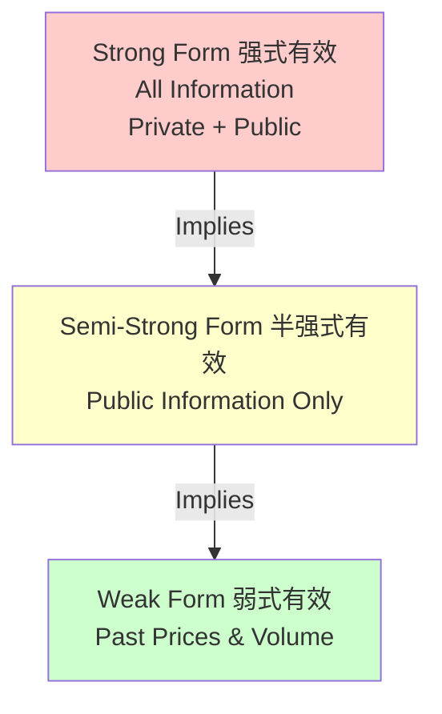
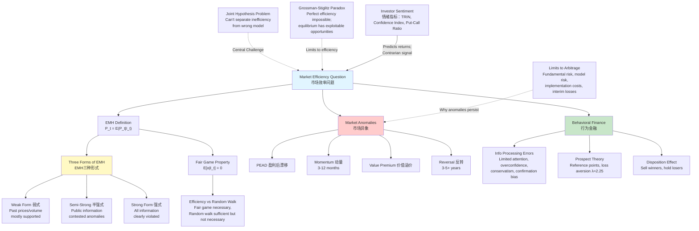

# Week 6-1: EMH and Behavioral Finance

> **FIN 522A | Lecture 11**
> 🎯 市场是否有效定价所有可用信息？无处不在的市场异象和行为偏差如何挑战传统金融理论？

---

## 📑 Table of Contents 目录

1. [[#1. EMH Definition and Competition Logic|EMH Definition and Competition Logic 有效市场假说定义与竞争逻辑]]
2. [[#2. Fair Game Property and Distinction from Random Walk|Fair Game Property and Distinction from Random Walk 公平博弈与随机游走的区别]]
3. [[#3. Grossman-Stiglitz Paradox|Grossman-Stiglitz Paradox Grossman-Stiglitz悖论]]
4. [[#4. Three Forms of Market Efficiency|Three Forms of Market Efficiency 市场效率的三种形式]]
5. [[#5. Empirical Tests of Market Efficiency|Empirical Tests of Market Efficiency 市场效率的实证检验]]
6. [[#6. Post-Earnings Announcement Drift and Market Anomalies|Post-Earnings Announcement Drift and Market Anomalies PEAD与市场异象]]
7. [[#7. Joint Hypothesis Problem|Joint Hypothesis Problem 联合假说问题]]
8. [[#8. Behavioral Finance: Information Processing and Decision Biases|Behavioral Finance: Information Processing and Decision Biases 行为金融基础]]
9. [[#9. Prospect Theory and the Disposition Effect|Prospect Theory and the Disposition Effect 前景理论与处置效应]]
10. [[#10. Limits to Arbitrage and Investor Sentiment|Limits to Arbitrage and Investor Sentiment 套利限制与投资者情绪]]

---

## 1. EMH Definition and Competition Logic ⭐⭐⭐

### 1.1 Fundamental Definition 基本定义

A market is efficient relative to an information set $I_t$ if:

$$\boxed{P_t = E(P_t | I_t)}$$

In words: **the current price equals the expected value of the security given all information available at time t** (当前价格等于给定时刻 $t$ 所有可用信息下的证券期望值).

> 直观理解：当前价格已经充分吸收了所有已知信息，不存在"捡漏"机会。就像买卖二手书，当市场高效时，书的定价已经反映了其内容质量、稀有度和读者需求，你买不到"特别便宜"的好书。

> [!important] 信息集的相对性
> Efficiency is NOT absolute — it's always defined with respect to a specific set of information that investors can access and process. 效率是相对于某一特定信息集的概念。
> 关键点：市场相对于某种信息集有效，不代表相对于所有信息都有效。比如公开信息充分定价，但内幕信息可能未被定价。

### 1.2 Equilibrium Outcome of Competition 竞争均衡的结果

Market efficiency emerges from the logic of competition and incentives:

1. **Many analysts compete** to find mispriced securities (许多分析师竞争寻找错误定价)
2. **Each analyst processes information** independently (独立处理信息)
3. **When mispricing is discovered** → quick trades exploit it (发现错误定价时迅速交易)
4. **Prices adjust rapidly** to new information (价格快速调整)
5. **Equilibrium reached:** No easy profit opportunities remain (均衡：无容易获利机会)

> [!tip] 核心理解
> Market efficiency is an **equilibrium statement** (均衡陈述). It emerges from competition and incentives, not necessarily from the assumption that all investors are rational. 价格"足够有效"以至于系统性利用困难。
>
> 类比：一个繁荣的菜市场中，许多小贩竞争叫价，最终胡萝卜的价格很快反映了"真实"供求关系。没人说小贩都是理性的天才，但竞争本身就产生了有效定价。

### 1.3 Connection to Alpha 与Alpha概念的联系

See [[Week 5-2 CAPM and Multifactor Models]] for the concept of **alpha (α)** (超额收益：超过风险调整后预期的部分). Market efficiency implies that alpha should be zero for all securities in equilibrium — any predictable outperformance would be immediately arbitraged away by competing investors.

---

## 2. Fair Game Property and Distinction from Random Walk ⭐⭐⭐

### 2.1 The Fair Game Property 公平博弈性质

Market efficiency requires that abnormal returns (异常收益：超过预期的部分) have zero expected value:

$$\boxed{E(\alpha_{i,t+1} | I_t) = 0}$$

Where:
- $\alpha_{i,t+1}$ = realized abnormal return for security $i$ in period $t+1$ (实现的异常收益)
- $I_t$ = information set available at time $t$ (时刻$t$已知的所有信息)
- Expectation is **conditional** on $I_t$ — given all available information

This is the **fair game property** (公平博弈性质): Under EMH, no one can systematically exploit information to earn positive expected alpha.

> 生动解释：想象你和我在赌场玩游戏。如果是"公平博弈"，那么你掌握的所有信息加起来，你从这个游戏的期望赢利应该是零。有人赢有人输，但从统计上讲，你无法利用已知信息获得系统性优势。如果你发现了一个策略能赢钱，说明游戏不是公平的，或者市场还有你没获得的信息。

### 2.2 Fair Game vs. Random Walk 公平博弈 vs 随机游走

A crucial distinction often confused:

| Property | Fair Game (EMH) | Random Walk |
|----------|---|---|
| **Definition** | $E(\alpha_{t+1} \| I_t) = 0$ | $R_t = \mu + \epsilon_t$ where $\epsilon_t$ iid |
| **Requires** | Unpredictable abnormal returns (无法预测超额收益) | Independent, identically distributed returns (完全独立、同分布的收益) |
| **Relationship** | **NECESSARY** for EMH | **SUFFICIENT** but NOT necessary |
| **Volatility** | Can have conditional heteroskedasticity; volatility clusters (可以有波动率聚集) | Rules out time-varying volatility (排除时变波动率) |

> [!warning] 关键区分
> A random walk is **sufficient but NOT necessary** for market efficiency. A market can be efficient with time-varying volatility, autocorrelated returns, or other patterns, **as long as** these patterns don't generate exploitable abnormal returns after transaction costs.
>
> 生动类比：公平博弈 vs 随机游走的区别。
> - **公平博弈**：掷硬币决定赌博。每次掷硬币结果都是随机的，你无法预测。但即使掷硬币的历史存在模式（比如最近10次都是正面），这个模式也不能帮你赚钱，因为下一次的期望值仍是50%。
> - **随机游走**：更严格。不仅无法预测，而且历史模式甚至都不存在（完全独立同分布）。
>
> 市场可以是"公平博弈"但不是"随机游走"。比如股票表现出动量效应（赢家继续赢），但在扣除交易成本后，你仍然赚不到钱。这样市场是"公平"的（无法系统性获利），但不是"随机游走"（存在可预测的模式）。
>
> 例：Prices can exhibit momentum (past returns predict future returns by 1-2% after costs), yet be "efficient" if this pattern doesn't exceed transaction costs. 关键是是否能盈利。

### 2.3 Practical Implication 实践意义

If markets are efficient (fair game property):
- You **cannot** beat the market using information available today (无法利用今天的信息击败市场)
- But markets **can still** exhibit patterns (momentum, seasonality, volatility clusters) (市场仍可能存在模式)
- These patterns must not be exploitable for profit after transaction costs (这些模式经交易成本调整后不可盈利)

---

## 3. Grossman-Stiglitz Paradox ⭐⭐⭐

### 3.1 The Paradox 悖论的陈述

> **If markets were perfectly efficient, no one would spend resources to gather and analyze information, because prices already reflect everything. But if no one gathers information, prices cannot be efficient. Therefore, markets must be "efficient enough" that some inefficiencies persist to justify information-gathering costs.**

This creates an apparent contradiction at the heart of market efficiency.

> 深层理解："完全有效"是不可能的自我实现的悖论。如果市场完全有效了，你就没动力去花钱做研究。但没有人做研究，信息就不会被发现和定价，市场就有效不了。所以现实中市场必须"有点无效"，恰好无效到足以奖励那些花钱做研究的人。

### 3.2 Paradox Resolution 悖论的解决

- **Perfect efficiency is impossible** in equilibrium (完全有效不可能处于均衡状态)
- Markets converge to **"efficient enough"** — an equilibrium level of inefficiency (均衡的无效性：市场有足够多的小机会)
- This inefficiency is just sufficient to reward information-gathering activity and analyst effort (无效性足以补偿信息成本)
- **Result:** Information differences persist; skilled managers CAN find alpha, but only through superior analysis (信息差持续存在；有技能的经理人可以找到alpha，但需要真正的优秀分析)

> 类比：就像一个城市里的"捡漏房产交易"。如果完全没有便宜房子可买，房产经纪人就会关门。但如果有太多便宜房子，每个人都成了经纪人。最终的均衡是：有足够的便宜房子让专业经纪人值得工作，但不够多让普通人都能赚钱。

> [!important] 联系：特雷诺-布莱克模型
> See [[Week 5-1 Single-Factor and Single-Index Models#11. Treynor-Black Model|Treynor-Black Model]]. The model assumes SOME analysts find positive alpha (信息差值) to justify their research effort, creating optimal allocation between active ($w_A^*$) and passive portfolios.

### 3.3 Implications 启示

The Grossman-Stiglitz paradox suggests:
- **Not all investors are equally skilled** (不是所有投资者同样熟练)
- **Information differences persist** in equilibrium (信息差值持续存在)
- **Superior analysis DOES exist** but is rare and requires hard work (优秀分析存在，但罕见且需努力)
- **This is the world of active management** — some managers fight against efficiency and sometimes succeed (主动管理的世界：部分经理人对抗市场效率，有时成功)

---

## 4. Three Forms of Market Efficiency ⭐⭐⭐

### 4.1 Nested Structure 嵌套结构

**Key insight:** Strong-form efficiency IMPLIES semi-strong efficiency, which IMPLIES weak-form efficiency. The reverse is **NOT true**. (强式有效蕴含半强式，半强式蕴含弱式，反之不成立)

> 递进理解：就像"完全诚实的人"必然是"在朋友面前诚实的人"，后者必然是"在陌生人面前诚实的人"。但"在陌生人面前诚实"不代表"在朋友面前诚实"。市场效率的三种形式也是这样的嵌套逻辑。

### 4.2 Weak-Form Efficiency 弱式有效 ⭐⭐

**Information set:** $I_t = \{P_1, P_2, \ldots, P_{t-1}, V_1, V_2, \ldots, V_{t-1}, R_1, R_2, \ldots, R_{t-1}\}$

(all past prices, volumes, and returns only — 仅历史价格、成交量、收益)

**Implication:** You cannot profit using only historical price/volume data. **Technical analysis** (技术分析：利用历史价格图表找规律) cannot systematically beat the market.

**Testable prediction:** Past returns should be unpredictable:
$$\text{Corr}(R_t, R_{t-k}) \approx 0 \quad \text{for} \quad k > 0$$

> 简化解释：如果弱式有效，那么历史股价图表毫无用处。你无法通过观察"之前升过三次的价格模式现在又出现了"来预测未来。就像掷硬币，100次正面之后，下一次仍然是50%概率，历史记录帮不了你。

**Evidence:**
- Daily returns: Near-zero autocorrelation ✓ (supports weak form — 支持弱式有效)
- Weekly/monthly returns: Small positive autocorrelation (1-2%), but not economically meaningful after trading costs ✓ (虽有相关性但无法盈利)
- **Conclusion:** Weak-form efficiency **reasonably supported** (弱式有效得到合理支持)

### 4.3 Semi-Strong Form Efficiency 半强式有效 ⭐⭐

**Information set:** $I_t = \{\text{past prices/volumes, financial statements, analyst reports, news, macroeconomic data, }\ldots\}$

(all publicly available information — 所有公开信息)

**Implication:** You cannot profit using public information. **Fundamental analysis** (基本面分析：通过研究财报、行业数据找被低估的股票) cannot systematically beat the market. When news is released, prices adjust **immediately** (新闻发布时，价格立即调整).

**Testable prediction:** In event studies, abnormal returns should spike at/immediately after news, then flatten (no post-event drift / 无事后漂移).

> 核心含义：一旦某个重要新闻（比如业绩公告）发布，市场中所有聪明的投资者都会立刻反应，价格在几秒内调整到位。你再努力读财报也晚了——这信息已经被定价了。就像菜市场里萝卜降价，你还没反应过来，价格就已经降好了。

**Evidence:**
- Most events: rapid price adjustment within 1-2 trading days ✓ (大多事件价格迅速调整)
- **Exception:** Post-earnings announcement drift (PEAD) shows prices drift for weeks ✗ (参考第6节)

### 4.4 Strong-Form Efficiency 强式有效 ⭐⭐

**Information set:** $I_t = \{\text{all public information} \cup \text{all private/insider information (MNPI)}\}$

(all information, public and private — 所有信息，包括内幕)

**Implication:** Even corporate insiders (内幕人士：掌握未公开信息的高管) cannot consistently profit. Even those with illegal access to material non-public information cannot earn abnormal returns.

**Reality:** Strong-form efficiency is **clearly and decisively violated** ❌

> 赤裸的现实：强式有效完全不成立。公司高管在宣布利好消息前买入公司股票，然后赚大钱。这太明显了，所以内幕交易是违法的。市场显然不能对所有信息有效定价。

Evidence:
- Corporate insiders DO earn abnormal returns on trades before news becomes public (内幕人士在新闻公布前交易能获得超额收益)
- SEC insider trading prosecutions document abnormal returns of 50-100%+ (美国证券交易委员会的处罚案例显示内幕收益50-100%+)
- Academic studies find insiders outperform by 5-20% annually (学术研究显示内幕人士年均超额收益5-20%)
- This is precisely why insider trading is **illegal** (所以内幕交易是违法的)

---

## 5. Empirical Tests of Market Efficiency ⭐⭐

### 5.1 Weak-Form Tests: Serial Correlation 弱式检验：序列相关

**Test statistic:**
$$\text{Corr}(R_t, R_{t-k}) \text{ for lag } k$$

**Hypothesis:** Correlation should be zero if weak-form efficient (如果弱式有效，相关系数应为零)

**Evidence:**
- Daily returns: ≈ 0 (strong support — 强有力支持)
- Weekly/monthly: +1% to +2% (small, not profitable after costs — 很小，扣除成本后无法盈利)
- **Trading strategy test:** Can you build a profitable moving-average strategy after transaction costs? Generally **NO** — costs eliminate modest autocorrelation (能否建立有利可图的移动平均策略？一般不能——成本消除了微弱的相关性)
- **Conclusion:** Weak form NOT clearly violated (弱式有效没有被明显违反)

### 5.2 Semi-Strong Tests: Event Study Methodology 半强式检验：事件研究

**Key concept:** Calculate abnormal returns around a significant event (earnings release, merger, etc.) (在重大事件前后计算异常收益)

**Step 1:** Define abnormal return (异常收益)
$$\boxed{\text{AR}_t = R_t - E(R_t)}$$

where $E(R_t)$ comes from a model (期望收益来自某模型):
- Market model: $E(R_t) = \alpha + \beta R_{m,t}$ (estimated pre-event — 从事件前估计)
- CAPM: $E(R_t) = r_f + \beta(r_m - r_f)$
- Fama-French: $E(R_t) = r_f + \beta_m(r_m - r_f) + \beta_{smb} \cdot \text{SMB} + \beta_{hml} \cdot \text{HML}$

> 简单解释：异常收益 = 实际收益 - 你预期的正常收益。如果股票涨了5%，但按风险调整后你预期涨3%，那异常收益就是+2%。

**Step 2:** Calculate cumulative abnormal returns over a window (在时间窗口上累积)
$$\boxed{\text{CAR}(\tau_1, \tau_2) = \sum_{t=\tau_1}^{\tau_2} \text{AR}_t}$$

> 理解：把事件前后的所有异常收益加起来。

**Step 3:** Test whether CAR is statistically different from zero (检验CAR是否显著不为零)

**Semi-Strong Prediction:** CAR should spike at announcement, then **flatten** (no drift). Visual pattern = step function with vertical jump at $t=0$.

> 预测：如果市场半强式有效，价格应在新闻公布时快速跳升，然后保持稳定。不应该继续漂移。

**Empirical finding:** Most events show this pattern, supporting semi-strong efficiency for large stocks. **Exception:** PEAD anomaly (see Section 6).

### 5.3 Strong-Form Tests: Insider Profitability 强式检验：内幕人士收益性

**Approach:** Track insider trades and measure abnormal returns (追踪内幕人士交易，衡量超额收益)

**Finding:** Insiders earn significant abnormal returns (5-20% annually) — **clearly violates** strong-form efficiency (内幕人士年均超额收益5-20%，明显违反强式有效)

**Implication:** Private information generates exploitable profit opportunities (私有信息产生可利用的获利机会)

---

## 6. Post-Earnings Announcement Drift and Market Anomalies ⭐⭐⭐

### 6.1 Post-Earnings Announcement Drift (PEAD) 盈利公告后漂移

One of the most robust and persistent market anomalies (最稳健和持久的市场异象之一):

**Finding:** After earnings surprise (positive or negative), the stock continues to drift in the direction of the surprise for 2-8 weeks. (业绩发布后，股价继续按意外方向漂移2-8周)

> [!example] PEAD示例
> - Positive earnings surprise on day 0 (正面业绩意外在第0天)
> - Stock jumps +2% on day 0 (expected under semi-strong efficiency — 半强式有效预期的反应)
> - Stock continues to drift upward +0.3% to +0.5% per week for next 4 weeks (NOT expected! — 之后每周继续漂移，这不符合半强式有效的预期)
> - Cumulative drift: ~1.2% to +2% over 4 weeks (四周累计漂移1.2-2%)
> 半强式有效要求事件后CAR立即平坦，但PEAD显示价格继续漂移。

> 直观理解：就像一个教室里突然宣布"今天考试取消"。半强式有效说，大家听到后立即高兴，价格"定了"。但PEAD说的是，学生们听了几分钟后，才真的意识到不用复习了，情绪继续升高。市场就像这样，有"反应延迟"。

**Magnitude:** Average drift ~0.3-0.5% per week following surprise (equivalent to 15-26% annualized for a month) (平均漂移~0.3-0.5%/周，相当于一个月年化15-26%)

**Problem for EMH:**
- Semi-strong efficiency implies all public information (including earnings) is immediately incorporated (半强式有效意味着所有公开信息立即被定价)
- PEAD shows prices adjust slowly over weeks (PEAD显示价格缓慢调整数周)
- This suggests either **market inefficiency** (underreaction / 反应不足) or a **missing risk model** (遗漏的风险模型)

**Interpretations:**
1. **Inefficiency (behavioral):** Investors are slow to process implications of earnings due to limited attention, anchoring bias, or extrapolation bias (投资者因注意力有限、锚定偏差或外推偏差而缓慢处理信息)
2. **Risk factor:** Could be a risk premium (though hard to justify theoretically) (可能是风险溢价，但理论上难以解释)

> 两种解释。第一种：市场就是反应慢，这很人性——数据太多，人们没法快速吸收。第二种：也许业绩意外确实意味着"这家公司有我们之前没考虑的风险"，所以风险溢价（额外收益）应该补偿这个风险。但这个解释有点勉强。

### 6.2 Momentum Anomaly 动量异象 ⭐⭐

**Definition:** Assets that outperformed in the past 3-12 months continue to outperform in the near term (next 1-6 months). (过去3-12个月表现好的资产，在接下来1-6个月继续表现好)

> 通俗说：赢家继续赢。

**Magnitude:** 5-10% annualized outperformance (past winners vs. past losers) (赢家相对输家每年超额收益5-10%)

**Mechanism:** Underreaction to fundamental information; positive feedback trading; or systematic risk factor (Carhart momentum factor — see [[Week 5-2 CAPM and Multifactor Models]]) (机制：对信息的低估反应、正反馈交易或系统风险因子)

> 为什么？可能是人们看到某只股票涨了，还没完全理解为什么涨，就继续跟风。或者那只股票确实代表了某种新兴趋势，市场反应滞后。

**Challenge:** Momentum strategy requires frequent rebalancing → high transaction costs → hard to profit after costs (动量策略需要频繁调仓，交易成本高，扣除成本后难以盈利)

### 6.3 Value Premium 价值溢价 ⭐⭐

**Definition:** High book-to-market (B/M) stocks (value / 价值股：账面值相对价格高的股票，通常是不性感的传统行业) outperform low B/M stocks (growth / 成长股：高科技、高增长的股票) over long horizons (3-5+ years). (高账面价值股票在3-5年以上的长期内表现超过低账面价值股票)

> 通俗说：人们喜欢性感的成长股，忽视了沉闷的价值股。结果沉闷的股票涨得更好。

**Magnitude:** 4-7% annualized outperformance (1926-2023) (1926-2023年间年均超额收益4-7%)

**Risk vs. Mispricing:**
- **Risk interpretation:** Value stocks are riskier → deserved higher returns (价值股风险更高，所以应该有更高收益)
- **Mispricing interpretation:** Growth stocks overvalued; value stocks undervalued (成长股被高估，价值股被低估)
- **Evidence for mispricing:** Value premium larger for stocks with high uncertainty (hard to value) (证据：不确定性高的股票价值溢价更大——说明是定价偏差)

See [[Week 5-2 CAPM and Multifactor Models]] — HML (High Minus Low) is the value factor in Fama-French model.

### 6.4 Size Effect 规模效应 ⭐⭐

**Definition:** Small-cap stocks outperform large-cap stocks. (小公司股票表现超过大公司股票)

**Magnitude:** 3-5% annualized (variable and weakening over time) (3-5%年化，近年减弱)

**Trend:** Strong through 1980s, much weaker since 2000. Possible reasons: increased market efficiency, survivorship bias in old data, shift to growth investing. (1980年代强劲，2000年后明显减弱。可能原因：市场效率提升、数据幸存者偏差、投资风格转变)

**Explanations:**
- **Risk:** Small stocks riskier (less liquid, higher bankruptcy risk) (小股票流动性差，破产风险高，所以风险溢价应该更高)
- **Liquidity:** Wider bid-ask spreads, harder to trade (流动性差，买卖差价大)
- **Behavioral:** Neglected stocks, attention effects (行为：被忽视的股票、注意力效应)

### 6.5 Long-Horizon Reversals 长期反转 ⭐⭐

**Definition:** Stocks that significantly underperform for 3-5 years eventually reverse and become winners. (严重表现不佳3-5年的股票最终反转成为赢家)

> 说的是"什么极端都会回归平均"。

**Mechanism:** Price overshooting (价格过度反应：价格跌太低了) and mean reversion (均值回归：最终会回到正常水平)

**Interesting dichotomy:** Time horizon matters!
- **3-12 months:** Momentum (winners keep winning — 赢家继续赢)
- **1-3 years:** Mixed / no clear pattern (模糊无规律)
- **3-5+ years:** Reversal (winners become losers — 赢家变输家)

> [!note] 解释困难
> Why does momentum dominate short-term but reversal dominates long-term? Suggests different mechanisms at play: short-term underreaction vs. long-term overreaction.
>
> 深思：为什么短期是动量（继续赢），长期是反转（反向赢）？可能短期人们反应慢（低估反应），长期人们反应过度（过度反应）。就像股票走势：开始人们反应不足，保持上升趋势；后来反应过头，价格过高，最后回归。

---

## 7. Joint Hypothesis Problem ⭐⭐⭐

### 7.1 The Fundamental Challenge 根本困难

**Any empirical test of market efficiency simultaneously tests TWO hypotheses:** (任何市场效率检验同时检验两个假设)

1. **Market efficiency:** Prices reflect all available information (价格反映所有可用信息)
2. **Asset pricing model:** Our model of expected returns is correct (我们的期望收益模型正确)

$$\text{Observed Return} = \text{Expected Return (from model)} + \text{Abnormal Return}$$

If we find abnormal returns, it could be:
- **(A) Market is inefficient** — prices don't reflect information (市场无效——价格未反映信息)
- **(B) Model is wrong** — our expected return model is missing factors or mispriced fundamentals (模型错误——我们的模型遗漏了风险因子)

**We cannot distinguish between these possibilities with certainty.** (我们无法确定区分这两种可能)

> [!warning] 不可证伪性
> The joint hypothesis problem means we can **NEVER** definitively prove or disprove market efficiency using standard tests. Any "evidence against efficiency" can be reinterpreted as evidence of a missing risk factor. The debate is somewhat **unfalsifiable**. (联合假设问题意味着我们永远无法通过标准检验确定证明或推翻市场有效性。任何"反对有效性的证据"都可重新解释为"遗漏风险因子的证据"。这个辩论在某种意义上是不可证伪的。)
>
> 比喻：假设我说"天上有个看不见的独角兽"。你说"我没看到"。我就说"你用错了观察工具"。无论什么证据，我都能解释。这就是联合假设问题的困境——两个假设纠缠在一起，无法独立验证。

### 7.2 Examples of Ambiguity 模糊性示例

| Anomaly | Interpretation A: Inefficiency | Interpretation B: Wrong Model |
|---------|---|---|
| **Size effect** (small > large) | Small stocks mispriced (小股票定价错误) | Missing risk factor (FF SMB) (遗漏小公司风险因子) |
| **Value effect** (high B/M > low B/M) | Value stocks underpriced (价值股被低估) | Value stocks are riskier (FF HML) (价值股风险更高) |
| **Momentum** (winners keep winning) | Underreaction to news (对新闻反应不足) | Missing momentum risk factor (遗漏动量风险因子) |
| **PEAD** (post-earnings drift) | Slow information processing (信息处理缓慢) | Omitted variable in model (模型中遗漏变量) |

### 7.3 Fama-French Attempt 试图解决：Fama-French因子

Fama and French proposed that many "anomalies" are actually **risk factors**, not inefficiencies: (Fama和French提议许多"异象"其实是风险因子，不是无效)

$$R_i - r_f = \alpha + \beta_{m}(R_m - r_f) + \beta_{smb} \cdot \text{SMB} + \beta_{hml} \cdot \text{HML}$$

Where:
- **SMB (Small Minus Big):** Return spread of small-cap minus large-cap (小公司相对大公司的收益差异)
- **HML (High Minus Low):** Return spread of high B/M minus low B/M (高账面价值相对低账面价值的收益差异)

See [[Week 5-2 CAPM and Multifactor Models]] for detailed discussion.

**Claim:** If these are genuine risk factors → no anomaly → markets are efficient (如果这些是真实风险因子，就不是异象，市场就是有效的)

> 逻辑：如果小股票高收益只是因为小股票风险高（没人想要，所以需要高收益来补偿），那就不是"市场错定价"，而是"市场正确定价了风险"。

**Skepticism:** How do we distinguish risk factors from anomalies? The reasoning becomes circular: "This is an anomaly, so we create a factor, so now it's not an anomaly." (怀疑：我们如何区分风险因子和异象？推理变成循环了："这是异象，所以我们创造一个因子，现在就不是异象了。")

### 7.4 Practical Resolution 实践层面的解决

Rather than asking the unfalsifiable question "Are markets efficient?", ask narrower questions:
- Can I beat the market after transaction costs? (扣除成本后我能击败市场吗？)
- Are there identifiable strategies with consistent positive alpha? (有否定策略能持续产生正alpha？)
- Do prices adjust to news quickly or slowly? (价格对新闻反应快还是慢？)

---

## 8. Behavioral Finance: Information Processing and Decision Biases ⭐⭐

### 8.1 Information Processing Errors 信息处理偏差

Deviations from rational Bayesian information processing (偏离理性贝叶斯信息处理):

**Limited Attention and Processing Capacity** (有限注意力与处理能力)
- Investors can't monitor all securities; focus on subset → miss information on neglected stocks (投资者无法监控所有股票，关注一小部分，忽视被遗忘的股票)
- **Result:** Underreaction to news on neglected stocks; delayed price adjustment (结果：忽视股票的新闻反应不足；价格调整延迟)
- **Evidence:** PEAD anomaly; outperformance of stocks with big surprises that don't get media attention (证据：PEAD异象；没有媒体关注但有大意外的股票表现更好)

> 人性理由：你关注的只有那几只股票。新闻说某只你没关注的股票业绩爆涨，你可能压根没听到。等你听到时，已经太晚了。

**Overconfidence** (过度自信)
- Investors overestimate their ability to predict; overestimate precision of their information (投资者高估自己预测能力；高估信息精度)
- **Result:** Overtrading and overreaction (结果：交易过度和反应过度)
- **Evidence:** Day traders significantly underperform; high portfolio turnover correlates with poor returns (证据：日内交易者明显亏损；高换手率与低收益相关)

> 表现：你觉得自己很聪明，掌握了某个秘密，于是频繁交易。结果交易成本吃掉了利润。

**Conservatism Bias** (保守主义偏差)
- Investors are slow to update beliefs; cling to prior beliefs despite new evidence (violate Bayes' rule) (投资者缓慢更新信念；尽管有新证据仍坚持旧信念，违反贝叶斯法则)
- **Result:** Underreaction to surprising information (结果：对意外信息反应不足)
- **Example:** Earnings surprises take weeks to be fully reflected (PEAD) (例子：业绩意外花费数周才被充分定价，这就是PEAD)

> 心理学理由：你曾认为某家公司会倒闭。即使新闻说它起死回生了，你仍然半信半疑。这是我们对"改变主意"的抗拒。

**Confirmation Bias** (确认偏差)
- Seek information confirming prior beliefs; avoid disconfirming information (寻求确认既有信念的信息；回避否定信息)
- **Result:** Entrenched positions, slower price adjustment, underreaction to contrary news (结果：观点固化，价格调整慢，对反向新闻反应不足)

> 说法：你看好某只股票。之后你倾向于读看好新闻，而忽视看空分析。这就是确认偏差。

**Extrapolation and Representativeness Heuristic** (外推与代表性启发法)
- Project recent trends too far into future; overweight recent data (recency bias / 近因偏差) (将最近趋势过度推外：高估最近数据)
- **Result:** Growth stocks overvalued during growth periods; value stocks overvalued during value periods (结果：增长期成长股被高估；价值期价值股被高估)
- **Example:** Tech bubble (1999-2000): Investors extrapolated high growth indefinitely, pushing P/E ratios to 80+ for marginally profitable firms (例子：科技泡沫：投资者无限推外高增长，P/E倍数达80+的边际盈利公司)

> 行为：看到过去三年都涨，就以为以后还会这样涨。2000年网络泡沫时，人们说"互联网改变一切，规则变了"。实际上规则没变，只是人们过度外推了趋势。

> [!important] 分类
> These information processing errors share one characteristic: **systematic bias in how information is incorporated into beliefs**. They drive underreaction / overreaction patterns in prices.
> (这些信息处理偏差有一个共同特点：**信息纳入信念时的系统性偏差**。它们推动价格的低估/过度反应模式)

### 8.2 Behavioral Biases in Decision-Making 决策中的行为偏差

**Framing Effects** (框架效应)
- Decision outcome depends on how choices are presented (决策结果取决于选项如何呈现)
- Same objective outcomes → different choices depending on frame (相同客观结果，因呈现方式不同而导致不同选择)
- Example: "90% survival rate" vs. "10% mortality rate" → different risk preferences (例子："90%存活率" vs "10%死亡率" → 不同风险偏好)

> 说法：同样的东西，怎么说它就能改变你的决策。医学实验表明，"90%患者活下来"和"10%患者死亡"的表述虽然客观相同，但前者让人更倾向于接受手术。

**Mental Accounting** (心理账户)
- Treat money differently depending on source or purpose (根据金钱来源和目的而差别对待)
- "House money effect": newly won money spent more freely (赌场效应：赢的钱更容易花)
- Result: Different investment decisions for economically identical situations (结果：相同经济情境下不同投资决策)

> 例子：你的工资存起来很谨慎，但你通过赌博赢来的钱就敢乱花。经济上这是同一笔钱，但心理上你对待它们不同。

**Regret Avoidance and Loss Aversion** (后悔规避与损失厌恶)
- Losses hurt more than equivalent gains feel good (损失带来的痛苦超过等额收益的快乐)
- Realizing a loss = concretizing regret (实现损失 = 具体化后悔)
- **Result:** Hold losses too long, sell winners too early (disposition effect / 处置效应 — see Section 9) (结果：持有损失太久，太早卖出赢家——这就是处置效应)

> 心理学：亏100块的痛苦，比赚100块的快乐强烈。所以你会死守亏损的股票，希望反弹（不想承认错误）；但赚钱的股票一有机会就卖了（锁定快乐）。

---

## 9. Prospect Theory and the Disposition Effect ⭐⭐⭐

### 9.1 Key Innovation: Reference Points 关键创新：参考点

**Classic expected utility theory:** Utility defined over final wealth; inherently risk-averse (concave utility) (效用基于最终财富；内在风险厌恶)

**Kahneman & Tversky's insight:** People evaluate prospects relative to a **reference point** (参考点), not absolute wealth (人们相对参考点而非绝对财富评估前景):

- **Gain** (收益): money above reference point → feel good (参考点以上的钱 → 感觉好)
- **Loss** (损失): money below reference point → feel bad (参考点以下的钱 → 感觉差)
- Reference point is often: current wealth, aspiration level, or **recent purchase price** (参考点通常是：当前财富、愿望水平或**最近购买价格**)

> 深层理解：效用不是基于"你现在有多少钱"，而是"相对你期望有多少钱"。如果你买股票时花100块，现在值110块，你感到快乐。但如果买时花100块，现在值90块，你感到痛苦。客观上，90块和110块的快乐程度不同，但这不是因为钱的数量，而是因为"参考点"不同。

### 9.2 Value Function and Loss Aversion 价值函数与损失厌恶

The prospect theory **value function** $v(x)$ has a distinctive **kinked and asymmetric** shape:

$$\boxed{v(x) = \begin{cases} x^\alpha & \text{if } x \geq 0 \\ -\lambda(-x)^\beta & \text{if } x < 0 \end{cases}}$$

Where:
- $\alpha, \beta \approx 0.88$ (less concave/convex than standard expected utility — 比标准效用论更弱的凹凸性)
- $\lambda \approx 2.25$ ← **loss aversion parameter**: losses weighted 2.25× vs. equivalent gains (损失厌恶参数：损失权重是等额收益的2.25倍)

> 直观意义：$\lambda \approx 2.25$意味着亏100块的痛苦，大约是赚100块快乐的2.25倍。这就是为什么人们这么讨厌亏钱。

**Properties:**

| Property | Interpretation |
|----------|---|
| **Concave for gains** ($x > 0$) | Diminishing marginal utility; **risk-averse** in gains domain (收益域凹，边际递减，风险厌恶) |
| **Convex for losses** ($x < 0$) | Diminishing marginal disutility; **risk-seeking** in losses domain (损失域凸，边际递减，风险寻求) |
| **Steeper for losses** | Losses hurt ~2.25× as much as gains feel good (损失的陡峭度2.25倍，即同等金额损失的痛苦远大于收益的快乐) |

> [!example] 直观例子
> - Gain +100: value ≈ +10 (赚100块的主观价值约10)
> - Loss -100: value ≈ -22.5 (亏100块的主观价值约-22.5)
>
> 关键：同样金额，损失的"主观伤害"是收益的"主观快乐"的2.25倍！
>
> 这解释了很多行为：比如为什么人们对亏损的恐惧远大于对收益的渴望。

### 9.3 Disposition Effect 处置效应 ⭐⭐

**Definition:** Investors preferentially realize gains (sell winners early) and hold losses (refuse to realize losing positions). (投资者倾向于实现收益——早卖赢家，持有损失——拒绝卖亏家)

> 说法：赢了就想跑，亏了就想守。这和理性的税收优化策略完全相反。

**Mechanism through prospect theory:**

1. **Stock purchased at $P_0$** — this becomes the reference point (参考点建立在购买价格)
2. **Stock appreciates to $P_1 > P_0$** → gain → risk-averse in gain domain → want to realize gain → **SELL** (股票升到$P_1 > P_0$ → 收益 → 在收益域风险厌恶 → 想要实现收益 → **卖出**)
3. **Stock depreciates to $P_1 < P_0$** → loss → risk-seeking in loss domain → hope for recovery → **HOLD** (股票跌到$P_1 < P_0$ → 损失 → 在损失域风险寻求 → 期望反弹 → **持有**)

> 心理学链条：你用100块买了股票。现在升到110块（+10的收益）。在收益域，你风险厌恶，所以想锁定这10块的快乐，马上卖掉。但现在跌到90块（-10的损失）。在损失域，你反而变成风险寻求——你抱着希望，期望股票反弹回100块或更高。这个心理转变就是处置效应的根本。

**Empirical evidence:**
- Mutual funds: realized gains ≈ 50% of holdings; realized losses ≈ 30% (共同基金：实现收益占持仓50%，实现损失占30%)
- Holding period longer for losses than gains (持有损失的时间比收益长)
- Stronger in taxable accounts; weaker for retirement accounts (where mental accounting differs) (在应税账户中更强；退休账户中较弱，因为心理账户不同)

**Investment consequence:** This is **exactly backwards** from tax-optimal strategy (与税收最优策略恰好相反):
- Rational strategy: realize losses (tax-loss harvest / 税损收割) to offset gains (理性策略：实现损失以抵消收益)
- Rational strategy: let winners ride (defer gains, compound tax-free) (理性策略：让赢家继续跑)
- **Disposition effect does the opposite!** (处置效应完全相反！)

> 讽刺：税收上，你应该卖掉亏损的股票来抵扣利得税。但处置效应让你做相反的事。这就是为什么行为金融很重要——我们的心理偏差实际上让我们变得更穷。

### 9.4 Market Implications 对市场的影响

**Pressure on stock prices:**
- Overweight selling of winners → downward pressure on past winners (过度卖出赢家 → 对赢家的下行压力)
- Underweight selling of losers → upward pressure on past losers (低估卖出亏家 → 对亏家的上行压力)
- **Result:** Mean reversion pattern (relates to reversal anomaly / 反转异象) (结果：均值回归模式，与反转异象相关)

> 逻辑链：如果大家都在卖赢家、持有亏家，那么赢家被人卖，价格就跌；亏家没人卖，价格就涨。最后赢家和亏家会相互接近，形成"反转"——曾经的赢家反而跑输。

**Volatility patterns:** Stocks investors hold reluctantly (losses) have higher volatility, more uncertainty about exit timing, wider bid-ask spreads (投资者不情愿持有的损失股票有更高波动率、更多的退出时机不确定性、更宽的买卖差价)

---

## 10. Limits to Arbitrage and Investor Sentiment ⭐⭐

### 10.1 Why Mispricing Can Persist 为什么错误定价会持续

Even if we identify market inefficiencies, they may persist because **arbitrage is limited** (即使发现市场无效，它可能持续存在，因为套利受限):

**Fundamental Risk** (基本面风险)
- Mispriced security has no perfect substitute (错误定价证券没有完美替代品)
- Arbitrageur buys cheap, sells expensive — but if fundamentals diverge further, losses result (套利者买便宜、卖贵，但如果基本面进一步分化，会亏损)
- Residual risk forces arbitrageurs to liquidate at a loss (剩余风险迫使套利者以亏损清仓)

> 例子：你发现股票A被低估，股票B被高估。你买A、卖空B。但突然爆出新闻，A的基本面变差，B的基本面变好。现在你的套利策略反而亏损。你没有足够资本死守，最后被迫认赔。

**Model Risk** (模型风险)
- Is it really mispriced, or do we just have the wrong model? (真的定价错误，还是我们模型错了？)
- Uncertainty prevents large positions (不确定性阻止大额头寸)
- **Links back to [[#7. Joint Hypothesis Problem|Joint Hypothesis Problem]]** (与联合假设问题相关)

**Implementation Costs** (实施成本)
- **Bid-ask spreads:** Trading costs immediately reduce profit opportunity (买卖差价：交易成本立即减少利润)
- **Market impact:** Large trades move prices against you (市场冲击：大宗交易向你不利的方向移动价格)
- **Short-selling costs:** Borrowing shares to short is expensive; some shares can't be shorted (做空成本：借股票做空很贵，某些股票甚至无法做空)

> [!example] 3Com/Palm案例 (2000)
> Palm subsidiary spun off from parent 3Com, but 3Com retained large stake. Market prices implied **negative value** for 3Com's remaining business. Should be pure arbitrage: buy 3Com, short Palm. But short-selling cost + bid-ask spread + market impact eliminated profit. 看似无风险的套利被实施成本消除。
>
> 细节：3Com的剩余业务应该值钱，但市场定价让3Com整体价值 < Palm价值。这意味着3Com剩余业务价值 < 0（负数！）。你应该：买3Com（因为太便宜），卖空Palm（因为太贵）。但实际上，借Palm股票的成本这么高，买卖差价这么宽，市场冲击这么大，结果没利润。所以虽然"逻辑上"是套利，"现实中"执行不了。

**Interim Loss Risk** (中间损失风险)
- Even if position is right long-term, short-term losses may force liquidation (即使长期正确，短期亏损可能迫使清仓)
- **LTCM example (1998):** Sophisticated arbitrage fund with Nobel laureates; short-term losses forced liquidation requiring Fed-coordinated bailout; positions were ultimately correct but couldn't survive drawdowns (LTCM案例：拥有诺贝尔奖得主的精密套利基金；短期亏损迫使清仓，需要美联储救助；最后交易确实是对的，但熬不过亏损期)

> 故事：LTCM用复杂数学找到套利机会。逻辑上它们应该赚大钱。但1998年俄罗斯债务危机时，市场突然变得非常不理性，LTCM持有的头寸短期内大幅亏损。投资者开始赎回，LTCM没钱了，被迫以低价卖出持仓。几个月后，市场恢复理性，LTCM的持仓确实反弹了。但它们没撑到那一刻，破产了。这个故事说明，即使你是对的，如果短期亏损太大、资本不足，你也可能被市场淘汰。

**Short-Selling Constraints** (做空限制)
- Many securities hard or impossible to short (许多证券难以或无法做空)
- Not available for borrow; high borrow costs (无法借到股票，借股成本高)
- Unlimited loss potential; margin requirements can force liquidation (无限亏损潜力；保证金要求可能迫使清仓)
- Result: Can't arbitrage away mispricings on hard-to-short stocks (结果：难以做空的股票上无法套利消除错误定价)

> 实际：想做空某只股票，但没人愿意借给你。或者借的成本每年20%。成本太高，套利机会被蚕食。这限制了市场自我纠正的能力。

### 10.2 Investor Sentiment and Return Predictability 投资者情绪与收益预测性

If investor sentiment (投资者情绪 — optimism vs. pessimism) drives prices away from fundamentals, then sentiment should predict future returns. (如果投资者情绪驱动价格远离基本面，那么情绪应该预测未来收益)

**Key finding:** Investor sentiment **predicts future returns**: (关键发现：投资者情绪**预测未来收益**)
- **High sentiment today** → **Low returns tomorrow** (next 6-12 months) (今天高情绪 → 明天低收益)
- **Low sentiment today** → **High returns tomorrow** (今天低情绪 → 明天高收益)
- **Magnitude:** 3-7% differential annual returns (3-7%的差异年收益)

> 直观：当所有人都乐观时，股票已经被炒得很贵了。之后赚钱空间就小了。当所有人都悲观时，股票便宜得不行，之后反弹空间大。

> [!tip] 逆向投资逻辑
> Sentiment acts as a **contrarian indicator** (反向指标): buy when others are fearful, sell when others are greedy. But precise timing is very difficult. (情绪是反向指标：别人害怕时买，别人贪心时卖。但精确择时很难。)
>
> 名言：巴菲特说"别人贪心时恐惧，别人恐惧时贪心"。这里的"贪心"和"恐惧"就是投资者情绪。

### 10.3 Sentiment Indicators and Formulas 情绪指标与公式 ⭐⭐

**TRIN (Short-Term Advance Decline Index):** (TRIN短期上升/下降指数)
$$\boxed{\text{TRIN} = \frac{\text{Advancing Issues / Declining Issues}}{\text{Advancing Volume / Declining Volume}}}$$

- TRIN < 1 → More upside participation (bullish / 乐观情绪：更多资金参与上升，说明市场强)
- TRIN > 1 → Less upside participation (bearish / 悲观情绪：更多资金参与下跌，说明市场弱)

> 解释：分子是上升股票数/下跌股票数。分母是上升成交量/下跌成交量。TRIN < 1说明：虽然跌的股票数量多，但升的股票成交量大——说明大钱在追高，市场情绪乐观。反之则悲观。

**Confidence Index:** (信心指数)
$$\boxed{\text{Confidence Index} = \frac{\text{Yield of High-Grade Bonds}}{\text{Yield of Intermediate-Grade Bonds}}}$$

- Ranges 0.8 to 1.0 (范围0.8到1.0)
- High confidence → investors buy risky bonds → spreads narrow → ratio falls (高信心 → 投资者买风险债券 → 利差缩小 → 比率下降)
- Low confidence → investors demand risk premium → spreads widen → ratio rises (低信心 → 投资者要求风险溢价 → 利差扩大 → 比率上升)
- **Contrarian signal:** High ratio → low future returns (反向信号：高比率 → 低未来收益)

> 逻辑：高评级债券收益率 / 中等评级债券收益率。当市场信心足（投资者敢买风险债券）时，中等债券要出高收益才吸引人，所以分母小，比率低。当市场恐惧（投资者躲到高评级债券）时，中等债券收益率很高（补偿风险），分母大，比率高。所以高比率 = 恐惧信号 = 反向看好。

**Put-Call Ratio:** (看跌/看涨期权比率)
$$\boxed{\text{Put-Call Ratio} = \frac{\text{Put Volume}}{\text{Call Volume}}}$$

- Ratio > 1 → More puts than calls (bearish — 看跌期权多，说明人们在对冲下跌风险，市场悲观)
- Ratio < 1 → More calls than puts (bullish — 看涨期权多，说明人们看好，市场乐观)
- **Contrarian:** High ratio → low sentiment → future returns tend high (反向：高比率 → 低情绪 → 未来收益倾向高)

> 说法：当everyone都买看跌期权（protect下跌风险），说明人心惶惶。这往往是底部信号——大家都怕了，股票反而可能涨。

| Indicator | High Sentiment (高情绪) | Low Sentiment (低情绪) |
|-----------|---|---|
| IPO volume | Many IPOs (IPO多，人们敢创业) | Few IPOs (IPO少，人们害怕) |
| VIX | Low (波动率低，市场平静) | High (波动率高，市场恐慌) |
| Put-Call Ratio | Low (<1，乐观) | High (>1，悲观) |
| Margin debt | Rising (保证金使用增加，人们敢杠杆) | Falling (保证金使用减少，人们去杠杆) |
| TRIN | <1 (bullish) | >1 (bearish) |

### 10.4 Which Stocks Most Affected by Sentiment? 哪些股票受影响最大？

Sentiment effects are strongest for **hard-to-value, hard-to-arbitrage** stocks: (情绪效应对**难以估值、难以套利**的股票影响最大)

| Stock Type | Sentiment Effect | Reason |
|------------|---|---|
| **Small-cap** | Larger than large-cap (远大于大市值) | Less liquid, less analyst coverage (流动性差，分析师覆盖少) |
| **High-beta** | Larger effect (影响更大) | More volatile, harder to value (波动大，难估值) |
| **Growth stocks** | Larger than value (远大于价值股) | Long cash flows → harder to value (远期现金流，难估值) |
| **High volatility** | Larger effect (影响大) | More disagreement about value (对价值的分歧多) |
| **Speculative** (penny stocks) | Largest effect (影响最大) | Almost no fundamental anchor (几乎没有基本面锚定) |

**Mechanism:** Sentiment pushes hard-to-value stocks furthest from fundamentals because: (1) no clear "right" valuation, (2) harder to short, (3) more subject to mood swings, (4) large disagreement among investors. (机制：情绪推动难估值股票偏离基本面最大，因为：(1)没有明确"正确"估值，(2)难以做空，(3)更易受情绪影响，(4)投资者分歧大)

> 例子：微软和某个小网络公司。微软的价值相对明确（基本面清晰），所以即使情绪变化，价格偏离基本面也有限。但小网络公司，没人真知道值多少钱，所以情绪高时被炒到天价，情绪低时跌到地板价。这就是为什么小市值、高成长、高波动的股票更容易被情绪驱动。

---

## Summary 本讲总结

### Flowchart of EMH and Behavioral Finance

### Key Formulas 关键公式表

| Formula | Section | Application |
|---------|---------|---------|
| $\boxed{P_t = E(P_t \| I_t)}$ | 1 | Market Efficiency Definition |
| $\boxed{E(\alpha_{i,t+1} \| I_t) = 0}$ | 2 | Fair Game Property |
| $\boxed{\text{AR}_t = R_t - E(R_t)}$ | 5 | Abnormal Return |
| $\boxed{\text{CAR}(\tau_1, \tau_2) = \sum_{t=\tau_1}^{\tau_2} \text{AR}_t}$ | 5 | Cumulative Abnormal Return |
| $\boxed{\text{Corr}(R_t, R_{t-k})}$ | 5 | Serial Correlation Test |
| $\boxed{v(x) = \begin{cases} x^\alpha & x \geq 0 \\ -\lambda(-x)^\beta & x < 0 \end{cases}}$ | 9 | Prospect Theory Value Function |
| $\boxed{\text{TRIN} = \frac{\text{Adv Issues/Dec Issues}}{\text{Adv Vol/Dec Vol}}}$ | 10 | Sentiment Indicator |
| $\boxed{\text{Confidence Index} = \frac{\text{Yield High-Grade}}{\text{Yield Intermediate-Grade}}}$ | 10 | Sentiment Indicator |
| $\boxed{\text{Put-Call Ratio} = \frac{\text{Put Volume}}{\text{Call Volume}}}$ | 10 | Sentiment Indicator |

### Core Insights 核心洞察

1. **Efficiency is conditional** on information set (弱式、半强式、强式) with increasing evidence quality
   > 市场效率不是绝对的，而是相对于某种信息集的。强式有效蕴含半强式，半强式蕴含弱式。

2. **EMH challenged by anomalies** (PEAD, momentum, value, reversals) but **joint hypothesis problem** makes interpretation hard — 无法分离"市场无效"与"模型错误"
   > 市场有许多异象难以解释，但我们永远无法确定：这是市场真的无效，还是我们的估值模型错了？

3. **Strong-form clearly false** (insiders profit); Semi-strong contested (PEAD violation); Weak-form mostly supported (after costs)
   > 强式有效明显错误（内幕人士赚钱）；半强式有争议（PEAD异象）；弱式大多支持（扣除成本后）。

4. **Fair game is NECESSARY for EMH; random walk is SUFFICIENT but NOT necessary** — market can be efficient with patterns that don't generate exploitable profit
   > 公平博弈是EMH必要条件；随机游走是充分但非必要条件。市场可以有模式（如动量），只要这些模式不能产生可利用的利润。

5. **Grossman-Stiglitz paradox:** Perfect efficiency impossible; equilibrium has "efficient enough" level with exploitable opportunities for superior information/analysis
   > 完全有效是自我破坏的。现实中市场达到"足够有效"的均衡，有足够多的小机会奖励那些花钱做研究的人。

6. **Behavioral finance explains anomalies** through information processing errors (limited attention, overconfidence, conservatism bias, extrapolation) and decision biases (loss aversion $\lambda \approx 2.25$, disposition effect)
   > 行为金融通过信息处理偏差（注意力有限、过度自信、保守偏差、外推）和决策偏差（损失厌恶$\lambda \approx 2.25$、处置效应）解释异象。

7. **Prospect theory foundation:** Reference points, value function concave for gains (risk-averse), convex for losses (risk-seeking), loss aversion parameter $\lambda \approx 2.25$ drives disposition effect
   > 前景理论的核心：参考点、收益域凹（风险厌恶）、损失域凸（风险寻求）、损失厌恶$\lambda \approx 2.25$驱动处置效应。

8. **Limits to arbitrage** (fundamental risk, model risk, implementation costs, interim loss risk, short-selling constraints) → mispricing can persist even when identified
   > 套利受多重限制，所以即使发现错误定价也可能持续存在。这解释了为什么异象没被完全套利消除。

9. **Investor sentiment predicts returns** with contrarian logic: high sentiment → low future returns; affects hard-to-value stocks most (small-cap, high-beta, growth, speculative)
   > 投资者情绪预测收益，具有反向逻辑。高情绪 → 低未来收益。情绪对难估值股票影响最大。

10. **Active vs. passive debate** hinges on whether costs + anomalies → skill can generate excess returns vs. efficient market view that most managers underperform
    > 主动投资 vs 被动投资的辩论归结为：成本和异象是否足够让有技能的经理人产生超额收益，还是市场足够有效使大多数经理人跑输？

---

**Related Notes:** [[Week 4-1 Risk and Return]] | [[Week 4-2 Portfolio Theory and Optimization]] | [[Week 5-1 Single-Factor and Single-Index Models]] | [[Week 5-2 CAPM and Multifactor Models]] | [[Week 6-2 Portfolio Performance Evaluation]] | [[Week 7-1 Futures Markets and Pricing]] | [[Week 7-2 FX Interest Rate Futures and Swaps]]
