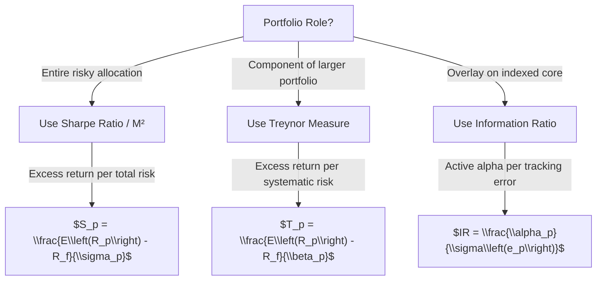

# Week 6-2: Portfolio Performance Evaluation

> **FIN 522A | Lecture 12**
> 🎯 Isolate manager skill from luck: risk-adjusted excess return framework shows why different measures can rank portfolios differently.

## Table of Contents
- [[#Why Evaluate Performance|Why Evaluate Performance]]
- [[#Measuring Returns|Measuring Returns]]
- [[#Risk Adjustment Framework|Risk Adjustment Framework]]
- [[#Sharpe Ratio and M²|Sharpe Ratio and M²]]
- [[#Treynor Measure|Treynor Measure]]
- [[#Information Ratio|Information Ratio]]
- [[#Jensen's Alpha|Jensen's Alpha]]
- [[#Connections Between Measures|Connections Between Measures]]
- [[#Luck vs Skill and Statistical Challenges|Luck vs Skill and Statistical Challenges]]
- [[#Style Analysis and Manipulation Detection|Style Analysis and Manipulation Detection]]

---

## Why Evaluate Performance ⭐⭐

The fundamental challenge in portfolio performance evaluation is the **agency problem** (代理问题：投资者和基金经理的利益不完全一致，很难判断经理是真的有投资本领，还是只是运气好). How can investors distinguish between:
- **Luck**: Random returns from risk exposure
- **Skill**: True alpha generation by the manager

### The Core Question

The CAPM decomposes total return as:

$$R_p = R_f + \underbrace{\beta_p(R_M - R_f)}_{\text{compensation for systematic risk}} + \underbrace{\alpha_p}_{\text{excess return = skill?}}$$

**Goal**: Isolate $\alpha_p$ and determine if it is statistically significant (not luck).

> [!important]
> We must **risk-adjust returns** (风险调整回报：把回报按照承担的风险来标准化，就像问"每赚一块钱是冒了多大的风险"？) because a manager might beat the market simply by taking more risk, not by being skillful. Without risk adjustment, we cannot distinguish leverage from stock-picking ability.

---

## Measuring Returns ⭐⭐

Before evaluating performance, we must correctly measure the return itself. Different return measures are appropriate for different contexts.

### Arithmetic Mean Return (算术平均收益率：简单地把每期回报加起来除以期数)

$$\boxed{\bar{R} = \frac{1}{T}\sum_{t=1}^{T} R_t}$$

**Characteristics:**
- Unbiased estimate of the **single-period expected return** (单期期望收益)
- Best for **forecasting**: $E[R_{t+1}] \approx \bar{R}$
- **Overstates** long-term wealth accumulation in volatile portfolios (对波动大的投资组合，高估了你实际赚的钱)
- Appropriate for hypothetical one-period performance

### Geometric Mean Return (几何平均收益率：真实的复利增长率，告诉你你的钱实际长期增长的速度)

$$\boxed{R_g = \left[\prod_{t=1}^{T}(1+R_t)\right]^{1/T} - 1}$$

**Characteristics:**
- Represents the **actual compound growth** rate of wealth (真实的复利增长：如果你有100万，经过T年后，$W_T = W_0(1+R_g)^T$ 就是你的财富)
- $R_g \leq \bar{R}$ (equality only if returns are constant)
- Accounting measure: If initial wealth is $W_0$, then $W_T = W_0(1+R_g)^T$

**Key Approximation (convexity adjustment):**

$$\boxed{R_g \approx \bar{R} - \frac{1}{2}\sigma^2}$$

> 直觉理解：几何平均比算术平均低，因为在波动中会有"不对称损失"——赚50%再亏50%，你没有回到原点，而是损失了。波动越大，这个差距越大。

This shows geometric return is penalized by volatility. High-volatility portfolios have a larger gap between arithmetic and geometric means.

### Money-Weighted Return (IRR) (金钱加权回报/内部收益率：考虑了每笔投入时间的回报，很适合考察有时间来去的私募)

$$\sum_{t=0}^{T} \frac{CF_t}{(1+IRR)^t} = 0$$

**When to use:**
- **Private equity / Venture capital**: Manager controls cash flow timing; IRR appropriate (PE基金经理决定什么时候投钱、什么时候出钱，所以要用IRR来衡量他的选时能力)
- **Mutual funds with exogenous flows**: Time-weighted return better isolates manager skill (eliminates flow timing luck) (散户随时可能进出，经理控制不了，所以用时间加权回报，排除掉进出时机的影响)

> [!tip]
> For evaluating public fund managers: Use **time-weighted returns** (时间加权回报). For evaluating PE/VC managers who control deployment timing: Use **IRR** (金钱加权回报).

---

## Risk Adjustment Framework ⭐⭐⭐

The principle underlying all performance measures is:

$$\boxed{\text{Performance} = \frac{\text{Excess Return}}{\text{Relevant Risk Measure}}}$$

> 直觉理解：用超额回报除以承担的风险。但关键问题是"什么样的风险才是相关的"？答案取决于这个投资组合在投资者整个资产配置中的角色。

But **which risk measure is relevant**? This depends on the portfolio's role in the investor's overall portfolio.

| **Context**                                                        | **Relevant Risk**            | **Measure**       | **Interpretation**                |
| ------------------------------------------------------------------ | ---------------------------- | ----------------- | --------------------------------- |
| **Standalone portfolio** (entire risky allocation)                 | Total volatility $\sigma_p$  | Sharpe Ratio      | Return per unit total risk        |
| **Component of larger portfolio** (idiosyncratic risk diversified) | Systematic risk $\beta_p$    | Treynor Measure   | Return per unit systematic risk   |
| **Active overlay on indexed core**                                 | Tracking error $\sigma(e_p)$ | Information Ratio | Active alpha per unit active risk |

---

## Sharpe Ratio and M² ⭐⭐⭐

The **Sharpe Ratio** (夏普比率：衡量每承担一单位总风险能获得多少超额回报，就像问"每冒一分总风险能多赚多少钱") is the excess return per unit of total risk.

$$\boxed{S_p = \frac{E(R_p) - R_f}{\sigma_p}}$$

**Example:**
- Portfolio A: $E[R_A] = 12\%$, $\sigma_A = 18\%$, $R_f = 2\%$ → $S_A = \frac{10\%}{18\%} = 0.556$
- Portfolio B: $E[R_B] = 10\%$, $\sigma_B = 12\%$, $R_f = 2\%$ → $S_B = \frac{8\%}{12\%} = 0.667$
- **B is better as standalone portfolio** despite lower absolute return. (B虽然绝对回报低，但相对风险更小，所以综合来看B更优。这说明我们不能只看回报，还要看风险)

### M² Measure (M平方度量：把夏普比率转换成回报率百分比，方便比较，就像问"如果把这个投资组合调整到跟市场风险一样，它会赚多少%")

M² converts the Sharpe Ratio into return units, facilitating comparison:

$$\boxed{M^2_p = R_f + S_p \times \sigma_M}$$

This is the return the portfolio **would have** if leveraged/deleveraged to match market volatility $\sigma_M$.

> 直觉理解：M²就是说，如果你把这个投资组合加杠杆或减杠杆，使得它的风险跟市场一样大，它会给你多少回报？夏普比率高的投资组合，调整后的回报也会高。

**Key property:** M² produces the **same ranking** as Sharpe Ratio, but in percentage return units rather than ratios.

> [!important]
> **Sharpe/M² is appropriate when:** The portfolio represents the investor's entire risky allocation. Idiosyncratic risk **cannot** be diversified away because there is no other risky holding. Leverage/deleveraging is feasible. (适用于：这个投资组合是你全部的股票投资，特定风险排不出去；或者你可以加杠杆)

---

## Treynor Measure ⭐⭐⭐

The **Treynor Measure** (特雷诺度量：衡量每承担一单位系统风险(贝塔)能获得多少超额回报。适合这个投资组合只是你大投资组合的一部分的情况，因为你在大组合里已经分散了特定风险，只剩下系统风险对你重要) uses only **systematic risk** (beta) (系统风险：跟整个市场一起波动的那部分风险，排不出去).

$$\boxed{T_p = \frac{E(R_p) - R_f}{\beta_p}}$$

**Logic:**
- If the portfolio is part of a larger, well-diversified portfolio, idiosyncratic risk is already diversified away (特定风险已经通过分散投资消除了)
- Only systematic risk $\beta_p$ affects marginal risk to the investor (只有系统风险还在影响你的总风险)
- Therefore, evaluate only return per unit of systematic risk (所以只需要看相对系统风险的回报)

**Example (from Lecture 12):**

Assume $R_f = 2\%$, $E[R_M] = 8\%$, $\sigma_M = 15\%$ (market premium = 6%)

| Portfolio | $\beta$ | $E[R_p]$ | Treynor |
|---|---|---|---|
| A | 1.1 | 11.1% | $(11.1\% - 2\%)/1.1 = 8.27\%$ |
| B | 1.0 | 9.2% | $(9.2\% - 2\%)/1.0 = 7.20\%$ |
| Market | 1.0 | 8.0% | $(8.0\% - 2\%)/1.0 = 6.00\%$ |

**Portfolio A > B > Market**: A generates more excess return per unit of systematic risk.

> [!tip]
> The **Treynor-Market relationship**: $T_p - T_M = \frac{\alpha_p}{\beta_p}$. A portfolio beats the market (Treynor-wise) if and only if $\alpha_p > 0$. (特雷诺值超过市场 ⟺ 经理有正的超额回报；这说明超额回报α是真正衡量经理能力的东西)

---

## Information Ratio ⭐⭐⭐

The **Information Ratio** (信息比率：衡量相对基准的主动管理能力。它问"每多冒一点不同于基准的风险，能多赚多少主动回报") measures active management performance relative to a benchmark.

$$\boxed{IR = \frac{\alpha_p}{\sigma(e_p)} = \frac{\text{Active Return}}{\text{Active Risk (Tracking Error)}}}$$

Where:
- $\alpha_p$ = Excess return vs benchmark (主动回报：超过基准的那部分回报)
- $\sigma(e_p)$ = Residual standard deviation (追踪误差：投资组合的回报和基准回报的差距)

**Interpretation:** Alpha per unit of bet taken away from the benchmark. (每下一点离开基准的赌注，能赚多少超额回报)

### The Fundamental Law of Active Management (主动管理的基本法则：这是一个很深刻的关系式，说明了IR是如何改进整个投资组合的夏普比率的)

If active management is a separate overlay on an indexed core:

$$\boxed{S^2_{\text{active+indexed}} = S^2_{\text{indexed}} + IR^2}$$

> 直觉理解：假设你的投资分两部分——一部分被动跟踪指数，一部分是主动管理加到上面的。那么整个组合的夏普比率平方，就等于指数的夏普比率平方加上主动管理的IR平方。这说明IR高的经理，即使规模不大，也能显著改进你的整体风险-收益。

The **Sharpe Ratio of blending** improves by $IR^2$ from the active manager's alpha.

**Example:**
- Benchmark Sharpe: $S_b = 0.40$
- Active manager IR: $0.60$
- **Combined**: $S_{\text{combined}} = \sqrt{0.40^2 + 0.60^2} = \sqrt{0.52} = 0.721$

> [!important]
> **IR is appropriate when:** Evaluating a manager vs an explicit benchmark, considering a fund as an overlay to a passive core, or assessing active management's value. The manager's alpha is evaluated relative to tracking error (bet size), not total volatility. (适用于：你有一个被动基金做core，然后考虑加一个主动经理；或者直接评价一个经理相对某个基准的表现)

---

## Jensen's Alpha ⭐⭐⭐

**Jensen's Alpha** (詹森阿尔法：CAPM模型下的超额回报，衡量经理是否真的有本事跑赢市场。这是评价经理能力的最核心的指标) is the intercept from a CAPM regression, representing abnormal return after adjusting for systematic risk.

$$\boxed{\alpha_p = E(R_p) - [R_f + \beta_p(E(R_M) - R_f)]}$$

> 直觉理解：根据CAPM，合理的回报应该是 = 无风险利率 + β×市场风险溢价。如果实际回报超过了这个，超出的部分就是α，说明经理有本事。

**Estimation:**
Run the regression: $R_p - R_f = \alpha + \beta(R_M - R_f) + \varepsilon$

The intercept $\alpha$ is Jensen's alpha.

**Interpretation:**
- $\alpha > 0$ (and statistically significant): Manager has skill (经理真的有本事，不是运气)
- $\alpha = 0$: Manager merely delivers market return for systematic risk taken (经理既没加值，也没亏损，就是按照风险该得的回报)
- $\alpha < 0$: Manager underperforms (likely due to fees) (经理亏了，通常是因为管理费太高)

**Critical Issues:**
1. **Model-dependent**: True if CAPM is correct. If true risk model is multi-factor, single-factor alpha is biased (假设CAPM是对的，但如果真实的风险因子不止一个，这个α就有偏差了)
2. **Estimation error**: $\hat{\alpha}$ has noise; need long history to detect skill (样本量小的话，算出来的α波动很大，很难区分是真实能力还是噪音)
3. **Dead weight of fees**: Most alphas are consumed by management fees before reaching investors (可怕的现实：投资者看到的α通常已经被管理费吃掉了一大半)

---

## Connections Between Measures ⭐⭐⭐

This section is **critical for the exam** because different measures can rank portfolios differently. (关键洞察：不同的度量标准可能会得出不同的排名！要理解为什么。)

### Mathematical Connections

**Treynor vs Market:**
$$\boxed{T_p - T_M = \frac{\alpha_p}{\beta_p}}$$

Portfolio beats market on Treynor measure ⟺ $\alpha_p > 0$

**Sharpe Decomposition:**
$$\boxed{S_p = \frac{\alpha_p}{\sigma_p} + \rho_{pM} \cdot S_M}$$

Where $\rho_{pM}$ is correlation with market.

Portfolio improves Sharpe ratio ⟺ $\alpha_p$ is large relative to total volatility $\sigma_p$ (not just relative to tracking error).

**Information Ratio:**
$$\boxed{IR = \frac{\alpha_p}{\sigma(e_p)}}$$

Improvement comes from alpha per unit of residual (active) risk.

### Worked Example: LECTURE 12 (Critical for Exam)

**Given:**
- $R_f = 2\%$, $E[R_M] = 8\%$, $\sigma_M = 15\%$, Benchmark = Market

**Portfolio A:**
- $\beta_A = 1.1$, $\alpha_A = 2.5\%$
- $\sigma(e_A) = 8\%$ (tracking error)
- $E[R_A] = 2\% + 1.1(6\%) + 2.5\% = 11.1\%$
- $\sigma_A = 18.3\%$

**Portfolio B:**
- $\beta_B = 1.0$, $\alpha_B = 1.2\%$
- $\sigma(e_B) = 2\%$ (tracking error)
- $E[R_B] = 2\% + 1.0(6\%) + 1.2\% = 9.2\%$
- $\sigma_B = 15.1\%$

### Calculations & Rankings

**Sharpe Ratio:**
- A: $\frac{11.1\% - 2\%}{18.3\%} = 0.497$
- B: $\frac{9.2\% - 2\%}{15.1\%} = 0.475$
- **Winner: A** (better as standalone)

**Treynor Measure:**
- A: $\frac{11.1\% - 2\%}{1.1} = 8.27\%$
- B: $\frac{9.2\% - 2\%}{1.0} = 7.20\%$
- Market: $\frac{8\% - 2\%}{1.0} = 6.00\%$
- **Winner: A** (higher alpha per unit beta)

**Information Ratio (vs Market benchmark):**
- A: $\frac{2.5\%}{8\%} = 0.3125$
- B: $\frac{1.2\%}{2\%} = 0.60$
- **Winner: B** (more efficient alpha per tracking error)

### Key Insight: Different Measures, Different Rankings

```
Measure        | Winner | Rationale
---|---|---
Sharpe/M²      | A      | Higher absolute excess return per total risk
Treynor        | A      | Higher alpha per unit systematic risk
Information    | B      | Higher active alpha per unit active risk
```

**Why the difference?**
- **A** generates more total alpha (2.5% vs 1.2%) and larger alpha-to-beta ratio
- **B** concentrates alpha efficiently with much tighter tracking error (2% vs 8%)
- If investor already has broad market exposure, B is **better complement** (adds more active return per bet)
- If portfolio is standalone, A is **better** (higher risk-adjusted return overall)

> 直觉理解：A就像一个激进的狩猎者——冒了更多风险，赚了更多钱。B就像一个精准的狙击手——每一个行动都很高效。如果你已经有了基础的市场投资，加一个B这样的狙击手效率更高；但如果这是你全部的投资，A提供了更好的综合风险-回报。

> [!important]
> **Exam Key:** Always ask "**What is the investor's context?**" before selecting a performance measure. Don't just compute all three; justify which one is appropriate for the decision. (先问清楚投资者的处境，再选择度量标准，不要盲目计算)

---

## Luck vs Skill and Statistical Challenges ⭐⭐⭐

Even if a manager has positive alpha, is it due to **skill** or **luck**? (这是最难的问题：看起来赚钱的经理，是真的有本事，还是只是运气好？)

### Statistical Significance of Alpha (阿尔法的统计显著性：用t统计量来判断一个α是否是真实的，还是噪音)

The **t-statistic** for alpha (t统计量：比值越大，说明α越确定，不是噪音):

$$\boxed{t = \frac{\hat{\alpha} \sqrt{N}}{\sigma(e)}}$$

Where:
- $\hat{\alpha}$ = Estimated alpha (e.g., from regression)
- $\sigma(e)$ = Residual standard deviation (追踪误差/残差标准差：你的投资偏离预期的幅度)
- $N$ = Number of periods (years)

**Example:** Need $t > 1.96$ (95% confidence) (要达到95%的置信度)

- Monthly data, 5 years: $N = 60$ → $\sqrt{60} = 7.75$
- Need $\alpha \approx 0.25\% \times 7.75 = 1.94\%$ monthly to be significant
- **In annual terms:** $\approx 23\%$ annual alpha! (天哪，需要每年23%的超额回报才能在5年数据上显著！)
- For 20% tracking error: IR would need to be 1.15+ (unrealistic) (这说明很难用短期数据证明经理有能力)

> 直觉理解：数据越少，噪音越容易被当成真实的信号。要证明一个经理真的有能力（而不只是运气），需要很长的历史数据。这叫"数据挖掘的诅咒"。

**Reality:** Need **~33 years** of data to prove manager skill statistically (assuming tracking error of 10% and alpha of 2%). (现实中，要有大概33年的表现记录才能有把握说这个经理真的有本事。但大多数基金经理开公司都没有33年的历史！)

### Selection Biases (样本偏差：观测到的α被系统地高估了，因为有各种偏差)

> [!warning]
> Observed alphas are systematically biased upward due to:

1. **Survivorship bias** (幸存者偏差：死掉的基金被删掉了，数据库里只剩下活着的赢家): Dead funds dropped from database; only winners remain (比如2008年后，很多对冲基金关闭了，但我们研究数据时只看还活着的那些，自然看起来表现更好)
2. **Backfill bias** (回填偏差：新加入数据库的基金往往把以前的记录也加进去，而新基金的初期表现通常特别好): Newly added funds have existing track record, which is unrepresentative (新基金加入数据库时，会把过去的成功记录加上去，但早期往往是最赚钱的)
3. **Self-selection bias** (自选偏差：基金自己决定什么时候公布成绩，自然是成绩好的时候): Funds choose to report only when performance is good (表现不好的年份，基金经理可能就不主动发布了)
4. **Data-snooping** (数据挖掘/多重检验问题：如果你测试1000个基金，概率学告诉你大概有50个会因为纯运气而看起来表现很好): Thousands of funds tested; pure luck produces some "winners" (简单的数学：如果你随机测试足够多的基金，总会有些因为运气而看起来像赢家的)

**Empirical finding:** After controlling for these biases, average fund underperformance widens (most alphas are zero or negative when adjusted). (控制了这些偏差后，大多数基金的α变成零甚至负数。这说明市场上大多数主动管理的经理其实没有真正的能力。)

---

## Style Analysis and Manipulation Detection ⭐⭐

### Returns-Based Style Analysis (回报率基础风格分析：把投资组合的回报分解成不同风格因子的贡献)

Decompose portfolio return using observed factor returns (把投资组合的回报归属到不同的因子，比如大盘vs小盘、成长vs价值):

$$\boxed{R_p = \alpha + \sum_{k} w_k R_k + \varepsilon}$$

Constraints: $w_k \geq 0$ (non-negative weights), $\sum w_k = 1$ (sum to one)

**Interpretation:**
- **High $R^2$** (>95%): Portfolio is well-explained by style factors = **closet indexer** (隐形指数基金：经理声称主动管理，实际上就是跟踪指数) (hidden indexing)
- **Low $R^2$** (<80%): Significant active management or style drift (真的在做主动投资，或者风格不稳定)

> 直觉理解：用因子回报能解释95%以上的投资组合回报，说明经理其实没什么独特策略，就是跟着市场的大风格走。这在业界叫"衣柜指数化"——表面是主动，实际是被动。

**Advantage:** Detects if manager claims to be active but is actually tracking an index. (能识别骗子经理——声称自己在主动选股，实际上就是被动跟踪)

### Manipulation Detection (操纵检测：聪明的骗子基金经理会作弊来伪造好的业绩)

Managers may manipulate reported returns (一些经理为了吸引资金，会想办法伪造业绩):

1. **Return smoothing** (平滑收益：报告虚假平滑的回报→低估波动率，高估夏普比率): Report artificial smooth returns → Underestimate volatility, inflate Sharpe
   - **Detection**: High reported returns with suspiciously low volatility (如果一个基金的回报高，但波动率低到不合理，可能在作假)

2. **Tail risk strategies** (尾部风险策略/黑天鹅陷阱：通过卖远期看跌期权来赚一些稳定的溢价，但偶尔会有个大崩盘，一次全赔): Sell far OTM puts to generate steady premium, but rare crashes cause massive losses (每年稳定赚2-3%，但万一市场大跌，一次亏掉之前赚的10倍)
   - **Detection**: High recent returns, low realized volatility, but massive negative skewness in returns (看起来稳赚，但分布右尾特别长——下跌特别狠)

3. **Window dressing** (窗口打扮：季末或年末临时调整持仓，让财务报表更漂亮): Buy/sell holdings before performance reporting periods to improve appearance (年底前买买赚钱的股票，年底后再卖掉，财务报表看起来很光鲜)
   - **Detection**: Trades right before reporting; liquidity costs; pattern analysis (季末前交易特别频繁，或者某些股票总是在报告前买入、报告后卖出)

4. **Gaming benchmarks**: Concentrated bets on benchmark losers, hoping for outperformance

### Morningstar MRAR (晨星风险调整收益：比夏普比率更鲁棒的度量，因为考虑了下行风险和偏度)

More robust measure than simple Sharpe:
- Uses **downside deviation** instead of total volatility (只看向下的风险，不是所有的波动) (penalizes only downside)
- Accounts for **skewness** (考虑回报分布是否不对称：黑天鹅风险) (asymmetric returns)
- Better detects tail risk strategies (能识别出那些"平时赚小钱，偶尔大亏"的陷阱)

### Market Timing Analysis (择时分析：问一个经理是否能预测市场上下)

Can a manager time market entry/exit? (这个经理是否有能力在对的时间买入卖出？)

**Treynor-Mazuy Test** (特雷诺-麦祖伊检验：用平方项来检测经理是否有择时能力):

$$\boxed{r_p = \alpha + \beta r_M + \gamma r_M^2 + e}$$

> 直觉理解：如果经理有择时能力，他会在市场上升时增加风险敞口、在市场下降时减少风险敞口。这样他的回报和市场回报的关系就不是线性的，而是有个弯曲（二次项γ）。如果γ > 0，说明这个弯曲是"好的"，即市场涨幅大时他的β更大。

- $\gamma > 0$ suggests market timing ability (higher return when market surges) (当市场大幅上升时，这个经理的β比较大，说明他有能力增加风险敞口)
- **Empirical finding**: Most managers show $\gamma \approx 0$ (no timing ability) (现实中，绝大多数经理的γ接近0，说明他们没有择时能力。市场择时真的特别难)
- Timing ability is rare and difficult to detect statistically (成功的择时能力寥寥无几)

---

## Summary and Key Formulas

### Performance Measure Selection Matrix



### Core Formulas Reference Table

| **Concept** | **Formula** | **Key Use** |
|---|---|---|
| Geometric Return | $R_g \approx \bar{R} - \frac{1}{2}\sigma^2$ | True compound growth |
| Sharpe Ratio | $S_p = \frac{E(R_p) - R_f}{\sigma_p}$ | Standalone portfolio ranking |
| M² | $M^2 = R_f + S_p \times \sigma_M$ | Sharpe in return units |
| Treynor | $T_p = \frac{E(R_p) - R_f}{\beta_p}$ | Portfolio component ranking |
| Jensen Alpha | $\alpha_p = E(R_p) - [R_f + \beta_p(R_M - R_f)]$ | CAPM abnormal return |
| Information Ratio | $IR = \frac{\alpha_p}{\sigma(e_p)}$ | Active mgmt efficiency |
| Treynor Spread | $T_p - T_M = \frac{\alpha_p}{\beta_p}$ | Skill detection |
| Alpha t-stat | $t = \frac{\hat{\alpha}\sqrt{N}}{\sigma(e)}$ | Statistical significance |

### Exam-Critical Insights

1. **Always consider context first**: Different measures answer different questions. Select based on investor's portfolio role, not just computation convenience.

2. **Different measures can rank portfolios differently**: Portfolio A can win Sharpe but lose Information Ratio. Know why.

3. **Alpha is the core**: All measures ultimately depend on $\alpha_p$. The differences lie in which risk adjustment (total, systematic, or tracking error) is applied.

4. **Statistical significance is rare**: Proving skill requires 25+ years of data with measurable alpha. Selection biases make observed alphas upward biased.

5. **Worked example structure**:
   - Compute returns and risk metrics
   - Calculate each measure (Sharpe, Treynor, IR)
   - Compare rankings
   - Justify which measure is appropriate
   - Discuss skill vs luck

---

**Related Notes:** [[Week 4-1 Risk and Return]] | [[Week 4-2 Portfolio Theory and Optimization]] | [[Week 5-1 Single-Factor and Single-Index Models]] | [[Week 5-2 CAPM and Multifactor Models]] | [[Week 6-1 EMH and Behavioral Finance]] | [[Week 7-1 Futures Markets and Pricing]] | [[Week 7-2 FX Interest Rate Futures and Swaps]]
