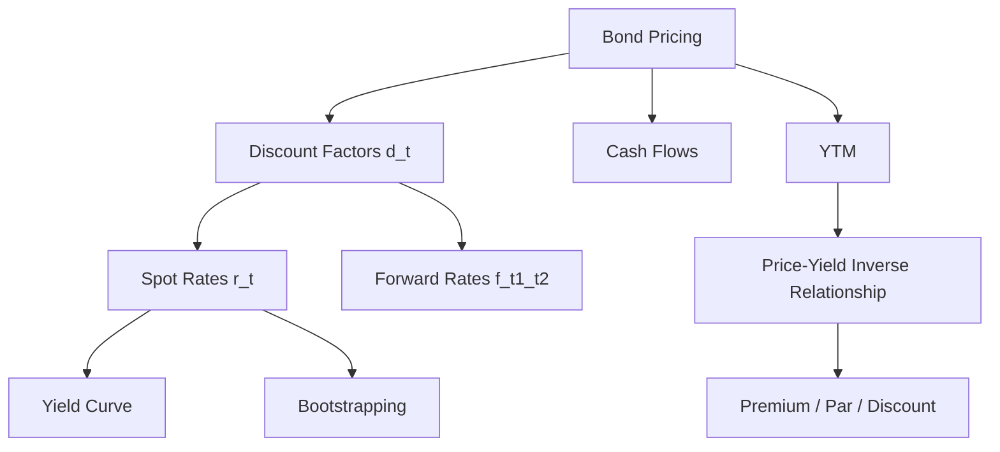

# Week 1-1: Bond Pricing and Yield Fundamentals

> **FIN 522A Fixed Income | Lecture 1**
> 🎯 本讲核心：理解债券定价的基本逻辑，从 discount factor 到 yield curve 的构建

---

## 📑 Table of Contents 目录

1. [[#1. Why Fixed Income Matters 为什么要学固定收益|Why Fixed Income Matters 为什么要学固定收益]]
2. [[#2. Bond Basics 债券基础|Bond Basics 债券基础]]
3. [[#3. Discount Factors 折现因子 ⭐|Discount Factors 折现因子]]
4. [[#4. Bond Pricing 债券定价 ⭐⭐|Bond Pricing 债券定价]]
5. [[#5. Yield to Maturity (YTM) 到期收益率 ⭐⭐|Yield to Maturity (YTM) 到期收益率]]
6. [[#6. Spot Rates and the Yield Curve 即期利率与收益率曲线 ⭐⭐|Spot Rates & Yield Curve 即期利率与收益率曲线]]
7. [[#7. Forward Rates 远期利率 ⭐|Forward Rates 远期利率]]
8. [[#8. Types of Bonds 债券类型|Types of Bonds 债券类型]]
9. [[#9. Day Count Conventions 日计数惯例|Day Count Conventions 日计数惯例]]
10. [[#10. Accrued Interest and Clean vs Dirty Price 应计利息与净价/全价|Accrued Interest & Clean vs Dirty Price 应计利息与净价/全价]]

---

## 1. Why Fixed Income Matters 为什么要学固定收益

Fixed income is the **largest asset class** globally — 固定收益是全球最大的资产类别。

Key reasons to study:
- Bond markets are **bigger than equity markets** (美国债市规模 > 股市)
- Understanding interest rates is fundamental to **all** asset pricing（利率是所有资产定价的基础）
- Crucial for **risk management** in banks, insurance companies, and pension funds

> [!important] 考试重点
> 固定收益不是"boring"的资产类别，它是金融系统的backbone（骨架）

---

## 2. Bond Basics 债券基础

### 2.1 What is a Bond? 什么是债券

A bond is a **debt instrument** where the issuer promises to pay:
- **Coupon payments** (利息) — periodic interest payments
- **Face value / Par value** (面值) — typically $1,000, paid at maturity

### 2.2 Key Terminology 关键术语

| Term | 中文 | Definition |
|------|------|------------|
| **Coupon Rate** | 票面利率 | Annual interest as % of face value |
| **Maturity** | 到期日 | When the bond expires and principal is returned |
| **Face/Par Value** | 面值 | The amount repaid at maturity (usually $1,000) |
| **Yield** | 收益率 | The return an investor earns |
| **Zero-Coupon Bond** | 零息债券 | Only pays face value at maturity, no coupon |

---

## 3. Discount Factors 折现因子 ⭐

> [!tip] 核心概念
> **Discount factor** $d(t)$ = the price TODAY of receiving **$1** at time $t$ in the future
> 也就是说，未来1块钱，今天值多少钱？

### 3.1 Definition 定义

$$d(t) = \text{PV of receiving \$1 at time } t$$

**Key properties:**
- $d(0) = 1$（今天的1块钱就是1块钱）
- $d(t) < 1$ for $t > 0$（未来的钱今天更不值钱 → **time value of money**）
- $d(t_1) > d(t_2)$ if $t_1 < t_2$（越远的现金流折现越多）

### 3.2 Relationship with Interest Rates 与利率的关系

If the **semi-annual compounding rate** is $r(t)$:

$$d(t) = \frac{1}{\left(1 + \frac{r(t)}{2}\right)^{2t}}$$

> [!warning] 注意
> 美国债券市场的convention是 **semi-annual compounding**（半年复利），这是默认假设！

如果是 **continuous compounding**（连续复利）:

$$d(t) = e^{-r(t) \cdot t}$$

---

## 4. Bond Pricing 债券定价 ⭐⭐

### 4.1 The Fundamental Pricing Formula 基本定价公式

A bond's price = **PV of all future cash flows**:

$$P = \sum_{i=1}^{n} c_i \cdot d(t_i)$$

where:
- $c_i$ = cash flow at time $t_i$（第 $i$ 期的现金流）
- $d(t_i)$ = discount factor for time $t_i$（对应的折现因子）

### 4.2 Example: Coupon Bond Pricing 举例

For a bond with:
- Face value = $100
- Coupon rate = 6% (semi-annual → 每半年付 $3)
- Maturity = 2 years (4 periods)

$$P = 3 \cdot d(0.5) + 3 \cdot d(1.0) + 3 \cdot d(1.5) + 103 \cdot d(2.0)$$

> [!note] 理解逻辑
> 最后一期支付 $103 = $3 coupon + $100 face value（最后一次付息+还本）

### 4.3 Zero-Coupon Bond 零息债券

Zero-coupon bond 是最简单的情况 — 只有到期还本，没有中间付息：

$$P_{zero} = Face \times d(T)$$

所以 **zero-coupon bond 的价格本身就直接告诉你 discount factor！**

$$d(T) = \frac{P_{zero}}{Face}$$

> [!important] 考试技巧
> 如果题目给你 zero-coupon bond 的价格，你可以直接算出 discount factor

---

## 5. Yield to Maturity (YTM) 到期收益率 ⭐⭐

### 5.1 Definition 定义

**YTM** is the **single discount rate** that makes the PV of all cash flows equal to the bond's market price.

$$P = \sum_{i=1}^{n} \frac{c_i}{\left(1 + \frac{y}{2}\right)^{2t_i}}$$

where $y$ = YTM (annualized, semi-annual compounding)

> [!tip] 直觉理解
> YTM 就是把所有不同期限的折现率"平均"成一个数。它是一种 **summary measure**，但不是完美的。
> 类比：YTM 之于 discount factors，就像 GPA 之于每门课的成绩 — 方便但丢失了细节。

### 5.2 Price-Yield Relationship 价格与收益率的关系

**核心关系：Price and Yield move in OPPOSITE directions!**

$$y \uparrow \implies P \downarrow$$
$$y \downarrow \implies P \uparrow$$

原因：折现率越高，未来现金流的现值越低 → 债券价格下降

→ 价格到底变**多少**？见 [[Week 1-2 Duration, Convexity and Interest Rate Risk#4. Modified Duration 修正久期 ⭐⭐⭐|Modified Duration]]

### 5.3 Premium, Par, and Discount 溢价、平价、折价

| Condition | Name | 中文 | Price vs Face |
|-----------|------|------|---------------|
| Coupon Rate > YTM | **Premium Bond** | 溢价债券 | $P > Face$ |
| Coupon Rate = YTM | **Par Bond** | 平价债券 | $P = Face$ |
| Coupon Rate < YTM | **Discount Bond** | 折价债券 | $P < Face$ |

> [!example] 直觉
> 如果一个债券给的 coupon 比市场要求的收益率高，大家都想买 → 价格被推高到面值以上 → **premium**

---

## 6. Spot Rates and the Yield Curve 即期利率与收益率曲线 ⭐⭐

### 6.1 Spot Rate 即期利率

**Spot rate** $r(t)$ = the yield on a **zero-coupon bond** maturing at time $t$

也叫 **zero rate**，是对应期限的"纯粹"利率，没有被 coupon 污染

$$d(t) = \frac{1}{\left(1 + \frac{r(t)}{2}\right)^{2t}}$$

### 6.2 The Yield Curve 收益率曲线

The **yield curve** (also called **term structure of interest rates**) plots spot rates against maturity:

```
r(t)
 |        ___________
 |      /
 |    /
 |  /
 | /
 |/__________________ t
 0   1   5   10   30
```

**Common shapes 常见形状:**

| Shape | 形状 | Meaning |
|-------|------|---------|
| **Normal / Upward sloping** | 正常向上 | 长期利率 > 短期利率 (most common) |
| **Inverted** | 倒挂 | 短期利率 > 长期利率 (often signals recession) |
| **Flat** | 平坦 | 各期限利率差不多 |
| **Humped** | 驼峰形 | 中期利率最高 |

> [!warning] 考试重点
> Inverted yield curve 常被视为经济衰退的信号（recession predictor）

### 6.3 Bootstrapping 自举法 ⭐⭐

**Bootstrapping** is the method to extract spot rates from **coupon bond prices** step by step.

**逻辑：** 从短期到长期，逐步求解每一个 spot rate。

**Step-by-step process:**

**Step 1:** Use the shortest maturity bond (e.g., 6-month T-bill) to get $r(0.5)$

$$d(0.5) = \frac{P_{0.5}}{Face + Coupon}$$

**Step 2:** Use the 1-year bond + already known $d(0.5)$ to solve for $d(1.0)$ and thus $r(1.0)$

$$P_1 = c \cdot d(0.5) + (Face + c) \cdot d(1.0)$$

**Step 3:** Continue for longer maturities...

> [!example] 例子
> 已知：
> - 6-month zero: price = $99.50, face = $100 → $d(0.5) = 0.9950$
> - 1-year 4% coupon bond: price = $101.00
>
> 求 $d(1.0)$:
> $$101 = 2 \times 0.9950 + 102 \times d(1.0)$$
> $$d(1.0) = \frac{101 - 1.99}{102} = 0.9707$$

---

## 7. Forward Rates 远期利率 ⭐

### 7.1 Definition 定义

**Forward rate** $f(t_1, t_2)$ = the interest rate agreed **today** for borrowing/lending from $t_1$ to $t_2$ in the future

> [!tip] 直觉
> 你今天就锁定了一个未来才开始的利率。比如 $f(1,2)$ = 从1年后到2年后的利率，但现在就确定了。

### 7.2 Calculating Forward Rates from Spot Rates 用即期利率算远期利率

核心公式（No arbitrage condition / 无套利条件）:

$$\left(1 + \frac{r(t_2)}{2}\right)^{2t_2} = \left(1 + \frac{r(t_1)}{2}\right)^{2t_1} \times \left(1 + \frac{f(t_1,t_2)}{2}\right)^{2(t_2 - t_1)}$$

Or equivalently using discount factors:

$$d(t_2) = d(t_1) \times \frac{1}{\left(1 + \frac{f}{2}\right)^{2(t_2-t_1)}}$$

> [!important] No Arbitrage 无套利
> 两种投资策略必须给出相同的结果：
> 1. 直接投资 $t_2$ 年
> 2. 先投资 $t_1$ 年，再以 forward rate 投资剩余 $t_2 - t_1$ 年
>
> 如果不等，就有套利机会（free money），市场不允许。

---

## 8. Types of Bonds 债券类型

### 8.1 U.S. Treasury Securities 美国国债

| Type | Maturity | 特点 |
|------|----------|------|
| **T-Bills** | ≤ 1 year | Zero-coupon, sold at discount |
| **T-Notes** | 2-10 years | Semi-annual coupon |
| **T-Bonds** | 10-30 years | Semi-annual coupon |
| **TIPS** | Various | Inflation-protected (本金随CPI调整) |

### 8.2 Other Important Types

- **Corporate Bonds** 公司债 — have **credit risk**（违约风险）→ 详见 [[Week 2-2 Credit Risk and Credit Analysis]]
- **Municipal Bonds** 市政债 — usually **tax-exempt**（免税）
- **Agency Bonds** 机构债 — issued by GSEs like Fannie Mae

---

## 9. Day Count Conventions 日计数惯例

> [!note] 看起来琐碎但考试可能考

| Convention | Used For | Formula |
|------------|----------|---------|
| **Actual/Actual** | U.S. Treasuries | 实际天数/实际天数 |
| **30/360** | Corporate & Municipal bonds | 假设每月30天，每年360天 |
| **Actual/360** | Money market instruments | 实际天数/360 |

---

## 10. Accrued Interest and Clean vs Dirty Price 应计利息与净价/全价

### Clean Price vs Dirty Price

$$\text{Dirty Price (Full Price)} = \text{Clean Price (Quoted Price)} + \text{Accrued Interest}$$

- **Clean Price** (净价/报价): 报纸上看到的价格，不含应计利息
- **Dirty Price** (全价/实际支付价): 买方实际要付的钱 = Clean Price + 应计利息
- **Accrued Interest** (应计利息): 从上一个付息日到交割日，卖方"应得"但还没收到的利息

$$AI = \text{Coupon} \times \frac{\text{Days since last coupon}}{\text{Days in coupon period}}$$

> [!tip] 为什么要区分？
> 因为 coupon payment 会导致价格跳跃。用 clean price 可以让价格变动更平滑，更好地反映利率变化。

---

## Summary 本讲总结



**必须记住的公式：**
1. $P = \sum c_i \cdot d(t_i)$ — 债券定价
2. $d(t) = \frac{1}{(1+r/2)^{2t}}$ — discount factor 与 spot rate 的关系
3. Forward rate 的无套利公式
4. Bootstrapping 的逐步求解过程
5. Dirty Price = Clean Price + Accrued Interest

---

**Related Notes:** [[Week 1-2 Duration, Convexity and Interest Rate Risk]] | [[Week 2-1 Embedded Options Effective Duration and MBS]] | [[Week 2-2 Credit Risk and Credit Analysis]] | [[Week 3 Portfolio Credit Risk and CreditMetrics]] | [[Week 4-1 Risk and Return]] | [[Week 4-2 Portfolio Theory and Optimization]]
