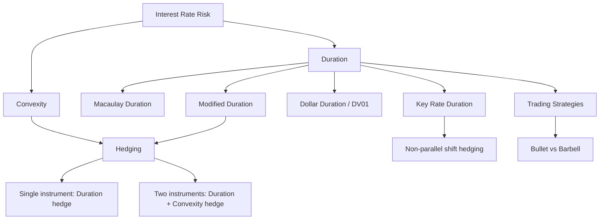

# Week 1-2: Duration, Convexity and Interest Rate Risk

> **FIN 522A Fixed Income | Lecture 2**
> 🎯 本讲核心：如何衡量和管理债券对利率变动的敏感性
> 📌 Prerequisites: [[Week 1-1 Bond Pricing and Yield Fundamentals]]

---

## 📑 Table of Contents 目录

1. [[#1. The Big Picture 全局观|The Big Picture 全局观]]
2. [[#2. Dollar Duration (DV01 / PVBP) 美元久期 ⭐⭐|Dollar Duration (DV01 / PVBP) 美元久期]]
3. [[#3. Macaulay Duration 麦考利久期 ⭐⭐|Macaulay Duration 麦考利久期]]
4. [[#4. Modified Duration 修正久期 ⭐⭐⭐|Modified Duration 修正久期]]
5. [[#5. Convexity 凸性 ⭐⭐|Convexity 凸性]]
6. [[#6. Portfolio Duration 组合久期 ⭐⭐|Portfolio Duration 组合久期]]
7. [[#7. Hedging with Duration 用久期进行对冲 ⭐⭐⭐|Hedging with Duration 用久期进行对冲]]
8. [[#8. Key Rate Duration (KRD) 关键利率久期 ⭐|Key Rate Duration (KRD) 关键利率久期]]
9. [[#9. Barbell vs Bullet Strategy 哑铃策略 vs 子弹策略|Barbell vs Bullet Strategy 哑铃策略 vs 子弹策略]]
10. [[#10. Trading Strategies with Duration 基于久期的交易策略|Trading Strategies with Duration 基于久期的交易策略]]

---

## 1. The Big Picture 全局观

我们在 [[Week 1-1 Bond Pricing and Yield Fundamentals]] 中学到：$y \uparrow \implies P \downarrow$

**但关键问题是：价格到底变多少？**

这就是 **Duration** 和 **Convexity** 要回答的问题。

```
Price
  |  \
  |   \  ← actual price-yield curve (convex)
  |    \
  |     \___
  |         \____
  |____________________ Yield
```

---

## 2. Dollar Duration (DV01 / PVBP) 美元久期 ⭐⭐

### 2.1 Definition 定义

**DV01** (Dollar Value of a Basis Point) 也叫 **PVBP** (Price Value of a Basis Point):

$$DV01 = -\frac{\Delta P}{\Delta y} \times 0.0001$$

> [!tip] 直觉理解
> DV01 回答的问题：**利率变动1个基点 (0.01%)，债券价格变多少美元？**
> - 1 basis point (bp) = 0.01% = 0.0001

### 2.2 Calculation 计算方法

**Numerical approximation 数值近似法:**

$$DV01 \approx \frac{P(y - \Delta y) - P(y + \Delta y)}{2}$$

where $\Delta y = 1$ bp = 0.0001

> [!example] 例子
> A bond priced at $100:
> - $P(y - 1bp) = 100.05$
> - $P(y + 1bp) = 99.95$
> - $DV01 = \frac{100.05 - 99.95}{2} = 0.05$
>
> 意思：利率每变动1bp，价格变动约 $0.05

> [!important] DV01 vs Duration
> - **DV01** 是 **dollar amount**（美元金额）— 绝对值
> - **Duration** 是 **percentage change**（百分比）— 相对值
> - 联系：$DV01 = \frac{D \times P}{10000}$，其中 D = [[#4. Modified Duration 修正久期 ⭐⭐⭐|modified duration]]
> - DV01 也是 [[#7. Hedging with Duration 用久期进行对冲 ⭐⭐⭐|对冲]] 的核心计算工具

---

## 3. Macaulay Duration 麦考利久期 ⭐⭐

### 3.1 Definition 定义

**Macaulay Duration** = the **weighted average time** to receive cash flows, where weights are the **PV of each cash flow** as a proportion of the bond price.

$$D_{Mac} = \frac{\sum_{i=1}^{n} t_i \times \frac{PV(c_i)}{P}}{1} = \sum_{i=1}^{n} t_i \times w_i$$

where:
- $t_i$ = time to the $i$-th cash flow（第 $i$ 期的时间）
- $w_i = \frac{PV(c_i)}{P}$ = weight of the $i$-th cash flow（权重）
- $\sum w_i = 1$

> [!tip] 直觉 🎯
> Macaulay Duration 就像一个**跷跷板的平衡点（fulcrum）**：
> 把所有现金流按时间排列在一根棍子上，每个现金流的"重量"是它的现值。
> Duration 就是让这根棍子平衡的支点位置。
>
> 这就是为什么它的单位是 **years**（年）！

### 3.2 Key Properties 关键性质

| Property | Explanation |
|----------|-------------|
| **Zero-coupon bond**: $D_{Mac} = T$ | 零息债券的 duration 就等于 maturity |
| **Coupon bond**: $D_{Mac} < T$ | 有coupon的债券 duration < maturity（因为中间有现金流回来）|
| Coupon ↑ → Duration ↓ | coupon越高，更多现金流来得更早 → 重心左移 |
| Maturity ↑ → Duration ↑ | 到期日越远 → 重心右移 |
| Yield ↑ → Duration ↓ | 利率越高，远期现金流的PV权重下降更多 |

### 3.3 Calculation Example 计算举例

Consider a 2-year, 6% semi-annual coupon bond, YTM = 5%, Face = $100

| Period $t$ | Cash Flow | PV at 2.5% | Weight $w_i$ | $t_i \times w_i$ |
|------------|-----------|------------|--------------|-------------------|
| 0.5 | $3 | $2.927 | 0.0286 | 0.0143 |
| 1.0 | $3 | $2.856 | 0.0279 | 0.0279 |
| 1.5 | $3 | $2.786 | 0.0272 | 0.0408 |
| 2.0 | $103 | $93.351 | 0.9124 | 1.8248 |
| **Total** | | **$101.92** | **1.0000** | **1.9078** |

$$D_{Mac} = 1.9078 \text{ years}$$

> [!note]
> 注意这里半年利率 = 5%/2 = 2.5%，2年 = 4个半年期

---

## 4. Modified Duration 修正久期 ⭐⭐⭐

### 4.1 Definition 定义

$$D_{Mod} = \frac{D_{Mac}}{1 + y/2}$$

> [!important] 这是考试最核心的公式之一
> Modified Duration 直接告诉你：**利率变动1%，债券价格变动百分之几**

### 4.2 The Price Sensitivity Formula 价格敏感度公式

$$\frac{\Delta P}{P} \approx -D_{Mod} \times \Delta y$$

也可以写成：

$$\Delta P \approx -D_{Mod} \times P \times \Delta y$$

> [!example] 例子
> Modified Duration = 5.2, Bond Price = $1,000, Yield increases by 50 bps (0.50%)
>
> $$\Delta P \approx -5.2 \times 1000 \times 0.005 = -\$26$$
>
> 价格下跌约 $26，即 2.6%

### 4.3 Dollar Duration

$$\text{Dollar Duration} = D_{Mod} \times P$$

这是 Modified Duration 的"美元版本"，衡量的是 **每单位利率变动** 对应的 **美元价格变动**

---

## 5. Convexity 凸性 ⭐⭐

### 5.1 Why We Need Convexity 为什么需要凸性

Duration 是一个**线性近似** (linear approximation)，但 price-yield 关系实际上是一条 **曲线** (convex curve)！

```
Price
  |  \
  |   \   ← Duration line (tangent, linear)
  |    \ /
  |     X ← actual curve is ABOVE the line
  |      \____
  |_______________  Yield
```

当利率变动较大时，仅用 Duration 会有误差 → 需要 **Convexity** 做修正！注意：callable bonds 在低利率时会出现 **negative convexity** — 详见 [[Week 2-1 Embedded Options Effective Duration and MBS#7. Effective Convexity 有效凸性 ⭐⭐|Effective Convexity]]。

### 5.2 Definition 定义

**Convexity** measures the **curvature** of the price-yield relationship — 是 price 对 yield 的二阶导数（归一化后的）。

$$C = \frac{1}{P} \cdot \frac{d^2P}{dy^2}$$

**Numerical approximation:**

$$C \approx \frac{P(y + \Delta y) + P(y - \Delta y) - 2P(y)}{P(y) \cdot (\Delta y)^2}$$

### 5.3 The Complete Price Change Formula 完整的价格变动公式 ⭐⭐⭐

$$\frac{\Delta P}{P} \approx -D_{Mod} \times \Delta y + \frac{1}{2} \times C \times (\Delta y)^2$$

> [!important] 🎯 考试必背公式
> **Price Change = Duration Effect + Convexity Adjustment**
> - Duration term: 线性部分，负号表示反向关系
> - Convexity term: 修正项，**总是正的**（对于普通债券）→ 让估计更准确

### 5.4 Why Convexity is Good 为什么凸性是好事

对于**positive convexity** (普通债券):
- 利率**下降** → 价格上涨比 Duration 预测的**更多** ✅
- 利率**上升** → 价格下跌比 Duration 预测的**更少** ✅

> [!tip] 结论
> **Convexity is your friend!** 凸性越大，债券对你越有利（无论利率往哪个方向变）
> 两个 Duration 相同的债券，凸性更大的那个更好（价格也更高）

### 5.5 Convexity Properties 凸性的性质

| Factor | Effect on Convexity |
|--------|-------------------|
| Maturity ↑ | Convexity ↑（到期日越长，凸性越大）|
| Coupon ↓ | Convexity ↑（coupon越低，凸性越大）|
| Yield ↓ | Convexity ↑ |
| Zero-coupon | 最高 convexity（same maturity 下）|

---

## 6. Portfolio Duration 组合久期 ⭐⭐

### 6.1 Portfolio DV01 组合的 DV01

**Portfolio DV01 is additive!** 组合的 DV01 等于各成分的 DV01 之和：

$$DV01_{portfolio} = \sum_{i} DV01_i = \sum_i D_{Mod,i} \times P_i \times 0.0001$$

> [!important] 关键假设
> 这里假设所有利率 **parallel shift**（平行移动），即所有期限的利率变动相同

### 6.2 Portfolio Duration 组合的 Duration

$$D_{portfolio} = \sum_i w_i \times D_i$$

where $w_i = \frac{MV_i}{\sum MV}$ = market value weight of bond $i$

> [!example] 例子
> | Bond | Market Value | Duration |
> |------|-------------|----------|
> | A | $600,000 | 3.0 |
> | B | $400,000 | 7.0 |
>
> $$D_{portfolio} = 0.6 \times 3.0 + 0.4 \times 7.0 = 1.8 + 2.8 = 4.6 \text{ years}$$

---

## 7. Hedging with Duration 用久期进行对冲 ⭐⭐⭐

### 7.1 The Hedging Problem 对冲问题

**Goal:** Make the portfolio value **insensitive** to interest rate changes.

$$DV01_{portfolio} + N_{hedge} \times DV01_{hedge} = 0$$

Solving:

$$N_{hedge} = -\frac{DV01_{portfolio}}{DV01_{hedge}}$$

> [!tip] 理解
> 如果你持有一个 DV01 = +$500 的组合（利率降1bp赚$500），你需要 short 一个 DV01 = $500 的对冲工具，使得总 DV01 = 0。

### 7.2 Example 例子

**Situation:** You hold a bond portfolio with DV01 = $5,000
**Hedge instrument:** 10-year T-Note futures with DV01 per contract = $80

$$N_{contracts} = -\frac{5000}{80} = -62.5 \approx -63 \text{ contracts (short)}$$

> [!warning] 注意
> - Negative sign = **short** position
> - 实际操作中要取整到整数合约

### 7.3 Duration + Convexity Hedge 同时对冲 Duration 和 Convexity

要同时消除 Duration 和 Convexity 风险，需要**两个**对冲工具，解两个方程：

$$\begin{cases} N_1 \times DV01_1 + N_2 \times DV01_2 = -DV01_{portfolio} \\ N_1 \times C_1 + N_2 \times C_2 = -C_{portfolio} \end{cases}$$

> [!note]
> 一个工具只能对冲一个 risk dimension。Duration 和 Convexity 是两个维度，所以需要两个工具。

---

## 8. Key Rate Duration (KRD) 关键利率久期 ⭐

### 8.1 Why KRD? 为什么需要 KRD？

**Problem with Modified Duration:** 它假设 yield curve **parallel shift**（所有期限利率同时同量变动），但现实中 yield curve 的变动是 **non-parallel** 的！另外，对于含有嵌入期权的债券，Modified Duration 完全不适用 — 需要用 [[Week 2-1 Embedded Options Effective Duration and MBS#6. Effective Duration 有效久期 ⭐⭐⭐|Effective Duration]]。

**Solution:** Key Rate Duration 分别衡量对每个关键期限利率变动的敏感性。

### 8.2 Definition 定义

$$KRD(t_k) = -\frac{1}{P} \times \frac{\Delta P}{\Delta r(t_k)}$$

只变动期限 $t_k$ 的 spot rate（1bp），其他 spot rates 不变 → 看价格变多少。

常用的 key rates: 1Y, 2Y, 3Y, 5Y, 7Y, 10Y, 20Y, 30Y

### 8.3 Properties 性质

$$\sum_k KRD(t_k) \approx D_{Mod}$$

所有 Key Rate Durations 的加总 ≈ Modified Duration

> [!example] 直觉
> 一个 5年期零息债券：几乎所有的 KRD 集中在 5Y 这个 key rate 上
> 一个 coupon bond：KRD 分散在各个 key rate 上

### 8.4 Hedging with KRD

要对冲 non-parallel yield curve risk，你需要 **每个 key rate 都对冲到 0**，这需要多个对冲工具。

---

## 9. Barbell vs Bullet Strategy 哑铃策略 vs 子弹策略

### 9.1 Definitions

| Strategy | 策略 | Construction |
|----------|------|-------------|
| **Bullet** | 子弹 | 集中投资于**中期**债券（e.g., all in 5-year bonds）|
| **Barbell** | 哑铃 | 投资于**短期 + 长期**债券（e.g., 2-year + 10-year）|

两者可以构建成 **相同 Duration** 的组合！

### 9.2 Key Differences 关键区别

| Feature | Bullet | Barbell |
|---------|--------|---------|
| Duration | Same | Same |
| Convexity | **Lower** | **Higher** |
| Performance if parallel shift | Similar | Similar |
| Performance if curve flattens | Underperform | **Outperform** ✅ |
| Performance if curve steepens | **Outperform** ✅ | Underperform |
| Cost (yield) | Higher yield | Lower yield (pay for convexity) |

> [!important] 考试重点
> **Barbell has MORE convexity** than Bullet with same Duration.
> 但凸性是有代价的 — barbell 通常 yield 稍低（你为 convexity 这个好东西付费了）

---

## 10. Trading Strategies with Duration 基于久期的交易策略

### 10.1 If You Expect Rates to Fall 如果你预期利率下降

→ **Increase Duration!** 增加久期
- 买长期债券（higher duration = more price gain when rates fall）
- 或者 go long duration via futures

### 10.2 If You Expect Rates to Rise 如果你预期利率上升

→ **Decrease Duration!** 降低久期
- 换成短期债券（less price loss when rates rise）
- 或者 short duration via futures

### 10.3 Yield Curve Trades 收益率曲线交易

| Expectation | Trade |
|-------------|-------|
| Curve **flattening** | Barbell (or long short-end, short long-end) |
| Curve **steepening** | Bullet (or short short-end, long long-end) |

---

## Summary 本讲总结

> [!important] 🎯 考试必背清单

**公式:**
1. $DV01 = D_{Mod} \times P \times 0.0001$
2. $D_{Mod} = \frac{D_{Mac}}{1 + y/2}$
3. $\frac{\Delta P}{P} \approx -D_{Mod} \times \Delta y + \frac{1}{2} C (\Delta y)^2$
4. $N_{hedge} = -\frac{DV01_{portfolio}}{DV01_{hedge}}$
5. $D_{portfolio} = \sum w_i D_i$

**概念:**
- Duration = weighted average time = interest rate sensitivity
- Convexity = curvature = "the good thing" for bondholders
- KRD = sensitivity to individual key rate changes
- Barbell > Bullet in convexity (same duration)
- Parallel shift assumption 的局限性



---

**Related Notes:** [[Week 1-1 Bond Pricing and Yield Fundamentals]] | [[Week 2-1 Embedded Options Effective Duration and MBS]] | [[Week 2-2 Credit Risk and Credit Analysis]] | [[Week 3 Portfolio Credit Risk and CreditMetrics]] | [[Week 4-1 Risk and Return]] | [[Week 4-2 Portfolio Theory and Optimization]]
