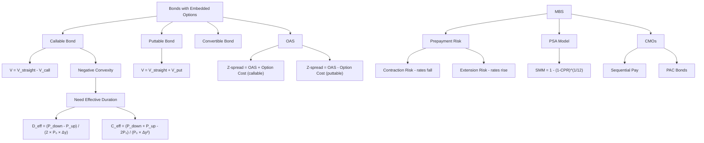

# Week 2-1: Embedded Options, Effective Duration, and MBS

> **FIN 522A Fixed Income | Lecture 3**
> 🎯 本讲核心：理解嵌入期权如何改变债券的风险特征，以及 MBS 的 prepayment 机制

---

## 📑 Table of Contents 目录

1. [[#1. Bonds with Embedded Options 嵌入期权的债券 ⭐⭐|Bonds with Embedded Options 嵌入期权的债券]]
2. [[#2. Callable Bonds 可赎回债券 ⭐⭐|Callable Bonds 可赎回债券]]
3. [[#3. Puttable Bonds 可回售债券 ⭐|Puttable Bonds 可回售债券]]
4. [[#4. Convertible Bonds 可转换债券|Convertible Bonds 可转换债券]]
5. [[#5. Yield Measures for Callable Bonds 可赎回债券的收益率指标 ⭐|Yield Measures for Callable Bonds]]
6. [[#6. Effective Duration 有效久期 ⭐⭐⭐|Effective Duration 有效久期]]
7. [[#7. Effective Convexity 有效凸性 ⭐⭐|Effective Convexity 有效凸性]]
8. [[#8. OAS: Option-Adjusted Spread 期权调整价差 ⭐⭐|OAS 期权调整价差]]
9. [[#9. Mortgage-Backed Securities (MBS) 抵押贷款支持证券 ⭐⭐|MBS 抵押贷款支持证券]]
10. [[#10. Prepayment Risk 提前偿还风险 ⭐⭐⭐|Prepayment Risk 提前偿还风险]]
11. [[#11. PSA Prepayment Model PSA提前偿还模型 ⭐⭐|PSA Prepayment Model]]
12. [[#12. CMOs: Collateralized Mortgage Obligations 担保抵押贷款凭证 ⭐|CMOs 担保抵押贷款凭证]]

---

## 1. Bonds with Embedded Options 嵌入期权的债券 ⭐⭐

### 1.1 What Are Embedded Options? 什么是嵌入期权

An **embedded option** is an option that is built into the bond contract, giving either the **issuer** or the **bondholder** special rights.

> [!tip] 直觉理解
> 普通债券（straight bond / option-free bond）的现金流是固定的。但一旦嵌入了期权，现金流会**随利率变化而改变** — 这是本讲最核心的概念！

### 1.2 Three Main Types 三种主要类型

| Type | 中文 | Who Benefits? | The Right |
|------|------|---------------|-----------|
| **Callable** | 可赎回 | **Issuer** (发行人) | Issuer can buy back the bond early |
| **Puttable** | 可回售 | **Bondholder** (持有人) | Holder can sell back the bond early |
| **Convertible** | 可转换 | **Bondholder** (持有人) | Holder can convert bond into stock |

### 1.3 Option Valuation Framework 期权估值框架

This is the **most important conceptual equation** of this lecture:

$$\boxed{V_{\text{callable}} = V_{\text{straight}} - V_{\text{call option}}}$$

$$\boxed{V_{\text{puttable}} = V_{\text{straight}} + V_{\text{put option}}}$$

> [!important] 考试重点：为什么一个减、一个加？
> - **Callable bond**: 发行人拥有 call option → 对投资者不利 → 投资者愿意付的钱更少 → 价值更低（减去期权价值）
> - **Puttable bond**: 投资者拥有 put option → 对投资者有利 → 投资者愿意付更多 → 价值更高（加上期权价值）
>
> 记忆口诀：**谁有权谁得利，对方就要\"打折\"**

---

## 2. Callable Bonds 可赎回债券 ⭐⭐

### 2.1 How Callable Bonds Work 运作机制

The issuer has the right (but not obligation) to **redeem the bond before maturity** at a specified **call price**.

**When would the issuer call?** 什么时候发行人会赎回？

→ When **interest rates fall**（利率下降时）！因为发行人可以：
1. Call back the old high-coupon bond（赎回旧的高息债）
2. Issue a new bond at lower interest rates（以更低利率发新债）
3. Save money on interest payments（省利息）

> [!example] 生活类比
> 就像你有一个高利率的房贷，利率降了之后你会选择 refinance（再融资）— callable bond 对发行人来说就是这个道理。

### 2.2 Types of Call Provisions 赎回条款类型

**Make-Whole Call（补偿性赎回）:**
- Call price = PV of remaining cash flows discounted at **Treasury yield + a fixed spread**
- 赎回价格随利率变动，对投资者更"公平"
- 因为赎回代价高，发行人很少真正行使

**Discrete Call（离散赎回）:**
- Callable at **specific dates** at a predetermined price (通常为 par 或 small premium)
- 更常见，对投资者不利
- Often has a **call protection period**（赎回保护期）— 前几年不能赎回

### 2.3 Price-Yield Relationship for Callable Bonds 价格-收益率关系

This is critical for understanding **negative convexity（负凸性）**:

```
Price
  |
  |  Straight bond (no option)
  |   /
  |  / ← At high yields: callable ≈ straight
  | /    (call option is worthless)
  |/_ _ _ _ _ _ _ _ _ _
  |        ____-------  Call Price ceiling
  |     /
  |   / ← At low yields: price compression!
  |  /    (call option is valuable)
  |/_________________________ Yield
     Low ←          → High
```

> [!warning] 考试重点：Negative Convexity 负凸性
> - 当利率很低时，callable bond 的价格被"压住"了（**price compression**），不能像 straight bond 那样继续上涨
> - 原因：利率越低，发行人越可能 call → 投资者知道这一点 → 不愿出高价
> - 这就是 **negative convexity（负凸性）**：价格-收益率曲线在低利率端弯向下方
> - 对比 [[Week 1-2 Duration, Convexity and Interest Rate Risk#5. Convexity 凸性 ⭐⭐|positive convexity]] (普通债券) — 凸性是好事；但 callable bond 在低利率区间凸性为负！
> - 这也是为什么我们需要 [[#6. Effective Duration 有效久期 ⭐⭐⭐|Effective Duration]] 和 [[#7. Effective Convexity 有效凸性 ⭐⭐|Effective Convexity]] 来替代传统公式

### 2.4 Key Insight: Cash Flows Change with Yields!

> [!important] 核心洞察
> 对于 callable bonds，当利率变化时，**现金流本身也会改变**：
> - 利率下降 → 可能被 call → 现金流变短（提前结束）
> - 利率上升 → 不会被 call → 现金流保持不变
>
> 这就是为什么 **modified duration 不适用于有嵌入期权的债券** — 它假设现金流不变！

---

## 3. Puttable Bonds 可回售债券 ⭐

### 3.1 How Puttable Bonds Work 运作机制

The bondholder has the right to **sell the bond back to the issuer** at a specified put price (usually par) before maturity.

**When would the holder put?** 什么时候持有人会行使回售权？

→ When **interest rates rise**（利率上升时）！因为：
1. 利率上升 → 债券价格下跌
2. 如果价格跌到 put price 以下，持有人可以按 put price 卖回
3. 拿到的钱可以再投资到更高利率的债券

### 3.2 Price-Yield Relationship 价格-收益率关系

```
Price
  |
  |   Puttable bond
  |   /
  |  /
  | /  ← At low yields: puttable ≈ straight
  |/    (put option is worthless)
  |_ _ _ Put Price floor _ _ _
  |  \   ← At high yields: price has a floor!
  |   \    (put option is valuable)
  |    \  Straight bond keeps falling
  |_________________________ Yield
     Low ←          → High
```

> [!tip] 对比记忆
> | Feature | Callable | Puttable |
> |---------|----------|----------|
> | 谁受益 | Issuer | Bondholder |
> | 什么时候行使 | Rates fall | Rates rise |
> | 对价格的影响 | Price ceiling (天花板) | Price floor (地板) |
> | 凸性影响 | Negative convexity | Enhanced (positive) convexity |
> | 相对straight bond | 价值更低 | 价值更高 |

---

## 4. Convertible Bonds 可转换债券

A **convertible bond** gives the bondholder the right to convert the bond into a **fixed number of shares** of the issuer's common stock.

### 4.1 Key Terms 关键术语

$$\text{Conversion Ratio} = \frac{\text{Face Value}}{\text{Conversion Price}}$$

$$\text{Conversion Value} = \text{Conversion Ratio} \times \text{Current Stock Price}$$

> [!example] 例子
> Face Value = $1,000, Conversion Price = $50
> → Conversion Ratio = $1,000 / $50 = **20 shares**
> 如果当前股价 = $60 → Conversion Value = 20 × $60 = **$1,200**

### 4.2 Valuation 估值

$$V_{\text{convertible}} = V_{\text{straight bond}} + V_{\text{conversion option}}$$

> [!note] 注意
> Convertible bond 的投资者本质上持有一个 straight bond + 一个 call option on the stock（对股票的看涨期权）。因为多了一个期权，convertible bond 的 coupon rate 通常比同等级 straight bond 更低。

---

## 5. Yield Measures for Callable Bonds 可赎回债券的收益率指标 ⭐

### 5.1 Four Yield Measures 四种收益率

| Measure | 中文 | Definition |
|---------|------|------------|
| **Current Yield** | 当前收益率 | $\frac{\text{Annual Coupon}}{\text{Current Price}}$ |
| **YTM** | 到期收益率 | 假设持有到期的收益率 |
| **YTC (Yield to Call)** | 赎回收益率 | 假设在最近赎回日被 call 的收益率 |
| **YTW (Yield to Worst)** | 最差收益率 | = min(YTM, all possible YTCs) |

### 5.2 Yield to Call 赎回收益率

$$P = \sum_{i=1}^{n_c} \frac{c_i}{\left(1 + \frac{y_c}{2}\right)^{2t_i}} + \frac{\text{Call Price}}{\left(1 + \frac{y_c}{2}\right)^{2t_c}}$$

where $n_c$ = number of periods until call date, $y_c$ = YTC

> [!tip] 直觉
> YTC 就是假设债券在 call date 被赎回时，投资者能获得的年化收益率。计算方式和 YTM 完全一样，只是到期时间换成了 call date，face value 换成了 call price。

### 5.3 Yield to Worst 最差收益率

$$\boxed{YTW = \min(YTM, \; YTC_1, \; YTC_2, \; \ldots)}$$

> [!important] 考试重点
> **YTW 是最保守的收益率估计** — 投资者应该用 YTW 来评估 callable bond，因为发行人总会选择对自己最有利的时间来 call。

---

## 6. Effective Duration 有效久期 ⭐⭐⭐

### 6.1 Why Modified Duration Fails 为什么修正久期不适用

Recall from [[Week 1-2 Duration, Convexity and Interest Rate Risk]]:

$$D_{\text{mod}} = \frac{1}{P} \sum_{i=1}^{n} \frac{t_i \cdot c_i}{(1+y/2)^{2t_i+1}}$$

**Problem:** Modified duration assumes **cash flows don't change** when yields change.

But for bonds with embedded options:
- Callable: cash flows shorten when rates fall (bond gets called)
- Puttable: cash flows shorten when rates rise (bond gets put)
- MBS: prepayments speed up when rates fall

> [!warning] 关键区别
> **Modified duration** = analytical formula, assumes fixed cash flows
> **Effective duration** = numerical approximation, allows cash flows to change with yields

### 6.2 Effective Duration Formula 有效久期公式

$$\boxed{D_{\text{eff}} = \frac{P(y - \Delta y) - P(y + \Delta y)}{2 \times P_0 \times \Delta y}}$$

where:
- $P(y - \Delta y)$ = bond price when yield **decreases** by $\Delta y$（利率下降后的价格）
- $P(y + \Delta y)$ = bond price when yield **increases** by $\Delta y$（利率上升后的价格）
- $P_0$ = current bond price（当前价格）
- $\Delta y$ = small yield change (e.g., 25 bps = 0.0025)

### 6.3 Step-by-Step Derivation 推导过程

**为什么公式长这样？**

Start from the definition of duration — the **percentage price change** per unit yield change:

$$D = -\frac{1}{P} \frac{dP}{dy}$$

We approximate the derivative numerically using a **central difference**:

$$\frac{dP}{dy} \approx \frac{P(y + \Delta y) - P(y - \Delta y)}{2 \Delta y}$$

> [!note] 为什么用"中心差分"而不是"前向差分"？
> 中心差分（central difference）比前向差分更精确，因为它在两侧都取了样本，误差项是 $O(\Delta y^2)$ 而非 $O(\Delta y)$

Substituting back:

$$D_{\text{eff}} = -\frac{1}{P_0} \times \frac{P(y + \Delta y) - P(y - \Delta y)}{2\Delta y}$$

$$= \frac{P(y - \Delta y) - P(y + \Delta y)}{2 \times P_0 \times \Delta y}$$

（注意负号与分子交换了顺序）

### 6.4 How to Calculate: Step by Step 计算步骤

> [!example] 例子
> A callable bond has:
> - Current price $P_0 = 101.50$
> - $\Delta y = 25$ bps $= 0.0025$
> - When yield drops 25 bps: $P(y - \Delta y) = 102.00$（注意因为 call 的存在，价格不会涨太多）
> - When yield rises 25 bps: $P(y + \Delta y) = 100.90$
>
> $$D_{\text{eff}} = \frac{102.00 - 100.90}{2 \times 101.50 \times 0.0025} = \frac{1.10}{0.5075} = 2.17$$
>
> 解读：利率变动 1%（100 bps），价格大约变动 2.17%

> [!important] 关键点
> 注意 $P(y - \Delta y)$ 和 $P(y + \Delta y)$ 必须用**包含期权效果的模型**来计算 — 不是简单地用新利率代入 PV 公式，而是要考虑利率变化后 call/put 是否会被行使，从而改变现金流！

---

## 7. Effective Convexity 有效凸性 ⭐⭐

### 7.1 Formula 公式

$$\boxed{C_{\text{eff}} = \frac{P(y - \Delta y) + P(y + \Delta y) - 2P_0}{P_0 \times (\Delta y)^2}}$$

### 7.2 Derivation 推导

Convexity measures the **second derivative** of price with respect to yield:

$$C = \frac{1}{P} \frac{d^2P}{dy^2}$$

Using the **central difference approximation** for the second derivative:

$$\frac{d^2P}{dy^2} \approx \frac{P(y + \Delta y) - 2P(y) + P(y - \Delta y)}{(\Delta y)^2}$$

Substituting:

$$C_{\text{eff}} = \frac{1}{P_0} \times \frac{P(y - \Delta y) + P(y + \Delta y) - 2P_0}{(\Delta y)^2}$$

### 7.3 Sign of Convexity 凸性的符号

| Bond Type | Convexity | 中文 | Meaning |
|-----------|-----------|------|---------|
| Straight bond | **Positive** | 正凸性 | Price-yield curve bends upward |
| Callable bond (low yields) | **Negative** | 负凸性 | Price-yield curve bends downward (price compression) |
| Puttable bond | **More positive** | 更强正凸性 | Enhanced upward curvature |

> [!example] 用上面的数据验证
> $P_0 = 101.50$, $P(y-\Delta y) = 102.00$, $P(y+\Delta y) = 100.90$, $\Delta y = 0.0025$
>
> $$C_{\text{eff}} = \frac{102.00 + 100.90 - 2 \times 101.50}{101.50 \times (0.0025)^2} = \frac{-0.10}{0.000634} = -157.7$$
>
> 凸性为负！说明这是一个在负凸性区域的 callable bond。

### 7.4 Complete Price Approximation 完整的价格近似公式

Combining duration and convexity（结合久期和凸性的完整公式）:

$$\boxed{\frac{\Delta P}{P} \approx -D_{\text{eff}} \times \Delta y + \frac{1}{2} C_{\text{eff}} \times (\Delta y)^2}$$

> [!tip] 直觉
> - 第一项（duration term）：线性近似，告诉你价格变动的方向和大致幅度
> - 第二项（convexity term）：二次修正项，修正了线性近似的误差
> - 正凸性 → 利好投资者（涨多跌少）
> - 负凸性 → 不利投资者（涨少跌多）

---

## 8. OAS: Option-Adjusted Spread 期权调整价差 ⭐⭐

### 8.1 Review: Z-Spread 回顾Z价差

**Z-spread (Zero-Volatility Spread)** = the **constant spread** added to each spot rate that makes the PV of bond's cash flows equal to its market price:

$$P = \sum_{i=1}^{n} \frac{c_i}{\left(1 + \frac{r(t_i) + Z}{2}\right)^{2t_i}}$$

**Problem with Z-spread for bonds with options:** Z-spread 不区分 credit risk 和 option risk — 它把所有"额外收益率"都混在一起了。

### 8.2 OAS Definition 定义

**OAS** = the spread after **removing the effect of the embedded option** — it measures **pure credit risk** only.

### 8.3 Key Relationships 核心关系

**For Callable Bonds:**

$$\boxed{Z\text{-spread} = OAS + \text{Option Cost}}$$

> [!note] 理解
> Callable bond 的 Z-spread 比 OAS 高，因为投资者要求额外补偿来弥补 call option 的风险（发行人可能提前赎回）。

**For Puttable Bonds:**

$$\boxed{Z\text{-spread} = OAS - \text{Option Cost}}$$

> [!note] 理解
> Puttable bond 的 Z-spread 比 OAS 低，因为 put option 对投资者有利，投资者愿意接受更低的 spread。

### 8.4 How to Use OAS 如何使用 OAS

> [!important] 考试重点
> **Comparing bonds with different embedded options:**
> - 不能用 Z-spread 比较 callable bond 和 straight bond — 不公平（含期权成本）
> - 应该用 **OAS** 来比较 — 它剥离了期权效果，只反映信用风险
> - **Higher OAS** = higher **credit compensation** = potentially better value（更高的信用补偿，可能更有价值）

---

## 9. Mortgage-Backed Securities (MBS) 抵押贷款支持证券 ⭐⭐

### 9.1 What is an MBS? 什么是 MBS

An MBS is a bond backed by a **pool of mortgage loans**.

**Securitization process（证券化过程）:**
1. Banks originate mortgage loans（银行发放房贷）
2. Loans are pooled together（贷款被打包）
3. Securities (MBS) are issued backed by the pool（发行以贷款池为担保的证券）
4. Investors buy MBS and receive cash flows from mortgage payments（投资者购买 MBS，获得房贷还款现金流）

### 9.2 Mortgage Pass-Through Securities 抵押贷款过手证券

**Pass-through** = the simplest type of MBS. Each investor receives a **pro-rata share** of:
- **Interest payments**（利息）
- **Scheduled principal payments**（计划本金偿还）
- **Prepayments**（提前偿还）

### 9.3 Monthly Mortgage Payment 每月房贷还款

A standard fixed-rate mortgage has a **constant monthly payment** calculated as:

$$PMT = P_0 \times \frac{r/12}{1 - (1 + r/12)^{-n}}$$

where:
- $P_0$ = original loan balance
- $r$ = annual mortgage rate
- $n$ = total number of months

> [!note] 注意
> 每月还款中，利息和本金的比例在不断变化 — 前期利息多、本金少（**amortization**）

---

## 10. Prepayment Risk 提前偿还风险 ⭐⭐⭐

### 10.1 What is Prepayment? 什么是提前偿还

Homeowners can **pay off their mortgage early** — this is an **embedded option** in the mortgage!

最常见的原因：
- **Refinancing**（再融资）— 利率下降时，借新还旧
- **Home sale**（卖房）
- **Default**（违约）— technically also ends the mortgage

### 10.2 Two Types of Prepayment Risk 两类提前偿还风险

| Risk | 中文 | When | Effect on MBS Investors |
|------|------|------|------------------------|
| **Contraction Risk** | 收缩风险 | Rates **fall** ↓ | Prepayments speed up → cash flows come back faster → must reinvest at lower rates |
| **Extension Risk** | 延展风险 | Rates **rise** ↑ | Prepayments slow down → cash flows are delayed → stuck in lower-rate MBS longer |

> [!warning] 考试重点
> - **Contraction risk** = 利率下降 → 提前偿还加速 → 再投资风险（reinvestment risk）
> - **Extension risk** = 利率上升 → 提前偿还减慢 → 被锁在低利率投资中
> - MBS investors are **hurt in BOTH directions** — this is why MBS exhibit **negative convexity**（像 [[#2. Callable Bonds 可赎回债券 ⭐⭐|callable bonds]] 一样！）
> - MBS 的 prepayment risk 可以通过 [[#12. CMOs: Collateralized Mortgage Obligations 担保抵押贷款凭证 ⭐|CMO tranching]] 来重新分配

### 10.3 Why MBS ≈ Callable Bond MBS为什么像可赎回债券

MBS investors are essentially **short a prepayment option** (sold a call option to homeowners):

$$V_{\text{MBS}} = V_{\text{straight mortgage}} - V_{\text{prepayment option}}$$

This is exactly analogous to $V_{\text{callable}} = V_{\text{straight}} - V_{\text{call}}$ !

---

## 11. PSA Prepayment Model PSA提前偿还模型 ⭐⭐

### 11.1 CPR and SMM 条件提前偿还率

**CPR (Conditional Prepayment Rate)** = annualized prepayment rate
- 表示在一年内，剩余贷款余额中有多少比例会被提前偿还

**SMM (Single Monthly Mortality)** = monthly prepayment rate

两者的关系：

$$\boxed{SMM = 1 - (1 - CPR)^{1/12}}$$

> [!note] 推导
> 如果一年后存活比例是 $(1-CPR)$，那么每个月的存活比例应该是 $(1-SMM)$，12个月连乘：
> $$(1-SMM)^{12} = 1 - CPR$$
> $$1 - SMM = (1 - CPR)^{1/12}$$
> $$SMM = 1 - (1 - CPR)^{1/12}$$

**Prepayment amount in month $t$（第 $t$ 月的提前偿还金额）:**

$$\text{Prepayment}_t = SMM \times (\text{Beginning Balance}_t - \text{Scheduled Principal}_t)$$

### 11.2 The PSA Benchmark PSA基准模型

**100% PSA (Public Securities Association):**

$$CPR_t = \begin{cases} \frac{t}{30} \times 6\% & \text{if } t \leq 30 \text{ months} \\ 6\% & \text{if } t > 30 \text{ months} \end{cases}$$

```
CPR (%)
  |
6%|          ___________________________
  |        /
  |      /
  |    /
  |  /
  |/
  |__________________________________ Month
  0     30
```

> [!example] 不同的 PSA 速度
> - **100% PSA** = benchmark (上述基准)
> - **200% PSA** = prepayments are 2x the benchmark（CPR 在第30月达到 12%）
> - **50% PSA** = prepayments are 0.5x the benchmark（CPR 在第30月达到 3%）
>
> General formula: At $X$% PSA, $CPR_t = X/100 \times$ benchmark CPR

### 11.3 WAL: Weighted Average Life 加权平均寿命

$$\boxed{WAL = \sum_{t=1}^{T} t \times \frac{\text{Principal}_t}{\text{Total Principal}}}$$

where $\text{Principal}_t$ = scheduled principal + prepayment in period $t$

> [!tip] WAL vs Maturity
> - **Maturity** = when the last payment is due（法定到期日）
> - **WAL** = the average time to receive principal back（平均回收本金的时间）
> - For MBS, WAL << Maturity, because prepayments return principal early
> - WAL 是分析 MBS 时比 maturity 更有用的期限度量

---

## 12. CMOs: Collateralized Mortgage Obligations 担保抵押贷款凭证 ⭐

### 12.1 Purpose 目的

CMOs **redistribute the prepayment risk** of MBS by creating different **tranches（分级）** with different risk/return profiles.

> [!tip] 直觉
> MBS pass-through 把所有 prepayment risk 平均分给每个投资者。CMO 的思路是：不平均分，而是让不同 tranche 承担不同类型的风险，满足不同投资者的需求。

### 12.2 Sequential Pay CMO 顺序偿还CMO

- All principal payments (scheduled + prepayments) go to **Tranche A** first
- After Tranche A is fully paid off, then to **Tranche B**
- Then **Tranche C**, etc.

| Tranche | Characteristic | 特点 |
|---------|---------------|------|
| A (shortest) | Gets principal first → lower WAL, more contraction risk | 最先获得本金，WAL最短 |
| B (middle) | Medium timing | 中间 |
| C (longest) | Gets principal last → higher WAL, more extension risk | 最后获得本金，WAL最长 |

### 12.3 PAC Bonds (Planned Amortization Class) 计划摊还级

**PAC bonds** have a **scheduled principal payment** that remains constant over a range of PSA speeds（在一定 PSA 范围内，本金偿还是确定的）.

- PAC bonds have the **most stable cash flows** → lowest prepayment risk
- This stability comes at the cost of the **support/companion tranche**（支撑级）, which absorbs the prepayment variability

> [!important] 考试重点
> - **PAC tranche**: stable cash flows, lower yield, less prepayment risk
> - **Support/Companion tranche**: absorbs all the variability, higher yield, more prepayment risk
> - PAC 的稳定性是以 support tranche 承担更多风险为代价的

---

## Summary 本讲总结



**必须记住的公式：**
1. $V_{\text{callable}} = V_{\text{straight}} - V_{\text{call}}$；$V_{\text{puttable}} = V_{\text{straight}} + V_{\text{put}}$
2. $D_{\text{eff}} = \frac{P(y-\Delta y) - P(y+\Delta y)}{2 P_0 \Delta y}$ — 有效久期
3. $C_{\text{eff}} = \frac{P(y-\Delta y) + P(y+\Delta y) - 2P_0}{P_0 (\Delta y)^2}$ — 有效凸性
4. $\frac{\Delta P}{P} \approx -D_{\text{eff}} \Delta y + \frac{1}{2} C_{\text{eff}} (\Delta y)^2$ — 完整价格近似
5. Z-spread = OAS + Option Cost (callable) / OAS - Option Cost (puttable)
6. $SMM = 1 - (1-CPR)^{1/12}$ — SMM 与 CPR 转换
7. 100% PSA: CPR ramps to 6% over 30 months
8. $WAL = \sum t \times \frac{\text{Principal}_t}{\text{Total Principal}}$

---

**Related Notes:** [[Week 1-1 Bond Pricing and Yield Fundamentals]] | [[Week 1-2 Duration, Convexity and Interest Rate Risk]] | [[Week 2-2 Credit Risk and Credit Analysis]] | [[Week 3 Portfolio Credit Risk and CreditMetrics]] | [[Week 4-1 Risk and Return]] | [[Week 4-2 Portfolio Theory and Optimization]]
