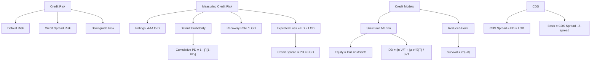

# Week 2-2: Credit Risk and Credit Analysis

> **FIN 522A Fixed Income | Lecture 4**
> 🎯 本讲核心：理解信用风险的度量方式，从评级体系到 CDS 定价

---

## 📑 Table of Contents 目录

1. [[#1. Types of Credit Risk 信用风险的类型 ⭐⭐|Types of Credit Risk 信用风险的类型]]
2. [[#2. Credit Ratings 信用评级 ⭐⭐|Credit Ratings 信用评级]]
3. [[#3. Rating Transition Matrices 评级迁移矩阵 ⭐|Rating Transition Matrices 评级迁移矩阵]]
4. [[#4. Credit Spreads 信用利差 ⭐⭐|Credit Spreads 信用利差]]
5. [[#5. Spread Duration 利差久期 ⭐|Spread Duration 利差久期]]
6. [[#6. Default Probability 违约概率 ⭐⭐⭐|Default Probability 违约概率]]
7. [[#7. Recovery Rate and LGD 回收率与违约损失率 ⭐⭐|Recovery Rate and LGD 回收率与违约损失率]]
8. [[#8. Expected Loss 预期损失 ⭐⭐|Expected Loss 预期损失]]
9. [[#9. Structural Models — Merton Model 结构化模型 ⭐⭐⭐|Structural Models — Merton Model 结构化模型]]
10. [[#10. Reduced-Form Models 简约模型 ⭐⭐|Reduced-Form Models 简约模型]]
11. [[#11. Credit Default Swaps (CDS) 信用违约互换 ⭐⭐⭐|Credit Default Swaps (CDS) 信用违约互换]]

---

## 1. Types of Credit Risk 信用风险的类型 ⭐⭐

Credit risk is the risk that a borrower fails to meet its obligations — 信用风险是借款人无法履行义务的风险。

### 1.1 Three Types 三种类型

| Type | 中文 | Definition |
|------|------|------------|
| **Default Risk** | 违约风险 | Borrower fails to make payments（借款人无法偿付本息） |
| **Credit Spread Risk** | 信用利差风险 | Credit spread widens → price drops even without default（利差扩大导致价格下跌） |
| **Downgrade / Migration Risk** | 降级/迁移风险 | Rating is lowered → spread widens → price drops（评级被下调） |

> [!tip] 直觉理解
> - **Default risk** = "还不了钱"的风险（最极端的情况）→ 用 [[#6. Default Probability 违约概率 ⭐⭐⭐|PD]] 和 [[#7. Recovery Rate and LGD 回收率与违约损失率 ⭐⭐|LGD]] 度量
> - **Spread risk** = 市场觉得你"可能还不了钱"的风险（信心动摇，不需要真的违约）→ 用 [[#5. Spread Duration 利差久期 ⭐|Spread Duration]] 度量
> - **Downgrade risk** = 评级机构正式说你"更可能还不了钱"（被贴标签）→ 用 [[#3. Rating Transition Matrices 评级迁移矩阵 ⭐|Transition Matrix]] 度量
>
> 三者从重到轻：Default > Downgrade > Spread change
>
> → 组合层面如何整合这三种风险？见 [[Week 3 Portfolio Credit Risk and CreditMetrics]]

---

## 2. Credit Ratings 信用评级 ⭐⭐

### 2.1 The Big Three Rating Agencies 三大评级机构

| Rating Quality | Moody's | S&P | Fitch |
|---------------|---------|-----|-------|
| Highest | Aaa | AAA | AAA |
| High | Aa1, Aa2, Aa3 | AA+, AA, AA- | AA+, AA, AA- |
| Upper Medium | A1, A2, A3 | A+, A, A- | A+, A, A- |
| Medium | Baa1, Baa2, Baa3 | BBB+, BBB, BBB- | BBB+, BBB, BBB- |
| — | — | — | — |
| Speculative | Ba1, Ba2, Ba3 | BB+, BB, BB- | BB+, BB, BB- |
| Highly Speculative | B1, B2, B3 | B+, B, B- | B+, B, B- |
| Very High Risk | Caa, Ca, C | CCC, CC, C | CCC, CC, C |
| In Default | — | D | D |

### 2.2 The Critical Divide 关键分界线

$$\boxed{\text{Investment Grade} \geq \text{BBB-/Baa3} \quad | \quad \text{High Yield (Junk)} \leq \text{BB+/Ba1}}$$

> [!warning] 考试重点
> - **Investment grade**（投资级）: BBB- (S&P/Fitch) 或 Baa3 (Moody's) 及以上
> - **High yield / Junk / Speculative grade**（高收益/垃圾级）: BB+ (S&P/Fitch) 或 Ba1 (Moody's) 及以下
> - 这个分界线非常重要！很多机构投资者（如养老金、保险公司）**只允许持有投资级债券**
> - **Fallen angel**（堕落天使）= 从投资级被降到高收益级的债券 → 大量被迫抛售 → 价格暴跌

---

## 3. Rating Transition Matrices 评级迁移矩阵 ⭐

### 3.1 What is a Transition Matrix? 什么是迁移矩阵

A **transition matrix** shows the probability of moving from one rating to another over a given time period (usually 1 year).

> [!example] 简化例子
> |  | AAA | AA | A | BBB | Default |
> |--|-----|----|----|-----|---------|
> | **AAA** | 90% | 8% | 1.5% | 0.4% | 0.1% |
> | **AA** | 1% | 88% | 9% | 1.5% | 0.5% |
> | **A** | 0.1% | 2% | 89% | 7% | 1.9% |
> | **BBB** | 0% | 0.3% | 4% | 87% | 8.7% |
>
> 读法：AAA 级债券在一年后有 90% 概率仍然是 AAA，8% 概率降为 AA...

> [!tip] 特征
> - 对角线上的数值最大（大部分债券评级不变）
> - 越高评级，保持不变的概率越高
> - 每一行的概率之和 = 100%

---

## 4. Credit Spreads 信用利差 ⭐⭐

### 4.1 What is a Credit Spread? 什么是信用利差

Credit spread = the **additional yield** above the risk-free rate that compensates investors for credit risk.

### 4.2 Four Types of Spreads 四种利差

| Spread | 中文 | Benchmark | Formula |
|--------|------|-----------|---------|
| **G-Spread** | 政府利差 | Government bond yield | $G = y_{\text{bond}} - y_{\text{govt}}$ (matched maturity) |
| **I-Spread** | 互换利差 | Swap rate (LIBOR/SOFR) | $I = y_{\text{bond}} - y_{\text{swap}}$ |
| **Z-Spread** | 零波动利差 | Spot rate curve | Constant spread added to each spot rate |
| **OAS** | 期权调整利差 | Spot rates + option model | Z-spread minus option cost |

### 4.3 Comparison 对比

> [!important] 考试重点：何时用哪个？
> - **G-spread**: 最简单，适合快速比较，但不精确（只用了一个 benchmark yield）
> - **I-spread**: 类似 G-spread，但基于 swap rate（更常用于公司债）
> - **Z-spread**: 更精确，用了整条 spot rate curve（见 [[Week 1-1 Bond Pricing and Yield Fundamentals]] 回顾 spot rates）
> - **OAS**: 最精确，剥离了期权效果（见 [[Week 2-1 Embedded Options Effective Duration and MBS]] Section 8）
>
> **精确程度：G-spread < I-spread < Z-spread < OAS**

### 4.4 Z-Spread Calculation Z利差计算

$$P = \sum_{i=1}^{n} \frac{c_i}{\left(1 + \frac{r(t_i) + Z}{2}\right)^{2t_i}}$$

> [!note] 理解
> Z-spread 是让上述等式成立的那个 $Z$ 值 — 在每一个 spot rate $r(t_i)$ 上都加上同样的 $Z$，使得算出来的现值等于市场价格。

---

## 5. Spread Duration 利差久期 ⭐

### 5.1 Definition 定义

Spread duration measures the bond's **price sensitivity to changes in the credit spread**:

$$\boxed{\%\Delta P \approx -D_{\text{spread}} \times \Delta \text{Spread}}$$

> [!tip] 对比理解
> | Measure | What it measures |
> |---------|-----------------|
> | **Modified Duration** | Sensitivity to benchmark yield changes |
> | **Spread Duration** | Sensitivity to credit spread changes |
>
> 区别：利率变化和利差变化是两个不同的东西！
> - 利率变化 = 整体市场利率变了（比如美联储加息）
> - 利差变化 = 市场对该发行人信用风险看法变了

> [!example] 例子
> A corporate bond has spread duration = 5.2, and its credit spread widens by 50 bps (0.50%):
> $$\%\Delta P \approx -5.2 \times 0.0050 = -2.6\%$$
> 价格下跌约 2.6%

---

## 6. Default Probability 违约概率 ⭐⭐⭐

### 6.1 Two Types 两种违约概率

| Type | 中文 | Definition |
|------|------|------------|
| **Marginal PD** | 边际违约概率 | Probability of defaulting in year $t$, **given survival** to year $t-1$ |
| **Cumulative PD** | 累积违约概率 | Probability of defaulting **at any time** from now to year $t$ |

### 6.2 Survival Probability 存活概率

$$\text{Survival Probability through year } t = \prod_{i=1}^{t} (1 - PD_i)$$

where $PD_i$ = marginal default probability in year $i$

### 6.3 Cumulative Default Probability 累积违约概率

$$\boxed{\text{Cumulative PD}_t = 1 - \prod_{i=1}^{t}(1 - PD_i)}$$

> [!note] 推导
> 逻辑：要么在 $t$ 年内的某个时间点违约，要么一直存活到 $t$ 年。两者概率之和为 1。
>
> $$\text{Cumulative PD}_t + \text{Survival Probability}_t = 1$$
> $$\text{Cumulative PD}_t = 1 - \text{Survival Probability}_t$$
> $$= 1 - (1 - PD_1)(1 - PD_2) \cdots (1 - PD_t)$$

> [!example] 例子
> Year 1 marginal PD = 2%, Year 2 marginal PD = 3%, Year 3 marginal PD = 4%
>
> **Survival through Year 3:**
> $$= (1 - 0.02)(1 - 0.03)(1 - 0.04) = 0.98 \times 0.97 \times 0.96 = 0.9122$$
>
> **Cumulative PD through Year 3:**
> $$= 1 - 0.9122 = 0.0878 = 8.78\%$$
>
> 注意：$8.78\% \neq 2\% + 3\% + 4\% = 9\%$（不能简单相加！因为各年并非独立事件 — 如果第1年就违约了，就不存在第2年违约的可能性）

### 6.4 Constant Hazard Rate Simplification 常数风险率简化

If marginal PD is constant at $\lambda$ per year:

$$\text{Survival Probability}_t = (1 - \lambda)^t$$

$$\text{Cumulative PD}_t = 1 - (1 - \lambda)^t$$

---

## 7. Recovery Rate and LGD 回收率与违约损失率 ⭐⭐

### 7.1 Recovery Rate 回收率

**Recovery Rate** = the percentage of face value recovered after default（违约后能收回面值的百分比）

### 7.2 Recovery by Seniority 按优先级的回收率

| Seniority | 中文 | Typical Recovery Rate |
|-----------|------|--------------------|
| **Senior Secured** | 优先有担保 | ~45% |
| **Senior Unsecured** | 优先无担保 | ~35% |
| **Subordinated** | 次级 | ~25% |

> [!tip] 直觉
> - **Secured** = 有抵押品（比如房产、设备），违约后可以变卖，所以回收率高
> - **Unsecured** = 没有抵押品，排队等分剩余资产
> - **Subordinated** = 排在最后面，大家都分完了才轮到你

### 7.3 Loss Given Default (LGD) 违约损失率

$$\boxed{LGD = 1 - \text{Recovery Rate}}$$

> [!example] 例子
> Senior Unsecured bond, Recovery Rate = 35%
> $$LGD = 1 - 0.35 = 0.65 = 65\%$$
> 意思是如果违约，投资者会损失面值的 65%

---

## 8. Expected Loss 预期损失 ⭐⭐

### 8.1 Formula 公式

$$\boxed{EL = PD \times LGD}$$

或更完整地：

$$EL = PD \times LGD \times EAD$$

where **EAD** = Exposure at Default（违约时的风险暴露）— 对于债券通常就是面值

### 8.2 Credit Spread Approximation 信用利差近似

$$\boxed{\text{Credit Spread} \approx PD \times LGD}$$

> [!important] 考试重点：推导这个近似
> **逻辑：** 投资者要求的额外收益率（credit spread）应该正好补偿预期损失（expected loss）。
>
> 如果一个债券的 PD = 2%, LGD = 60%:
> $$\text{Credit Spread} \approx 0.02 \times 0.60 = 0.012 = 1.2\% = 120 \text{ bps}$$
>
> **注意：** 这只是一个近似！实际 credit spread 还包含：
> - **Liquidity premium**（流动性溢价）
> - **Risk premium**（风险溢价 — 投资者是 risk-averse 的，要求超过 expected loss 的补偿）
> - 所以实际 spread > PD × LGD
>
> → 这个公式也适用于 [[#11. Credit Default Swaps (CDS) 信用违约互换 ⭐⭐⭐|CDS pricing]]: CDS Spread ≈ PD × LGD
> → 从 EL 扩展到组合层面（包括 UL、Credit VaR）见 [[Week 3 Portfolio Credit Risk and CreditMetrics#4. Unexpected Loss 非预期损失 ⭐⭐⭐|Portfolio UL]]

> [!example] 完整例子
> Bond: 5-year, Senior Unsecured, BBB rated
> - PD (5-year cumulative) = 8%
> - Recovery Rate = 35% → LGD = 65%
> - EAD = $1,000 (face value)
>
> $$EL = 0.08 \times 0.65 \times \$1{,}000 = \$52$$
>
> $$\text{Approximate annual credit spread} = \frac{0.08 \times 0.65}{5} \approx 1.04\% \approx 104 \text{ bps}$$

---

## 9. Structural Models — Merton Model 结构化模型 ⭐⭐⭐

### 9.1 The Big Idea 核心思想

The **Merton (1974) Model** uses the framework of option pricing to model default:

> [!important] 核心洞察
> - A firm has **assets** (total value $V$) and **debt** (face value $F$, due at time $T$)
> - At maturity:
>   - If $V > F$: the firm can pay off debt, equity holders keep $V - F$
>   - If $V < F$: the firm **defaults**, equity holders get nothing, debt holders get $V$
> - This payoff pattern is exactly a **call option**!

### 9.2 Equity as a Call Option 股权 = 看涨期权

$$\boxed{\text{Equity} = \text{Call Option on Firm Assets}}$$

| Option Term | Corporate Finance Equivalent |
|-------------|----------------------------|
| Underlying asset | Firm value $V$ |
| Strike price | Face value of debt $F$ |
| Expiration | Maturity of debt $T$ |
| Option premium | Equity value $E$ |

**Payoff at maturity:**

$$E_T = \max(V_T - F, \; 0)$$

> [!tip] 直觉
> 股东就像是买了一个 call option：
> - 如果公司做得好（$V > F$），还完债之后剩下的都是股东的
> - 如果公司做得差（$V < F$），股东最多赔光（有限责任 limited liability），不需要额外掏钱
> - 这不就是 call option 的"收益无限、亏损有限"吗？
>
> → Merton model 的 equity correlation 后来被 [[Week 3 Portfolio Credit Risk and CreditMetrics#5. Default Correlation 违约相关性 ⭐⭐⭐|CreditMetrics]] 用作 default correlation 的 proxy

### 9.3 Debt Valuation in Merton 债务估值

$$\boxed{D = PV(\text{Risk-free bond}) - \text{Put Option on Firm Assets}}$$

$$D_T = \min(V_T, \; F) = F - \max(F - V_T, \; 0)$$

> [!note] 推导
> 债权人在到期时的收入：
> - 如果 $V_T \geq F$：收到 $F$（全额偿还）
> - 如果 $V_T < F$：只收到 $V_T$（公司值多少就给多少）
>
> $$D_T = F - \max(F - V_T, 0)$$
>
> 其中 $\max(F - V_T, 0)$ 就是一个 **put option on firm value with strike $F$**
>
> 所以：**Risky debt = Risk-free debt - Put option**
> - 持有风险债务 = 持有无风险债务 + 卖出一个 put（短了一个 put）

### 9.4 Distance to Default (DD) 违约距离

$$\boxed{DD = \frac{\ln(V/F) + (\mu - \sigma^2/2) \cdot T}{\sigma \sqrt{T}}}$$

where:
- $V$ = current firm value（公司当前资产价值）
- $F$ = face value of debt（债务面值）
- $\mu$ = expected return on firm assets（资产预期收益率）
- $\sigma$ = volatility of firm assets（资产波动率）
- $T$ = time to debt maturity（债务到期时间）

> [!note] 理解每一项
> - $\ln(V/F)$：公司资产相对于债务的"缓冲"大小。$V >> F$ 时这个值很大，说明离违约很远
> - $(\mu - \sigma^2/2)T$：资产的预期增长（考虑了波动率拖累）
> - $\sigma\sqrt{T}$：标准化因子（波动率越大、时间越长，不确定性越大）
>
> **DD 越大 → 离违约越远 → 越安全**
> **DD 越小（甚至为负）→ 越危险**

### 9.5 Default Probability from DD 从违约距离推算违约概率

Under Merton's assumptions (asset values follow lognormal distribution):

$$PD = N(-DD)$$

where $N(\cdot)$ = cumulative standard normal distribution function

> [!example] 例子
> $V = 100$, $F = 80$, $\mu = 5\%$, $\sigma = 20\%$, $T = 1$ year
>
> $$DD = \frac{\ln(100/80) + (0.05 - 0.04/2) \times 1}{0.20 \times 1} = \frac{0.2231 + 0.03}{0.20} = \frac{0.2531}{0.20} = 1.27$$
>
> $$PD = N(-1.27) \approx 10.3\%$$

### 9.6 Limitations of Merton Model 局限性

- 假设公司只有一笔到期债务（现实中有多笔不同期限的债务）
- 需要估计 $V$ 和 $\sigma$，但公司资产价值不能直接观察
- 通常低估违约概率（for investment-grade bonds）
- 不能解释 credit spread 的 term structure

---

## 10. Reduced-Form Models 简约模型 ⭐⭐

### 10.1 Key Difference from Structural Models 与结构化模型的区别

| Feature | Structural Model (Merton) | Reduced-Form Model |
|---------|--------------------------|-------------------|
| Default trigger | $V < F$（资产 < 债务） | **Random event** with a certain probability |
| Requires | Firm value $V$, debt $F$ | Only **market data** (spreads, prices) |
| Default timing | Predictable (model-implied) | **Surprise** — can happen at any time |

> [!tip] 直觉
> - **Structural model**: 违约是"可以看到来的" — 公司资产一直在缩水，最终低于债务
> - **Reduced-form model**: 违约是"突然发生的" — 用一个随机过程来描述，不关心具体原因

### 10.2 Hazard Rate 风险率

The **hazard rate** $\lambda$ (also called **default intensity**) defines the instantaneous probability of default:

$$P(\text{default in small interval } dt) = \lambda \, dt$$

### 10.3 Survival Probability 存活概率

With a **constant hazard rate** $\lambda$:

$$\boxed{P(\text{survive to } t) = e^{-\lambda t}}$$

> [!note] 推导
> 将时间 $[0, t]$ 分成 $n$ 个小区间，每个长度 $\Delta t = t/n$：
>
> $$P(\text{survive}) = (1 - \lambda \Delta t)^n = \left(1 - \frac{\lambda t}{n}\right)^n$$
>
> 当 $n \to \infty$：
> $$\lim_{n \to \infty} \left(1 - \frac{\lambda t}{n}\right)^n = e^{-\lambda t}$$
>
> 这就是自然指数的经典极限！

**Cumulative default probability:**

$$PD(t) = 1 - e^{-\lambda t}$$

> [!example] 例子
> Hazard rate $\lambda = 3\%$ per year. What is the 5-year cumulative default probability?
>
> $$PD(5) = 1 - e^{-0.03 \times 5} = 1 - e^{-0.15} = 1 - 0.8607 = 13.93\%$$

### 10.4 Time-Varying Hazard Rate 时变风险率

If $\lambda(t)$ changes over time:

$$P(\text{survive to } t) = e^{-\int_0^t \lambda(s) \, ds}$$

（当风险率不是常数时，指数上变成积分）

---

## 11. Credit Default Swaps (CDS) 信用违约互换 ⭐⭐⭐

### 11.1 What is a CDS? 什么是 CDS

A CDS is an **insurance contract** against default:

| Party | Role | 中文 |
|-------|------|------|
| **Protection Buyer** | Pays periodic premiums (CDS spread) | 保护买方 — 付保费 |
| **Protection Seller** | Pays loss if default occurs | 保护卖方 — 承担违约损失 |

```
 Protection Buyer          Protection Seller
      (Long CDS)              (Short CDS)
          |    CDS Spread (bps/year)   |
          |  ========================> |
          |                            |
          |  Loss Given Default        |
          |  <======================== |
          |    (only if default)       |
```

### 11.2 CDS Mechanics CDS 的运作

- **Premium Leg**: Buyer pays CDS spread (e.g., 150 bps/year) quarterly until default or maturity
- **Protection Leg**: If default occurs, seller pays $(1 - \text{Recovery Rate}) \times \text{Notional}$

### 11.3 CDS Spread Approximation CDS利差近似

$$\boxed{\text{CDS Spread} \approx PD \times LGD}$$

> [!note] 理解
> CDS spread 是在 **risk-neutral measure**（风险中性测度）下的 PD × LGD。
> 这和 credit spread 的近似是一样的逻辑：premium 应该刚好补偿预期损失。

### 11.4 CDS-Bond Basis CDS-债券基差

$$\boxed{\text{CDS-Bond Basis} = \text{CDS Spread} - \text{Z-Spread}}$$

> [!important] 考试重点
> - 理论上，CDS-bond basis ≈ 0（no arbitrage / 无套利）
> - **Positive basis**（CDS spread > Z-spread）: CDS 比较"贵"，可以：
>   - Buy the bond（赚 Z-spread）
>   - Buy CDS protection（付 CDS spread）
>   - 如果 basis > 0，这个组合亏钱 → 反向操作可能获利
> - **Negative basis**（CDS spread < Z-spread）: Bond 比较"便宜"，可以：
>   - Buy the bond + Buy CDS protection = near risk-free position earning positive spread
>   - 这是经典的 **negative basis trade**

> [!example] 套利例子
> - Bond Z-spread = 200 bps
> - CDS spread = 180 bps
> - Basis = 180 - 200 = **-20 bps** (negative basis)
>
> **Trade:** Buy the bond + Buy CDS protection
> - You earn 200 bps from the bond (over risk-free)
> - You pay 180 bps for CDS protection
> - Net: **earn 20 bps** with (almost) no credit risk!

### 11.5 Uses of CDS CDS 的用途

1. **Hedging**（对冲）: 持有公司债 + 买 CDS = 消除信用风险
2. **Speculation**（投机）: 不持有债券也可以买 CDS 来做空信用
3. **Arbitrage**（套利）: 利用 CDS-bond basis 进行交易
4. **Relative Value**（相对价值）: 比较不同公司或不同期限的信用风险

---

## Summary 本讲总结



**必须记住的公式：**
1. $\text{Cumulative PD}_t = 1 - \prod_{i=1}^{t}(1 - PD_i)$ — 累积违约概率
2. $LGD = 1 - \text{Recovery Rate}$ — 违约损失率
3. $EL = PD \times LGD$ — 预期损失
4. $\text{Credit Spread} \approx PD \times LGD$ — 信用利差近似
5. $DD = \frac{\ln(V/F) + (\mu - \sigma^2/2)T}{\sigma\sqrt{T}}$ — Merton 违约距离
6. $PD = N(-DD)$ — 从违约距离算违约概率
7. $P(\text{survive to } t) = e^{-\lambda t}$ — 存活概率（reduced-form）
8. $\text{CDS-Bond Basis} = \text{CDS Spread} - \text{Z-Spread}$ — CDS基差
9. $\%\Delta P \approx -D_{\text{spread}} \times \Delta \text{Spread}$ — 利差久期

---

**Related Notes:** [[Week 1-1 Bond Pricing and Yield Fundamentals]] | [[Week 1-2 Duration, Convexity and Interest Rate Risk]] | [[Week 2-1 Embedded Options Effective Duration and MBS]] | [[Week 3 Portfolio Credit Risk and CreditMetrics]] | [[Week 4-1 Risk and Return]] | [[Week 4-2 Portfolio Theory and Optimization]]
