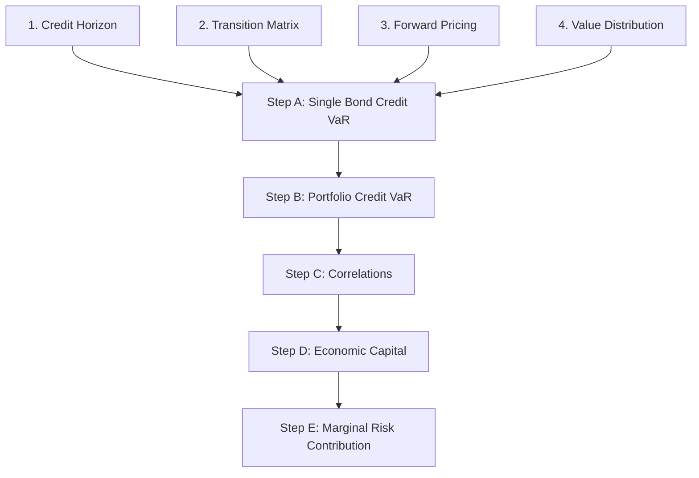
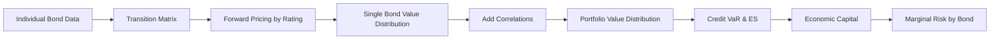

# Week 3: Portfolio Credit Risk and CreditMetrics

> **FIN 522A Fixed Income | Lecture 5 + Malhotra CreditMetrics Paper**
> 🎯 本讲核心：从单笔债券信用分析扩展到**组合层面**的信用风险度量
> 📌 Prerequisites: [[Week 2-2 Credit Risk and Credit Analysis]]（PD, LGD, Expected Loss, Transition Matrices 的基础）

---

## 📑 Table of Contents 目录

1. [[#1. From Single Bond to Portfolio 从单笔到组合 ⭐|From Single Bond to Portfolio]]
2. [[#2. Key Drivers of Portfolio Credit Risk 组合信用风险的关键驱动因素 ⭐⭐|Key Drivers of Portfolio Credit Risk]]
3. [[#3. Portfolio Expected Loss 组合预期损失 ⭐⭐|Portfolio Expected Loss]]
4. [[#4. Unexpected Loss 非预期损失 ⭐⭐⭐|Unexpected Loss]]
5. [[#5. Default Correlation 违约相关性 ⭐⭐⭐|Default Correlation]]
6. [[#6. Credit Loss Distribution 信用损失分布 ⭐⭐|Credit Loss Distribution]]
7. [[#7. Credit VaR 信用风险价值 ⭐⭐⭐|Credit VaR]]
8. [[#8. Expected Shortfall (ES / CVaR) 预期短缺 ⭐⭐⭐|Expected Shortfall (ES / CVaR)]]
9. [[#9. CreditMetrics Framework Overview 框架总览 ⭐⭐|CreditMetrics Framework Overview]]
10. [[#10. CreditMetrics Step A — Single Bond Credit VaR 单笔债券 ⭐⭐⭐|CreditMetrics Step A — Single Bond]]
11. [[#11. CreditMetrics Step B-E — Portfolio Credit VaR 组合层面 ⭐⭐⭐|CreditMetrics Step B-E — Portfolio]]
12. [[#12. Economic Capital and Marginal Risk 经济资本与边际风险 ⭐⭐|Economic Capital and Marginal Risk]]

---

## 1. From Single Bond to Portfolio 从单笔到组合 ⭐

In [[Week 2-2 Credit Risk and Credit Analysis]], we analyzed credit risk for a **single bond** — PD, LGD, Expected Loss, CDS spreads.

But in reality, banks and portfolio managers hold **hundreds or thousands** of bonds. The key question becomes:

> [!important] 核心问题
> **What is the total credit risk of the entire portfolio?**
> 组合的总信用风险是多少？
>
> 这**不是**简单地把每笔债券的风险加起来 — 因为**相关性（correlation）**的存在，组合风险可能远大于（或小于）各部分之和！这与 [[Week 4-2 Portfolio Theory and Optimization#2. Correlation and Diversification 相关性与分散化 ⭐⭐⭐|投资组合理论中 correlation 对分散化的影响]] 逻辑一致。

### 1.1 Why Portfolio View Matters 为什么组合视角重要

| Single Bond View | Portfolio View |
|-----------------|----------------|
| PD, LGD → [[#3. Portfolio Expected Loss 组合预期损失 ⭐⭐\|EL]] | How do losses interact? |
| Spread duration → price change | What's the [[#7. Credit VaR 信用风险价值 ⭐⭐⭐\|worst-case loss]]? |
| CDS hedging | How much capital do we need? |

---

## 2. Key Drivers of Portfolio Credit Risk 组合信用风险的关键驱动因素 ⭐⭐

Four key drivers（四个关键驱动因子）:

| Driver | 中文 | Impact |
|--------|------|--------|
| **Probability of Default (PD)** | 违约概率 | Higher PD → higher risk |
| **Loss Given Default (LGD)** | 违约损失率 | Higher LGD → more loss per default |
| **Default Correlation** | 违约相关性 | Higher correlation → fatter tail risk |
| **Concentration** | 集中度 | More concentrated → less diversification |

> [!warning] 考试重点
> - **PD and LGD** affect [[#3. Portfolio Expected Loss 组合预期损失 ⭐⭐\|Expected Loss (EL)]] — the average loss
> - **Correlation and Concentration** affect [[#4. Unexpected Loss 非预期损失 ⭐⭐⭐\|Unexpected Loss (UL)]] — the tail risk
> - EL is "predictable" and can be priced in → covered by **reserves / provisions**
> - UL is the "surprise" → must be covered by **economic capital**

---

## 3. Portfolio Expected Loss 组合预期损失 ⭐⭐

### 3.1 Single Asset Expected Loss 单笔预期损失

Recall from [[Week 2-2 Credit Risk and Credit Analysis#8. Expected Loss 预期损失 ⭐⭐|Week 2-2 Section 8]]:

$$EL_i = PD_i \times LGD_i \times EAD_i$$

### 3.2 Portfolio Expected Loss 组合预期损失

$$\boxed{EL_P = \sum_{i=1}^{N} EL_i = \sum_{i=1}^{N} PD_i \times LGD_i \times EAD_i}$$

> [!tip] 关键性质
> **Portfolio EL is simply the sum of individual ELs!**
>
> 组合的预期损失 = 各笔债券预期损失之和
>
> **不受相关性影响** — 即使违约高度相关，平均损失不变
>
> 数学原因：$E(X + Y) = E(X) + E(Y)$，期望的可加性不要求独立性

> [!example] 例子
> | Bond | EAD | PD | LGD | EL |
> |------|-----|----|-----|-----|
> | A | $1M | 1% | 60% | $6,000 |
> | B | $2M | 3% | 50% | $30,000 |
> | C | $500K | 5% | 70% | $17,500 |
>
> $$EL_P = \$6{,}000 + \$30{,}000 + \$17{,}500 = \$53{,}500$$

---

## 4. Unexpected Loss 非预期损失 ⭐⭐⭐

### 4.1 What is Unexpected Loss? 什么是非预期损失

**Unexpected Loss (UL)** = the **standard deviation** of the credit loss distribution

$$UL = \sigma(\text{Loss})$$

> [!tip] 直觉
> - **EL** = 你"预期"会损失多少（平均值）
> - **UL** = 实际损失可能偏离 EL 多远（波动性）
> - 真正可怕的不是预期损失（可以提前准备），而是非预期损失（措手不及）

### 4.2 Single Asset UL 单笔非预期损失

For a single asset with **uncertain PD and LGD**:

$$\boxed{UL_i = EAD_i \times \sqrt{PD_i \times \sigma_{LGD}^2 + LGD_i^2 \times PD_i \times (1 - PD_i)}}$$

> [!note] 公式推导
> Loss for asset $i$: $L_i = EAD_i \times D_i \times LGD_i$，其中 $D_i$ 是 Bernoulli 变量（1=违约, 0=不违约）
>
> $$\text{Var}(L_i) = EAD_i^2 \times \text{Var}(D_i \times LGD_i)$$
>
> 使用条件方差公式 $\text{Var}(XY) = E(X)\text{Var}(Y) + E(Y)^2\text{Var}(X)$（当 X 和 Y 独立时）:
>
> $$\text{Var}(D_i \times LGD_i) = PD_i \times \sigma_{LGD}^2 + LGD_i^2 \times PD_i(1 - PD_i)$$
>
> 两项的含义：
> - $PD_i \times \sigma_{LGD}^2$：LGD 不确定性带来的风险
> - $LGD_i^2 \times PD_i(1-PD_i)$：违约本身的不确定性带来的风险

### 4.3 Simplified UL (Constant LGD) 简化版本

If LGD is fixed（即 $\sigma_{LGD} = 0$）:

$$UL_i = EAD_i \times LGD_i \times \sqrt{PD_i \times (1 - PD_i)}$$

> [!example] 例子
> Bond A: $EAD = \$1M$, $PD = 1\%$, $LGD = 60\%$, $\sigma_{LGD} = 0$ (fixed)
>
> $$UL_A = \$1M \times 0.60 \times \sqrt{0.01 \times 0.99} = \$1M \times 0.60 \times 0.0995 = \$59{,}700$$
>
> 注意：$UL = \$59{,}700 >> EL = \$6{,}000$！非预期损失远大于预期损失

### 4.4 Portfolio UL 组合非预期损失

$$\boxed{UL_P = \sqrt{\sum_{i=1}^{N} \sum_{j=1}^{N} \rho_{ij} \times UL_i \times UL_j}}$$

where $\rho_{ij}$ = default correlation between assets $i$ and $j$

> [!important] 关键洞察：相关性的影响
> - 如果 $\rho_{ij} = 0$（完全不相关 / 完全分散）:
>   $$UL_P = \sqrt{\sum UL_i^2} < \sum UL_i$$
>   → **分散化降低了风险！**
>
> - 如果 $\rho_{ij} = 1$（完全正相关）:
>   $$UL_P = \sum UL_i$$
>   → **没有分散化效果，风险是最大的**
>
> - 现实中 $0 < \rho < 1$，所以 portfolio UL 在两个极端之间

> [!warning] EL vs UL 对比总结
> | Property | EL | UL |
> |----------|----|----|
> | 含义 | 平均损失 | 损失的波动性 |
> | 受相关性影响？ | **No** | **Yes** |
> | 组合计算 | 简单求和 | 需要 correlation matrix |
> | 应对方式 | Reserves / Loan pricing | Economic capital |

---

## 5. Default Correlation 违约相关性 ⭐⭐⭐

### 5.1 Why Correlation Matters 为什么相关性重要

Default correlation measures the tendency of borrowers to **default together**（同时违约的倾向）.

> [!tip] 直觉
> 想想 2008 金融危机 — 当房价下跌时，**很多**房贷借款人同时违约，因为他们受到同一个因素（房价）的影响。这就是高 default correlation 的后果。

### 5.2 Sources of Default Correlation 违约相关性的来源

1. **Common macroeconomic factors**（共同宏观因素）— recession affects everyone
2. **Industry factors**（行业因素）— oil price crash hits all energy companies
3. **Contagion / direct linkages**（传染/直接关联）— one default triggers others through supply chains

### 5.3 Measuring Default Correlation 衡量违约相关性

**Problem:** Default is a rare, binary event → hard to directly estimate correlation from default data.

**Solution (CreditMetrics approach):** Use **equity return correlations** as a proxy!

> [!note] 为什么用股票收益率的相关性？
> Recall the [[Week 2-2 Credit Risk and Credit Analysis#9. Structural Models — Merton Model 结构化模型 ⭐⭐⭐|Merton Model]]: equity = call option on firm assets.
>
> 如果两家公司的资产价值（→ 股价）高度相关，那么它们同时跌破违约点的概率也会更高。
>
> 所以：**equity correlation ≈ asset correlation → proxy for default correlation**

### 5.4 Impact on Loss Distribution 对损失分布的影响

| Correlation | Loss Distribution Shape | Meaning |
|-------------|------------------------|---------|
| Low $\rho$ | More concentrated, thinner tails | Diversification works, extreme losses rare |
| High $\rho$ | More spread out, **fatter tails** | Losses cluster together, extreme losses more likely |

→ Higher correlation doesn't change [[#3. Portfolio Expected Loss 组合预期损失 ⭐⭐|EL]], but dramatically increases [[#7. Credit VaR 信用风险价值 ⭐⭐⭐|Credit VaR]] and [[#8. Expected Shortfall (ES / CVaR) 预期短缺 ⭐⭐⭐|ES]]!

---

## 6. Credit Loss Distribution 信用损失分布 ⭐⭐

### 6.1 Why Not Normal? 为什么不是正态分布

Unlike market risk (roughly normal), credit loss distributions are:

| Feature | 中文 | Description |
|---------|------|-------------|
| **Skewed right** | 右偏 | Most of the time losses are small; occasionally very large |
| **Fat-tailed / Leptokurtic** | 厚尾 | Extreme losses happen more often than normal predicts |
| **Bounded below** | 下界为零 | You can't have negative losses |
| **Peaked** | 尖峰 | Large mass at zero/small losses |

```
Probability
  |
  |█
  |██
  |███
  |████
  |█████
  |██████
  |███████
  |████████
  |█████████
  |█████████▄▄▄▄▄_____ _ _ _ _
  |_________________________________ Loss
  0   EL        VaR      Tail
       ↑         ↑
    "expected"  "stress"
```

> [!warning] 考试重点
> 信用损失分布的非正态性是本讲最重要的概念之一：
> - 不能用 $\mu \pm z\sigma$ 的简单公式来计算 Credit VaR
> - 需要用 simulation 或专门的模型（如 [[#9. CreditMetrics Framework Overview 框架总览 ⭐⭐|CreditMetrics]]）
> - 这也是为什么 [[#8. Expected Shortfall (ES / CVaR) 预期短缺 ⭐⭐⭐|ES]] 比 VaR 更适合信用风险

---

## 7. Credit VaR 信用风险价值 ⭐⭐⭐

### 7.1 Definition 定义

**Credit VaR** at confidence level $\alpha$ (e.g., 99%) = the loss level that will **not be exceeded** with probability $\alpha$.

$$\boxed{P(\text{Loss} \leq \text{VaR}_\alpha) = \alpha}$$

Or equivalently: there is only a $(1-\alpha)$ probability that losses exceed VaR.

### 7.2 Credit VaR vs Market VaR 信用VaR vs 市场VaR

| Feature | Market VaR | Credit VaR |
|---------|------------|------------|
| Distribution | Approx. normal | **Skewed, fat-tailed** |
| Horizon | 1-10 days | **1 year** (typically) |
| Confidence | 95% or 99% | **99% or 99.9%** |
| Meaning | "Worst daily trading loss" | "Worst annual credit loss" |

### 7.3 Two Definitions of Credit VaR 两种定义

> [!important] 考试注意：两种定义要分清
>
> **Definition 1: Absolute Credit VaR**
> $$\text{VaR}_\alpha = F^{-1}(\alpha)$$
> = the loss at the $\alpha$ percentile of the loss distribution
>
> **Definition 2: Relative Credit VaR (more common)**
> $$\text{Credit VaR}_\alpha = \text{VaR}_\alpha - EL = F^{-1}(\alpha) - EL$$
> = the **unexpected** portion of the loss at the $\alpha$ percentile
>
> 区别：Definition 2 减去了 EL（因为 EL 已经被 reserves 覆盖了，我们关心的是超出 EL 的部分）

> [!example] 例子
> Portfolio: $EL = \$53{,}500$, loss at 99th percentile = $\$450{,}000$
>
> - Absolute VaR (99%) = $450,000
> - Relative Credit VaR (99%) = $450,000 - $53,500 = **$396,500**
>
> 解读：有99%的概率，超出预期的损失不会超过 $396,500

### 7.4 Limitations of VaR VaR的局限性

> [!warning] VaR 的问题
> 1. **VaR tells you nothing about the tail** — 只告诉你"门槛在哪"，不告诉你"门槛之外有多惨"
> 2. **VaR is NOT subadditive** — combining portfolios can increase VaR (反直觉！分散化可能增加 VaR)
>    - This means VaR is **not a coherent risk measure**
> 3. For skewed credit distributions, VaR can be very misleading
>
> → 这就是为什么我们需要 [[#8. Expected Shortfall (ES / CVaR) 预期短缺 ⭐⭐⭐|Expected Shortfall]]！

---

## 8. Expected Shortfall (ES / CVaR) 预期短缺 ⭐⭐⭐

### 8.1 Definition 定义

**Expected Shortfall** (also called **CVaR** or **Tail VaR**) = the **average loss** given that losses **exceed** VaR.

$$\boxed{ES_\alpha = E[\text{Loss} \;|\; \text{Loss} \geq \text{VaR}_\alpha]}$$

Equivalently:

$$ES_\alpha = \frac{1}{1-\alpha} \int_{\alpha}^{1} \text{VaR}_u \, du$$

> [!tip] 直觉
> - **VaR** 回答："最坏情况下（$\alpha$ 置信度），损失是多少？" → 只是一个点
> - **ES** 回答："如果真的超过了最坏情况，**平均**会损失多少？" → 尾部的平均
>
> ES 关注的是"如果最坏的事情发生了，到底有多坏"

### 8.2 ES ≥ VaR (Always)

$$ES_\alpha \geq \text{VaR}_\alpha \quad \text{always}$$

> [!note] 为什么
> ES 是所有超过 VaR 的损失的平均值。平均值必然 ≥ 最小值（VaR 是这些损失中最小的那个）。

### 8.3 Why ES is Better for Credit Risk 为什么 ES 更适合信用风险

| Property | VaR | ES |
|----------|-----|-----|
| **Subadditivity** | ❌ Can fail | ✅ Always holds |
| **Tail sensitivity** | ❌ Ignores tail | ✅ Captures tail shape |
| **Coherent risk measure** | ❌ No | ✅ Yes |
| **Regulatory preference** | Basel II (market risk) | **Basel III** (preferred) |

> [!important] 考试重点：Subadditivity 次可加性
> A risk measure $\rho$ is **subadditive** if:
> $$\rho(A + B) \leq \rho(A) + \rho(B)$$
>
> 含义：分散化不应该增加风险。
> - ES 满足这个性质 ✅（分散化总是有帮助的）
> - VaR 不一定满足 ❌（有时合并组合后 VaR 反而增加）
>
> 这是 ES 被称为 **coherent risk measure** 的关键原因之一

> [!example] 数值对比
> 假设 99% VaR = $450,000
>
> 如果 tail 很 thin（尾部薄）：ES(99%) ≈ $480,000 — 差不多
> 如果 tail 很 fat（尾部厚）：ES(99%) ≈ $1,200,000 — 远超 VaR！
>
> → 对于 fat-tailed 的信用损失分布，ES 提供了**更真实的风险图景**

---

## 9. CreditMetrics Framework Overview 框架总览 ⭐⭐

### 9.1 What is CreditMetrics? 什么是 CreditMetrics

**CreditMetrics** was developed by **J.P. Morgan in 1997** to measure **portfolio credit risk** arising from:
- **Defaults**（违约）
- **Credit migrations / upgrades / downgrades**（评级迁移）

> [!tip] 关键区别
> CreditMetrics 不只考虑"违不违约"，还考虑**评级变化**带来的价值变动！
>
> 比如：一个 A 级债券被降为 BBB，虽然没有违约，但因为 credit spread 扩大了（参见 [[Week 2-2 Credit Risk and Credit Analysis#4. Credit Spreads 信用利差 ⭐⭐|credit spreads]]），债券价值也会下降。

### 9.2 Five Overall Steps (A through E)



### 9.3 Credit Returns are Non-Gaussian 信用收益率的非正态性

> [!warning] 核心问题
> Market risk models assume returns are roughly normal. But **credit returns are fundamentally different**:
> - **Upside is limited**（上行空间有限）— best case: rating upgrade, small price gain
> - **Downside can be extreme**（下行空间很大）— worst case: default, lose everything
> - This creates a **heavily skewed, fat-tailed** distribution
>
> → CreditMetrics was designed specifically to handle this non-normality

---

## 10. CreditMetrics Step A — Single Bond Credit VaR 单笔债券 ⭐⭐⭐

### 10.1 Step 1: Specify Credit Risk Horizon 指定信用风险时间范围

**Standard: 1 year** — matching the typical transition matrix horizon from [[Week 2-2 Credit Risk and Credit Analysis#3. Rating Transition Matrices 评级迁移矩阵 ⭐|rating agencies]].

### 10.2 Step 2: Credit Migration / Transition Probabilities 评级迁移概率

Use the **rating transition matrix** (e.g., from S&P):

> [!example] Example: A-rated bond transition probabilities
> | From A → | AAA | AA | A | BBB | BB | B | CCC | Default |
> |----------|-----|----|---|-----|----|---|-----|---------|
> | Prob (%) | 0.02 | 0.33 | 91.05 | 5.52 | 0.74 | 0.26 | 0.01 | 0.06 |
>
> 解读：一个 A 级债券在一年后有 91.05% 的概率仍然是 A 级，5.52% 被降为 BBB，0.06% 违约...

### 10.3 Step 3: Forward Pricing — Revaluation at Each Rating 各评级下的重新定价

For each possible future rating, we calculate the bond's **forward value** using rating-specific **forward zero curves（远期零息利率曲线）**.

> [!example] 详细计算：A-rated 3-year 5% coupon bond (Malhotra paper example)
>
> **If stays A-rated after 1 year** (remaining: 2-year bond):
>
> Forward zero rates for A-rated bonds: $r_1 = 3.72\%$, $r_2 = 4.32\%$
>
> $$V_A = \frac{5}{1.0372} + \frac{105}{(1.0432)^2} = 4.82 + 96.53 = \$101.35$$
>
> (加上第一年 coupon $5: total forward value ≈ $106.35)
>
> **If upgraded to AAA:**
> Forward zero rates for AAA: $r_1 = 3.60\%$, $r_2 = 4.17\%$
>
> $$V_{AAA} = \frac{5}{1.036} + \frac{105}{(1.0417)^2} = 4.83 + 96.81 = \$101.64$$
>
> (+ coupon $5: total ≈ $106.64)
>
> **If downgraded to B:**
> Forward zero rates for B: $r_1 = 5.55\%$, $r_2 = 6.22\%$
>
> $$V_B = \frac{5}{1.0555} + \frac{105}{(1.0622)^2} = 4.74 + 93.09 = \$97.83$$
>
> (+ coupon $5: total ≈ $102.83)
>
> **If default:**
> $$V_{\text{default}} = \text{Recovery Rate} \times \text{Face Value} = 0.5138 \times 100 = \$51.38$$
> （参见 [[Week 2-2 Credit Risk and Credit Analysis#7. Recovery Rate and LGD 回收率与违约损失率 ⭐⭐|Recovery Rates by seniority]]）

> [!important] 关键理解
> **为什么不同评级有不同的远期利率曲线？**
>
> 因为评级越低 → credit spread 越大 → 折现率越高 → 债券价值越低
>
> 这就是 CreditMetrics 的精妙之处：它把**评级迁移**转化为了**价值变动**

### 10.4 Step 4: Forward Distribution of Value Changes 价值变动分布

Combine transition probabilities × forward values = **probability-weighted distribution**:

| Future Rating | Probability | Forward Value | Deviation from Mean |
|--------------|-------------|---------------|-------------------|
| AAA | 0.02% | $106.64 | +$0.30 |
| AA | 0.33% | $106.59 | +$0.25 |
| A | 91.05% | $106.35 | +$0.01 |
| BBB | 5.52% | $105.64 | -$0.70 |
| BB | 0.74% | $103.81 | -$2.53 |
| B | 0.26% | $102.83 | -$3.51 |
| CCC | 0.01% | $98.10 | -$8.24 |
| Default | 0.06% | $51.38 | -$54.96 |

**Expected Forward Value:**

$$\bar{V} = \sum_s p_s \times V_s$$

**Standard Deviation of Forward Value:**

$$\sigma_V = \sqrt{\sum_s p_s \times (V_s - \bar{V})^2}$$

**Single Bond Credit VaR (at percentile):** find the value at the desired confidence level from this discrete distribution.

> [!tip] 注意分布形状
> 这个分布明显是**左偏**的 — 91% 的概率在 A 级附近（小波动），但有 0.06% 的概率掉到 default（巨大损失）。这就是为什么[[#6. Credit Loss Distribution 信用损失分布 ⭐⭐|信用损失分布不是正态的]]。

---

## 11. CreditMetrics Step B-E — Portfolio Credit VaR 组合层面 ⭐⭐⭐

### 11.1 Step B: Joint Migration — The Combinatorial Challenge

For a portfolio of $N$ bonds, each with $K$ possible future states (ratings):
- Total possible outcomes = $K^N$

> [!example] 3-bond portfolio, 8 states each
> $8^3 = 512$ possible combinations!
>
> For a realistic 100-bond portfolio with 8 states: $8^{100}$ → computationally impossible to enumerate
>
> → Must use **Monte Carlo simulation**（蒙特卡洛模拟）

### 11.2 Joint Probability Calculation 联合概率计算

**If bonds are independent（独立）:**

$$P(\text{Bond 1 in state } i, \text{ Bond 2 in state } j) = P_1(i) \times P_2(j)$$

**But bonds are NOT independent in reality** — we need [[#5. Default Correlation 违约相关性 ⭐⭐⭐|default correlations]]!

### 11.3 Step C: Correlations — The Gaussian Copula Approach 相关性建模

CreditMetrics uses a **Gaussian copula** (高斯 copula) approach:

**Key Idea:** Map each bond's credit transition to a **latent continuous variable** (asset return) that follows a standard normal distribution.

**Steps:**
1. For each bond, map transition thresholds to standard normal quantiles:

> [!example] A-rated bond thresholds
> | Cumulative Prob | Threshold $z$ | Transition |
> |-----------------|--------------|------------|
> | 0.06% (default) | $z < -3.24$ | Default |
> | 0.07% (CCC) | $-3.24 \leq z < -3.19$ | → CCC |
> | 0.33% (B) | $-3.19 \leq z < -2.72$ | → B |
> | 1.07% (BB) | $-2.72 \leq z < -2.30$ | → BB |
> | 6.59% (BBB) | $-2.30 \leq z < -1.51$ | → BBB |
> | 97.64% (A) | $-1.51 \leq z < 2.70$ | Stays A |
> | 97.97% (AA) | $2.70 \leq z < 3.54$ | → AA |
> | 100% (AAA) | $z \geq 3.54$ | → AAA |

2. Model **joint asset returns** as multivariate normal with correlation $\rho$:

$$\begin{pmatrix} x_1 \\ x_2 \end{pmatrix} \sim N\left(\begin{pmatrix} 0 \\ 0 \end{pmatrix}, \begin{pmatrix} 1 & \rho \\ \rho & 1 \end{pmatrix}\right)$$

3. **Simulate** $(x_1, x_2)$ → map to credit states → compute portfolio value

> [!important] 考试重点
> **Asset return correlation** (from equity markets) is used as the input:
> - E.g., $\rho_{\text{asset}} = 0.20$ between two firms
> - Higher $\rho$ → higher probability of **joint default** or **joint downgrade**
> - Even a moderate $\rho = 0.20$ can significantly increase joint default probability vs independence

### 11.4 Impact of Correlation on Joint Default 相关性对联合违约的影响

> [!example] Malhotra paper example
> Two A-rated bonds, each with $PD = 0.06\%$
>
> | Asset Correlation $\rho$ | Joint Default Prob | Ratio to Independent |
> |-----------------------|-------------------|---------------------|
> | 0 (independent) | 0.000004% | 1× |
> | 0.20 | 0.000144% | ~36× |
> | 0.40 | Much higher | >>36× |
>
> 即使 $\rho = 0.20$（看似不大），联合违约概率比独立情况下高了约 36 倍！

### 11.5 Step D: Economic Capital 经济资本

$$\boxed{\text{Economic Capital} = EV - P(c)}$$

where:
- $EV$ = expected portfolio value（组合预期价值）
- $P(c)$ = portfolio value at the $(1-c)\%$ confidence level（置信度对应的最差价值）

> [!note] 理解
> Economic Capital = 银行需要持有的资本来覆盖 unexpected losses
> - 如果 $c = 99\%$: 覆盖 99% 的情况下不会出问题
> - 如果 $c = 99.9\%$: 更保守，需要更多资本
>
> 这直接关系到银行的 [[Week 2-2 Credit Risk and Credit Analysis#8. Expected Loss 预期损失 ⭐⭐|regulatory capital requirements]]

### 11.6 Step E: Marginal Risk Contribution 边际风险贡献

**Marginal Risk** = how much does **adding one bond** to the portfolio change the total risk?

$$\text{Marginal Risk}_i = \text{Portfolio Risk with bond } i - \text{Portfolio Risk without bond } i$$

> [!tip] 应用
> - Helps identify **concentration risk**（集中度风险）
> - If one bond's marginal contribution is very high → portfolio is over-concentrated in that name/sector
> - Used for **risk-adjusted pricing**: charge higher spread for loans that contribute more marginal risk
> - Supports **portfolio optimization**: add bonds that have low marginal risk contribution

---

## 12. Economic Capital and Marginal Risk 经济资本与边际风险 ⭐⭐

### 12.1 Putting It All Together 整合



### 12.2 Practical Implications 实践意义

| Concept | Who Uses It? | Purpose |
|---------|-------------|---------|
| **EL** | Loan pricing, reserves | Price in expected credit losses |
| **UL / Credit VaR** | Risk management | Set risk limits |
| **Economic Capital** | Bank capital planning | Meet regulatory requirements |
| **Marginal Risk** | Portfolio managers | Optimize diversification |
| **ES** | Basel III compliance | Better tail risk measure |

> [!important] 考试重点：大框架
> $$\text{Total Credit Risk} = \underbrace{EL}_{\text{Reserves}} + \underbrace{UL}_{\text{Economic Capital}}$$
>
> - **EL** 用 loan pricing 和 provisions（拨备）来覆盖
> - **UL** 用 economic capital（经济资本）来覆盖
> - **Credit VaR** 和 **ES** 是衡量 UL 的两种方式（ES 更好）
> - **CreditMetrics** 是计算整个组合 credit VaR 的标准方法

---

## Summary 本讲总结

**必须记住的公式：**

1. $EL_P = \sum PD_i \times LGD_i \times EAD_i$ — 组合预期损失（简单求和，不受相关性影响）
2. $UL_i = EAD_i \times \sqrt{PD_i \cdot \sigma_{LGD}^2 + LGD_i^2 \cdot PD_i(1-PD_i)}$ — 单笔非预期损失
3. $UL_P = \sqrt{\sum_i \sum_j \rho_{ij} \cdot UL_i \cdot UL_j}$ — 组合非预期损失
4. $P(\text{Loss} \leq \text{VaR}_\alpha) = \alpha$ — Credit VaR 定义
5. $\text{Credit VaR} = \text{VaR}_\alpha - EL$ — 相对 Credit VaR
6. $ES_\alpha = E[\text{Loss} \mid \text{Loss} \geq \text{VaR}_\alpha]$ — Expected Shortfall
7. $ES_\alpha = \frac{1}{1-\alpha} \int_\alpha^1 \text{VaR}_u \, du$ — ES 积分形式
8. $\text{Economic Capital} = EV - P(c)$ — 经济资本

**必须记住的概念：**
- EL 不受相关性影响，UL 受相关性影响
- Credit VaR is NOT subadditive; ES IS subadditive（ES 是 coherent risk measure）
- CreditMetrics 5 steps: Horizon → Transition → Revaluation → Distribution → Correlation → Capital
- Gaussian copula: 用 equity correlation 作为 asset correlation 的 proxy

---

**Related Notes:** [[Week 1-1 Bond Pricing and Yield Fundamentals]] | [[Week 1-2 Duration, Convexity and Interest Rate Risk]] | [[Week 2-1 Embedded Options Effective Duration and MBS]] | [[Week 2-2 Credit Risk and Credit Analysis]] | [[Week 4-1 Risk and Return]] | [[Week 4-2 Portfolio Theory and Optimization]]
