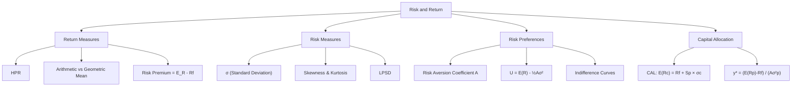

# Week 4-1: Risk and Return

> **FIN 522A Fixed Income | Lecture 7**
> 🎯 本讲核心：理解投资回报的度量方式、风险的统计特征，以及投资者如何在风险与收益间做出最优配置

---

## 📑 Table of Contents 目录

1. [[#1. Holding Period Return (HPR) 持有期回报率|Holding Period Return (HPR) 持有期回报率]]
2. [[#2. Expected Return and Risk 期望收益与风险 ⭐|Expected Return and Risk 期望收益与风险]]
3. [[#3. Excess Return and Risk Premium 超额收益与风险溢价 ⭐|Excess Return and Risk Premium 超额收益与风险溢价]]
4. [[#4. Sharpe Ratio 夏普比率 ⭐⭐|Sharpe Ratio 夏普比率]]
5. [[#5. Distribution of Returns 收益率分布 ⭐|Distribution of Returns 收益率分布]]
6. [[#6. LPSD and Sortino Ratio 下行风险与索提诺比率|LPSD and Sortino Ratio 下行风险与索提诺比率]]
7. [[#7. Historical Returns 历史收益率|Historical Returns 历史收益率]]
8. [[#8. Arithmetic vs Geometric Mean 算术平均与几何平均 ⭐|Arithmetic vs Geometric Mean 算术平均与几何平均]]
9. [[#9. Expected Utility and Risk Aversion 期望效用与风险厌恶 ⭐⭐|Expected Utility and Risk Aversion 期望效用与风险厌恶]]
10. [[#10. Mean-Variance Utility 均值-方差效用 ⭐⭐|Mean-Variance Utility 均值-方差效用]]
11. [[#11. Capital Allocation Line (CAL) 资本配置线 ⭐⭐⭐|Capital Allocation Line (CAL) 资本配置线]]
12. [[#12. Optimal Capital Allocation 最优资本配置 ⭐⭐|Optimal Capital Allocation 最优资本配置]]

---

## 1. Holding Period Return (HPR) 持有期回报率

### 1.1 Definition 定义

**Holding Period Return** = 持有一段时间后的总回报率：

$$HPR = \frac{P_1 - P_0 + D_1}{P_0}$$

where:
- $P_0$ = beginning price（期初价格）
- $P_1$ = ending price（期末价格）
- $D_1$ = cash distributions (dividends, coupon等)

> [!tip] 理解
> HPR 包含两部分：**capital gain**（资本利得）+ **income**（收入），即价格变动 + 利息/分红

### 1.2 Decomposition 分解

$$HPR = \underbrace{\frac{P_1 - P_0}{P_0}}_{\text{Capital Gain Yield}} + \underbrace{\frac{D_1}{P_0}}_{\text{Dividend Yield / Current Yield}}$$

> [!note] 与债券的联系
> 对于债券：$D_1$ = coupon payment，Capital Gain 来自价格变动（由 [[Week 1-2 Duration, Convexity and Interest Rate Risk#4. Modified Duration 修正久期 ⭐⭐⭐|利率变动]] 驱动）

---

## 2. Expected Return and Risk 期望收益与风险 ⭐

### 2.1 Expected Return 期望收益率

给定 $S$ 个scenarios，每个 scenario 的概率为 $p(s)$，收益率为 $r(s)$：

$$E(R) = \sum_{s=1}^{S} p(s) \times r(s)$$

### 2.2 Variance and Standard Deviation 方差与标准差

$$\sigma^2 = \text{Var}(R) = \sum_{s=1}^{S} p(s) \times [r(s) - E(R)]^2$$

$$\sigma = \text{SD}(R) = \sqrt{\sigma^2}$$

> [!important] 考试重点
> **Standard deviation (σ)** 是最常用的风险度量指标。它衡量收益率偏离期望值的程度。
> σ 越大 → 不确定性越大 → 风险越高

### 2.3 Example 例子

| Scenario | Probability | Return |
|----------|-------------|--------|
| Boom | 0.25 | 44% |
| Normal | 0.50 | 14% |
| Recession | 0.25 | -16% |

$$E(R) = 0.25(44\%) + 0.50(14\%) + 0.25(-16\%) = 14\%$$

$$\sigma^2 = 0.25(44-14)^2 + 0.50(14-14)^2 + 0.25(-16-14)^2 = 450$$

$$\sigma = \sqrt{450} = 21.21\%$$

---

## 3. Excess Return and Risk Premium 超额收益与风险溢价 ⭐

### 3.1 Key Definitions 关键定义

| Term | Formula | 中文 |
|------|---------|------|
| **Risk-free rate** $R_f$ | T-bill rate | 无风险利率 |
| **Excess return** | $r = R - R_f$ | 超额收益（已实现） |
| **Risk premium** | $E(r) = E(R) - R_f$ | 风险溢价（期望超额收益） |

> [!tip] 区分
> **Excess return** 是事后的、已实现的（ex-post）
> **Risk premium** 是事前的、期望的（ex-ante）
> 两者关系：risk premium 是 excess return 的期望值

### 3.2 Why Does Risk Premium Exist? 为什么存在风险溢价

投资者是 **risk-averse**（风险厌恶的）→ 承担风险需要 **补偿** → 这个补偿就是 risk premium

> [!note] 逻辑链
> Risk aversion → 投资者要求补偿 → Risk premium > 0 → 高风险资产应有更高的期望收益
> 详见 [[#9. Expected Utility and Risk Aversion 期望效用与风险厌恶 ⭐⭐|Expected Utility and Risk Aversion]]

---

## 4. Sharpe Ratio 夏普比率 ⭐⭐

### 4.1 Definition 定义

$$S = \frac{E(R_p) - R_f}{\sigma_p} = \frac{\text{Risk Premium}}{\text{Standard Deviation}}$$

> [!important] 核心概念
> Sharpe Ratio = **每单位风险获得的超额收益**（reward-to-volatility ratio）
> S 越高 → 风险调整后的表现越好

### 4.2 Interpretation 解读

- Sharpe Ratio 是评估投资组合表现的最常用指标
- 它后来也是 [[#11. Capital Allocation Line (CAL) 资本配置线 ⭐⭐⭐|CAL 的斜率]]
- 对于 [[Week 4-2 Portfolio Theory and Optimization#7. Capital Market Line (CML) 资本市场线 ⭐⭐⭐|CML]]，斜率就是 **market portfolio** 的 Sharpe Ratio

> [!warning] 注意
> Sharpe Ratio 假设收益率是正态分布的。如果分布有 [[#5. Distribution of Returns 收益率分布 ⭐|严重偏度或厚尾]]，Sharpe Ratio 可能低估风险。此时考虑用 [[#6. LPSD and Sortino Ratio 下行风险与索提诺比率|Sortino Ratio]]

---

## 5. Distribution of Returns 收益率分布 ⭐

### 5.1 Normal Distribution 正态分布假设

许多金融模型假设收益率服从正态分布（e.g., [[Week 3 Portfolio Credit Risk and CreditMetrics#5. Credit VaR 信用风险价值 ⭐⭐|Credit VaR 计算]]）。

正态分布的特点：
- 完全由 **mean ($\mu$)** 和 **variance ($\sigma^2$)** 决定
- 对称（symmetric）
- Bell-shaped

### 5.2 Departures from Normality 偏离正态

实际收益率往往**不是**完美正态分布：

#### Skewness 偏度

$$\text{Skew} = \frac{E\left[(R - \bar{R})^3\right]}{\sigma^3}$$

| Type | Value | 含义 |
|------|-------|------|
| **Negative skew** | Skew < 0 | 左尾更厚，大亏损更可能（投资者讨厌！）|
| **Zero skew** | Skew = 0 | 对称（normal distribution）|
| **Positive skew** | Skew > 0 | 右尾更厚，大盈利更可能 |

#### Kurtosis 峰度

$$\text{Kurt} = \frac{E\left[(R - \bar{R})^4\right]}{\sigma^4}$$

| Type | Value | 含义 |
|------|-------|------|
| **Leptokurtic** | Kurt > 3 | 尖峰厚尾（fat tails），极端事件更可能 |
| **Mesokurtic** | Kurt = 3 | Normal distribution |
| **Platykurtic** | Kurt < 3 | 扁平瘦尾，极端事件更少 |

> [!warning] 考试重点
> 金融市场收益率通常是 **leptokurtic（厚尾）** + **negatively skewed（左偏）**
> → 正态分布会**低估**极端损失的概率！
> 这也是 [[Week 3 Portfolio Credit Risk and CreditMetrics#4. Credit Loss Distribution 信用损失分布 ⭐|信用损失分布]] 为什么是非正态的原因之一

---

## 6. LPSD and Sortino Ratio 下行风险与索提诺比率

### 6.1 Lower Partial Standard Deviation (LPSD)

LPSD 只衡量**低于目标收益率**的波动（只看坏的那部分）：

$$LPSD = \sqrt{\frac{1}{N} \sum_{r_t < R_T} (r_t - R_T)^2}$$

where $R_T$ = target return（目标收益率，通常取 $R_f$ 或 0）

> [!tip] 直觉
> Standard deviation 对涨和跌"一视同仁"，但投资者其实只担心跌的部分。LPSD 只计算下行波动。

### 6.2 Sortino Ratio 索提诺比率

$$\text{Sortino Ratio} = \frac{\bar{R} - R_T}{LPSD}$$

> [!note] Sharpe vs Sortino
> - **Sharpe Ratio**: 用总波动率 σ（上下两个方向都算）
> - **Sortino Ratio**: 只用下行波动 LPSD → 对有 positive skew 的策略更友好
> - 如果收益率是完美正态分布，两者给出类似排名

---

## 7. Historical Returns 历史收益率

### 7.1 Using Sample Data 用样本数据估计

从 $N$ 期历史数据中：

$$\bar{R} = \frac{1}{N} \sum_{t=1}^{N} R_t \quad \text{(sample mean / arithmetic mean)}$$

$$\hat{\sigma}^2 = \frac{1}{N-1} \sum_{t=1}^{N} (R_t - \bar{R})^2 \quad \text{(sample variance, 注意用 } N-1\text{)}$$

> [!note] 为什么用 $N-1$？
> 自由度修正（Bessel's correction）→ 无偏估计

### 7.2 Volatility Scaling 波动率缩放

如果已知月度波动率 $\sigma_1$，假设收益率 i.i.d.（独立同分布）：

$$\sigma_T = \sigma_1 \times \sqrt{T}$$

> [!example] 例子
> 月度 σ = 5%，则年度 σ = 5% × √12 ≈ 17.32%

> [!warning] 前提条件
> 波动率的 √T 缩放假设收益率是 **i.i.d.**（独立同分布），实际中可能不完全成立（存在 autocorrelation, volatility clustering 等）

---

## 8. Arithmetic vs Geometric Mean 算术平均与几何平均 ⭐

### 8.1 Definitions 定义

**Arithmetic mean** 算术平均:

$$\bar{R}_A = \frac{1}{N} \sum_{t=1}^{N} R_t$$

**Geometric mean** 几何平均 (compounded return):

$$1 + \bar{R}_G = \left[\prod_{t=1}^{N} (1 + R_t)\right]^{1/N}$$

### 8.2 Key Relationship 关键关系

$$\bar{R}_G \approx \bar{R}_A - \frac{1}{2}\sigma^2$$

> [!important] 核心理解
> 几何平均**总是** ≤ 算术平均（当且仅当各期收益率完全相同时取等号）
> 差额约等于 ½σ² → **波动率越大，几何平均比算术平均低越多**

### 8.3 Which to Use? 用哪个？

| Purpose | Use | 理由 |
|---------|-----|------|
| **Forecast future expected return** | Arithmetic mean | 是无偏估计 |
| **Measure past actual performance** | Geometric mean | 反映实际复利增长 |

> [!example] 直觉例子
> Year 1: +50%, Year 2: -50%
> - Arithmetic mean = (50% + (-50%)) / 2 = 0%
> - Geometric mean: \$100 → \$150 → \$75 → 实际亏了25%
> - $\bar{R}_G = \sqrt{1.5 \times 0.5} - 1 = -13.4\%$
>
> Arithmetic mean 说"平均没亏"，但实际上你亏了！这就是 **volatility drag**

---

## 9. Expected Utility and Risk Aversion 期望效用与风险厌恶 ⭐⭐

### 9.1 Risk Aversion 风险厌恶

投资者面对两个选择：
- A: 确定获得 $100,000
- B: 50% 概率获得 $200,000，50% 概率获得 $0

两者期望值相同（$100,000），但 **risk-averse investor** 选 A

> [!tip] 三种投资者
> - **Risk-averse** (A > 0): 偏好确定性，愿意放弃部分期望收益以减少风险 → **大多数投资者**
> - **Risk-neutral** (A = 0): 只看期望收益，不在乎风险
> - **Risk-seeking** (A < 0): 偏好不确定性

### 9.2 Certainty Equivalent 确定性等价

**Certainty Equivalent (CE)** = 让投资者与不确定投资**无差异**的确定收益率

For a risk-averse investor: $CE < E(R)$

差额 $E(R) - CE$ = **risk penalty**（投资者愿意放弃多少收益来避免风险）

---

## 10. Mean-Variance Utility 均值-方差效用 ⭐⭐

### 10.1 Utility Function 效用函数

$$U = E(R) - \frac{1}{2} A \sigma^2$$

where:
- $U$ = utility score（效用值）
- $E(R)$ = expected return
- $A$ = **risk aversion coefficient**（风险厌恶系数）
- $\sigma^2$ = variance of returns

> [!important] 核心公式
> 这个公式说明：效用 = 期望收益 - 风险惩罚
> - $A$ 越大 → 越厌恶风险 → 同样的 $\sigma^2$ 带来更大的效用损失
> - 给定 $A$，可以在 E(R)-σ 空间画出 **indifference curves**（无差异曲线）

### 10.2 Indifference Curves 无差异曲线

在 E(R) vs σ 的坐标系中，无差异曲线上每一点给投资者相同的效用。

$$E(R) = U + \frac{1}{2} A \sigma^2$$

- 这是一条 **向上弯曲** 的曲线（抛物线）
- 越高的无差异曲线 → 越高的效用
- $A$ 越大 → 曲线越陡（风险厌恶者要求更多回报来补偿风险）

> [!note] 与最优配置的联系
> 投资者的最优选择 = 无差异曲线与 [[#11. Capital Allocation Line (CAL) 资本配置线 ⭐⭐⭐|CAL]] 相切的点
> 详见 [[#12. Optimal Capital Allocation 最优资本配置 ⭐⭐|Optimal Capital Allocation]]

---

## 11. Capital Allocation Line (CAL) 资本配置线 ⭐⭐⭐

### 11.1 Setup: Combining Risk-free and Risky Asset 组合无风险与风险资产

投资者将资金分配在：
- **Risk-free asset**: 收益率 $R_f$，$\sigma = 0$（如 T-bill）
- **Risky portfolio P**: 期望收益 $E(R_p)$，标准差 $\sigma_p$

权重 $y$ 分配给 risky portfolio，$(1-y)$ 给 risk-free：

$$E(R_c) = (1-y) R_f + y \cdot E(R_p) = R_f + y[E(R_p) - R_f]$$

$$\sigma_c = y \cdot \sigma_p$$

### 11.2 The CAL Equation CAL方程

消去 $y$（$y = \sigma_c / \sigma_p$）：

$$\boxed{E(R_c) = R_f + \frac{E(R_p) - R_f}{\sigma_p} \cdot \sigma_c = R_f + S_p \cdot \sigma_c}$$

> [!important] 核心结论
> **CAL 是 E(R)-σ 空间中的一条直线**
> - 截距 = $R_f$
> - **斜率 = Sharpe Ratio** of the risky portfolio
> - CAL 上每一点代表一种 risk-free 和 risky portfolio 的组合

### 11.3 Visual Interpretation 图形理解

```
E(R)
 |         P (100% risky)
 |        /
 |       / ← CAL (slope = Sharpe Ratio)
 |      /
 |     /
 |    /
 |   * ← optimal point (depends on A)
 |  /
 | /
 |/______________ σ
R_f
```

- $y = 0$: 全部投资 risk-free → 点在 $(0, R_f)$
- $y = 1$: 全部投资 risky portfolio → 点在 $(\sigma_p, E(R_p))$
- $y > 1$: **Leveraged position**（借钱投资 → 杠杆）→ 在 P 右上方延伸
- $0 < y < 1$: 分散配置 → 在 $R_f$ 和 P 之间

> [!tip] 与 Portfolio Theory 的联系
> CAL 的 risky portfolio P 应该选哪个？→ 选 **tangency portfolio**（Sharpe Ratio 最高的组合）
> 这就是 [[Week 4-2 Portfolio Theory and Optimization#6. Optimal Risky Portfolio 最优风险组合 ⭐⭐⭐|最优风险组合]] 的概念

---

## 12. Optimal Capital Allocation 最优资本配置 ⭐⭐

### 12.1 Optimization Problem 最优化问题

投资者最大化效用：

$$\max_y \quad U = E(R_c) - \frac{1}{2} A \sigma_c^2$$

代入 $E(R_c) = R_f + y[E(R_p) - R_f]$ 和 $\sigma_c = y \sigma_p$：

$$\max_y \quad U = R_f + y[E(R_p) - R_f] - \frac{1}{2} A y^2 \sigma_p^2$$

### 12.2 Solution 求解

对 $y$ 求导令其为零：

$$\frac{dU}{dy} = E(R_p) - R_f - A y \sigma_p^2 = 0$$

$$\boxed{y^* = \frac{E(R_p) - R_f}{A \sigma_p^2}}$$

> [!important] 最优配置公式
> $y^*$ = 投入风险资产的最优比例
> - Risk premium $\uparrow$ → $y^* \uparrow$（收益更高，多投资）
> - Risk aversion $A \uparrow$ → $y^* \downarrow$（更怕风险，少投资）
> - Variance $\sigma_p^2 \uparrow$ → $y^* \downarrow$（风险更大，少投资）

### 12.3 Graphical Interpretation 图形解释

最优点 = **CAL 与 indifference curve 的切点**

$$\text{At tangency: Slope of indifference curve} = \text{Slope of CAL} = S_p$$

> [!example] 数值例子
> - $R_f = 5\%$, $E(R_p) = 15\%$, $\sigma_p = 22\%$, $A = 4$
> - $y^* = \frac{0.15 - 0.05}{4 \times 0.22^2} = \frac{0.10}{0.1936} = 0.5165 \approx 51.65\%$
> - 投入约52%到风险资产，48%到无风险资产

---

## Summary 本讲总结



**必须记住的公式：**
1. $HPR = (P_1 - P_0 + D_1) / P_0$ — 持有期回报率
2. $S = E(R_p - R_f) / \sigma_p$ — Sharpe Ratio
3. $\bar{R}_G \approx \bar{R}_A - \frac{1}{2}\sigma^2$ — 几何平均与算术平均的关系
4. $\sigma_T = \sigma_1 \times \sqrt{T}$ — 波动率缩放
5. $U = E(R) - \frac{1}{2}A\sigma^2$ — Mean-Variance Utility
6. $E(R_c) = R_f + S_p \cdot \sigma_c$ — Capital Allocation Line
7. $y^* = [E(R_p) - R_f] / (A\sigma_p^2)$ — 最优资本配置

---

**Related Notes:** [[Week 1-1 Bond Pricing and Yield Fundamentals]] | [[Week 1-2 Duration, Convexity and Interest Rate Risk]] | [[Week 2-1 Embedded Options Effective Duration and MBS]] | [[Week 2-2 Credit Risk and Credit Analysis]] | [[Week 3 Portfolio Credit Risk and CreditMetrics]] | [[Week 4-2 Portfolio Theory and Optimization]]
