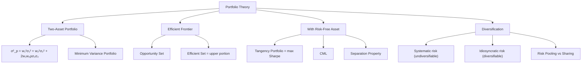

# Week 4-2: Portfolio Theory and Optimization

> **FIN 522A Fixed Income | Lecture 8**
> 🎯 本讲核心：Markowitz 投资组合理论 — 如何通过分散化降低风险，如何找到最优投资组合

---

## 📑 Table of Contents 目录

1. [[#1. Two-Asset Portfolio 两资产组合 ⭐⭐|Two-Asset Portfolio 两资产组合]]
2. [[#2. Correlation and Diversification 相关性与分散化 ⭐⭐⭐|Correlation and Diversification 相关性与分散化]]
3. [[#3. Minimum Variance Portfolio 最小方差组合 ⭐⭐|Minimum Variance Portfolio 最小方差组合]]
4. [[#4. The Efficient Frontier 有效前沿 ⭐⭐⭐|The Efficient Frontier 有效前沿]]
5. [[#5. N-Asset Portfolio N资产组合|N-Asset Portfolio N资产组合]]
6. [[#6. Optimal Risky Portfolio 最优风险组合 ⭐⭐⭐|Optimal Risky Portfolio 最优风险组合]]
7. [[#7. Capital Market Line (CML) 资本市场线 ⭐⭐⭐|Capital Market Line (CML) 资本市场线]]
8. [[#8. Separation Property 分离定理 ⭐⭐|Separation Property 分离定理]]
9. [[#9. Power of Diversification 分散化的威力 ⭐⭐|Power of Diversification 分散化的威力]]
10. [[#10. Risk Pooling vs Risk Sharing 风险汇聚与风险分担 ⭐|Risk Pooling vs Risk Sharing 风险汇聚与风险分担]]
11. [[#11. Optimal Asset Allocation Decision 最优资产配置决策 ⭐|Optimal Asset Allocation Decision 最优资产配置决策]]

---

## 1. Two-Asset Portfolio 两资产组合 ⭐⭐

### 1.1 Portfolio Return 组合收益率

两个资产，权重 $w_1$ 和 $w_2 = 1 - w_1$：

$$E(R_p) = w_1 E(R_1) + w_2 E(R_2)$$

> [!tip] 注意
> 期望收益率是权重的**线性**组合 — 没有分散化效应

### 1.2 Portfolio Variance 组合方差

$$\boxed{\sigma_p^2 = w_1^2 \sigma_1^2 + w_2^2 \sigma_2^2 + 2 w_1 w_2 \rho_{12} \sigma_1 \sigma_2}$$

where $\rho_{12}$ = correlation coefficient between assets 1 and 2

> [!important] 核心理解
> 组合风险**不是**简单加权平均！关键在于 **协方差项** $2w_1 w_2 \rho_{12} \sigma_1 \sigma_2$
> - 只要 $\rho_{12} < 1$，组合的风险就**小于**加权平均 → **分散化效应！**
> 这与 [[Week 3 Portfolio Credit Risk and CreditMetrics#3. Correlation and Portfolio Risk 相关性与组合风险 ⭐⭐|信用组合中相关性的作用]] 逻辑完全一致

### 1.3 Covariance 协方差

$$\text{Cov}(R_1, R_2) = \rho_{12} \sigma_1 \sigma_2$$

协方差矩阵（两资产）：

$$\Sigma = \begin{pmatrix} \sigma_1^2 & \rho_{12}\sigma_1\sigma_2 \\ \rho_{12}\sigma_1\sigma_2 & \sigma_2^2 \end{pmatrix}$$

---

## 2. Correlation and Diversification 相关性与分散化 ⭐⭐⭐

### 2.1 Effect of Correlation on Portfolio Risk 相关性对组合风险的影响

| Correlation $\rho$ | Effect | 组合在 E(R)-σ 图中的形状 |
|----------|--------|----------|
| $\rho = +1$ | **No diversification** 无分散化效果 | 直线（风险是简单加权平均）|
| $-1 < \rho < +1$ | **Partial diversification** 部分分散化 | 向左弯曲（风险低于加权平均）|
| $\rho = -1$ | **Perfect hedge** 完美对冲 | 可以构建 zero-risk portfolio |

### 2.2 Special Case: ρ = -1 完美对冲

当 $\rho = -1$ 时，可以完全消除风险：

$$\sigma_p = |w_1 \sigma_1 - w_2 \sigma_2|$$

令 $\sigma_p = 0$：

$$w_1 = \frac{\sigma_2}{\sigma_1 + \sigma_2}, \quad w_2 = \frac{\sigma_1}{\sigma_1 + \sigma_2}$$

> [!example] 例子
> $\sigma_1 = 15\%$, $\sigma_2 = 20\%$, $\rho = -1$
> $w_1 = 20/(15+20) = 57.1\%$, $w_2 = 42.9\%$
> → $\sigma_p = 0$（完全无风险！）

> [!warning] 考试重点
> $\rho < 1$ 是分散化有效的**唯一条件**。$\rho$ 越低 → 分散化效果越好 → 组合风险降低越多
> 但现实中 $\rho = -1$ 几乎不可能，通常 $\rho > 0$

---

## 3. Minimum Variance Portfolio 最小方差组合 ⭐⭐

### 3.1 Formula 公式

对两资产组合，最小方差权重：

$$\boxed{w_1^* = \frac{\sigma_2^2 - \rho_{12}\sigma_1\sigma_2}{\sigma_1^2 + \sigma_2^2 - 2\rho_{12}\sigma_1\sigma_2}}$$

> [!tip] 推导逻辑
> 对 $\sigma_p^2$ 关于 $w_1$ 求导令其为零 → 解出最优 $w_1$

### 3.2 Example 例子

Given: $E(R_1)=8\%$, $\sigma_1=12\%$, $E(R_2)=13\%$, $\sigma_2=20\%$, $\rho=0.3$

$$w_1^* = \frac{0.20^2 - 0.3 \times 0.12 \times 0.20}{0.12^2 + 0.20^2 - 2(0.3)(0.12)(0.20)} = \frac{0.04 - 0.0072}{0.0144 + 0.04 - 0.0144} = \frac{0.0328}{0.04} = 0.82$$

→ 82% in asset 1, 18% in asset 2

> [!note] 注意
> Minimum variance portfolio 不一定是"最好"的组合 — 它只是风险最小的。最优组合取决于投资者的效用函数。
> 详见 [[#6. Optimal Risky Portfolio 最优风险组合 ⭐⭐⭐|Optimal Risky Portfolio]]

---

## 4. The Efficient Frontier 有效前沿 ⭐⭐⭐

### 4.1 Opportunity Set 可行集

所有可能的两资产组合（通过改变 $w_1$）形成一条曲线 = **opportunity set**（可行集/投资机会集）

### 4.2 Efficient Frontier 有效前沿

**Efficient frontier** = 可行集中从 **minimum variance portfolio 向上** 的部分

```
E(R)
 |        * Asset 2 (high return, high risk)
 |      /
 |    / ← Efficient frontier (上半段)
 |   *  ← Minimum variance portfolio
 |    \
 |     \ ← Inefficient (下半段)
 |      \
 |        * Asset 1 (low return, low risk)
 |__________________ σ
```

> [!important] 核心概念
> **Efficient frontier 上的组合** = 给定风险水平下收益最高（或给定收益水平下风险最低）的组合
> **理性投资者只会选择有效前沿上的组合！**
> Minimum variance portfolio 以下的部分是 **inefficient** — 同样的风险可以获得更高的收益

### 4.3 Markowitz Portfolio Selection 马科维兹组合选择

投资者的最优选择 = **效率前沿与无差异曲线的切点**

- 更 risk-averse 的投资者 → 切点靠左（低风险低收益）
- 更 risk-tolerant 的投资者 → 切点靠右（高风险高收益）

---

## 5. N-Asset Portfolio N资产组合

### 5.1 General Formulas 一般公式

对 $N$ 个资产的组合：

$$E(R_p) = \sum_{i=1}^{N} w_i E(R_i) = \mathbf{w}^T \boldsymbol{\mu}$$

$$\sigma_p^2 = \sum_{i=1}^{N} \sum_{j=1}^{N} w_i w_j \text{Cov}(R_i, R_j) = \mathbf{w}^T \boldsymbol{\Sigma} \mathbf{w}$$

where:
- $\mathbf{w}$ = weight vector（权重向量）
- $\boldsymbol{\mu}$ = expected return vector（期望收益向量）
- $\boldsymbol{\Sigma}$ = covariance matrix（协方差矩阵）

### 5.2 Optimization Problem 优化问题

$$\min_{\mathbf{w}} \quad \mathbf{w}^T \boldsymbol{\Sigma} \mathbf{w}$$
$$\text{s.t.} \quad \mathbf{w}^T \boldsymbol{\mu} = \bar{R}, \quad \mathbf{w}^T \mathbf{1} = 1$$

> [!note] 矩阵表示
> N资产的有效前沿需要用 **quadratic programming** 求解。概念上与两资产相同，但计算更复杂。
> 输入需要：N 个期望收益 + N 个方差 + $N(N-1)/2$ 个协方差

---

## 6. Optimal Risky Portfolio 最优风险组合 ⭐⭐⭐

### 6.1 Adding the Risk-Free Asset 引入无风险资产

当存在 risk-free asset 时，投资者可以在 risk-free 和 **任何** risky portfolio 之间配置 → 形成 [[Week 4-1 Risk and Return#11. Capital Allocation Line (CAL) 资本配置线 ⭐⭐⭐|CAL]]

**关键问题：** CAL 的起点是 $R_f$，应该连到有效前沿上的**哪个点**？

### 6.2 Tangency Portfolio 切线组合

**最优风险组合** = 从 $R_f$ 出发与有效前沿**相切**的那个点

$$\text{Tangency portfolio} = \arg\max_P \frac{E(R_P) - R_f}{\sigma_P}$$

> [!important] 核心结论
> **Tangency portfolio 就是 Sharpe Ratio 最大的组合！**
> 它所对应的 CAL 是所有可能 CAL 中斜率最大的 → 对每一个风险水平都给出最高的期望收益

```
E(R)
 |          * Tangency Portfolio
 |         /|
 |        / |
 |       /  | ← Efficient frontier
 |      /   |
 |     /   /
 |    /  /
 |   / /
 |  //
 | / ← Optimal CAL (steepest slope)
 |/__________________ σ
R_f
```

### 6.3 Two-Asset Case 两资产情形

对于两个风险资产 + 一个无风险资产：

$$w_1^* = \frac{[E(R_1) - R_f]\sigma_2^2 - [E(R_2) - R_f]\rho\sigma_1\sigma_2}{[E(R_1) - R_f]\sigma_2^2 + [E(R_2) - R_f]\sigma_1^2 - [E(R_1) - R_f + E(R_2) - R_f]\rho\sigma_1\sigma_2}$$

> [!tip] 考试技巧
> 这个公式很长，记住分子分母的结构：分子和分母都有 risk premium × variance 的项，减去协方差项

---

## 7. Capital Market Line (CML) 资本市场线 ⭐⭐⭐

### 7.1 From CAL to CML

当 tangency portfolio = **market portfolio** 时，CAL 就变成了 **CML**：

$$\boxed{E(R_c) = R_f + \frac{E(R_M) - R_f}{\sigma_M} \cdot \sigma_c}$$

> [!important] CML vs CAL
> - **CAL**: 用**任意**风险组合 P 与 risk-free 连线
> - **CML**: 用**最优（market）组合 M** 与 risk-free 连线 → CML 是最陡的 CAL
> - CML 斜率 = **Market Sharpe Ratio** = $(E(R_M) - R_f) / \sigma_M$

### 7.2 Market Portfolio 市场组合

在均衡状态下（所有投资者都理性 + 同质预期）：
- 每个投资者持有的 **risky portfolio 都是 market portfolio**
- Market portfolio 包含市场上所有风险资产，按 **市值加权**

### 7.3 Passive vs Active Strategy 被动与主动策略

| Strategy | 做法 | 优缺点 |
|----------|------|--------|
| **Passive** | 持有 market index + T-bills，沿 CML 配置 | 简单、低成本、理论最优 |
| **Active** | 选股、择时，试图beat market | 需要 alpha，多数人做不到 |

> [!note] 与 Efficient Market Hypothesis 的联系
> 如果市场是有效的 → 没人能持续 beat market → passive strategy 最优 → 所有人沿 CML 配置

---

## 8. Separation Property 分离定理 ⭐⭐

### 8.1 The Two-Fund Separation Theorem 两基金分离定理

> [!important] 核心定理
> **投资决策可以分为两个独立步骤：**
> 1. **技术决策**：确定最优风险组合（tangency portfolio）→ 对所有投资者**相同**
> 2. **个人决策**：根据自身风险偏好在 risk-free 和 tangency portfolio 之间配置 → **因人而异**

$$y^* = \frac{E(R_P) - R_f}{A \sigma_P^2}$$

（这就是 [[Week 4-1 Risk and Return#12. Optimal Capital Allocation 最优资本配置 ⭐⭐|最优资本配置公式]]）

### 8.2 Implications 含义

- **所有投资者持有相同的风险组合**（tangency/market portfolio）
- 风险厌恶程度只影响 **风险资产 vs 无风险资产的比例**（$y^*$）
- Risk-averse investor: 小 $y^*$ → 多买 T-bills
- Risk-tolerant investor: 大 $y^*$，甚至 $y^* > 1$（杠杆 → 借钱买风险资产）

---

## 9. Power of Diversification 分散化的威力 ⭐⭐

### 9.1 Equal-Weight Portfolio of N Assets N资产等权组合

假设 $N$ 个资产，每个权重 $w_i = 1/N$，所有资产的方差相同为 $\sigma^2$，所有资产对的相关系数相同为 $\rho$：

$$\boxed{\sigma_p^2 = \frac{1}{N}\sigma^2 + \frac{N-1}{N}\rho\sigma^2}$$

### 9.2 As N → ∞ 当N趋向无穷

$$\lim_{N \to \infty} \sigma_p^2 = \rho \sigma^2$$

> [!important] 核心结论
> - **第一项** $\frac{1}{N}\sigma^2$：**idiosyncratic risk / firm-specific risk**（个体风险）→ 随 N 增大趋向于 0 → **可以被分散掉！**
> - **第二项** $\frac{N-1}{N}\rho\sigma^2$：**systematic risk / market risk**（系统风险）→ 趋向 $\rho\sigma^2$ → **无法被分散掉！**
> - 只要 $\rho > 0$，风险就**不可能降到零**

```
σ_p
 |
 |  \
 |   \
 |    \___________  ← systematic risk (ρσ²)
 |                   (can't diversify away)
 |
 |__________________ N
 1   10  20  30
```

> [!tip] 实际意义
> - 大约 **20-30 只股票** 就能消除大部分 idiosyncratic risk
> - 增加更多股票的边际分散化效果递减
> - 这解释了为什么市场只补偿 systematic risk → 这是 CAPM 的基础

### 9.3 Two Types of Risk 两种风险

| Risk Type | 中文 | 可否分散 | 市场是否补偿 |
|-----------|------|----------|-------------|
| **Systematic / Market Risk** | 系统风险 | ❌ 不可分散 | ✅ 有 risk premium |
| **Idiosyncratic / Firm-specific Risk** | 个体/特有风险 | ✅ 可以通过分散化消除 | ❌ 没有 risk premium |

> [!warning] 考试重点
> **市场只补偿不可分散的 systematic risk**。如果你持有一只股票承担了大量 idiosyncratic risk，市场不会给你额外补偿 — 因为你"自找的"（可以通过分散化消除）

---

## 10. Risk Pooling vs Risk Sharing 风险汇聚与风险分担 ⭐

### 10.1 Risk Pooling 风险汇聚

**Risk pooling** = 把多个独立风险放在一起

$$\sigma_{pool} = \sqrt{N} \cdot \sigma$$

> [!warning] 常见误区
> Risk pooling **不等于** diversification！
> 汇聚 N 个独立风险 → **总风险** 增大（$\sqrt{N}$倍）→ 没有降低总的风险暴露

### 10.2 Risk Sharing 风险分担

**Risk sharing** = Risk pooling + 按比例分担

每个参与者承担 $1/N$ 的总风险：

$$\sigma_{share} = \frac{\sigma_{pool}}{N} = \frac{\sqrt{N} \cdot \sigma}{N} = \frac{\sigma}{\sqrt{N}}$$

> [!important] 关键区别
> - **Pooling**: 总风险 = $\sqrt{N} \cdot \sigma$（增大了！）
> - **Sharing**: 每人风险 = $\sigma / \sqrt{N}$（减小了！）
> - **真正降低个体风险的是 sharing，不是 pooling！**

> [!example] 保险公司的例子
> 保险公司承保1000份独立保单 → risk pooling → 总风险 = $\sqrt{1000}\sigma$
> 但保险公司有1000个股东分担 → risk sharing → 每个股东的风险 = $\sigma/\sqrt{1000}$
> 这就是保险运作的原理

---

## 11. Optimal Asset Allocation Decision 最优资产配置决策 ⭐

### 11.1 The Complete 5-Step Process 完整5步流程

| Step  | 内容                                 | 详细说明                                                                    |                                   |
| ----- | ---------------------------------- | ----------------------------------------------------------------------- | --------------------------------- |
| **1** | Specify the return characteristics | 确定每个资产的 $E(R)$, $\sigma$, 和 $\rho$                                      |                                   |
| **2** | Establish the risky portfolio      | 用 [[#4. The Efficient Frontier 有效前沿 ⭐⭐⭐]]                               | 有效前沿]] 找到所有可行组合                   |
| **3** | Find the tangency portfolio        | 从 $R_f$ 出发与有效前沿相切 → [[#6. Optimal Risky Portfolio 最优风险组合 ⭐⭐⭐]]          | 最优风险组合]]                          |
| **4** | Choose appropriate mix on CAL      | 用 [[Week 4-1 Risk and Return#12. Optimal Capital Allocation 最优资本配置 ⭐⭐]] | y* 公式]] 确定 risk-free vs risky 的比例 |
| **5** | Evaluate performance               | 用 [[Week 4-1 Risk and Return#4. Sharpe Ratio 夏普比率 ⭐⭐]]                  | Sharpe Ratio]] 等指标评估              |

> [!tip] 全局图景
> Step 1-3 = **技术决策**（对所有投资者相同）→ [[#8. Separation Property 分离定理 ⭐⭐|Separation Property]]
> Step 4 = **个人决策**（取决于个人的 $A$）
> Step 5 = **绩效评估**

---

## Summary 本讲总结



**必须记住的公式：**
1. $\sigma_p^2 = w_1^2\sigma_1^2 + w_2^2\sigma_2^2 + 2w_1w_2\rho\sigma_1\sigma_2$ — 两资产组合方差
2. $w_1^* = \frac{\sigma_2^2 - \rho\sigma_1\sigma_2}{\sigma_1^2 + \sigma_2^2 - 2\rho\sigma_1\sigma_2}$ — 最小方差组合权重
3. Tangency portfolio = $\arg\max \frac{E(R_P) - R_f}{\sigma_P}$ — 最大 Sharpe Ratio
4. $E(R_c) = R_f + \frac{E(R_M) - R_f}{\sigma_M} \sigma_c$ — Capital Market Line
5. $\sigma_p^2 = \frac{1}{N}\sigma^2 + \frac{N-1}{N}\rho\sigma^2$ — N资产等权组合方差
6. Systematic risk = $\rho\sigma^2$（不可分散）vs Idiosyncratic risk → 0（可分散）
7. Risk sharing: $\sigma_{share} = \sigma / \sqrt{N}$

---

**Related Notes:** [[Week 1-1 Bond Pricing and Yield Fundamentals]] | [[Week 1-2 Duration, Convexity and Interest Rate Risk]] | [[Week 2-1 Embedded Options Effective Duration and MBS]] | [[Week 2-2 Credit Risk and Credit Analysis]] | [[Week 3 Portfolio Credit Risk and CreditMetrics]] | [[Week 4-1 Risk and Return]]
