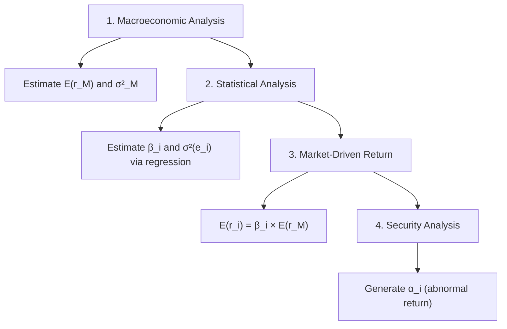
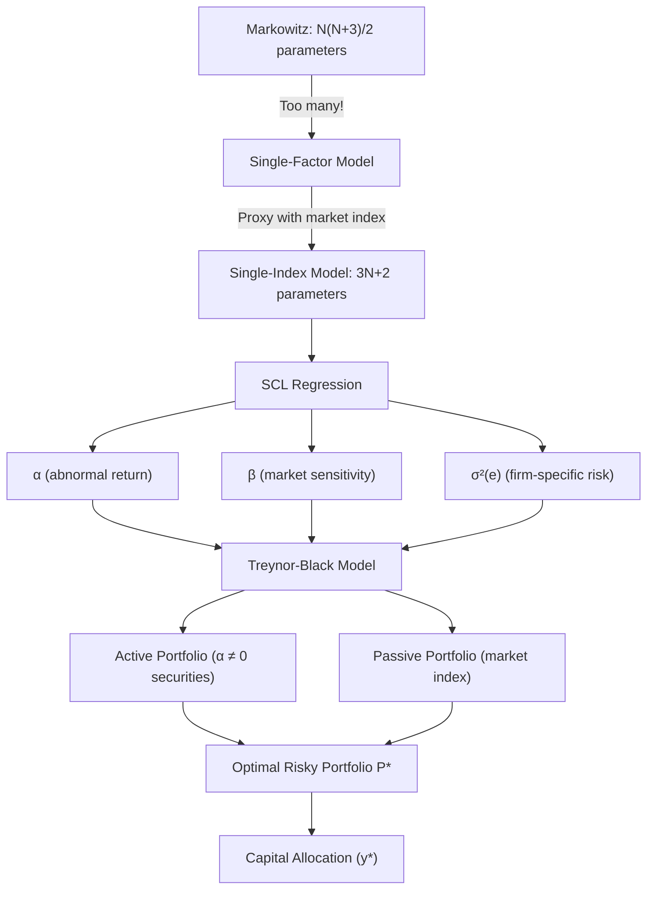

# Week 5-1: Single-Factor and Single-Index Models

> **FIN 522A Fixed Income | Lecture 9**
> 🎯 本讲核心：从 Markowitz 的估计难题出发，引入 single-factor model 简化协方差结构，再发展为可实证的 single-index model，最终通过 Treynor-Black 模型实现主动管理与被动投资的最优结合

---

## 📑 Table of Contents 目录

1. [[#1. The Estimation Problem Markowitz的估计难题 ⭐⭐|The Estimation Problem Markowitz的估计难题]]
2. [[#2. Realized Returns vs Expectations 实际收益与期望 ⭐|Realized Returns vs Expectations 实际收益与期望]]
3. [[#3. Single-Factor Model 单因子模型 ⭐⭐⭐|Single-Factor Model 单因子模型]]
4. [[#4. Variance Decomposition 方差分解 ⭐⭐|Variance Decomposition 方差分解]]
5. [[#5. Covariance in the Single-Factor Model 单因子模型中的协方差 ⭐⭐|Covariance in the Single-Factor Model 单因子模型中的协方差]]
6. [[#6. From Single-Factor to Single-Index Model 从单因子到单指数模型 ⭐⭐⭐|From Single-Factor to Single-Index Model 从单因子到单指数模型]]
7. [[#7. Security Characteristic Line (SCL) 证券特征线 ⭐⭐⭐|Security Characteristic Line (SCL) 证券特征线]]
8. [[#8. Estimation and Regression OLS回归估计 ⭐⭐|Estimation and Regression OLS回归估计]]
9. [[#9. Parameter Comparison: SIM vs Markowitz 参数对比 ⭐⭐|Parameter Comparison: SIM vs Markowitz 参数对比]]
10. [[#10. Alpha and Security Analysis Alpha与证券分析 ⭐⭐|Alpha and Security Analysis Alpha与证券分析]]
11. [[#11. Treynor-Black Model 特雷诺-布莱克模型 ⭐⭐⭐|Treynor-Black Model 特雷诺-布莱克模型]]

---

## 1. The Estimation Problem Markowitz的估计难题 ⭐⭐

### 1.1 Markowitz Framework Recap 回顾

[[Week 4-2 Portfolio Theory and Optimization|上一讲]]我们学习了 Markowitz mean-variance optimization。投资者基于 expected return、variance 和 [[Week 4-2 Portfolio Theory and Optimization#4. Efficient Frontier 有效前沿 ⭐⭐⭐|efficient frontier]] 来选择最优组合。

但实施 Markowitz 需要估计大量参数：

- $N$ 个 expected returns：$E(R_i)$
- $N$ 个 variances：$\sigma_i^2$
- $\frac{N(N-1)}{2}$ 个 covariances：$\text{Cov}(R_i, R_j)$

**Total parameters:**

$$\text{Total} = N + \frac{N(N+1)}{2} = \frac{N(N+3)}{2}$$

> [!example] 数量级的直观感受
> | N (assets) | Covariances | Total Parameters |
> |-----------|-------------|-----------------|
> | 50 | 1,225 | 1,325 |
> | 500 | 124,750 | 125,750 |
> | 3,000 | 4,498,500 | 4,504,500 |

### 1.2 Practical Consequences 实际后果

参数估计的噪声带来严重问题：

- Expected returns 的估计 **噪声大、难以准确**
- 输入的微小误差 → 最优权重的 **巨大变化**
- Mean-variance 优化出的组合常出现：extreme long/short positions、high leverage、poor out-of-sample performance

> [!warning] 核心矛盾
> 理论很优美，但实施很脆弱（The theory is elegant, but implementation is fragile）。
> 我们需要一种方法来 **减少需要估计的参数数量**，同时保留模型的核心结构。

---

## 2. Realized Returns vs Expectations 实际收益与期望 ⭐

### 2.1 Return Decomposition 收益分解

资产收益是不确定的。任何实际收益可以分解为：

$$R_i = E(R_i) + \text{unexpected return}$$

- **Expected return** $E(R_i)$: 基于已知信息的风险补偿，在 time 0 已确定
- **Unexpected return**: 新信息带来的 surprise

### 2.2 Two Sources of Surprise 两类冲击

Unexpected return 进一步分解为：

$$R_i - E(R_i) = \text{systematic shock} + \text{firm-specific shock}$$

| 类型 | 说明 | 能否分散 |
|------|------|---------|
| **Systematic (market) risk** 系统性风险 | 宏观经济新闻，影响所有资产 | ❌ 不能分散 |
| **Firm-specific (idiosyncratic) risk** 特质风险 | 盈利意外、诉讼、管理层变动等 | ✅ 大组合中可分散 |

> [!tip] 与 Portfolio Theory 的联系
> 这里的 systematic vs idiosyncratic 划分对应 [[Week 4-2 Portfolio Theory and Optimization#9. Power of Diversification 分散化的威力 ⭐⭐|分散化的力量]] 中讨论的：分散化只能消除 idiosyncratic risk，不能消除 systematic risk。

### 2.3 Why Expected Surprise Is Zero 为何期望冲击为零

- 如果 $E(R_i - E(R_i)) \neq 0$，说明预期有系统性偏差 → 理性投资者会调整期望
- 均衡中：$E(m) = 0$（市场冲击均值为零）且 $E(e_i) = 0$（firm-specific 冲击均值为零）
- 这意味着：期望收益由风险驱动，而非噪音；方差衡量的是真正的风险

---

## 3. Single-Factor Model 单因子模型 ⭐⭐⭐

### 3.1 Model Specification 模型设定

将 surprise 建模为：

$$\boxed{R_i = E(R_i) + \beta_i m + e_i}$$

where:
- $m$ = unexpected market return（市场冲击，不可直接观测）
- $\beta_i$ = asset $i$ 对市场冲击的 **敏感度**（sensitivity）
- $e_i$ = firm-specific shock（公司特有冲击）

### 3.2 Key Assumptions 关键假设

| 假设 | 含义 |
|------|------|
| $E(m) = 0$ | 市场冲击均值为零 |
| $E(e_i) = 0$ | 公司冲击均值为零 |
| $\text{Cov}(e_i, m) = 0$ | 公司冲击与市场冲击不相关 |
| $\text{Cov}(e_i, e_j) = 0$ for $i \neq j$ | 不同公司的特有冲击互不相关 |

> [!important] 核心约束
> **资产间的相关性完全来自共同的市场冲击 $m$**。
> 这是一个强假设，但它极大地简化了协方差结构。Firm-specific risk 影响 variance 但不影响 covariance。

---

## 4. Variance Decomposition 方差分解 ⭐⭐

### 4.1 Derivation 推导

从 $R_i = E(R_i) + \beta_i m + e_i$ 出发：
- $E(R_i)$ 是常数 → 计算方差时 drop out
- 利用 $\text{Var}(X + Y) = \text{Var}(X) + \text{Var}(Y) + 2\text{Cov}(X,Y)$
- 由假设 $\text{Cov}(m, e_i) = 0$：

$$\boxed{\sigma_i^2 = \beta_i^2 \sigma_m^2 + \sigma^2(e_i)}$$

### 4.2 Interpretation 解读

$$\underbrace{\sigma_i^2}_{\text{Total Risk}} = \underbrace{\beta_i^2 \sigma_m^2}_{\text{Systematic Risk}} + \underbrace{\sigma^2(e_i)}_{\text{Firm-specific Risk}}$$

> [!important] 考试重点
> **Total risk = Systematic risk + Idiosyncratic risk**
> - Systematic risk 由 $\beta$ 和市场波动决定 → 不可分散
> - Idiosyncratic risk 由 firm-specific 波动决定 → 可分散
> - 这与 [[Week 4-1 Risk and Return#2. Expected Return and Risk 期望收益与风险 ⭐|风险度量]] 中 $\sigma^2$ 的概念一脉相承，但现在我们把它分解成了两个来源

---

## 5. Covariance in the Single-Factor Model 单因子模型中的协方差 ⭐⭐

### 5.1 Derivation 推导

对于两个资产 $i$ 和 $j$：

$$\text{Cov}(R_i, R_j) = \text{Cov}(\beta_i m + e_i, \; \beta_j m + e_j)$$

展开并利用假设（$\text{Cov}(m, e_i) = \text{Cov}(m, e_j) = \text{Cov}(e_i, e_j) = 0$）：

$$\boxed{\text{Cov}(R_i, R_j) = \beta_i \beta_j \sigma_m^2}$$

### 5.2 Significance 意义

- 所有的 covariance 由 **两个 beta 和市场方差** 决定
- 不再需要直接估计 $\frac{N(N-1)}{2}$ 个 pairwise covariances！
- 这与 [[Week 4-2 Portfolio Theory and Optimization#2. Correlation and Diversification 相关性与分散化 ⭐⭐⭐|correlation and diversification]] 的讨论密切相关：相关性的来源被追溯到了共同的市场因子

> [!tip] 直觉理解
> 为什么 Apple 和 Google 的股票回报相关？不是因为它们直接互相影响，而是因为它们都暴露于共同的宏观经济冲击（$m$），只是敏感度（$\beta$）不同。

---

## 6. From Single-Factor to Single-Index Model 从单因子到单指数模型 ⭐⭐⭐

### 6.1 The Problem with $m$ 市场因子的问题

Single-factor model 中的 $m$（unexpected market return）不可直接观测。

解决方案：用 **broad market index**（宽基市场指数）作为 proxy

常用的市场指数：S&P 500、CRSP value-weighted index、MSCI World

> [!note] 为什么市场指数是好的 proxy？
> - 市场指数本身就是高度分散化的组合
> - Firm-specific shocks 在指数中大部分相互抵消
> - 指数的变动主要反映 systematic news

### 6.2 Single-Index Model (SIM) 单指数模型

用 **excess returns**（超额收益）重新表述：

$$\boxed{r_i = \alpha_i + \beta_i r_M + e_i}$$

where:
- $r_i = R_i - R_f$ = asset $i$ 的 excess return（[[Week 4-1 Risk and Return#3. Excess Return and Risk Premium 超额收益与风险溢价 ⭐|超额收益]]）
- $r_M = R_M - R_f$ = market index 的 excess return
- $\alpha_i$ = **abnormal excess return**（超额收益中不被市场解释的部分）
- $\beta_i$ = sensitivity to market（对市场的敏感度）
- $e_i$ = firm-specific residual

### 6.3 Why Excess Returns? 为什么用超额收益？

- 投资者总有投资 risk-free asset 的选项
- 只有当 risky asset 提供 **正的超额收益** 时，理性投资者才会从 risk-free 转向 risky
- Excess return 隔离了 **承担风险的补偿** 与 **时间价值**（time value of money）

---

## 7. Security Characteristic Line (SCL) 证券特征线 ⭐⭐⭐

### 7.1 Definition 定义

SCL 是将 $r_i$ 对 $r_M$ 做回归后得到的 **拟合直线**：

$$r_i = \alpha_i + \beta_i r_M + e_i$$

在散点图中：
- **x-axis**: market excess return $r_M$
- **y-axis**: stock excess return $r_i$
- 每个点 = 一个时间段的一次实现

### 7.2 Interpreting the Parameters 参数解读

| 参数 | 含义 | 图形意义 |
|------|------|---------|
| $\beta_i$ | 对市场变动的敏感度 | SCL 的 **斜率** |
| $\alpha_i$ | 市场无法解释的平均超额收益 | SCL 的 **截距** |
| $e_i$ | 实际值与预测值的偏差 | 点到线的 **垂直距离** |

> [!important] Alpha 的含义
> - $\alpha > 0$: 资产表现 **优于** 市场风险应给的回报 → 正的 abnormal return
> - $\alpha < 0$: 资产表现 **劣于** 市场风险应给的回报 → 负的 abnormal return
> - $\alpha = 0$: 资产表现恰好与其 beta 风险相匹配

### 7.3 Taking Expectations 取期望

由 $E(e_i) = 0$：

$$E(r_i) = \alpha_i + \beta_i E(r_M)$$

这告诉我们：资产的期望超额收益 = alpha + beta × 市场风险溢价

---

## 8. Estimation and Regression OLS回归估计 ⭐⭐

### 8.1 OLS Regression OLS回归

给定 $\alpha_i$ 和 $\beta_i$，predicted excess return 为：

$$\hat{r}_{i,t} = \alpha_i + \beta_i r_{M,t}$$

Firm-specific residual:

$$e_{i,t} = r_{i,t} - \hat{r}_{i,t}$$

选择 $\alpha_i$ 和 $\beta_i$ 来最小化 sum of squared errors (SSE):

$$SSE(\alpha_i, \beta_i) = \sum_t (r_{i,t} - \alpha_i - \beta_i r_{M,t})^2$$

> [!tip] Excel 实现
> - $\beta_i$ = `SLOPE(r_i_range, r_M_range)`
> - $\alpha_i$ = `INTERCEPT(r_i_range, r_M_range)`
> - $R^2$ = `RSQ(r_i_range, r_M_range)`

### 8.2 R-squared 拟合优度

$$R^2 = \frac{\beta_i^2 \sigma_M^2}{\sigma_i^2} = \frac{\text{Systematic Variance}}{\text{Total Variance}}$$

- $R^2$ 接近 1 → 收益主要由市场驱动
- $R^2$ 接近 0 → 收益主要由 firm-specific 因素驱动

### 8.3 Estimation Error and Statistical Significance 估计误差与显著性

回归产生的是 **估计值**，不是真实参数：$\hat{\alpha}_i \neq \alpha_i$, $\hat{\beta}_i \neq \beta_i$

每个估计值都有 **standard error**，衡量估计的精度：
- **t-statistic**: 估计值距离零有多少个标准误 → $t = \hat{\theta} / SE(\hat{\theta})$
- **p-value**: 如果真实值为零，观察到如此大的 t 统计量的概率

> [!note] 经验法则
> $|t| > 2$ 通常视为 **statistically significant**（统计显著）
> - $p < 0.10$: 10% 水平显著
> - $p < 0.05$: 5% 水平显著
> - $p < 0.01$: 1% 水平显著

---

## 9. Parameter Comparison: SIM vs Markowitz 参数对比 ⭐⭐

### 9.1 Side-by-Side Comparison 对比

| | **Markowitz** | **Single-Index Model** |
|---|---|---|
| Expected returns | $N$ 个 $E(R_i)$ | $N$ 个 $\alpha_i$ |
| Variances | $N$ 个 $\sigma_i^2$ | $N$ 个 $\sigma^2(e_i)$ |
| Covariances | $\frac{N(N-1)}{2}$ 个 | — (由 $\beta$ 推导) |
| Betas | — | $N$ 个 $\beta_i$ |
| Market parameters | — | $E(r_M)$, $\sigma_M^2$ |
| **Total** | $\frac{N(N+3)}{2}$ | **$3N + 2$** |
| **Growth rate** | $O(N^2)$ 二次增长 | $O(N)$ 线性增长 |

> [!important] 关键优势
> 参数数量从 $O(N^2)$ 降到 $O(N)$！
> 例如 $N = 500$: Markowitz 需要 ~125,750 个参数，SIM 只需要 **1,502** 个

### 9.2 Set of Estimates Required SIM需要的估计

**Market-level**（2 个）：
- $E(r_M)$: market risk premium
- $\sigma_M^2$: market variance

**Asset-level**（每个资产 3 个）：
- $\beta_i$: sensitivity to market
- $\sigma^2(e_i)$: firm-specific variance
- $\alpha_i$: abnormal expected excess return

---

## 10. Alpha and Security Analysis Alpha与证券分析 ⭐⭐

### 10.1 Hierarchy of Analysis 分析层次

SIM 的一大优势是将分析结构化为清晰的层次：

- **Step 1-2**: 所有分析师共享的 macro + statistical inputs
- **Step 3**: 如果没有 security analysis → $E(r_i) = \beta_i E(r_M)$（仅反映系统性风险补偿）
- **Step 4**: Security analysis 产生 $\alpha_i$ → 捕获私有信息或 firm-level 洞察

### 10.2 The Market Index as an Asset 市场指数作为投资标的

在 SIM 框架中，market index 本身也是一个可投资的资产：
- $\beta_M = 1$（对自己的敏感度为1）
- $\alpha_M = 0$（没有超额 alpha）
- $\sigma^2(e_M) = 0$（没有 firm-specific risk）

这允许我们构建包含 **n 个主动研究的证券 + 1 个被动市场指数** 的组合。

---

## 11. Treynor-Black Model 特雷诺-布莱克模型 ⭐⭐⭐

### 11.1 Framework 框架

Treynor-Black 模型建立在 SIM 之上，核心思想是将 **被动市场暴露** 与 **主动证券选择** 分离：

| Component             | Description                           |
| --------------------- | ------------------------------------- |
| **Passive portfolio** | Market index（提供广泛分散化）                 |
| **Active portfolio**  | 由 alpha 非零的证券构成（反映 security analysis） |

> [!tip] 与 Separation Property 的联系
> 这与 [[Week 4-2 Portfolio Theory and Optimization#8.1 The Two-Fund Separation Theorem 两基金分离定理|separation property]] 异曲同工：先确定最优风险组合（这里是 active + passive 的最优混合），然后根据 [[Week 4-1 Risk and Return#12. Optimal Capital Allocation 最优资本配置 ⭐⭐|风险厌恶程度]] 决定配多少到 risk-free。

### 11.2 Step 1: Construct the Active Portfolio 构建主动组合

**Initial positions**（signal-to-noise ratio）：

$$w_i^0 = \frac{\alpha_i}{\sigma^2(e_i)}$$

- Higher $\alpha$ → larger position（alpha 越大，仓位越重）
- Higher $\sigma^2(e_i)$ → smaller position（噪声越大，仓位越轻）

**Scale to portfolio weights**:

$$w_i = \frac{w_i^0}{\sum_{j=1}^{n} w_j^0}$$

**Active portfolio alpha and residual variance**:

$$\alpha_A = \sum_{i=1}^{n} w_i \alpha_i \qquad \sigma^2(e_A) = \sum_{i=1}^{n} w_i^2 \sigma^2(e_i)$$

### 11.3 Step 2: Scale Active Portfolio Relative to Market 确定主动组合相对于市场的权重

**Initial position of active portfolio**:

$$w_A^0 = \frac{\alpha_A / \sigma^2(e_A)}{E(r_M) / \sigma_M^2}$$

> [!note] 直觉理解
> 分子 = active portfolio 的 **information ratio** 调整项（alpha per unit of residual risk²）
> 分母 = market 的 **reward-to-risk** ratio（[[Week 4-1 Risk and Return#4. Sharpe Ratio 夏普比率 ⭐⭐|market Sharpe Ratio]] 的方差版本）

**Calculate beta of active portfolio**:

$$\beta_A = \sum_{i=1}^{n} w_i \beta_i$$

**Adjust for active portfolio's market exposure**:

$$\boxed{w_A^* = \frac{w_A^0}{1 + (1 - \beta_A) w_A^0}}$$

> [!important] 为什么要调整？
> Active portfolio 本身也有 market exposure（$\beta_A \neq 0$）。如果不调整，增加 active portfolio 会改变整体的 market beta。$w_A^*$ 的调整确保最终组合的 market exposure 是最优的。

### 11.4 Step 3: Final Optimal Risky Portfolio 最终最优风险组合

**Final weights**:

$$w_M^* = 1 - w_A^* \qquad w_i^* = w_A^* \times w_i$$

**Expected excess return of optimal risky portfolio**:

$$E(r_P) = (w_M^* + w_A^* \beta_A) E(r_M) + w_A^* \alpha_A$$

**Variance**:

$$\sigma_P^2 = (w_M^* + w_A^* \beta_A)^2 \sigma_M^2 + [w_A^* \sigma(e_A)]^2$$

> [!important] 最终步骤
> 得到 $E(r_P)$ 和 $\sigma_P^2$ 后，就可以利用 [[Week 4-1 Risk and Return#12. Optimal Capital Allocation 最优资本配置 ⭐⭐|最优资本配置公式]] $y^* = E(r_P) / (A\sigma_P^2)$ 来决定投资者应在 risky portfolio 和 risk-free asset 之间如何分配。

### 11.5 Information Ratio 信息比率

$$IR = \frac{\alpha}{\sigma(e)}$$

- 衡量 **abnormal return per unit of firm-specific risk**
- 类似于 [[Week 4-1 Risk and Return#4. Sharpe Ratio 夏普比率 ⭐⭐|Sharpe Ratio]]，但针对的是 active management 的 alpha 而非整体的 risk premium
- IR 越高 → 主动管理的 **signal-to-noise** 比越好 → active portfolio 的权重 $w_A$ 越大

---

## Summary 本讲总结

**必须记住的公式：**
1. $R_i = E(R_i) + \beta_i m + e_i$ — Single-Factor Model
2. $\sigma_i^2 = \beta_i^2 \sigma_m^2 + \sigma^2(e_i)$ — Variance Decomposition
3. $\text{Cov}(R_i, R_j) = \beta_i \beta_j \sigma_m^2$ — Covariance via betas
4. $r_i = \alpha_i + \beta_i r_M + e_i$ — Single-Index Model (excess returns)
5. $E(r_i) = \alpha_i + \beta_i E(r_M)$ — Expected excess return
6. $R^2 = \beta_i^2 \sigma_M^2 / \sigma_i^2$ — Fraction of variance explained
7. $w_i^0 = \alpha_i / \sigma^2(e_i)$ — Treynor-Black initial weights
8. $w_A^0 = [\alpha_A / \sigma^2(e_A)] / [E(r_M) / \sigma_M^2]$ — Active portfolio position
9. $w_A^* = w_A^0 / [1 + (1 - \beta_A) w_A^0]$ — Adjusted active weight

---

**Related Notes:** [[Week 1-1 Bond Pricing and Yield Fundamentals]] | [[Week 1-2 Duration, Convexity and Interest Rate Risk]] | [[Week 2-1 Embedded Options Effective Duration and MBS]] | [[Week 2-2 Credit Risk and Credit Analysis]] | [[Week 3 Portfolio Credit Risk and CreditMetrics]] | [[Week 4-1 Risk and Return]] | [[Week 4-2 Portfolio Theory and Optimization]] | [[Week 5-2 CAPM and Multifactor Models]]
