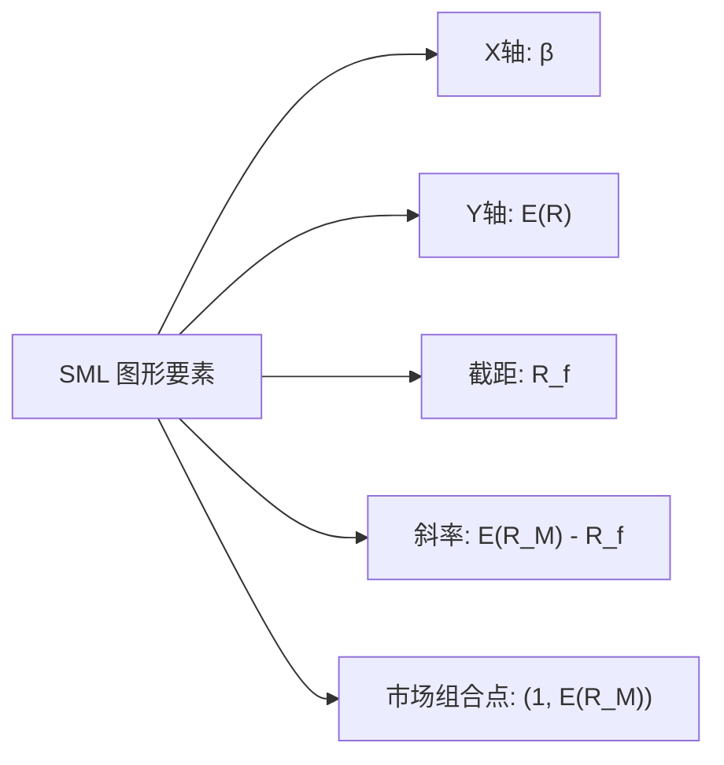
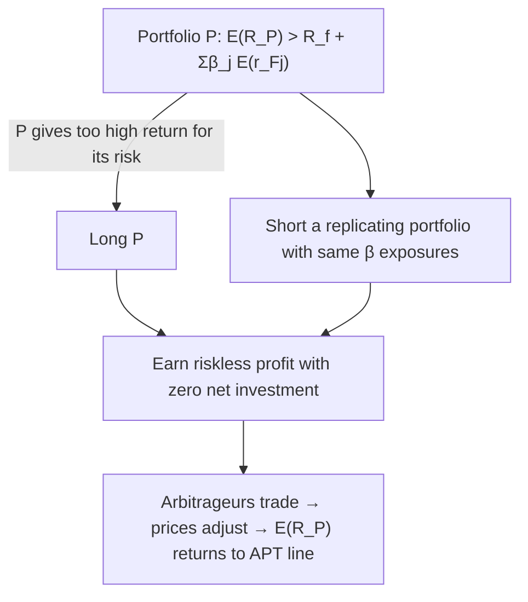
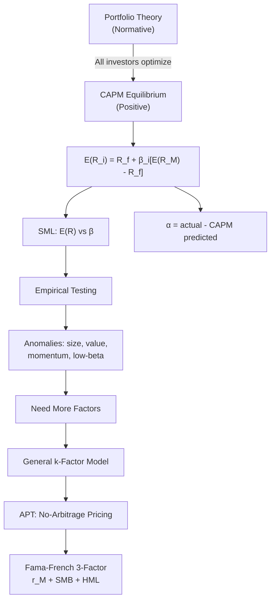

# Week 5-2: CAPM and Multifactor Models

> **FIN 522A Fixed Income | Lecture 10**
> 🎯 本讲核心：从 portfolio theory 出发推导 CAPM 均衡定价模型，理解 beta、SML、alpha 的含义，讨论 CAPM 的实证挑战，再引入 multifactor models 和 APT 作为替代框架，最终到 Fama-French 三因子模型

---

## 📑 Table of Contents 目录

1. [[#1. From Portfolio Choice to Asset Pricing 从组合选择到资产定价 ⭐⭐|From Portfolio Choice to Asset Pricing 从组合选择到资产定价]]
2. [[#2. CAPM Assumptions CAPM假设条件 ⭐⭐|CAPM Assumptions CAPM假设条件]]
3. [[#3. Market Portfolio and Equilibrium 市场组合与均衡 ⭐⭐⭐|Market Portfolio and Equilibrium 市场组合与均衡]]
4. [[#4. The CAPM Equation CAPM方程 ⭐⭐⭐|The CAPM Equation CAPM方程]]
5. [[#5. Security Market Line (SML) 证券市场线 ⭐⭐⭐|Security Market Line (SML) 证券市场线]]
6. [[#6. Alpha and Performance Evaluation Alpha与业绩评估 ⭐⭐|Alpha and Performance Evaluation Alpha与业绩评估]]
7. [[#7. Empirical Implementation 实证实施 ⭐⭐|Empirical Implementation 实证实施]]
8. [[#8. CAPM Assumptions in Practice CAPM假设的现实检验 ⭐⭐|CAPM Assumptions in Practice CAPM假设的现实检验]]
9. [[#9. Empirical Challenges to CAPM CAPM的实证挑战 ⭐⭐|Empirical Challenges to CAPM CAPM的实证挑战]]
10. [[#10. General Factor Models 一般因子模型 ⭐⭐|General Factor Models 一般因子模型]]
11. [[#11. Arbitrage Pricing Theory (APT) 套利定价理论 ⭐⭐⭐|Arbitrage Pricing Theory (APT) 套利定价理论]]
12. [[#12. Fama-French Three-Factor Model Fama-French三因子模型 ⭐⭐⭐|Fama-French Three-Factor Model Fama-French三因子模型]]

---

## 1. From Portfolio Choice to Asset Pricing 从组合选择到资产定价 ⭐⭐

### 1.1 The Big Question 核心问题的转变

在 [[Week 4-2 Portfolio Theory and Optimization|上一部分]]中，我们从 **individual investor** 的视角出发：给定 expected returns 和 covariances，如何选择最优组合？

现在问题翻转：**如果所有投资者都这样优化，均衡下资产价格（和 expected returns）会是什么？**

| Portfolio Theory                                                              | CAPM                                                                                                  |                      |
| ----------------------------------------------------------------------------- | ----------------------------------------------------------------------------------------------------- | -------------------- |
| 给定 $E(R)$, $\sigma$, $\rho$ → 求最优权重                                           | 假设所有人都做最优化 → 推导均衡下的 $E(R)$                                                                            |                      |
| 个体决策问题                                                                        | 市场均衡结果                                                                                                |                      |
| [[Week 4-2 Portfolio Theory and Optimization#4. Efficient Frontier 有效前沿 ⭐⭐⭐]] | [[Week 4-2 Portfolio Theory and Optimization#4. The Efficient Frontier 有效前沿 ⭐⭐⭐\|Efficient Frontier]] | Security Market Line |

> [!note] 关键转变
> Portfolio theory 是 **normative**（规范性的，告诉你应该怎么做）；CAPM 是 **positive**（实证性的，描述均衡下市场应该呈现什么样）。

---

## 2. CAPM Assumptions CAPM假设条件 ⭐⭐

CAPM（Capital Asset Pricing Model）由 Sharpe (1964)、Lintner (1965)、Mossin (1966) 独立提出。其核心假设：

### 2.1 Investor Assumptions 投资者假设

- **Mean-variance optimizers**：所有投资者都基于 [[Week 4-2 Portfolio Theory and Optimization#3. Minimum-Variance Frontier 最小方差前沿 ⭐⭐|mean-variance framework]] 做决策
- **Single-period horizon**：所有投资者有相同的投资期限
- **Homogeneous expectations**：所有投资者对 $E(R)$、$\sigma$、$\rho$ 的估计完全一致

### 2.2 Market Assumptions 市场假设

- **Perfect capital markets**：无交易成本、无信息成本
- **No taxes**：税率为零
- **No restrictions on short selling**：可以自由做空
- **Unlimited borrowing and lending at $R_f$**：可以按无风险利率自由借贷

> [!warning] 这些假设现实吗？
> 显然不现实！但这是 CAPM 作为 **均衡基准模型** 的起点。我们在 [[#8. CAPM Assumptions in Practice CAPM假设的现实检验 ⭐⭐|Section 8]] 中详细讨论放松这些假设的后果。

---

## 3. Market Portfolio and Equilibrium 市场组合与均衡 ⭐⭐⭐

### 3.1 All Investors Hold the Same Portfolio 所有人持有相同的风险组合

如果所有投资者有 **homogeneous expectations** 并且面对相同的 $R_f$，那么所有人会找到 **同一条 CAL**（[[Week 4-2 Portfolio Theory and Optimization#7. Capital Market Line (CML) 资本市场线 ⭐⭐⭐|Capital Market Line]]），也就是同一个 **tangency portfolio**。

在均衡中，这个 tangency portfolio 就是 **market portfolio $M$**：

$$\text{Market Portfolio} = \text{所有可投资资产按市值加权的组合}$$

> [!important] 核心推论
> - 每个投资者持有 **market portfolio** 的一部分（加上 risk-free asset）
> - 投资者之间的区别只在于 **capital allocation**（$y^*$ 的不同）
> - 这正是 [[Week 4-2 Portfolio Theory and Optimization#8. Separation Property 分离性质 ⭐⭐|separation property]] 的直接体现

### 3.2 Why Must Tangency = Market Portfolio? 为什么切点组合一定是市场组合？

市场出清条件（market clearing）：如果所有投资者都持有同一个风险组合，那这个组合里每个资产的权重一定等于该资产占总市值的比例。否则某些资产会出现供需不平衡。

---

## 4. The CAPM Equation CAPM方程 ⭐⭐⭐

### 4.1 Deriving the Risk-Return Relationship 推导风险-收益关系

考虑在 market portfolio 中增加少量资产 $X$ 的边际效应：

**Reward-to-risk ratio for asset $X$ in the market**:

$$\frac{\text{Marginal reward}}{\text{Marginal risk}} = \frac{E(R_X) - R_f}{\text{Cov}(R_X, R_M)}$$

> [!tip] 为什么分母是 Cov 不是 Var？
> 在一个已经充分分散化的组合中（即 market portfolio），增加一个资产对组合风险的边际贡献取决于它与组合的 **covariance**，而不是它自身的 variance。参见 [[Week 4-2 Portfolio Theory and Optimization#5. The Power of Diversification 分散化的力量 ⭐⭐|diversification]] 的逻辑。

### 4.2 Equilibrium Condition 均衡条件

在均衡中，所有资产的 **reward-to-risk ratio 必须相等**（否则有动力调整权重）。对于 market portfolio 自身：

$$\frac{E(R_M) - R_f}{\text{Cov}(R_M, R_M)} = \frac{E(R_M) - R_f}{\sigma_M^2}$$

这就是 **market price of risk**。

令所有资产的 reward-to-risk ratio 等于 market price of risk：

$$\frac{E(R_X) - R_f}{\text{Cov}(R_X, R_M)} = \frac{E(R_M) - R_f}{\sigma_M^2}$$

### 4.3 The CAPM Expected Return-Beta Relationship ⭐⭐⭐

整理上式得到 CAPM 的核心公式：

$$\boxed{E(R_X) = R_f + \beta_X \left[ E(R_M) - R_f \right]}$$

其中 **beta** 定义为：

$$\boxed{\beta_X = \frac{\text{Cov}(R_X, R_M)}{\sigma_M^2}}$$

### 4.4 Economic Interpretation of Beta Beta的经济含义

Beta 衡量的是资产对 **systematic risk**（市场风险）的敏感度：

| $\beta$ Value | Interpretation |
|--------------|---------------|
| $\beta = 1$ | 与市场同步波动（average systematic risk） |
| $\beta > 1$ | 比市场更敏感（aggressive） |
| $\beta < 1$ | 比市场不敏感（defensive） |
| $\beta = 0$ | 与市场无关（类似 risk-free） |
| $\beta < 0$ | 与市场反向（hedging asset，罕见） |

> [!important] CAPM 的核心洞见
> **只有 systematic risk（β）才获得风险溢价。** Firm-specific risk（$\sigma^2(e)$）不影响 expected return，因为投资者可以通过 [[Week 4-2 Portfolio Theory and Optimization#5. The Power of Diversification 分散化的力量 ⭐⭐|diversification]] 消除它。

---

## 5. Security Market Line (SML) 证券市场线 ⭐⭐⭐

### 5.1 SML Definition SML定义

SML 是 CAPM 的图形化表示，描述 **expected return** 与 **beta** 之间的线性关系：

$$E(R_i) = R_f + \beta_i \left[ E(R_M) - R_f \right]$$

### 5.2 SML vs CML 证券市场线 vs 资本市场线

这两条线经常被混淆，需要严格区分：

| Feature | CML | SML |
|---------|-----|-----|
| X-axis | Total risk $\sigma$ | Systematic risk $\beta$ |
| Applies to | **Efficient portfolios** only | **All assets** (个股 + 组合) |
| 来源 | [[Week 4-2 Portfolio Theory and Optimization#7. Capital Market Line (CML) 资本市场线 ⭐⭐⭐|Capital Allocation]] | CAPM equilibrium |
| 意义 | 最优组合的 risk-return trade-off | 所有资产的公平定价关系 |

> [!warning] 常见考点
> CML 上只有 efficient portfolios（$M$ 与 $R_f$ 的混合）；SML 上是所有资产和组合。个股不在 CML 上，但一定在 SML 上（如果 CAPM 成立）。

### 5.3 SML as a Benchmark SML作为基准

如果一个资产位于 SML **之上**，说明它的 actual expected return > CAPM-implied return → **underpriced**（值得买入）
如果一个资产位于 SML **之下**，说明它的 actual expected return < CAPM-implied return → **overpriced**（应该卖出）

---

## 6. Alpha and Performance Evaluation Alpha与业绩评估 ⭐⭐

### 6.1 Alpha Definition Alpha定义

**Alpha** 衡量实际 expected return 与 CAPM 预测之间的偏差：

$$\boxed{\alpha_X = E(R_X) - \left[ R_f + \beta_X (E(R_M) - R_f) \right]}$$

| Alpha | Meaning | Action |
|-------|---------|--------|
| $\alpha > 0$ | 超出 CAPM 预测的超额收益 | Buy (underpriced) |
| $\alpha = 0$ | 公平定价，在 SML 上 | Hold (fair) |
| $\alpha < 0$ | 低于 CAPM 预测 | Sell (overpriced) |

> [!tip] Alpha 与 Single-Index Model 的联系
> 这里的 alpha 定义与 [[Week 5-1 Single-Factor and Single-Index Models#7. Security Characteristic Line (SCL) 证券特征线 ⭐⭐⭐|SCL]] 中的 $\alpha_i$ 一致。在 CAPM 均衡中，所有资产的真实 alpha 应该为零。非零的 alpha 代表 **mispricing** 或者 **manager skill**。

### 6.2 Alpha in the Treynor-Black Framework

有了 alpha 的估计，就可以利用 [[Week 5-1 Single-Factor and Single-Index Models#11. Treynor-Black Model 特雷诺-布莱克模型 ⭐⭐⭐|Treynor-Black Model]] 构建 active portfolio，将 alpha 信号转化为投资决策。

---

## 7. Empirical Implementation 实证实施 ⭐⭐

### 7.1 Time Series Regression 时间序列回归

CAPM 的实证检验通过对 excess returns 做回归：

$$r_{X,t} = \alpha_X + \beta_X r_{M,t} + e_{X,t}$$

其中 $r_{X,t} = R_{X,t} - R_{f,t}$ 和 $r_{M,t} = R_{M,t} - R_{f,t}$ 是 excess returns。

- 如果 CAPM 成立：$\alpha_X = 0$（所有 expected excess return 都来自 $\beta$ exposure）
- 回归得到的 $\hat{\alpha}$、$\hat{\beta}$、$R^2$ 等估计量与 [[Week 5-1 Single-Factor and Single-Index Models#8. Estimation and Regression OLS回归估计 ⭐⭐|SIM 回归]] 完全一致

### 7.2 Testable Prediction 可检验的预测

CAPM 的核心可检验预测：

$$E(r_X) = \beta_X \cdot E(r_M) \quad \Leftrightarrow \quad \alpha_X = 0 \quad \forall X$$

即 **market beta 是唯一的定价因子**，所有资产的 alpha 应该统计上不显著。

---

## 8. CAPM Assumptions in Practice CAPM假设的现实检验 ⭐⭐

### 8.1 Homogeneous Expectations 同质预期

- **现实**：投资者对 $E(R)$、$\sigma$、$\rho$ 的估计不同
- **影响**：不同投资者可能持有不同的 "tangency portfolio"
- **缓解因素**：如果差异不是很大，CAPM 仍然近似成立

### 8.2 Short Selling Constraints 做空限制

- **现实**：做空受限、成本高
- **影响**：有效前沿被截断，某些被高估的资产无法被做空 → 可能保持 overpriced
- **后果**：市场可能不是 fully efficient

### 8.3 Taxes 税收

- **现实**：不同投资者面对不同税率；capital gains vs dividends 税率不同
- **影响**：产生 **clientele effects**（高税率投资者偏好 low-dividend 股票）
- **后果**：税后 SML 可能需要考虑 dividend yield 等因子

### 8.4 Borrowing Constraints 借贷限制

- **现实**：投资者不能按 $R_f$ 自由借入
- **影响**：CML 上 $M$ 右边的部分变平（levered portfolios 更昂贵）
- **后果**：实际有效前沿变成 **kinked**，可能导致 CAPM 的 beta-return 关系比理论更平

### 8.5 Market Portfolio Identification 市场组合识别

- **现实**：真正的 "market portfolio" 包含所有可投资资产（stocks、bonds、real estate、human capital、private equity...）
- **影响**：我们只能用 **proxy**（如 S&P 500、MSCI World）

> [!warning] Roll's Critique (1977)
> Roll 指出：CAPM 在逻辑上几乎不可检验，因为我们永远无法观测到真正的 market portfolio。所有对 CAPM 的实证"否定"可能只是因为用了错误的 market proxy。

---

## 9. Empirical Challenges to CAPM CAPM的实证挑战 ⭐⭐

### 9.1 When is CAPM Most Useful? CAPM何时最有用？

尽管 CAPM 有局限性，它仍然在以下场景非常有用：

- **Discount rate estimation**：估计项目或公司的 required rate of return
- **Benchmarking**：评估基金经理的 alpha
- **Cost of capital**：corporate finance 中估计 WACC

### 9.2 Empirical Anomalies 实证异象

大量实证研究发现了 CAPM 无法解释的 **anomalies**（patterns in average returns not captured by beta）：

| Anomaly | Description | Challenge to CAPM |
|---------|-------------|-------------------|
| **Size effect** | Small-cap 股票收益率系统性高于 large-cap | 小盘股 beta 不够高来解释其超额收益 |
| **Value effect** | High book-to-market 股票收益率高于 low B/M | Beta 无法解释 value vs growth 的收益差异 |
| **Momentum** | Past winners 继续跑赢，past losers 继续落后 | 短期收益的 persistence 与 beta 无关 |
| **Low-beta anomaly** | Low-beta 股票风险调整后收益 > high-beta 股票 | 实际的 beta-return 关系比 SML 更平坦 |

> [!important] 这些异象意味着什么？
> 两种解释：
> 1. **Risk-based**：beta 不是唯一的系统性风险来源，还有其他 priced risk factors（→ [[#10. General Factor Models 一般因子模型 ⭐⭐|multifactor models]]）
> 2. **Behavioral**：市场并非完全有效，投资者存在系统性偏差

---

## 10. General Factor Models 一般因子模型 ⭐⭐

### 10.1 From Single Factor to Multiple Factors 从单因子到多因子

[[Week 5-1 Single-Factor and Single-Index Models#3. Single-Factor Model 单因子模型 ⭐⭐⭐|Single-factor model]] 假设只有一个共同因子（market）驱动所有资产收益。但如果 [[#9. Empirical Challenges to CAPM CAPM的实证挑战 ⭐⭐|empirical anomalies]] 表明 beta 不够，我们需要更多因子。

### 10.2 General k-Factor Model 一般k因子模型

$$\boxed{R_i = E(R_i) + \beta_{i1} F_1 + \beta_{i2} F_2 + \cdots + \beta_{ik} F_k + e_i}$$

其中：
- $F_j$ = factor $j$ 的 **surprise**（realized - expected, 期望为零）
- $\beta_{ij}$ = 资产 $i$ 对 factor $j$ 的 **sensitivity (factor loading)**
- $e_i$ = firm-specific surprise（与所有因子不相关）

> [!note] 与 single-factor model 的关系
> 当 $k = 1$ 且 $F_1 = m$（market surprise），这就退化为 [[Week 5-1 Single-Factor and Single-Index Models#3. Single-Factor Model 单因子模型 ⭐⭐⭐|single-factor model]]。

### 10.3 Systematic vs Idiosyncratic Risk 系统性与特质风险

$$\text{Total Risk} = \underbrace{\beta_{i1}^2 \sigma_{F_1}^2 + \cdots + \beta_{ik}^2 \sigma_{F_k}^2}_{\text{Systematic (non-diversifiable)}} + \underbrace{\sigma^2(e_i)}_{\text{Idiosyncratic (diversifiable)}}$$

（假设因子之间不相关的简化版本）

多因子模型同样保持核心性质：
- 充分 [[Week 4-2 Portfolio Theory and Optimization#5. The Power of Diversification 分散化的力量 ⭐⭐|diversification]] 可以消除 $\sigma^2(e_i)$
- 只有 systematic risk 获得风险补偿

### 10.4 What Are the Factors? 因子是什么？

因子模型本身不告诉我们因子是什么。两种识别方法：

| Approach | Method | Example |
|----------|--------|---------|
| **Macroeconomic factors** | 使用宏观经济变量作为因子 | GDP growth, inflation, interest rate changes |
| **Factor portfolios** | 使用 long-short 组合的收益率作为因子 | SMB, HML, momentum portfolios |

---

## 11. Arbitrage Pricing Theory (APT) 套利定价理论 ⭐⭐⭐

### 11.1 Core Idea 核心思想

APT 由 Ross (1976) 提出，基于 **no-arbitrage** 原则推导出因子定价关系：

> 如果资产收益率由 factor model 决定，且不存在 arbitrage opportunities，则 expected returns 必须是 factor loadings 的线性函数。

### 11.2 APT Assumptions APT的假设

APT 的假设比 CAPM **少得多**：

1. 资产收益率服从 **factor structure**：$R_i = E(R_i) + \sum_j \beta_{ij} F_j + e_i$
2. 有 **足够多的资产**使得 diversification 可以消除 idiosyncratic risk
3. 市场不允许 **persistent arbitrage opportunities**

> [!tip] 注意 APT 不需要什么！
> - ❌ 不需要假设投资者是 mean-variance optimizers
> - ❌ 不需要假设存在 market portfolio
> - ❌ 不需要 homogeneous expectations
> - 只需要 no-arbitrage（这是一个非常弱的假设）

### 11.3 APT Pricing Relation APT定价关系

对于一个 **well-diversified portfolio**（idiosyncratic risk ≈ 0）：

$$\boxed{E(R_i) = R_f + \beta_{i1} E(r_{F_1}) + \beta_{i2} E(r_{F_2}) + \cdots + \beta_{ik} E(r_{F_k})}$$

其中 $E(r_{F_j})$ 是 factor $j$ 的 **risk premium**。

### 11.4 APT Arbitrage Logic 套利逻辑

如果某个 well-diversified portfolio 的 expected return 偏离了上述等式：

### 11.5 CAPM vs APT Comparison CAPM与APT对比

| Feature | CAPM | APT |
|---------|------|-----|
| **Foundation** | Mean-variance optimization + equilibrium | No-arbitrage |
| **Number of factors** | 1 (market) | $k$（不指定） |
| **Market portfolio** | Required（但 [[#8. CAPM Assumptions in Practice CAPM假设的现实检验 ⭐⭐|难以观测]]） | Not required |
| **Applies to** | All assets（理论上） | Well-diversified portfolios（严格来说） |
| **Assumptions** | Strong（many） | Weak（few） |
| **Weakness** | Roll's Critique | 不告诉你因子是什么 |

> [!important] 互补关系
> CAPM 和 APT 不是互相排斥的。CAPM 可以看作是 APT 的一个 **特殊情形**：当只有一个因子且该因子是 market portfolio 时，APT 就退化为 CAPM。

---

## 12. Fama-French Three-Factor Model Fama-French三因子模型 ⭐⭐⭐

### 12.1 Motivation 动机

[[#9. Empirical Challenges to CAPM CAPM的实证挑战 ⭐⭐|Empirical anomalies]]（尤其是 size effect 和 value effect）促使 Fama and French (1993) 提出三因子模型。

### 12.2 The Model 模型

$$\boxed{r_i = \alpha_i + \beta_{iM} r_M + \beta_{iS} \, r_{\text{SMB}} + \beta_{iV} \, r_{\text{HML}} + \varepsilon_i}$$

| Factor | Construction | Captures |
|--------|-------------|----------|
| $r_M$ | Market excess return = $R_M - R_f$ | Market risk (same as CAPM) |
| $r_{\text{SMB}}$ | **Small Minus Big**: small-cap 组合收益 $-$ large-cap 组合收益 | Size effect |
| $r_{\text{HML}}$ | **High Minus Low**: high book-to-market 组合收益 $-$ low B/M 组合收益 | Value effect |

### 12.3 Interpretation of Factor Premiums 因子溢价的解释

**Risk-based interpretation（风险解释）：**
- SMB premium：小公司面临更高的 distress risk、liquidity risk
- HML premium：high B/M（value）公司通常是 financially distressed，在经济衰退中表现更差

**Behavioral interpretation（行为解释）：**
- 投资者系统性地高估 growth stocks（glamour stocks）、低估 value stocks
- Size premium 反映投资者对小盘股关注不够（neglect effect）

### 12.4 How Well Does It Work? 效果如何？

Fama-French 三因子模型比 CAPM 更好地解释了 cross-sectional return variation：

- 可以解释大部分 **size** 和 **value** anomalies
- 但仍然无法解释 **momentum**（→ 后来 Carhart (1997) 加入第四个因子 UMD）
- 三因子模型中如果 $\alpha_i = 0$，说明资产的 expected return 完全由三个因子的 exposure 决定

### 12.5 From APT to Empirical Factor Models 从APT到实证因子模型

$$E(r_i) = \beta_{iM} E(r_M) + \beta_{iS} E(r_{\text{SMB}}) + \beta_{iV} E(r_{\text{HML}})$$

这就是 [[#11. Arbitrage Pricing Theory (APT) 套利定价理论 ⭐⭐⭐|APT]] 的具体化：三个 factor portfolios（market, SMB, HML）的 risk premiums 乘以各自的 factor loadings，就得到了 expected excess return。

> [!example] 应用举例
> 假设某股票 $\beta_M = 1.2$、$\beta_S = 0.5$、$\beta_V = 0.3$
> 市场超额收益 $E(r_M) = 7\%$，$E(r_{\text{SMB}}) = 3\%$，$E(r_{\text{HML}}) = 4\%$
>
> $$E(r_i) = 1.2 \times 7\% + 0.5 \times 3\% + 0.3 \times 4\% = 8.4\% + 1.5\% + 1.2\% = 11.1\%$$
>
> 对比 CAPM：$E(r_i) = 1.2 \times 7\% = 8.4\%$
> 三因子模型多给出了 2.7% 的 expected return，来自 size 和 value exposure。

---

## Summary 本讲总结

**必须记住的公式：**
1. $E(R_X) = R_f + \beta_X [E(R_M) - R_f]$ — CAPM equation
2. $\beta_X = \text{Cov}(R_X, R_M) / \sigma_M^2$ — Beta definition
3. $\alpha_X = E(R_X) - [R_f + \beta_X(E(R_M) - R_f)]$ — Alpha (mispricing)
4. $R_i = E(R_i) + \sum_j \beta_{ij} F_j + e_i$ — General factor model
5. $E(R_i) = R_f + \sum_j \beta_{ij} E(r_{F_j})$ — APT pricing relation
6. $r_i = \alpha_i + \beta_{iM} r_M + \beta_{iS} r_{\text{SMB}} + \beta_{iV} r_{\text{HML}} + \varepsilon_i$ — Fama-French 3-factor model

---

**Related Notes:** [[Week 1-1 Bond Pricing and Yield Fundamentals]] | [[Week 1-2 Duration, Convexity and Interest Rate Risk]] | [[Week 2-1 Embedded Options Effective Duration and MBS]] | [[Week 2-2 Credit Risk and Credit Analysis]] | [[Week 3 Portfolio Credit Risk and CreditMetrics]] | [[Week 4-1 Risk and Return]] | [[Week 4-2 Portfolio Theory and Optimization]] | [[Week 5-1 Single-Factor and Single-Index Models]]