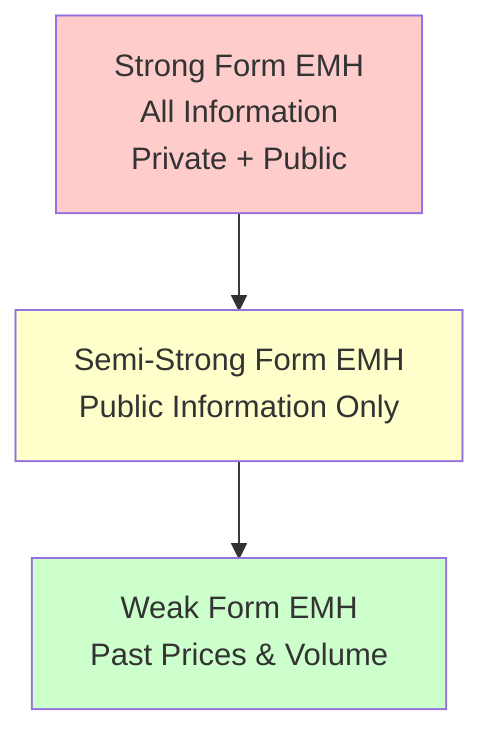
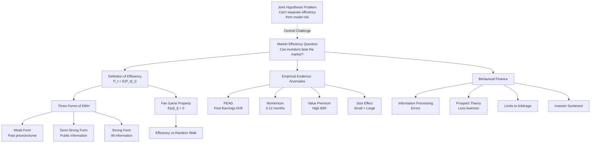

# Week 6-1: EMH and Behavioral Finance

> **FIN 522A Fixed Income | Lecture 11**
> 🎯 本讲核心：市场是否有效定价所有可用信息？无处不在的市场异象和行为偏差如何挑战传统金融理论？

---

## 📑 Table of Contents 目录

1. [[#1. The Market Efficiency Question|1. The Market Efficiency Question 市场效率问题]]
2. [[#2. Definition of Market Efficiency|2. Definition of Market Efficiency 有效市场假说的定义]]
3. [[#3. Fair Game Property|3. Fair Game Property 公平博弈性质]]
4. [[#4. Information, Incentives, and Limits|4. Information, Incentives, and Limits 信息、激励与效率边界]]
5. [[#5. Three Forms of Market Efficiency|5. Three Forms of Market Efficiency 三种形式]]
6. [[#6. Weak-Form Efficiency Tests|6. Weak-Form Efficiency Tests 弱式有效检验]]
7. [[#7. Semi-Strong Form Efficiency|7. Semi-Strong Form Efficiency 半强式有效与事件研究]]
8. [[#8. Strong-Form Efficiency|8. Strong-Form Efficiency 强式有效]]
9. [[#9. Joint Hypothesis Problem|9. Joint Hypothesis Problem 联合假说问题]]
10. [[#10. Market Anomalies|10. Market Anomalies 市场异象]]
11. [[#11. Behavioral Finance Foundations|11. Behavioral Finance Foundations 行为金融基础]]
12. [[#12. Prospect Theory|12. Prospect Theory 前景理论]]
13. [[#13. Limits to Arbitrage|13. Limits to Arbitrage 套利限制]]
14. [[#14. Investor Sentiment|14. Investor Sentiment 投资者情绪]]
15. [[#Summary|Summary 本讲总结]]

---

## 1. The Market Efficiency Question ⭐⭐

市场效率的核心问题围绕两个紧密相关的命题：

**1.1 The Two Central Questions**

- **Can investors systematically beat the market?** 投资者能否系统地战胜市场？
  - Beyond random luck, can an investor achieve persistent abnormal returns?
  - This is ultimately an economic question about profit opportunities

- **Do security prices fully reflect available information?** 证券价格是否充分反映可用信息？
  - If yes → prices are "right" → no unexploited profit opportunities
  - If no → inefficiencies exist → skilled investors can exploit them

These questions are linked: if prices reflect all available information, then future price changes must be unpredictable using that information, leaving no systematic trading opportunities.

**1.2 Connection to Previous Concepts**

See [[Week 5-2 CAPM and Multifactor Models]] for the concept of alpha (α). Market efficiency implies that alpha should be zero for all securities in equilibrium, since any predictable outperformance would be immediately arbitraged away.

---

## 2. Definition of Market Efficiency ⭐⭐⭐

**2.1 The Fundamental Definition**

A market is efficient relative to an information set $I_t$ if:

$$P_t = E(P_t | I_t)$$

In words: **the current price equals the expected value of the security given all information available at time t**.

The critical phrase is "relative to an information set." Efficiency is not absolute — it's always defined with respect to a specific set of information that investors can access and process.

**2.2 The Logic of Competition and Equilibrium**

The theoretical foundation for market efficiency:

1. **Many analysts compete** to find mispriced securities
2. **Each analyst processes information** independently
3. **When mispricing discovered** → quick trades exploit it
4. **Prices adjust rapidly** to new information
5. **Result: prices become "just right"** — reflecting consensus expectations
6. **Equilibrium:** No easy profit opportunities remain

> [!tip]
> Market efficiency is an EQUILIBRIUM STATEMENT. It emerges from competition and incentives, not from the assumption that all investors are rational or have perfect information. It says prices are "efficient enough" that systematic exploitation is difficult.

**2.3 Key Insight: Relative vs. Absolute Efficiency**

We never test absolute efficiency. We test efficiency relative to a specific information set:
- Weak form: past prices/volume only
- Semi-strong: publicly available information
- Strong form: all information including private data

Each form is increasingly restrictive and harder to achieve.

---

## 3. Fair Game Property ⭐⭐⭐

**3.1 EMH and Abnormal Returns**

Market efficiency requires that abnormal returns (alpha) have zero expected value:

$$E(\alpha_{i,t+1} | I_t) = 0$$

Where:
- $\alpha_{i,t+1}$ = realized abnormal return for security $i$ in period $t+1$
- $I_t$ = information set available at time $t$
- Expectation is **conditional** on $I_t$ — given all available information

This is called a **FAIR GAME** property. Under EMH, no one can systematically exploit information to earn positive expected alpha.

**3.2 Fair Game vs. Random Walk**

This is a crucial distinction often confused:

| Property | Fair Game (EMH) | Random Walk |
|----------|-----------------|------------|
| Definition | $E(\alpha_{t+1} \| I_t) = 0$ | $R_t = \mu + \epsilon_t$ where $\epsilon_t$ iid |
| Requires | Unpredictable abnormal returns | Independent, identically distributed returns |
| Relationship | NECESSARY for EMH | SUFFICIENT for EMH (but not necessary) |
| Example of difference | Returns can have conditional heteroskedasticity; volatility clusters | Pure random walk rules this out |

> [!warning]
> A random walk is SUFFICIENT but NOT NECESSARY for market efficiency. A market can be efficient with time-varying volatility, autocorrelated returns, or other patterns, AS LONG AS these patterns don't generate exploitable abnormal returns.

**3.3 Practical Implication**

If markets are efficient (fair game):
- You cannot beat the market using information available today
- But markets can still exhibit patterns (momentum, seasonality, volatility clusters)
- These patterns must not be exploitable for profit after transaction costs

---

## 4. Information, Incentives, and Limits ⭐⭐

**4.1 Regulatory Framework: Reg FD and MNPI**

- **Regulation Fair Disclosure (Reg FD)**: Companies must disclose material information to all investors simultaneously
  - Prevents selective disclosure to favored analysts
  - Ensures information reaches everyone at once

- **Material Non-Public Information (MNPI)**: Information that would affect stock price if public
  - Trading on MNPI is **illegal insider trading**
  - Enforced by SEC
  - Creates boundary: some information legally unavailable to trade on

**4.2 Grossman-Stiglitz Paradox** ⭐⭐⭐

A fundamental insight about the limits of perfect efficiency:

> If markets were perfectly efficient, no one would spend resources to gather and analyze information, because prices already reflect everything. But if no one gathers information, prices can't be efficient. Therefore, markets must be "efficient enough" that some inefficiencies persist to justify information-gathering costs.

**The Paradox Resolution:**
- Perfect efficiency is impossible in equilibrium
- Markets converge to "efficient enough" — an equilibrium level of inefficiency
- This inefficiency is just enough to reward information gathering activity
- Link: See [[Week 5-1 Single-Factor and Single-Index Models]] (Treynor-Black model) — assumes some analysts find positive alpha to justify their research effort

**4.3 Implications**

The Grossman-Stiglitz paradox suggests:
- Not all investors are equally skilled
- Information differences persist in equilibrium
- Superior analysis DOES exist but is rare and rewards hard work
- This is the world of active management — fighting against but not perfectly offset by efficiency

---

## 5. Three Forms of Market Efficiency ⭐⭐⭐

**5.1 The Nested Structure**



Strong-form efficiency IMPLIES semi-strong efficiency, which implies weak-form efficiency. The reverse is not true.

**5.2 Weak-Form Efficiency** ⭐⭐

**Definition:** Information set $I_t$ = {all past prices, trading volumes, and returns}

$$I_t = \{P_1, P_2, \ldots, P_{t-1}, V_1, V_2, \ldots, V_{t-1}, R_1, R_2, \ldots, R_{t-1}\}$$

**Implication:** You cannot profit using only historical price/volume data. Technical analysis cannot beat the market.

**Testable prediction:** Past returns should be unpredictable from past returns:

$$E(R_{t+1} | R_t, R_{t-1}, \ldots) = \bar{R}$$

Returns have no serial correlation exploitable for trading.

**5.3 Semi-Strong Form Efficiency** ⭐⭐

**Definition:** Information set $I_t$ = {all publicly available information}

$$I_t = \{\text{past prices/volumes, financial statements, analyst reports, news, macroeconomic data, \ldots}\}$$

**Implication:** You cannot profit using public information (fundamental analysis). When news is released, prices adjust immediately.

**Testable prediction:** In event studies, abnormal returns should appear only during/immediately after the news announcement, then flatten.

**5.4 Strong-Form Efficiency** ⭐⭐

**Definition:** Information set $I_t$ = {ALL information, including material non-public information}

$$I_t = \{\text{all public information} \cup \text{all private/insider information}\}$$

**Implication:** Even insiders cannot profit. Even those with illegal access to material non-public information cannot earn abnormal returns.

**Reality:** Strong-form efficiency is **clearly violated**. Corporate insiders DO earn abnormal returns.

**Evidence:** SEC enforcement cases, academic studies of insider trading profits — all show insiders outperform.

---

## 6. Weak-Form Efficiency Tests ⭐⭐

**6.1 Serial Correlation Tests**

The simplest test: are past returns correlated with future returns?

**Test statistic:**
$$\rho(k) = \text{Corr}(R_t, R_{t-k})$$

For lag $k$ (e.g., $k=1$ for one-month returns, $k=5$ for one-week returns).

**Weak-form hypothesis:** $\rho(k) = 0$ for all $k > 0$

**Evidence:**
- **Daily returns:** Near-zero autocorrelation (supports weak form)
- **Weekly/monthly returns:** Small positive autocorrelation (1-2%), but not economically meaningful after trading costs
- **Result:** Weak-form efficiency **weakly supported**

**6.2 Technical Analysis and Trading Strategies**

Technical analysts claim to find patterns:
- Moving averages
- Relative strength index (RSI)
- Support/resistance levels
- Momentum trading

**Momentum Effect (3-12 months horizon):**
- Past winners continue to outperform (positive autocorrelation)
- See [[Week 5-2 CAPM and Multifactor Models]] for Carhart momentum factor
- Not easily explained as risk premium
- One of the most robust anomalies

**Long-Horizon Reversals (3-5 years):**
- Multi-year losers eventually become winners
- Multi-year winners eventually underperform
- Suggests price "overshooting" and mean reversion

**6.3 Filter Rules and Performance After Costs**

Evidence on simple trading rules:
- Moving average crossovers, momentum filters, breakout strategies
- **Before transaction costs:** modest outperformance documented
- **After transaction costs:** typically underperform buy-and-hold
- **Conclusion:** Transaction costs eliminate exploitable patterns → **weak form NOT clearly violated**

> [!example]
> A classic study found that moving average trading rules beat the market by ~1-2% annually before costs, but underperformed after including realistic trading costs (~0.3-0.5% per trade). This supports weak-form efficiency in practice.

---

## 7. Semi-Strong Form Efficiency ⭐⭐⭐

**7.1 Event Study Methodology**

The primary tool for testing semi-strong efficiency is the **event study**.

**Step 1: Define the event** (e.g., earnings announcement, merger, bankruptcy filing)

**Step 2: Calculate abnormal returns**
$$\text{AR}_t = R_t - E(R_t)$$

Where $E(R_t)$ comes from a model. Common models:
- **Market model:** $E(R_t) = \alpha + \beta R_{m,t}$ (estimated pre-event)
- **CAPM:** $E(R_t) = r_f + \beta(r_m - r_f)$ (see [[Week 5-2 CAPM and Multifactor Models]])
- **Fama-French:** $E(R_t) = r_f + \beta_m(r_m - r_f) + \beta_{smb} \cdot \text{SMB} + \beta_{hml} \cdot \text{HML}$

**Step 3: Cumulative abnormal returns**
$$\text{CAR}(\tau_1, \tau_2) = \sum_{t=\tau_1}^{\tau_2} \text{AR}_t$$

Sum abnormal returns over a window (e.g., day -1 to day +10 around announcement).

**Step 4: Test for significance**

Is the CAR statistically different from zero? Standard t-test.

**7.2 Semi-Strong Prediction**

If semi-strong efficient:
- Price adjustment happens **at the moment of announcement**
- CAR is **flat before announcement** (no drift)
- CAR **spikes at/immediately after** announcement
- CAR is **flat afterward** (no post-event drift)

Visual pattern: CAR looks like a step function with vertical jump at $t=0$.

**7.3 Post-Earnings Announcement Drift (PEAD)** ⭐⭐

One of the most robust and persistent market anomalies:

**Finding:** After earnings surprise (positive or negative), the stock continues to drift in the direction of the surprise for 2-8 weeks.

**Example:**
- Positive earnings surprise on day 0
- Stock jumps +2% on day 0 (expected, semi-strong efficiency)
- Stock continues to drift upward +0.5% per week for next 4 weeks (NOT expected under semi-strong efficiency)
- CAR is NOT flat after the event — it drifts

**Interpretation:**
- **Market inefficiency?** Investors are slow to incorporate full implications of surprise
- **Risk factor?** Could be a risk premium (though hard to justify theoretically)
- **Behavioral explanation:** Underreaction to news due to attention constraints or anchoring

> [!warning]
> PEAD is one of the most reliable findings in finance. It has been documented across different markets, time periods, and earnings metrics. Its persistence suggests **genuine market inefficiency** or a missing risk model.

**7.4 Other Anomalies Detected via Event Studies**

- **Merger announcements:** Target stocks jump, but merger likelihood matters (merger arbitrage)
- **Dividend changes:** Announcements of dividend increases lead to small positive drifts
- **Share repurchases:** Repurchased shares often outperform post-announcement
- **Analyst upgrades/downgrades:** Prices drift in direction of change for weeks

**7.5 Size Effect and January Effect**

- **Size effect:** Small-cap stocks outperform large-cap (5-15% annualized)
  - Less pronounced in recent decades
  - Could be risk premium or selection bias

- **January effect:** Outperformance is concentrated in January
  - Tax-loss harvesting reversal explanation
  - Weakened after being documented (self-correcting anomaly?)

---

## 8. Strong-Form Efficiency ⭐⭐

**8.1 Definition and Reality**

Strong-form efficiency says: even those with inside information (MNPI) cannot consistently earn abnormal returns.

**Empirical reality: DEFINITIVELY VIOLATED**

Evidence:
- Corporate officers and directors earn abnormal returns from trades before news becomes public
- Insider trading prosecutions document massive abnormal returns (50-100%+)
- Academic studies find insiders outperform by 5-20% annually
- This is precisely why insider trading is illegal

**Conclusion:** Strong-form efficiency is **clearly wrong**. There are profit opportunities in inside information.

**8.2 Active Management Implications**

If markets are semi-strong efficient (but not strong-form):

**Before transaction costs:**
- Active management is a zero-sum game
- Aggregate outperformance = zero (winners offset losers)
- Some managers beat the market, but only on average

**After transaction costs:**
- Active management becomes **negative-sum game**
- Average manager underperforms passive alternatives
- Higher fees + higher turnover = drag on returns

**Empirical evidence on mutual funds:**
- Most funds underperform benchmark indices
- Alphas cluster around zero
- Slight persistence in performance (next-year correlations ~0.3-0.4), but mostly noise
- One-year winners are not reliably next-year winners

> [!tip]
> As Fama once summarized: "On average, the dollar invested in active management would have earned higher returns from a passive strategy." This follows directly from semi-strong efficiency + trading costs.

**8.3 Who Can Beat the Market?**

- **Insiders:** Yes (but illegally)
- **Exceptional analysts:** Possibly, but rare and hard to identify beforehand
- **Professional managers:** On average, no
- **Individual investors:** Very unlikely, especially small traders with high costs

Link back to [[Week 5-1 Single-Factor and Single-Index Models]] Treynor-Black model: assumes SOME managers find alpha, but most do not. The model is essentially asking: how much should you allocate to that rare superior manager versus index funds?

---

## 9. Joint Hypothesis Problem ⭐⭐⭐

**9.1 The Fundamental Difficulty**

Any empirical test of market efficiency SIMULTANEOUSLY tests two hypotheses:

1. **Market efficiency:** Prices reflect all available information
2. **Asset pricing model:** Our model of expected returns is correct

$$\text{Observed Return} = \text{Expected Return (from model)} + \text{Abnormal Return}$$

If we find abnormal returns (unexplained returns), it could be because:
- **(A) The market is inefficient** — prices don't reflect available information
- **(B) Our model is wrong** — our expected return model is missing factors or mispriced

We cannot distinguish between these possibilities with certainty.

**9.2 Examples of Ambiguity**

| Anomaly | Interpretation A | Interpretation B |
|---------|------------------|------------------|
| Size effect (small > large) | Market inefficiency; small stocks mispriced | Missing risk factor; small stocks are riskier (Fama-French SMB) |
| Value effect (high B/M > low B/M) | Value stocks underpriced; growth overpriced | Value stocks are riskier (Fama-French HML); deserve higher return |
| Momentum (winners keep winning) | Underreaction to news; mispricing | Missing momentum risk factor (Carhart) |
| PEAD (post-earnings drift) | Slow information processing | Omitted variable; our model misses key risk |

**9.3 Fama-French and The Resolution Attempt**

Fama and French proposed that many "anomalies" are actually **risk factors**:

$$R_i - r_f = \alpha + \beta_{m}(R_m - r_f) + \beta_{smb} \cdot \text{SMB} + \beta_{hml} \cdot \text{HML} + \epsilon$$

- **SMB (Small Minus Big):** Return of small-cap minus large-cap
- **HML (High Minus Low):** Return of high B/M minus low B/M

See [[Week 5-2 CAPM and Multifactor Models]] for detailed discussion.

**If these are risk factors:**
- No anomaly → markets are efficient
- High SMB beta → must earn SMB premium
- High HML beta → must earn HML premium

**But skeptics argue:**
- How do we KNOW these are risk factors vs. anomalies?
- This is circular: we define anomalies as risk factors to restore efficiency
- Other anomalies not explained by 3-factor model (momentum, PEAD)

**9.4 The Philosophical Problem**

> [!warning]
> The joint hypothesis problem means we can NEVER definitively prove or disprove market efficiency. Any "evidence against efficiency" can be reinterpreted as evidence of a missing risk factor. Any "evidence of risk factors" could be evidence of anomalies. The debate is somewhat unfalsifiable — hence ongoing 50+ year disagreement among academics.

**Practical implication:** Instead of asking "Are markets efficient?" ask narrower questions:
- Can I beat the market after costs?
- Are there identifiable trading strategies with consistent positive alpha?
- Do prices adjust to news quickly or slowly?

---

## 10. Market Anomalies ⭐⭐

**10.1 Momentum Anomaly**

**Definition:** Assets that outperformed in past 3-12 months continue to outperform in the near term (next 1-6 months).

**Magnitude:** 5-10% annualized outperformance (past winners vs. past losers)

**Connection:** See [[Week 5-2 CAPM and Multifactor Models]] for Carhart momentum factor

**Explanations:**
- Underreaction: investors slowly incorporate momentum information
- Positive feedback: as winners appreciate, more investors chase them
- Risk: momentum might be a systematic risk factor (Carhart)
- Behavioral: extrapolation bias and representativeness heuristic

**Practical challenge:** Momentum strategy requires frequent rebalancing → high transaction costs → hard to profit after costs for small investors

**10.2 Value Anomaly (High Book-to-Market Premium)**

**Definition:** High B/M stocks (value) outperform low B/M stocks (growth) over long horizons.

**Magnitude:** 4-7% annualized outperformance (1926-2023)

**Components:**
- Small-cap value premium strongest
- Large-cap value premium weaker
- International evidence mixed but generally supports value effect

**Risk vs. Mispricing debate:**
- **Risk interpretation:** Value stocks are riskier → deserved higher returns
- **Mispricing interpretation:** Growth stocks overvalued; value stocks undervalued
- **Evidence for mispricing:** Value premium larger for stocks with high uncertainty (hard to value)

**Link to multifactor models:** [[Week 5-2 CAPM and Multifactor Models]] — HML (High Minus Low) is the value factor

**10.3 Size Effect**

**Definition:** Small-cap stocks outperform large-cap stocks.

**Magnitude:** 3-5% annualized (highly variable across periods)

**Weakening over time:**
- Strong through 1980s
- Much weaker since 2000
- Possibly due to: (1) increased market efficiency, (2) survivorship bias in old data, (3) shift to growth investing reducing small-cap demand

**Explanations:**
- Risk: small stocks are riskier (less liquid, more bankruptcy risk)
- Liquidity: small stocks have wider bid-ask spreads, harder to trade
- Arbitrage limits: small stocks harder to short, limited analyst coverage
- Behavioral: neglected stocks, attention effects

**10.4 Post-Earnings Announcement Drift (PEAD)** — Expanded ⭐⭐

Detailed in [[#7.3 Post-Earnings Announcement Drift|Section 7.3]].

**Key empirical fact:** Earnings surprises lead to multi-week drift.

**Magnitude:** Average drift ~0.3-0.5% per week following surprise (30-50% annualized for a month)

**Transaction costs:** At such frequency, costs likely exceed gross returns for most investors

**Behavioral explanations:**
- Limited attention: Investors don't process implications immediately
- Anchoring: Initial reaction anchors beliefs; adjustment is gradual
- Representativeness: Recent good earnings → assume good future earnings (extrapolation)

**10.5 Long-Horizon Reversals**

**Definition:** Stocks that significantly underperform for 3-5 years eventually reverse and become winners.

**Evidence:** De Bondt and Thaler (1985) found ~30% reversal in 3-5 year holding periods

**Mechanism:** Price overshooting and mean reversion
- Negative shock → stock falls too far
- Market eventually recognizes fundamental value
- Stock recovers

**Conflict with momentum:** Creates interesting dichotomy:
- **3-12 month horizon:** Momentum (winners keep winning)
- **1-3 year horizon:** Mixed / no clear pattern
- **3-5+ year horizon:** Reversal (winners become losers)

**Interpretation:** Suggests behavioral overreaction to short-term news with eventual correction

**10.6 Data Mining and Anomaly Concerns**

**Publication bias:** Researchers publish findings of anomalies, not null results

**Multiple testing problem:** If you test 1,000 strategies, some will outperform by chance

**Out-of-sample evidence:** Anomalies weaken once documented and widely known

**Practical caution:** "Anomaly" doesn't necessarily mean exploitable trading opportunity
- Must account for trading costs
- Must be able to implement at large scale
- Must consider whether effect persists after discovery

---

## 11. Behavioral Finance Foundations ⭐⭐⭐

**11.1 Information Processing Errors**

Deviation from rational Bayesian information processing:

**Limited Attention and Processing Capacity**
- Investors can't monitor all securities
- Focus on subset of stocks → miss information on others
- Result: **UNDERREACTION** to news on neglected stocks
- Evidence: PEAD (section 7.3), stock-market anomalies for small stocks

**Overconfidence**
- Investors overestimate their ability to predict
- Overestimate precision of their information
- Result: **OVERTRADING** and **OVERREACTION**
- Evidence: Day traders significantly underperform

**Conservatism Bias**
- Investors are slow to update beliefs (violate Bayes' rule)
- Cling to prior beliefs despite new evidence
- Result: **UNDERREACTION** to surprising information
- Example: Earnings surprises take weeks to be fully reflected (PEAD)

**Confirmation Bias**
- Seek information confirming prior beliefs
- Avoid disconfirming information
- Result: Entrenched positions, slower price adjustment
- Underreaction to contrary news

**Extrapolation and Representativeness Heuristic**
- Project recent trends too far into future
- Overweight recent data (recency bias)
- Use past performance as if it will continue
- Result: Growth stocks overvalued during growth periods; value stocks overvalued in value periods

> [!example]
> Tech bubble (1999-2000): Investors extrapolated high growth rates indefinitely, pushing valuations to 80+ P/E ratios for marginally profitable companies. When realized that growth couldn't continue forever, crash followed. The representativeness heuristic made recent success look "typical" for the future.

**11.2 Behavioral Biases in Decision-Making**

**Framing Effects**
- Decision outcome depends on how choices are presented
- Same objective outcomes → different choices depending on frame
- Example: 90% survival vs. 10% mortality → different risk preferences

**Mental Accounting**
- Treat money differently depending on source or purpose
- "House money effect": newly won money spent more freely
- "Earned vs. gift" distinction
- Result: Different investment decisions for different account types even though economically identical

**Regret Avoidance and Disposition Effect**
- Investors feel regret differently for losses vs. missed gains
- Selling loser = realizing loss = regret intensified
- Holding loser = deferring realization of regret
- Result: **DISPOSITION EFFECT** — sell winners too early, hold losers too long
- Evidence: Strong empirical support; violates rational stop-loss rules

**Loss Aversion**
- Losses hurt more than equivalent gains feel good
- Manifests in disposition effect and risk-taking behavior
- Related to reference point: gains vs. losses relative to starting wealth, not absolute wealth

---

## 12. Prospect Theory ⭐⭐⭐

**12.1 Key Innovation: Reference Points**

Classic expected utility theory assumes:
- Utility function defined over **final wealth**
- People are inherently risk-averse (concave utility)

**Kahneman & Tversky's insight:** People evaluate prospects relative to a **REFERENCE POINT**

- Not absolute wealth, but **changes in wealth**
- Gain: money above reference point
- Loss: money below reference point
- Reference point is often: current wealth, aspiration level, or recent price

**12.2 Value Function Properties**

The prospect theory **value function** $v(x)$ has distinctive shape:

```
         v(x)
           |
           |     Gains (concave: risk-averse)
         / |
        /  |
       /   |------- x = 0 (reference point)
      |    \
      |     \
      |      \     Losses (convex: risk-seeking)
      |       \
```

**Concave for gains:** $v''(x) < 0$ for $x > 0$
- Utility increases at decreasing rate
- Diminishing marginal utility
- Risk-averse in gains domain
- Prefer sure gain to gamble with equal expected value

**Convex for losses:** $v''(x) > 0$ for $x < 0$
- Disutility increases at decreasing rate
- Diminishing marginal disutility
- Risk-seeking in losses domain
- Prefer gamble to sure loss with equal expected value

**Loss Aversion:** The function is **steeper for losses than gains**
- $|v(-\Delta)| > v(\Delta)$ for equal magnitude changes
- Losses hurt ~2 times as much as equivalent gains feel good
- This asymmetry drives many behavioral effects

**12.3 Formal Representation**

$$v(x) = \begin{cases} x^\alpha & \text{if } x \geq 0 \\ -\lambda(-x)^\beta & \text{if } x < 0 \end{cases}$$

Where:
- $\alpha, \beta \approx 0.88$ (less concave/convex than expected utility)
- $\lambda \approx 2.25$ (loss aversion parameter — losses weighted 2.25x vs. gains)

**12.4 Disposition Effect**

**Definition:** Investors preferentially realize gains (sell winners) and hold losses (refuse to realize losing positions).

**Mechanism through prospect theory:**
1. Stock purchased at $P_0$ — reference point established
2. Stock appreciates to $P_1$ → gain → loss-averse → want to realize gain → **SELL**
3. Stock depreciates to $P_1 < P_0$ → loss → risk-seeking in loss domain → hope for recovery → **HOLD**

**Evidence:**
- Mutual funds: realized gains → ~50% of position
- Realized losses → ~30% of position
- Time horizon: longer for losses than gains
- Strong effect for taxable accounts; weaker for retirement accounts (where realization doesn't trigger emotional regret)

**Investment consequence:** Exactly backwards from tax-optimal strategy
- Should realize losses (tax-loss harvest)
- Should let winners ride (defer gains)
- Disposition effect does opposite

**12.5 Implications for Markets**

**Pressure on departing stocks:**
- Overweight selling of winners
- Underweight buying of losers
- Creates downward pressure on past winners
- Creates upward pressure on past losers
- Result: mean reversion (relates to reversal anomaly)

**Volatility patterns:**
- Stocks investors hold reluctantly (losses) have higher volatility
- More uncertainty about when they'll exit
- Larger bid-ask spreads (illiquidity)

**Market timing implications:**
- Investor sentiment affects prices
- When sentiment bullish → disposition effect less active (few large losses)
- When sentiment bearish → disposition effect stronger (many underwater positions)

---

## 13. Limits to Arbitrage ⭐⭐⭐

**13.1 Why Mispricing Can Persist**

Even if we identify market inefficiencies, they may persist because arbitrage is limited:

**Fundamental Risk (Substitution Risk)**
- Mispriced security has no perfect substitute
- Example: Two classes of same company (different voting rights) trade at different prices
- Arbitrageur buys cheap class, sells expensive class
- But: if company cuts off dividend on one class, prices diverge further
- Residual risk forces arbitrageurs to eventually liquidate at loss

**Model Risk**
- Is it really mispriced, or do we just have the wrong model?
- Example: Is small-cap premium an anomaly or a missing risk factor?
- Arbitrageur can't be certain → position size limited
- If actually a risk factor and market corrects opposite way → large losses
- **Links back to [[#9. Joint Hypothesis Problem|joint hypothesis problem]]**

**Implementation Costs**
- **Bid-ask spreads:** Trading costs immediately reduce profit opportunity
- **Market impact:** Large trades move prices against you
- **Short-selling costs:** Borrowing shares to short is expensive; some shares can't be shorted
- Example: Equity carve-out arbitrage — 3Com/Palm (2000)
  - Palm subsidiary spun off but parent 3Com retained stake
  - Market prices implied negative value for rest of 3Com
  - Should be free arbitrage: buy 3Com, short Palm
  - But short-selling cost + market impact eliminated profit

**Investor Risk (Interim Losses)**
- Even if position is right long-term, short-term losses may force liquidation
- Example: LTCM (Long-Term Capital Management) in 1998
  - Sophisticated arbitrage fund with Nobel laureates
  - Made seemingly riskless bets
  - Short-term losses ($4+ billion) forced liquidation
  - Required Fed-coordinated bailout
  - Positions were ultimately right, but couldn't survive interim drawdowns
- **Shleifer-Vishny insight:** Rational arbitrageurs may need to exit exactly when mispricing is widest

**13.2 Closed-End Fund Discount**

Classic example of persistent anomaly / arbitrage limit:

**Puzzle:** Closed-end mutual fund trades at large discount to Net Asset Value (NAV)
- Owns basket of stocks with value = NAV
- Fund itself trades at NAV × 0.85 (15% discount)
- No fundamental difference from open-end fund
- Should trade at NAV (perfect arbitrage candidate)

**Why persists:**
- Arbitrary investor sentiment — hard to arbitrage
- Fund size → hard to short
- Not all stocks in fund are easily shortable
- Interim drawdown risk if sentiment strengthens discount

**Evidence:** Discount is predictable from sentiment measures
- High sentiment → smaller discount (eventually closes)
- Low sentiment → larger discount (but then fund gets more attractive)

Link to [[#14. Investor Sentiment|Section 14: Investor Sentiment]]

**13.3 Constraints on Short Selling**

Many securities hard to short:
- **Not available for borrow:** Limited float, insiders hold large stakes
- **High borrow cost:** Especially for small-cap, speculative stocks
- **Unlimited loss potential:** Unlike long position (losses capped at 100%), short has unlimited loss potential if stock soars
- **Regulatory constraints:** Some stocks/derivatives prohibited from shorting
- **Margin requirements:** Must post capital upfront; changes in margining can force liquidation

Result: Can't arbitrage away mispricings on hard-to-short stocks → upward bias in mispricing prices

---

## 14. Investor Sentiment ⭐⭐

**14.1 Sentiment and Mispricing**

If rational investors fully arbitrage away all mispricing, why do anomalies persist?

**Behavioral hypothesis:** Investor sentiment (optimism vs. pessimism) drives prices away from fundamentals.

**Empirical approach:**
1. Measure investor sentiment (bullish vs. bearish mood)
2. Test whether sentiment predicts future returns
3. Test whether harder-to-arbitrage stocks most affected

**14.2 Sentiment Indicators**

Various measures of investor optimism/pessimism:

| Indicator | High Sentiment | Low Sentiment |
|-----------|---|---|
| IPO volume and first-day returns | Many IPOs, high first-day pop | Few IPOs, low returns |
| VIX (Volatility Index) | Low VIX | High VIX |
| Mutual fund flows | Inflows surge | Outflows surge |
| Margin debt | Rising | Falling |
| Equity share in broker accounts | High | Low |
| Put/call ratio | Low (more calls than puts) | High |

**Baker-Wurgler Sentiment Index:** Composite index combining multiple sentiment indicators

**14.3 Sentiment and Returns Predictability**

**Finding:** Investor sentiment predicts future returns:

- **High sentiment today** → **Low returns tomorrow** (next 6-12 months)
  - Market overvalued when sentiment high
  - Correction comes later

- **Low sentiment today** → **High returns tomorrow**
  - Market undervalued when sentiment low
  - Recovery comes later

**Magnitude:** 3-7% differential annual returns based on sentiment

**14.4 Which Stocks Most Affected?**

Sentiment effects strongest for hard-to-value, hard-to-arbitrage stocks:

- **Small-cap stocks:** Bigger sentiment effect than large-cap
- **High-beta stocks:** More volatile, harder to value
- **Growth stocks (vs. value):** Harder to value (long cash flows); value more transparent
- **High volatility stocks:** More disagreement about value
- **Speculative stocks (penny stocks, biotech before FDA approvals):** Pure speculation

**Mechanism:** Sentiment pushes hard-to-value stocks further away from fundamentals because:
1. No clear right valuation
2. Harder to short (risk, cost, constraints)
3. More subject to mood swings
4. Disagreement among investors (some very bullish, some pessimistic)

**14.5 Connection to Broader Behavioral Framework**

Investor sentiment reflects composite effect of:
- Prospect theory (loss aversion, regret avoidance)
- Overconfidence and extrapolation
- Representativeness heuristic
- Attention effects
- Herding behavior

All these feed into aggregate market sentiment, which then pushes prices around fundamentals.

---

## Summary 本讲总结

**Key Concepts Diagram:**



**Essential Formulas:**

| Concept | Formula |
|---------|---------|
| **Market Efficiency** | $P_t = E(P_t \| I_t)$ |
| **Fair Game Property** | $E(\alpha_{i,t+1} \| I_t) = 0$ |
| **Abnormal Return** | $\text{AR}_t = R_t - E(R_t)$ |
| **Cumulative Abnormal Return** | $\text{CAR}(\tau_1, \tau_2) = \sum_{t=\tau_1}^{\tau_2} \text{AR}_t$ |
| **Serial Correlation** | $\rho(k) = \text{Corr}(R_t, R_{t-k})$ |
| **Prospect Value Function** | $v(x) = \begin{cases} x^\alpha & x \geq 0 \\ -\lambda(-x)^\beta & x < 0 \end{cases}$ |
| **3-Factor Model** | $R_i - r_f = \alpha + \beta_m(R_m - r_f) + \beta_{smb} \cdot \text{SMB} + \beta_{hml} \cdot \text{HML}$ |

**Critical Takeaways:**

1. **Efficiency is conditional** on information set → three testable forms with increasing restrictiveness
2. **EMH challenged by anomalies** (PEAD, momentum, value) but joint hypothesis problem makes interpretation hard
3. **Strong-form EMH clearly false** (insiders profit); semi-strong contested; weak-form mostly supported
4. **Behavioral finance explains anomalies** through information errors and decision biases
5. **Prospect theory provides foundation** for behavioral effects: loss aversion, disposition effect, risk-seeking in losses
6. **Arbitrage is limited** by fundamental risk, model risk, implementation costs, and interim loss risk
7. **Investor sentiment predicts returns** and affects hard-to-value stocks most
8. **Active vs. passive debate** hinges on whether you believe markets are efficient enough that costs outweigh skill
9. **Grossman-Stiglitz paradox:** Perfect efficiency impossible; equilibrium has "efficient enough" level with exploitable opportunities for skilled investors

> [!warning]
> The field remains unsettled: Markets appear reasonably efficient at semi-strong level (hard to beat after costs) but exhibit clear anomalies that behavioral finance partially explains. The truth likely lies between pure efficiency and pure irrationality — markets are "efficiently irrational" enough that most investors can't exploit inefficiencies, but anomalies persist for those with superior information, analysis, or timing.

---

## 📚 Related Notes

[[Week 1-1 Bond Pricing and Yield Fundamentals]] | [[Week 1-2 Duration, Convexity and Interest Rate Risk]] | [[Week 2-1 Embedded Options Effective Duration and MBS]] | [[Week 2-2 Credit Risk and Credit Analysis]] | [[Week 3 Portfolio Credit Risk and CreditMetrics]] | [[Week 4-1 Risk and Return]] | [[Week 4-2 Portfolio Theory and Optimization]] | [[Week 5-1 Single-Factor and Single-Index Models]] | [[Week 5-2 CAPM and Multifactor Models]] | [[Week 6-2 Portfolio Performance Evaluation]]
