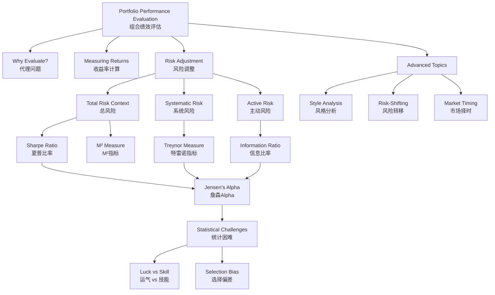

# Week 6-2: Portfolio Performance Evaluation

> **FIN 522A Fixed Income | Lecture 12**
> 🎯 本讲核心：理解如何衡量投资组合绩效，区分技能（Alpha）与风险承担的回报

---

## 📑 Table of Contents 目录

1. [[#1. Why Evaluate Portfolio Performance|Why Evaluate Portfolio Performance 为什么评估组合绩效]]
2. [[#2. Measuring Returns|Measuring Returns 收益率计算]]
3. [[#3. Adjusting Returns for Risk|Adjusting Returns for Risk 风险调整]]
4. [[#4. Sharpe Ratio and M² Measure|Sharpe Ratio and M² Measure 夏普比率与M²]]
5. [[#5. Treynor Measure|Treynor Measure 特雷诺指标]]
6. [[#6. Information Ratio|Information Ratio 信息比率]]
7. [[#7. Jensen's Alpha|Jensen's Alpha 詹森Alpha]]
8. [[#8. Connections Between Performance Measures|Connections Between Performance Measures 指标间的关系]]
9. [[#9. Realized Returns and Statistical Challenges|Realized Returns and Statistical Challenges 实际收益与统计挑战]]
10. [[#10. Selection Bias in Performance Evaluation|Selection Bias in Performance Evaluation 选择偏差]]
11. [[#11. Style Analysis|Style Analysis 风格分析]]
12. [[#12. Changing Strategy and Manipulation|Changing Strategy and Manipulation 策略变更与操纵]]
13. [[#13. Market Timing Evaluation|Market Timing Evaluation 市场择时评估]]
14. [[#Summary|Summary 本讲总结]]

---

## 1. Why Evaluate Portfolio Performance 为什么评估组合绩效 ⭐⭐

### 1.1 The Agency Problem 代理问题

When investors delegate portfolio management to professional managers, they face the **agency problem**: the manager's interests may not align with the investor's. Performance evaluation serves as a monitoring mechanism.

- **Key tension**: Investors must compensate managers for risk-taking, but distinguish between lucky returns and skilled returns
- **The fundamental question**:
$$R_p = R_f + \beta_p(R_M - R_f) + \alpha_p$$

The goal is to isolate $\alpha_p$ (alpha) — the manager's added value **independent of risk compensation**.

### 1.2 Four Purposes of Evaluation 评估的四大目的

| Purpose | Application |
|---------|------------|
| Manager Selection | Choose among competing fund managers |
| Compensation | Tie bonuses to risk-adjusted performance |
| Capital Allocation | Adjust assets given to managers with demonstrated skill |
| Attribution | Decompose return into source: asset allocation, security selection, timing |

> [!tip] 核心原则
> All performance measures attempt to answer: "Did the manager earn a return greater than justified by the risk they took?"

---

## 2. Measuring Returns 收益率计算 ⭐⭐

### 2.1 Arithmetic Mean vs Geometric Mean 算术平均 vs 几何平均

**Arithmetic Mean** (算术平均): The standard average
$$\bar{R} = \frac{1}{T} \sum_{t=1}^{T} R_t$$

- Best estimate of $E(R)$ for a **single future period**
- Used for forecasting
- More volatile and higher than geometric mean

**Geometric Mean** (几何平均): The compound growth rate
$$R_g = \left[\prod_{t=1}^{T}(1+R_t)\right]^{1/T} - 1$$

- Measures **actual compound growth** achieved historically
- Appropriate for evaluating past performance
- Approximation: $R_g \approx \bar{R} - \frac{1}{2}\sigma^2$

> [!example] 对比例子
> Returns over 2 years: +50%, -20%
> - Arithmetic mean: (50 - 20)/2 = 15%
> - Geometric mean: [(1.5)(0.8)]^(1/2) - 1 = 9.54%
> - 几何平均反映真实的年复合增长率

### 2.2 Money-Weighted Return (Internal Rate of Return) 资金加权收益率

The **money-weighted return** or **Internal Rate of Return (IRR)** accounts for the timing of cash flows:

$$\sum_{t=0}^{T} \frac{CF_t}{(1+\text{IRR})^t} = 0$$

- Critical for evaluating PE/VC managers
- **Problem**: If an investor adds capital before market downturn, the manager's IRR suffers—even with skillful management
- Penalizes managers for investors' poor timing of contributions
- Time-weighted return is often preferred to isolate manager skill

---

## 3. Adjusting Returns for Risk 风险调整 ⭐⭐⭐

### 3.1 Core Principle 核心原则

All risk-adjusted performance measures follow the same logic:

$$\text{Performance} = \frac{\text{Excess Return}}{\text{Relevant Risk Measure}}$$

The **key question**: Which risk measure is relevant depends on **evaluation context**:

| Context | Relevant Risk | Measure | Formula |
|---------|---------------|---------|---------|
| Standalone portfolio | Total risk (σ) | Sharpe Ratio | $S_p = \frac{E(R_p - R_f)}{\sigma_p}$ |
| Component of larger portfolio | Systematic risk (β) | Treynor Measure | $T_p = \frac{E(R_p - R_f)}{\beta_p}$ |
| Active overlay on benchmark | Active risk (tracking error) | Information Ratio | $\text{IR} = \frac{\alpha_p}{\sigma(e_p)}$ |

> [!warning] 关键洞察
> The SAME portfolio can rank differently under different measures if it has different systematic vs idiosyncratic risk. This is not a bug—it's a feature reflecting different evaluation contexts.

---

## 4. Sharpe Ratio and M² Measure 夏普比率与M² ⭐⭐⭐

### 4.1 Sharpe Ratio 夏普比率

$$S_p = \frac{E(R_p - R_f)}{\sigma_p}$$

- Uses **total risk** ($\sigma_p$)
- Assumes portfolio is evaluated **in isolation** (standalone)
- Dimensionless ratio: measures excess return per unit of total volatility
- **Interpretation**: Return per unit of risk taken
- Link to [[Week 4-1 Risk and Return]] fundamentals

### 4.2 Modigliani-Modigliani (M²) Measure M² 指标

Converts Sharpe ratio into return terms for easier interpretation:

$$M^2 = R_f + S_p \times \sigma_M$$

**Intuition**:
1. Imagine leveraging or deleveraging portfolio $p$ so its volatility equals the market ($\sigma_M$)
2. What return would it have achieved?
3. Compare this return directly to market return

**Key properties**:
- **Same ranking as Sharpe**: $M^2 > R_M$ if and only if $S_p > S_M$
- **More interpretable**: Expressed in return % rather than ratio
- If $M^2 = 12\%$ and $R_M = 10\%$, the manager added 2% of excess return after adjusting for risk

> [!example] M² 计算
> Portfolio: $\bar{R}_p = 14\%$, $\sigma_p = 18\%$, $R_f = 4\%$
> Market: $E(R_M) = 11\%$, $\sigma_M = 16\%$
>
> $S_p = \frac{14\% - 4\%}{18\%} = 0.556$
>
> $M^2 = 4\% + 0.556 \times 16\% = 12.89\%$
>
> Manager's risk-adjusted return is 12.89%, vs market 11% → 1.89% outperformance

---

## 5. Treynor Measure 特雷诺指标 ⭐⭐⭐

$$T_p = \frac{E(R_p - R_f)}{\beta_p}$$

### 5.1 Characteristics 特征

- Uses **systematic risk** ($\beta_p$) only
- Appropriate when evaluating a portfolio as **one component** of a larger portfolio
  - Idiosyncratic risk can be diversified away → not compensated
  - Only systematic risk (what can't be diversified) matters for marginal evaluation
- **Interpretation**: Return per unit of systematic risk
- Visual: Slope of line from $R_f$ to portfolio in ($\beta$, $R$) space

### 5.2 Treynor vs Sharpe 对比

```
          Expected Return (%)
                    |
                    |     Portfolio P
                    |    /
                    |   /
              R_f --|--/---- Market
                    |/
                    +------------- β
                    0      1.0
```

- **Sharpe** relevant if investor holds this portfolio alone
- **Treynor** relevant if this portfolio is mixed with many others
- **In practice**: For mutual fund evaluation, Treynor often more appropriate (small piece of diversified portfolio)

Link to [[Week 5-1 Single-Factor and Single-Index Models]] for beta calculation methodology.

---

## 6. Information Ratio 信息比率 ⭐⭐⭐

$$\text{IR} = \frac{E(R_p - R_b)}{\sigma(R_p - R_b)} = \frac{\alpha_p}{\sigma(e_p)}$$

### 6.1 Interpretation 解读

- **Numerator**: $\alpha_p$ = Alpha (active return relative to benchmark)
- **Denominator**: $\sigma(e_p)$ = Tracking Error (volatility of returns relative to benchmark)
- Measures **excess return per unit of active risk**
- Appropriate for evaluating an **active overlay** on top of a passive benchmark

### 6.2 Fundamental Law of Active Management 主动管理基本规律

The improvement in Sharpe ratio from adding active management:

$$S^2_{\text{new}} = S^2_b + \text{IR}^2$$

**Interpretation**:
- A manager with IR = 0.5 and benchmark Sharpe = 0.6 achieves overall Sharpe of $\sqrt{0.6^2 + 0.5^2} = 0.78$
- Additive relationship: high-IR active management boosts total portfolio Sharpe
- This relationship motivates the [[Week 5-1 Single-Factor and Single-Index Models#11. Treynor-Black Model|Treynor-Black model]] for optimal active-passive blending

---

## 7. Jensen's Alpha 詹森Alpha ⭐⭐⭐

$$\alpha_p = E(R_p) - \left[R_f + \beta_p(E(R_M) - R_f)\right]$$

### 7.1 Definition and Interpretation 定义与解读

- The **intercept** in a CAPM regression of portfolio excess returns on market excess returns
- Represents return **above what CAPM predicts** for the portfolio's beta
- **Positive alpha**: Manager adds value beyond risk compensation
- **Negative alpha**: Manager underperforms on a risk-adjusted basis

### 7.2 Statistical Significance 统计显著性

Estimated alpha includes sampling error:
$$\hat{\alpha} = \alpha + \text{sampling error}$$

Testing requires:
- **Standard Error**: $\text{SE}(\hat{\alpha}) = \frac{\sigma(e)}{\sqrt{N}}$
- **t-statistic**: $t = \frac{\hat{\alpha}}{\text{SE}(\hat{\alpha})} = \frac{\hat{\alpha} \sqrt{N}}{\sigma(e)}$
- Need $|t| > 2$ for significance at 5% level

---

## 8. Connections Between Performance Measures 绩效指标之间的关系 ⭐⭐⭐

### 8.1 Mathematical Relationships 数学联系

**Treynor vs Market**:
$$T_p - T_M = \frac{\alpha_p}{\beta_p}$$

Treynor outperforms market if and only if $\alpha_p > 0$.

**Sharpe Decomposition**:
$$S_p = \frac{\alpha_p}{\sigma_p} + \rho_{p,M} \times S_M$$

Sharpe ratio decomposes into:
- Contribution from alpha (manager skill)
- Contribution from market (systematic exposure)

**Information Ratio as Alpha per Tracking Error**:
$$\text{IR} = \frac{\alpha_p}{\sigma(e_p)}$$

### 8.2 Comprehensive Worked Example 完整计算例子 ⭐⭐⭐

**Given Data** (历史数据):
- Portfolio A: $R_p = 14\%$, $\sigma_p = 20\%$, $\beta_p = 1.2$
- Portfolio B: $R_p = 12\%$, $\sigma_p = 15\%$, $\beta_p = 0.8$
- Risk-free rate: $R_f = 4\%$
- Market return: $E(R_M) = 12\%$, $\sigma_M = 16\%$
- Correlation with market: $\rho_{A,M} = 0.95$, $\rho_{B,M} = 0.80$
- Standard error of residuals: $\sigma(e_A) = 8\%$, $\sigma(e_B) = 6\%$

**Calculate for Portfolio A**:

1. **Sharpe Ratio**: $S_A = \frac{14\% - 4\%}{20\%} = 0.500$

2. **Treynor**: $T_A = \frac{14\% - 4\%}{1.2} = 8.33\%$

3. **Jensen's Alpha**: $\alpha_A = 14\% - [4\% + 1.2(12\% - 4\%)] = 14\% - 13.6\% = 0.4\%$

4. **M² Measure**: $M^2_A = 4\% + 0.500 \times 16\% = 12\%$

5. **Information Ratio** (vs market as benchmark):
   - Tracking error: $\sigma(e_A) = 8\%$
   - $\text{IR}_A = \frac{0.4\%}{8\%} = 0.05$

**Calculate for Portfolio B**:

1. **Sharpe Ratio**: $S_B = \frac{12\% - 4\%}{15\%} = 0.533$

2. **Treynor**: $T_B = \frac{12\% - 4\%}{0.8} = 10\%$

3. **Jensen's Alpha**: $\alpha_B = 12\% - [4\% + 0.8(12\% - 4\%)] = 12\% - 10.4\% = 1.6\%$

4. **M² Measure**: $M^2_B = 4\% + 0.533 \times 16\% = 12.53\%$

5. **Information Ratio**: $\text{IR}_B = \frac{1.6\%}{6\%} = 0.267$

**Summary Table** (比较表):

| Measure | Portfolio A | Portfolio B | Winner |
|---------|------------|------------|--------|
| Sharpe Ratio | 0.500 | 0.533 | B |
| M² (%) | 12.00 | 12.53 | B |
| Treynor (%) | 8.33 | 10.00 | B |
| Jensen's Alpha (%) | 0.40 | 1.60 | B |
| Information Ratio | 0.050 | 0.267 | B |

**Conclusion**: Portfolio B outperforms on all measures. Why does B do better despite lower absolute return (12% vs 14%)?
- Higher Sharpe: Lower total volatility (15% vs 20%)
- Lower beta exposure: More alpha relative to beta
- Higher information ratio: More alpha per unit of active risk

This illustrates the importance of **risk-adjusted** evaluation!

---

## 9. Realized Returns and Statistical Challenges 实际收益与统计挑战 ⭐⭐⭐

### 9.1 The Luck vs Skill Problem 运气 vs 技能问题

The central problem: Estimated alpha contains sampling error.

$$\hat{\alpha} = \alpha_{\text{true}} + \varepsilon$$

We observe $\hat{\alpha}$, but we want to know if $\alpha_{\text{true}}$ is really positive or just noise.

### 9.2 Statistical Test for Skill 技能的统计检验

**Standard Error of Alpha**:
$$\text{SE}(\hat{\alpha}) = \frac{\sigma(e)}{\sqrt{N}}$$

where $N$ is number of observations (months, years, etc.)

**t-statistic**:
$$t = \frac{\hat{\alpha}}{\text{SE}(\hat{\alpha})} = \frac{\hat{\alpha} \sqrt{N}}{\sigma(e)}$$

### 9.3 How Long to Detect Skill? 需要多长的样本期来证明技能? ⭐⭐⭐

**Example**: Suppose a manager has true monthly alpha of $\alpha = 0.2\%$ with residual volatility $\sigma(e) = 2\%/\text{month}$

To achieve $t = 2$ (95% confidence):
$$t = \frac{0.002 \times \sqrt{N}}{0.02} = 0.1\sqrt{N} = 2$$

$$\sqrt{N} = 20 \implies N = 400 \text{ months} \approx 33 \text{ years}$$

> [!warning] 核心困难
> Even a genuinely skilled manager needs **decades** of data to statistically prove their skill. This is the most important insight in performance evaluation. With typical fund track records (5-10 years), **we cannot distinguish skill from luck** with high confidence.

**Implications**:
- Many funds with impressive 5-year returns may just be lucky
- Even poor performers might achieve good short-term returns by chance
- Past performance is **not** a reliable guide to future results (as disclosures note)

---

## 10. Selection Bias in Performance Evaluation 选择偏差 ⭐⭐

### 10.1 Sources of Bias 偏差的来源

**Survivorship Bias** (幸存者偏差):
- Failed funds disappear from databases
- Observed average alpha is biased **upward**
- Example: If 30% of funds close with -10% alpha, survivors' average alpha looks better than true population

**Backfill Bias** (回填偏差):
- Funds only enter database AFTER strong initial performance
- Return history is biased upward from the start

**Self-Selection Bias** (自选偏差):
- Managers with poor performance stop reporting
- Published track records exclude failed strategies

**Data-Snooping Bias** (数据挖掘偏差):
- Testing many strategies increases chance of false positives
- With 100 independent strategies at 5% significance level, expect 5 false discoveries by chance
- Link to [[Week 6-1 EMH and Behavioral Finance]] discussion of market anomalies

> [!warning] 研究设计含义
> Published empirical results on fund outperformance are likely **overstated** due to selection bias. True skill is probably even rarer than the data suggests.

---

## 11. Style Analysis 风格分析 ⭐⭐

### 11.1 Returns-Based Style Analysis 基于收益的风格分析

**Regression Model**:
$$R_{p,t} = \alpha + \sum_{k=1}^{K} w_k R_{k,t} + \varepsilon_t$$

where:
- $R_{k,t}$ = return on style index $k$ (e.g., large-cap growth, small-cap value, bonds)
- $w_k$ = estimated weight in style $k$
- Constraints: $w_k \geq 0$ and $\sum w_k = 1$ (portfolio weights must be non-negative and sum to 100%)

### 11.2 Interpreting R² 解读R²值

**High R²** (e.g., R² > 0.95):
- Portfolio returns mostly explained by factor exposures
- Manager is essentially a "closet indexer"
- Little active security selection or market timing
- Why pay active management fees?

**Low R²** (e.g., R² < 0.80):
- Large residual returns not explained by style
- Suggests active management in security selection or timing
- Or: Manager making unconventional style bets

### 11.3 Advantages 优势

- Requires only **returns data** — no need for portfolio holdings information
- Can identify drift: If fund drifts into different style over time, $w_k$ estimates change
- Can detect style box classifications that don't match fund name

---

## 12. Changing Strategy and Manipulation 策略变更与操纵 ⭐⭐

### 12.1 Risk-Shifting 改变风险敞口

Managers might change their portfolio beta mid-evaluation period:
- Run high-β strategy in market rallies
- Switch to low-β strategy in downturns
- Full-period Sharpe ratio may not reflect true risk-adjusted performance

**Example**:
- Jan-Jun: High-β strategy, market up 10% → portfolio +15%
- Jul-Dec: Low-β strategy, market down 5% → portfolio -1%
- Full year: +14% absolute, but volatility artificially suppressed

The manager benefited from tactical positioning but full-period Sharpe doesn't capture this timing risk.

### 12.2 Performance Manipulation Techniques 操纵绩效的技巧

**Return Smoothing** (平滑收益):
- Report less volatile returns than actual (using stale pricing, illiquid asset valuations)
- Artificially inflates Sharpe ratio
- Example: Hedge funds using month-end pricing of illiquid positions

**Tail Risk Strategies** (尾部风险策略):
- Sell OTM puts: steady premium income for 11 months + rare catastrophic loss in month 12
- Measured returns: 11 months of ~1% gains, 1 month of -30%
- Standard deviation understates true risk
- Sharpe ratio looks great until tail event occurs

**Window Dressing** (橱窗装饰):
- Buy recent winners before quarterly reporting date
- Holdings look good; sells them right after
- Doesn't materially affect performance but improves appearance

### 12.3 Morningstar MRAR: Robust Measure 晨星MRAR指标

The **Morningstar Excess Return and Risk-Adjusted Measure (MRAR)** is more robust to manipulation:

$$\text{MRAR}(\gamma) = \left\{\frac{1}{T} \sum_{t=1}^{T} \left[\frac{1+R_{p,t}}{1+R_{f,t}}\right]^{-\gamma}\right\}^{12/\gamma} - 1$$

where $\gamma = 2$ (risk aversion parameter)

**Key property**: Penalizes downside risk more than upside gain
- Hard to game with tail risk strategies
- Better captures risk asymmetry
- Accounts for compound returns more accurately

---

## 13. Market Timing Evaluation 市场择时评估 ⭐⭐⭐

### 13.1 What is Market Timing? 什么是市场择时?

A manager with **timing ability** varies portfolio beta based on market expectations:

- Expects market rally → increase β
- Expects market downturn → decrease β
- Actual realized beta: $\beta_t = \beta_0 + \gamma \times E[r_{M,t}]$ where $\gamma > 0$ indicates ability

If manager can predict market direction, portfolio return is **convex** function of market return.

### 13.2 Treynor-Mazuy Regression 特雷诺-马祖伊回归

$$r_{p,t} = \alpha + \beta r_{M,t} + \gamma r_{M,t}^2 + e_t$$

where:
- $r_{p,t}$ = portfolio excess return
- $r_{M,t}$ = market excess return
- Squared term captures convexity

**Interpretation**:
- $\gamma > 0$ → Positive timing ability
- $\gamma < 0$ → Negative timing ability (worse than buy-and-hold)
- $\gamma = 0$ → No timing ability

**Intuition**: If manager times well, portfolio return increases more when market rises (positive curvature) and decreases less when market falls. This convexity shows up as positive coefficient on $r_{M,t}^2$ term.

### 13.3 Empirical Evidence 实证证据

**Key Finding**: Most mutual fund managers show **NO significant market timing ability**
- Large meta-studies find average $\gamma \approx 0$ or slightly negative
- A few managers show evidence of timing, but may be luck (multiple testing problem)
- Timing ability, if present, often shows up as **negative alpha** due to model misspecification

> [!tip] 实务含义
> Investors should not pay for market timing ability. Historical track records rarely provide evidence of true forecasting skill. Stick to [[Week 6-1 EMH and Behavioral Finance]] insights: markets are largely efficient.

---

## Summary 本讲总结



### Key Formulas 关键公式

| Formula | Application | Link |
|---------|------------|------|
| $R_g \approx \bar{R} - \frac{1}{2}\sigma^2$ | Geometric vs Arithmetic mean | Section 2.1 |
| $S_p = \frac{E(R_p - R_f)}{\sigma_p}$ | Standalone portfolio evaluation | Section 4.1 |
| $M^2 = R_f + S_p \times \sigma_M$ | Risk-adjusted return interpretation | Section 4.2 |
| $T_p = \frac{E(R_p - R_f)}{\beta_p}$ | Component portfolio evaluation | Section 5.1 |
| $\text{IR} = \frac{\alpha_p}{\sigma(e_p)}$ | Active management evaluation | Section 6.1 |
| $S^2_{\text{new}} = S^2_b + \text{IR}^2$ | Active management benefit | Section 6.2 |
| $\alpha_p = E(R_p) - [R_f + \beta_p(E(R_M) - R_f)]$ | Risk-adjusted performance | Section 7.1 |
| $t = \frac{\hat{\alpha}\sqrt{N}}{\sigma(e)}$ | Significance testing | Section 9.2 |
| $r_{p,t} = \alpha + \beta r_{M,t} + \gamma r^2_{M,t} + e_t$ | Market timing detection | Section 13.2 |

### Core Insights 核心洞察

1. **Different contexts require different measures**: No single "best" performance metric—choice depends on evaluation context (standalone vs component, active vs passive)

2. **Luck vs skill is hard to distinguish**: Need ~30+ years of data to prove skill with typical manager alpha. Published track records rarely provide statistical evidence.

3. **Selection bias is pervasive**: Survivorship bias, backfill bias, and data-snooping inflate observed outperformance. True skill is rarer than data suggests.

4. **Risk-adjusted returns matter more than absolute returns**: Portfolio B in Section 8.2 example outperforms Portfolio A despite lower return, due to superior risk-adjusted metrics.

5. **Market timing rarely works**: Empirical evidence doesn't support systematic timing ability in mutual funds. Focus on factor exposure and security selection instead.

6. **Manager skill is expensive**: If past performance cannot reliably predict future results (Section 9.3), paying for active management is risky. Consider low-cost passive alternatives.

---

**Related Notes:** [[Week 1-1 Bond Pricing and Yield Fundamentals]] | [[Week 1-2 Duration, Convexity and Interest Rate Risk]] | [[Week 2-1 Embedded Options Effective Duration and MBS]] | [[Week 2-2 Credit Risk and Credit Analysis]] | [[Week 3 Portfolio Credit Risk and CreditMetrics]] | [[Week 4-1 Risk and Return]] | [[Week 4-2 Portfolio Theory and Optimization]] | [[Week 5-1 Single-Factor and Single-Index Models]] | [[Week 5-2 CAPM and Multifactor Models]] | [[Week 6-1 EMH and Behavioral Finance]]
