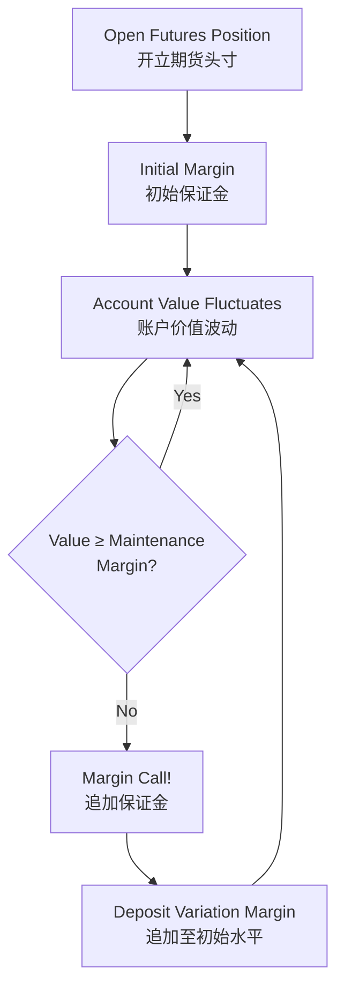
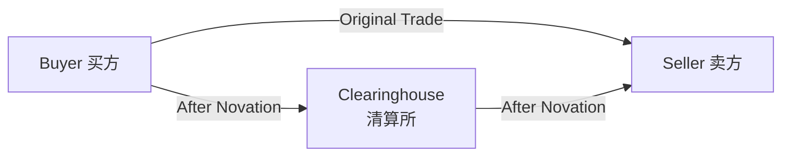
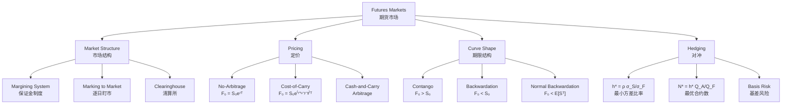

# Week 7-1: Futures Markets and Pricing

> **FIN 522A Fixed Income | Lecture 13**
> 🎯 本讲核心：理解期货市场的机制、无套利定价原理、持有成本模型，以及期货对冲的基本方法

---

## 📑 Table of Contents 目录

1. [[#1. Why Futures Markets Exist|Why Futures Markets Exist 期货市场为何存在]]
2. [[#2. Forward vs Futures Contracts|Forward vs Futures Contracts 远期 vs 期货]]
3. [[#3. Basic Futures Contract Structure|Basic Futures Contract Structure 期货合约结构]]
4. [[#4. The Margining System|The Margining System 保证金制度]]
5. [[#5. Marking to Market|Marking to Market 逐日盯市]]
6. [[#6. The Clearinghouse|The Clearinghouse 清算所]]
7. [[#7. Payoff of Futures Positions|Payoff of Futures Positions 期货头寸损益]]
8. [[#8. Futures Pricing — No-Arbitrage Replication|Futures Pricing — No-Arbitrage Replication 无套利定价]]
9. [[#9. Cash-and-Carry Arbitrage|Cash-and-Carry Arbitrage 现货-期货套利]]
10. [[#10. Spot-Futures Parity and Convergence|Spot-Futures Parity and Convergence 现期平价与收敛]]
11. [[#11. Futures on Assets with Income|Futures on Assets with Income 有收入资产的期货定价]]
12. [[#12. Cost-of-Carry Model|Cost-of-Carry Model 持有成本模型]]
13. [[#13. Contango and Backwardation|Contango and Backwardation 升水与贴水]]
14. [[#14. Risk-Neutral vs Physical Measure|Risk-Neutral vs Physical Measure 风险中性 vs 真实概率]]
15. [[#15. Normal Backwardation and Hedging Pressure|Normal Backwardation and Hedging Pressure 正常贴水与对冲压力]]
16. [[#16. Forward vs Futures Pricing Equivalence|Forward vs Futures Pricing Equivalence 远期与期货价格等价性]]
17. [[#17. Hedging with Futures|Hedging with Futures 期货对冲]]
18. [[#18. Basis Risk|Basis Risk 基差风险]]
19. [[#Summary|Summary 本讲总结]]

---

## 1. Why Futures Markets Exist 期货市场为何存在 ⭐⭐

### 1.1 Three Core Functions 三大核心功能

Futures markets serve three essential economic functions:

**Risk Transfer** (风险转移): Hedgers transfer unwanted price risk to speculators willing to bear it. A wheat farmer locks in a selling price; an airline locks in fuel costs. Both reduce uncertainty at the cost of giving up potential upside.

**Price Discovery** (价格发现): Futures prices aggregate information from diverse market participants — producers, consumers, traders, analysts — into a single observable price. This makes markets more informationally efficient (see [[Week 6-1 EMH and Behavioral Finance#1. The Efficient Market Hypothesis|EMH]]).

**Capital Efficiency** (资本效率): Because futures require only margin (not full payment), participants gain leveraged exposure. A trader can control $100,000 of oil with ~$5,000 in margin.

### 1.2 Three Types of Participants 三类参与者

| Participant | Goal | Example |
|-------------|------|---------|
| **Hedger** 套期保值者 | Reduce existing risk exposure | Farmer sells wheat futures to lock in price |
| **Speculator** 投机者 | Profit from directional price views | Trader buys oil futures expecting price increase |
| **Arbitrageur** 套利者 | Exploit mispricings for riskless profit | Buy cheap spot, sell expensive futures |

> [!tip] 核心逻辑
> 期货市场不创造新的风险——它**重新分配**已经存在的风险，从不愿承担风险者转移到愿意承担风险者。

---

## 2. Forward vs Futures Contracts 远期 vs 期货 ⭐⭐⭐

### 2.1 Key Differences 关键区别

| Feature | Forward 远期 | Futures 期货 |
|---------|--------|---------|
| Trading Venue | OTC (bilateral) | Exchange (standardized) |
| Customization | Fully customizable | Standardized terms |
| Settlement Timing | At maturity only | Daily marking to market |
| Counterparty Risk | Direct bilateral exposure | Clearinghouse intermediates |
| Liquidity | Typically illiquid | Highly liquid |
| Regulation | Minimal | CFTC/NFA oversight |

### 2.2 The Critical Distinction 关键区别

The most important difference is **daily marking to market**:

- **Forward**: No intermediate cash flows. At maturity, one party pays the other the full difference between the contract price and spot price.
- **Futures**: Gains and losses are settled **daily**. The contract effectively "resets" each day to a new futures price, with cash moving between margin accounts.

This daily settlement has profound implications for pricing (see [[#16. Forward vs Futures Pricing Equivalence|Section 16]]) and credit risk management.

---

## 3. Basic Futures Contract Structure 期货合约结构 ⭐⭐

### 3.1 Contract Specifications 合约要素

Every futures contract specifies:

**Underlying Asset** (标的资产): The asset to be delivered — can be commodities (oil, wheat, gold), financial instruments (Treasury bonds, equity indexes), currencies, or interest rates.

**Contract Size** (合约规模): The quantity per contract. E.g., one WTI crude oil contract = 1,000 barrels; one E-mini S&P 500 = $50 × Index.

**Delivery Dates** (交割日期): Specific months when the contract expires. Most financial futures follow quarterly cycles (March, June, September, December).

**Settlement Method** (结算方式):

| Method | Description | Example |
|--------|------------|---------|
| Physical Delivery 实物交割 | Actual asset changes hands | Grain, crude oil, Treasury bonds |
| Cash Settlement 现金结算 | Cash payment based on price difference | S&P 500 futures, Eurodollar futures |

**Tick Size** (最小变动价位): The minimum price increment. For E-mini S&P 500: 0.25 index points = $12.50 per contract.

---

## 4. The Margining System 保证金制度 ⭐⭐⭐

### 4.1 Three Types of Margin 三种保证金

**Initial Margin** (初始保证金): Deposit required to open a position, typically 5–15% of notional value. Not a "down payment" — the trader still has full exposure to price changes.

**Maintenance Margin** (维持保证金): Minimum account balance that must be maintained, typically ~75% of initial margin. Falling below triggers a margin call.

**Variation Margin** (追加保证金): The additional deposit required to bring the account back to the **initial margin** level after a margin call.

### 4.2 Embedded Leverage 内含杠杆

> [!warning] 保证金 ≠ 借款
> Margin is a **performance bond** (履约保证金), not borrowed money. There is no interest charged on margin deposits. But it creates **embedded leverage**: controlling $100,000 notional with $5,000 margin means 20× leverage.

This embedded leverage means futures can amplify both gains and losses. A 1% move in the underlying creates a 20% change in margin value at 20× leverage.

---

## 5. Marking to Market 逐日盯市 ⭐⭐⭐

### 5.1 Daily Settlement Mechanism 每日结算机制

At the end of each trading day, every futures position is "marked to market":

$$\text{Daily Gain/Loss} = (F_t - F_{t-1}) \times Q$$

where $F_t$ is today's settlement price, $F_{t-1}$ is yesterday's settlement price, and $Q$ is the contract size.

> [!example] 逐日盯市示例
> Long 1 crude oil futures (Q = 1,000 barrels):
> - Day 0: Buy at $F_0 = \$80.00$
> - Day 1: Settlement at $F_1 = \$81.50$ → Gain = $(81.50 - 80.00) \times 1{,}000 = +\$1{,}500$
> - Day 2: Settlement at $F_2 = \$79.00$ → Loss = $(79.00 - 81.50) \times 1{,}000 = -\$2{,}500$
>
> Cash flows are settled daily — gains credited, losses debited from margin account.

### 5.2 Implications of Daily Settlement 每日结算的影响

The daily reset means the **total payoff** of a futures position is the sum of daily gains/losses:

$$\Pi_T = \sum_{t=1}^{T} (F_t - F_{t-1}) \times Q = (F_T - F_0) \times Q$$

The sum telescopes, so the final payoff equals the difference between the final and initial futures prices — **same as a forward** in total, but the **timing of cash flows differs**. This timing difference matters when interest rates are stochastic (see [[#16. Forward vs Futures Pricing Equivalence|Section 16]]).

---

## 6. The Clearinghouse 清算所 ⭐⭐

### 6.1 Novation and Risk Management 合约更替与风险管理

The clearinghouse becomes the **buyer to every seller** and the **seller to every buyer** through a process called **novation** (合约更替). This eliminates bilateral counterparty risk.

### 6.2 Risk Management Tools 风险管理工具

The clearinghouse employs multiple layers of protection:

| Layer | Description |
|-------|------------|
| Margin Requirements | Daily mark-to-market with initial and maintenance margins |
| Position Limits | Cap on maximum open positions per trader |
| Default Fund | Pooled capital from clearing members for loss mutualization |
| Daily Settlement | Prevents loss accumulation over time |

**Regulatory Framework**: In the US, futures markets are regulated by the **CFTC** (Commodity Futures Trading Commission) and the **NFA** (National Futures Association). Post-2008, clearinghouses are designated as **Systemically Important Financial Market Utilities (SIFMUs)**.

> [!note] 对比信用风险
> 与[[Week 2-2 Credit Risk and Credit Analysis|Week 2-2]]中讨论的信用风险不同，期货的清算所机制将双边信用风险转化为中央对手方风险，极大降低了违约的系统性影响。

---

## 7. Payoff of Futures Positions 期货头寸损益 ⭐⭐

### 7.1 Long Futures 多头损益

The payoff to a **long futures** position at expiration:

$$\Pi_{\text{long}} = S_T - F_0$$

- Gains when $S_T > F_0$ (spot price rises above futures price)
- Losses when $S_T < F_0$ (spot price falls below futures price)
- **Linear payoff** — symmetric gains and losses, unlike options

### 7.2 Short Futures 空头损益

The payoff to a **short futures** position at expiration:

$$\Pi_{\text{short}} = F_0 - S_T$$

- Mirror image of the long position
- Gains when spot price falls, losses when spot price rises

### 7.3 Key Observations 关键观察

Both positions have **zero initial cost** (ignoring margin). The payoff is purely determined by the relationship between $S_T$ and $F_0$. This is fundamentally different from options where the buyer pays a premium upfront (giving asymmetric payoffs).

> [!tip] 重要区别
> Futures payoff is **linear and symmetric** — both upside and downside are unlimited. Options payoff is **nonlinear and asymmetric** — the buyer's loss is limited to the premium.

---

## 8. Futures Pricing — No-Arbitrage Replication 无套利定价 ⭐⭐⭐

### 8.1 The Fundamental Question 核心问题

What determines the futures price $F_0$? **Not** expectations about where the spot price will be — but rather the **cost of replicating** the futures payoff.

### 8.2 Replication Argument 复制论证

Consider two strategies to achieve the payoff $S_T$ at time $T$:

**Strategy A** — Buy the asset directly:
- Borrow $S_0$ at rate $r$, buy asset now
- At time $T$: receive $S_T$, repay $S_0 e^{rT}$
- Net payoff: $S_T - S_0 e^{rT}$

**Strategy B** — Use futures:
- Enter long futures at price $F_0$ (zero initial cost)
- At time $T$: payoff = $S_T - F_0$

### 8.3 No-Arbitrage Condition 无套利条件

Both strategies produce the same exposure to $S_T$ with zero initial outlay (excluding margin). By **no-arbitrage** (see also [[Week 6-1 EMH and Behavioral Finance#1. The Efficient Market Hypothesis|EMH and no-arbitrage]]):

$$\boxed{F_0 = S_0 \, e^{rT}}$$

This is the **spot-futures parity** for a non-income-paying asset. The futures price equals the spot price compounded at the risk-free rate — it reflects the **cost of carry**, not market expectations.

---

## 9. Cash-and-Carry Arbitrage 现货-期货套利 ⭐⭐⭐

### 9.1 When $F_0 > S_0 e^{rT}$: Cash-and-Carry 正向套利

If the futures is **overpriced** relative to spot-futures parity:

| Step | Action | Cash Flow |
|------|--------|-----------|
| 1 | Borrow $S_0$ at rate $r$ | $+S_0$ |
| 2 | Buy asset at spot price | $-S_0$ |
| 3 | Short futures at $F_0$ | $0$ |
| 4 (at $T$) | Deliver asset, receive $F_0$ | $+F_0$ |
| 5 (at $T$) | Repay loan | $-S_0 e^{rT}$ |
| **Net** | **Riskless profit** | $F_0 - S_0 e^{rT} > 0$ |

### 9.2 When $F_0 < S_0 e^{rT}$: Reverse Cash-and-Carry 反向套利

If the futures is **underpriced**:

| Step | Action | Cash Flow |
|------|--------|-----------|
| 1 | Short sell asset, receive $S_0$ | $+S_0$ |
| 2 | Invest $S_0$ at rate $r$ | $-S_0$ |
| 3 | Long futures at $F_0$ | $0$ |
| 4 (at $T$) | Receive investment proceeds | $+S_0 e^{rT}$ |
| 5 (at $T$) | Buy asset via futures, return to lender | $-F_0$ |
| **Net** | **Riskless profit** | $S_0 e^{rT} - F_0 > 0$ |

> [!warning] 套利限制
> In practice, short-selling constraints, transaction costs, and borrowing rates limit the precision of arbitrage. This is why small deviations from parity can persist — consistent with [[Week 6-1 EMH and Behavioral Finance|limits to arbitrage]].

---

## 10. Spot-Futures Parity and Convergence 现期平价与收敛 ⭐⭐⭐

### 10.1 Parity Relation 平价关系

For a non-income-paying asset:

$$F_0 = S_0 \, e^{rT}$$

**Critical insight**: $F_0 \neq E[S_T]$. The futures price is determined by no-arbitrage replication, **not** by market expectations about the future spot price.

### 10.2 Convergence at Maturity 到期收敛

As the contract approaches expiration ($t \to T$), the time to maturity shrinks and:

$$\lim_{t \to T} F_t = S_T$$

At expiration, the futures price **must** equal the spot price. If not, riskless arbitrage would be available (buy cheap, sell expensive for immediate delivery). This convergence is guaranteed by the delivery mechanism or cash settlement.

---

## 11. Futures on Assets with Income 有收入资产的期货定价 ⭐⭐⭐

### 11.1 Known Discrete Income 已知离散收入

If the underlying asset pays known income with present value $PV(I)$ during the futures life:

$$F_0 = (S_0 - PV(I)) \, e^{rT}$$

The income **reduces** the cost of carry — you earn income while holding the asset, so the futures price is lower than $S_0 e^{rT}$.

> [!example] 债券期货
> A bond paying coupons during the futures period: the known coupon payments reduce the futures price. This connects to [[Week 1-1 Bond Pricing and Yield Fundamentals#3. Bond Valuation|bond valuation]] — the present value of coupons is subtracted.

### 11.2 Continuous Dividend Yield — Equity Index Futures 连续股息率

For equity index futures where the index pays a continuous dividend yield $q$:

$$\boxed{F_0 = S_0 \, e^{(r-q)T}}$$

- If $q > r$: $F_0 < S_0$ (futures trades below spot — **backwardation**)
- If $q < r$: $F_0 > S_0$ (futures trades above spot — **contango**)

This is the workhorse formula for pricing S&P 500 futures, Nikkei futures, etc.

### 11.3 Commodities — Storage Costs and Convenience Yield 大宗商品

Commodities introduce two additional factors:

**Storage Cost** $u$ (per unit, continuous rate): Increases the cost of carry — you must pay to store the physical commodity.

**Convenience Yield** $y$ (continuous rate): The benefit of holding the physical commodity rather than the futures contract. Represents optionality from having physical inventory (e.g., a refinery can process oil immediately if needed).

$$F_0 = S_0 \, e^{(r+u-y)T}$$

---

## 12. Cost-of-Carry Model 持有成本模型 ⭐⭐⭐

### 12.1 General Formula 通用公式

Combining all factors into one unified framework:

$$\boxed{F_0 = S_0 \, e^{(r + u - y - q)T}}$$

where:

| Symbol | Meaning | Effect on $F_0$ |
|--------|---------|-----------------|
| $r$ | Risk-free rate 无风险利率 | ↑ increases |
| $u$ | Storage cost 仓储成本 | ↑ increases |
| $y$ | Convenience yield 便利收益率 | ↑ decreases |
| $q$ | Dividend yield 股息率 | ↑ decreases |

### 12.2 Interpretation 经济解释

The futures price reflects the **total cost of carrying** the underlying asset from now until delivery:

$$\text{Cost of Carry} = r + u - y - q$$

- **Financing cost** $r$: opportunity cost of capital tied up in the asset
- **Storage cost** $u$: direct cost of holding physical commodity
- **Convenience yield** $y$: benefit from holding physical vs synthetic exposure
- **Income yield** $q$: cash received from holding the asset

> [!tip] 统一框架
> 所有期货定价公式都是持有成本模型的特例：
> - Non-income asset: $u = y = q = 0 \Rightarrow F_0 = S_0 e^{rT}$
> - Equity index: $u = y = 0 \Rightarrow F_0 = S_0 e^{(r-q)T}$
> - Commodity: $q = 0 \Rightarrow F_0 = S_0 e^{(r+u-y)T}$

---

## 13. Contango and Backwardation 升水与贴水 ⭐⭐⭐

### 13.1 Carry-Based Definition (Curve Shape) 基于持有成本的定义

This definition compares **futures price to current spot**:

**Contango** (期货升水): $F_0 > S_0$ when $r + u > y + q$
- The cost of carry exceeds the benefits of holding
- Typical for: financial futures, high-storage-cost commodities
- Term structure of futures slopes **upward**

**Backwardation** (期货贴水): $F_0 < S_0$ when $y + q > r + u$
- Benefits of holding exceed the cost of carry
- Typical for: scarce commodities with high convenience yield
- Term structure of futures slopes **downward**

### 13.2 Expectation-Based Definition (Risk Premium) 基于预期的定义

This definition compares **futures price to expected future spot** under the physical measure $P$:

**Normal Backwardation** (正常贴水): $F_0 < E^P[S_T]$
- Long futures earn positive expected returns
- Speculators compensated for bearing risk

**Contango in expectation sense**: $F_0 > E^P[S_T]$
- Short futures earn positive expected returns
- Consumer hedging pressure drives futures above expected spot

> [!warning] 两个定义不要混淆
> These are **two distinct concepts** using similar terminology:
> 1. **Carry-based**: $F_0$ vs $S_0$ — directly observable from market prices
> 2. **Expectation-based**: $F_0$ vs $E^P[S_T]$ — involves unobservable expectations
>
> A market can be in carry-based contango ($F_0 > S_0$) while simultaneously in normal backwardation ($F_0 < E^P[S_T]$).

---

## 14. Risk-Neutral vs Physical Measure 风险中性 vs 真实概率 ⭐⭐⭐

### 14.1 Two Probability Measures 两种概率测度

**Risk-Neutral Measure** $Q$ (风险中性测度):
$$F_0 = E^Q[S_T] = S_0 \, e^{(r+u-y-q)T}$$

Under $Q$, the futures price equals the expected future spot. This is the pricing measure — it's what **no-arbitrage** implies.

**Physical Measure** $P$ (真实概率测度):
$$E^P[S_T] \neq F_0 \quad \text{(in general)}$$

Under $P$, the expected future spot incorporates a **risk premium**. The difference $E^P[S_T] - F_0$ reflects the compensation for bearing systematic risk.

### 14.2 Expected Futures Returns and Beta 期货预期回报与Beta

The expected return on a long futures position is related to the systematic risk of the underlying:

$$E^P[\Pi_T] \propto \beta_{\text{futures}}$$

Using CAPM logic (see [[Week 5-2 CAPM and Multifactor Models#3. The Capital Asset Pricing Model CAPM|CAPM]]):

- If $\beta > 0$: long futures should earn **positive** expected return → $F_0 < E^P[S_T]$
- If $\beta = 0$: long futures earn zero expected return → $F_0 = E^P[S_T]$
- If $\beta < 0$: long futures earn **negative** expected return → $F_0 > E^P[S_T]$

---

## 15. Normal Backwardation and Hedging Pressure 正常贴水与对冲压力 ⭐⭐

### 15.1 Keynes-Hicks Theory 凯恩斯-希克斯理论

**Normal Backwardation** (Keynes 1930, Hicks 1939):

Commodity **producers** (natural short hedgers) need to sell futures to lock in prices. To attract **speculators** to take the long side, the futures price must be set **below** the expected future spot:

$$F_0 < E^P[S_T]$$

This means long futures positions earn a **positive expected return** — the risk premium paid by hedgers to speculators.

### 15.2 Consumer Hedging Pressure 消费者对冲压力

When **consumers** (natural long hedgers) dominate — e.g., airlines hedging jet fuel — the pressure reverses:

$$F_0 > E^P[S_T]$$

Consumers bid up futures above expected spot. Short speculators earn positive expected returns for accommodating this demand.

### 15.3 Practical Implications 实践意义

In reality, **both** producer and consumer hedging pressures coexist. The net direction of the risk premium depends on which side's hedging demand is larger, and on the systematic risk ($\beta$) of the underlying.

---

## 16. Forward vs Futures Pricing Equivalence 远期与期货价格等价性 ⭐⭐⭐

### 16.1 Under Deterministic Interest Rates 确定利率下

When interest rates are **constant or deterministic** (non-random):

$$F_0^{\text{futures}} = F_0^{\text{forward}}$$

The daily settlement of futures vs lump-sum settlement of forwards doesn't matter because intermediate gains/losses can be invested or financed at the known rate $r$.

### 16.2 Stochastic Rates Break Equivalence 随机利率打破等价

When interest rates are **stochastic** (random), the equivalence breaks:

$$F_0^{\text{futures}} \neq F_0^{\text{forward}}$$

The key driver is the **covariance between the asset price and interest rates**:

| Condition | Result | Intuition |
|-----------|--------|-----------|
| $\text{Cov}(S_t, r_t) > 0$ | $F_0^{\text{futures}} > F_0^{\text{forward}}$ | Gains on long futures come when rates are high → reinvest at higher rates |
| $\text{Cov}(S_t, r_t) < 0$ | $F_0^{\text{futures}} < F_0^{\text{forward}}$ | Gains come when rates are low → reinvestment disadvantage |
| $\text{Cov}(S_t, r_t) = 0$ | $F_0^{\text{futures}} = F_0^{\text{forward}}$ | No reinvestment effect |

This difference is called the **convexity bias** (凸性偏差), connecting to the convexity concepts from [[Week 1-2 Duration, Convexity and Interest Rate Risk#5. Convexity|bond convexity]].

> [!note] 实务影响
> For short-dated contracts, the convexity bias is negligibly small. For long-dated interest rate futures (e.g., Eurodollar/SOFR futures extending 5+ years), the adjustment matters and must be accounted for in curve construction (see [[Week 7-2 FX Interest Rate Futures and Swaps#7. Convexity Adjustment|Week 7-2 convexity adjustment]]).

---

## 17. Hedging with Futures 期货对冲 ⭐⭐⭐

### 17.1 The Hedging Objective 对冲目标

A hedger holds an asset position worth $S$ and uses futures to reduce risk. The hedged portfolio value change:

$$\Delta V = \Delta S - h \cdot \Delta F$$

where $h$ is the **hedge ratio** (number of futures units per unit of spot exposure). The goal is to minimize $\text{Var}(\Delta V)$.

### 17.2 Minimum-Variance Hedge Ratio 最小方差对冲比率

Taking the first-order condition:

$$\boxed{h^* = \frac{\text{Cov}(\Delta S, \Delta F)}{\text{Var}(\Delta F)} = \rho \cdot \frac{\sigma_S}{\sigma_F}}$$

This is the **slope coefficient** from regressing $\Delta S$ on $\Delta F$ — directly analogous to the regression approach in [[Week 5-1 Single-Factor and Single-Index Models#4. The Single-Index Model|single-index models]].

- $\rho$ = correlation between spot and futures price changes
- $\sigma_S/\sigma_F$ = ratio of spot to futures volatilities
- If $\rho = 1$ and $\sigma_S = \sigma_F$: $h^* = 1$ (perfect hedge)

### 17.3 Optimal Number of Contracts 最优合约数

$$N^* = h^* \times \frac{Q_A}{Q_F}$$

where $Q_A$ is the quantity of the asset being hedged and $Q_F$ is the size of one futures contract.

### 17.4 Short Hedge vs Long Hedge 卖出对冲 vs 买入对冲

**Short Hedge** (卖出对冲 — Producer):
- Already owns the asset (or will produce it)
- Sells futures to lock in selling price
- Example: Oil producer hedges future production revenue

**Long Hedge** (买入对冲 — Consumer):
- Will need to purchase the asset in the future
- Buys futures to lock in buying price
- Example: Airline hedges future jet fuel costs

---

## 18. Basis Risk 基差风险 ⭐⭐

### 18.1 Definition 定义

The **basis** is the difference between the spot and futures price:

$$b_t = S_t - F_t$$

Basis risk arises when the hedge is imperfect because: the asset being hedged differs from the futures underlying (cross-hedging), the hedge horizon doesn't match the futures expiration, or the hedge ratio isn't perfect.

### 18.2 Hedged Portfolio with Basis 含基差的对冲组合

With a hedge ratio of $h = 1$, the hedged position change is:

$$\Delta V = \Delta S - \Delta F = \Delta b_t$$

The hedger has **exchanged price risk for basis risk**. If the basis were perfectly predictable, the hedge would be perfect. In practice, basis fluctuates, creating residual risk.

### 18.3 Sources of Basis Risk 基差风险来源

| Source | Description |
|--------|------------|
| Cross-hedging 交叉对冲 | Hedging jet fuel with crude oil futures — different but correlated assets |
| Maturity mismatch 到期不匹配 | Hedge horizon ≠ futures expiration — basis changes as maturity approaches |
| Quality/location mismatch 品质/地点不匹配 | Hedged asset differs in grade or delivery location from futures specification |

> [!tip] 核心洞察
> 完美对冲在理论上需要: $\rho = 1$, exact underlying match, and matching maturity. 实际中这些条件很少完全满足，因此基差风险几乎总是存在的。

---

## Summary 本讲总结

### Key Formulas 关键公式

| Formula | Application | Link |
|---------|------------|------|
| $F_0 = S_0 e^{rT}$ | Non-income asset futures pricing | [[#8. Futures Pricing — No-Arbitrage Replication\|Section 8]] |
| $F_0 = (S_0 - PV(I))e^{rT}$ | Asset with known discrete income | [[#11. Futures on Assets with Income\|Section 11.1]] |
| $F_0 = S_0 e^{(r-q)T}$ | Equity index futures | [[#11. Futures on Assets with Income\|Section 11.2]] |
| $F_0 = S_0 e^{(r+u-y)T}$ | Commodity futures | [[#11. Futures on Assets with Income\|Section 11.3]] |
| $F_0 = S_0 e^{(r+u-y-q)T}$ | General cost-of-carry | [[#12. Cost-of-Carry Model\|Section 12]] |
| $\Pi_{\text{long}} = S_T - F_0$ | Long futures payoff | [[#7. Payoff of Futures Positions\|Section 7]] |
| $h^* = \rho \cdot \sigma_S / \sigma_F$ | Minimum-variance hedge ratio | [[#17. Hedging with Futures\|Section 17]] |
| $N^* = h^* \times Q_A / Q_F$ | Optimal number of contracts | [[#17. Hedging with Futures\|Section 17.3]] |
| $b_t = S_t - F_t$ | Basis definition | [[#18. Basis Risk\|Section 18]] |

### Core Insights 核心洞察

1. **Futures prices are NOT forecasts**: $F_0 = S_0 e^{rT}$, not $E[S_T]$. The futures price is determined by the cost of carrying the underlying asset, enforced by no-arbitrage. Market expectations play no direct role in pricing.

2. **Daily marking to market matters**: Under stochastic rates, the daily settlement of futures creates a convexity bias relative to forwards. The direction depends on the correlation between asset prices and interest rates.

3. **Contango/backwardation has two meanings**: Carry-based (observable curve shape: $F_0$ vs $S_0$) and expectation-based (risk premium: $F_0$ vs $E^P[S_T]$). Don't confuse them — they can point in opposite directions simultaneously.

4. **Hedging replaces price risk with basis risk**: The minimum-variance hedge ratio $h^* = \rho \sigma_S/\sigma_F$ minimizes residual risk, but perfect hedging requires perfect correlation and matching maturity — rarely achievable in practice.

5. **The clearinghouse transforms credit risk**: Through novation and daily margin settlement, bilateral counterparty risk is converted to centralized risk management, fundamentally changing the risk landscape of derivatives markets.

6. **Cost-of-carry unifies all futures pricing**: Whether the underlying is an equity index, bond, commodity, or currency, $F_0 = S_0 e^{(r+u-y-q)T}$ captures all cases with appropriate parameter choices.

---

**Related Notes:** [[Week 1-1 Bond Pricing and Yield Fundamentals]] | [[Week 1-2 Duration, Convexity and Interest Rate Risk]] | [[Week 2-1 Embedded Options Effective Duration and MBS]] | [[Week 2-2 Credit Risk and Credit Analysis]] | [[Week 3 Portfolio Credit Risk and CreditMetrics]] | [[Week 4-1 Risk and Return]] | [[Week 4-2 Portfolio Theory and Optimization]] | [[Week 5-1 Single-Factor and Single-Index Models]] | [[Week 5-2 CAPM and Multifactor Models]] | [[Week 6-1 EMH and Behavioral Finance]] | [[Week 6-2 Portfolio Performance Evaluation]] | [[Week 7-2 FX Interest Rate Futures and Swaps]]