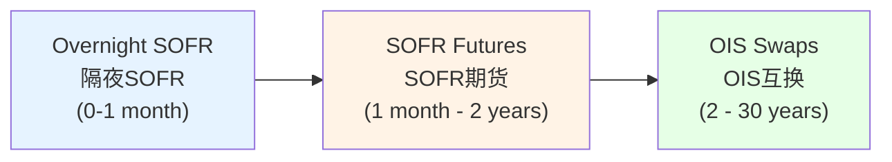
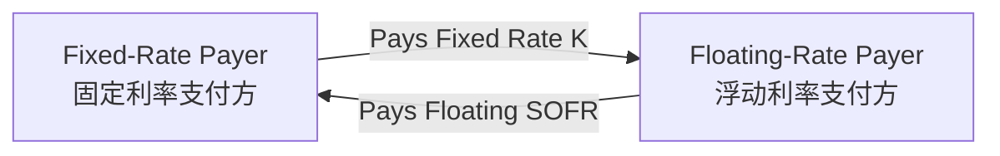
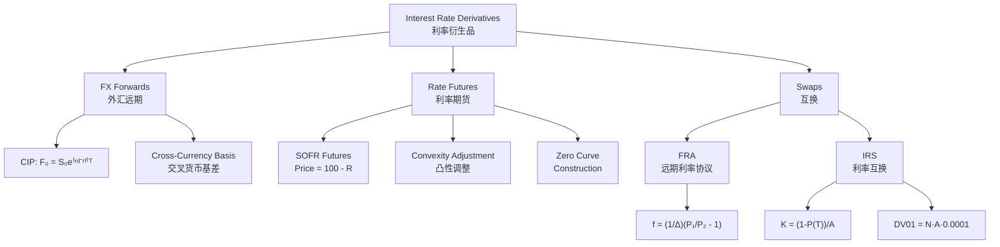

# Week 7-2: FX, Interest Rate Futures, and Swaps

> **FIN 522A Fixed Income | Lecture 14**
> 🎯 本讲核心：掌握抛补利率平价（CIP）、SOFR曲线构建、远期利率协议（FRA）和利率互换（IRS）的定价与风险管理

---

## 📑 Table of Contents 目录

1. [[#1. Foreign Exchange Market Conventions|FX Market Conventions 外汇市场惯例]]
2. [[#2. Covered Interest Rate Parity|Covered Interest Rate Parity 抛补利率平价]]
3. [[#3. Forward Premium and CIP Arbitrage|Forward Premium and CIP Arbitrage 远期升水与CIP套利]]
4. [[#4. CIP Deviations and Cross-Currency Basis|CIP Deviations and Cross-Currency Basis CIP偏离与交叉货币基差]]
5. [[#5. SOFR — The New Risk-Free Benchmark|SOFR — The New Risk-Free Benchmark 新的无风险基准]]
6. [[#6. SOFR Futures|SOFR Futures SOFR期货]]
7. [[#7. Convexity Adjustment|Convexity Adjustment 凸性调整]]
8. [[#8. Constructing the Zero Curve|Constructing the Zero Curve 构建零息曲线]]
9. [[#9. Bootstrapping with OIS Swaps|Bootstrapping with OIS Swaps 用OIS互换引导]]
10. [[#10. Forward Rate Agreements|Forward Rate Agreements 远期利率协议]]
11. [[#11. Interest Rate Swaps — Structure and Mechanics|Interest Rate Swaps — Structure and Mechanics 利率互换结构]]
12. [[#12. Valuing Interest Rate Swaps|Valuing Interest Rate Swaps 利率互换估值]]
13. [[#13. Par Swap Rate|Par Swap Rate 平价互换利率]]
14. [[#14. Mark-to-Market and Risk Measures|Mark-to-Market and Risk Measures 盯市与风险指标]]
15. [[#Summary|Summary 本讲总结]]

---

## 1. Foreign Exchange Market Conventions 外汇市场惯例 ⭐⭐

### 1.1 Spot Exchange Rate 即期汇率

The spot exchange rate $S_0$ quotes the price of one unit of foreign currency in domestic currency units:

$$S_0 = \frac{\text{Domestic Currency}}{\text{Foreign Currency}}$$

**Direct quote** (直接标价): domestic per foreign — e.g., $S_0 = 1.10$ USD/EUR means 1 EUR costs 1.10 USD.

**Indirect quote** (间接标价): foreign per domestic — the reciprocal, $1/S_0 = 0.909$ EUR/USD.

### 1.2 Bid-Ask Spread 买卖价差

Dealers quote two prices: **bid** (the price at which the dealer buys foreign currency) and **ask** (the price at which the dealer sells). The spread reflects transaction costs and is tighter for more liquid currency pairs.

### 1.3 Forward Exchange Rate 远期汇率

The forward rate $F_0$ is the rate agreed today for exchange at a future date $T$. It is determined by no-arbitrage (not by forecasting future spot rates), as we'll see in [[#2. Covered Interest Rate Parity|CIP]].

---

## 2. Covered Interest Rate Parity 抛补利率平价 ⭐⭐⭐

### 2.1 The CIP Relation CIP关系式

The forward exchange rate is determined by the interest rate differential between two currencies:

$$\boxed{F_0 = S_0 \, e^{(r_d - r_f)T}}$$

With simple compounding:

$$F_0 = S_0 \cdot \frac{1 + r_d \cdot T}{1 + r_f \cdot T}$$

where $r_d$ is the domestic risk-free rate and $r_f$ is the foreign risk-free rate.

> [!tip] 与期货定价的联系
> CIP is a special case of the [[Week 7-1 Futures Markets and Pricing#12. Cost-of-Carry Model|cost-of-carry model]]. The foreign interest rate $r_f$ acts like a **continuous dividend yield** $q$: holding foreign currency earns foreign interest, just as holding an equity index earns dividends. Hence $F_0 = S_0 e^{(r-q)T}$ maps directly to $F_0 = S_0 e^{(r_d - r_f)T}$.

### 2.2 Arbitrage Logic 套利逻辑

Two strategies to convert foreign currency today and receive domestic currency at time $T$:

**Strategy 1** (Invest domestically):
- Convert foreign to domestic at $S_0$
- Invest domestically at rate $r_d$
- At $T$: receive $S_0 \cdot e^{r_d T}$ in domestic currency

**Strategy 2** (Invest abroad + hedge):
- Invest in foreign currency at rate $r_f$
- Lock in forward conversion at $F_0$
- At $T$: receive $e^{r_f T} \cdot F_0$ in domestic currency

No-arbitrage requires both strategies to yield the same result:

$$S_0 \cdot e^{r_d T} = e^{r_f T} \cdot F_0 \implies F_0 = S_0 \cdot e^{(r_d - r_f)T}$$

---

## 3. Forward Premium and CIP Arbitrage 远期升水与CIP套利 ⭐⭐

### 3.1 Forward Premium/Discount 远期升水/贴水

The **forward premium** on the foreign currency:

$$\frac{F_0 - S_0}{S_0} \approx (r_d - r_f) \cdot T$$

- If $r_d > r_f$: $F_0 > S_0$ — foreign currency at a **forward premium** (trades for more domestic currency forward than spot)
- If $r_d < r_f$: $F_0 < S_0$ — foreign currency at a **forward discount**

> [!example] CIP数值示例
> $S_0 = 1.10$ USD/EUR, $r_d = 5\%$ (USD), $r_f = 3\%$ (EUR), $T = 1$ year:
> $$F_0 = 1.10 \times e^{(0.05 - 0.03) \times 1} = 1.10 \times 1.0202 \approx 1.122 \text{ USD/EUR}$$
> EUR trades at a forward premium because USD rates are higher — you give up more USD in the future to compensate for earning a higher domestic rate today.

### 3.2 FX Forwards vs FX Futures 外汇远期 vs 外汇期货

FX forwards are **OTC bilateral** contracts; FX futures are **exchange-traded standardized** contracts. Under deterministic interest rates, their prices are identical (see [[Week 7-1 Futures Markets and Pricing#16. Forward vs Futures Pricing Equivalence|forward-futures equivalence]]).

---

## 4. CIP Deviations and Cross-Currency Basis CIP偏离与交叉货币基差 ⭐⭐⭐

### 4.1 The Cross-Currency Basis 交叉货币基差

Since 2007, CIP has exhibited persistent deviations captured by the **cross-currency basis** $b$:

$$F_0 = S_0 \, e^{(r_d - r_f + b)T}$$

When $b \neq 0$, a "risk-free" CIP arbitrage appears to exist — but in practice it cannot be easily exploited.

### 4.2 Why the Basis Opens: Hedging Demand 基差产生的原因

BIS (2016) documented the key drivers of FX hedging demand:

| Source | Direction | Mechanism |
|--------|-----------|-----------|
| Global banks | Borrow USD via FX swaps | Non-US banks need USD funding for dollar-denominated assets |
| Institutional investors | Hedge foreign assets back to domestic | Pension funds, insurers hedging overseas bond holdings |
| Corporates | Hedge FX exposure | Multinationals managing cross-border cash flows |

This creates persistent **demand imbalances** in FX forward markets, pushing the basis away from zero.

### 4.3 Why the Basis Persists: Limits to Arbitrage 基差持续的原因

Even though the CIP deviation looks like "free money," arbitrageurs face real constraints:

**Basel III Capital Requirements**: Arbitrage trades consume regulatory capital (leverage ratio, risk-weighted assets). The return on equity after accounting for capital charges may not be attractive.

**Balance Sheet Constraints**: "Balance sheet space is rented, not free." Banks must allocate scarce balance sheet capacity, and CIP arbitrage competes with client-facing business for this resource.

**Funding Reality**: Textbook CIP assumes costless, unlimited funding. Post-2008, funding costs are non-trivial and vary with market conditions.

> [!note] 与EMH的联系
> CIP basis persistence is a powerful example of [[Week 6-1 EMH and Behavioral Finance#5. Limits to Arbitrage|limits to arbitrage]] in action. The deviation exists because the **costs of exploiting** it (capital, balance sheet, funding) exceed the apparent profit — the "arbitrage" is not truly riskless when real-world frictions are included.

---

## 5. SOFR — The New Risk-Free Benchmark SOFR新的无风险基准 ⭐⭐⭐

### 5.1 What is SOFR SOFR是什么

**SOFR** (Secured Overnight Financing Rate) is the primary USD risk-free interest rate benchmark:

| Feature | Description |
|---------|------------|
| Definition | Volume-weighted median rate of overnight **Treasury repo** transactions |
| Published by | Federal Reserve Bank of New York |
| Credit risk | Minimal — collateralized by US Treasuries |
| Volume | ~$1 trillion+ daily |
| Compounding | Overnight rate, compounded for longer periods |

### 5.2 Why SOFR Replaced LIBOR 为什么SOFR取代了LIBOR

**LIBOR** (London Interbank Offered Rate) was the dominant benchmark for decades but had fundamental flaws:

- Based on **bank submissions** (expert judgment), not actual transactions
- Susceptible to manipulation (2012 LIBOR scandal)
- Embedded **bank credit risk** — inappropriate for a "risk-free" benchmark
- Underlying market (unsecured interbank lending) shrank dramatically post-2008

USD LIBOR ceased publication in 2023. **SOFR** replaced it as the standard floating-rate benchmark for new contracts, including derivatives, loans, and securitizations.

> [!tip] 利率基准与债券定价
> SOFR作为无风险基准利率，直接关联到[[Week 1-1 Bond Pricing and Yield Fundamentals#3. Bond Valuation|债券估值]]中的折现率选择。零息曲线从SOFR构建（见[[#8. Constructing the Zero Curve|Section 8]]），替代了之前基于LIBOR的曲线。

---

## 6. SOFR Futures SOFR期货 ⭐⭐⭐

### 6.1 Contract Types 合约类型

| Feature | 1-Month SOFR | 3-Month SOFR |
|---------|-------------|-------------|
| Reference Rate | Arithmetic average of daily SOFR | Compounded daily SOFR |
| Contract Months | Serial (consecutive) | IMM dates (Mar, Jun, Sep, Dec) |
| Use | Short-term rate expectations | Zero curve construction |

### 6.2 Pricing Convention 定价惯例

SOFR futures are quoted as:

$$\text{Price} = 100 - R_{\text{ann}}$$

where $R_{\text{ann}}$ is the annualized rate in percentage terms. For example, if the implied rate is 4.80%, the price is $100 - 4.80 = 95.20$.

The interest accrual uses **ACT/360** day count:

$$\text{Accrual} = R_{\text{ann}} \times \frac{D}{360}$$

where $D$ is the actual number of days in the reference period.

> [!example] SOFR期货定价
> 3-Month SOFR future with implied rate 4.80%, reference period = 91 days:
> - Price = $100 - 4.80 = 95.20$
> - Accrual per $\$1{,}000{,}000$ notional = $0.0480 \times \frac{91}{360} = 1.213\%$
> - Dollar amount = $\$1{,}000{,}000 \times 0.01213 = \$12{,}133$

---

## 7. Convexity Adjustment 凸性调整 ⭐⭐⭐

### 7.1 Why Futures Rate ≠ Forward Rate 为什么期货利率≠远期利率

Due to [[Week 7-1 Futures Markets and Pricing#16. Forward vs Futures Pricing Equivalence|daily marking to market]], futures rates are **biased upward** relative to true forward rates:

$$\text{Futures Rate} > \text{Forward Rate}$$

The adjustment:

$$f_{t_1, t_2} = R_{\text{ann}} - \text{Convexity Adjustment}$$

where $f_{t_1, t_2}$ is the true forward rate and $R_{\text{ann}}$ is the futures-implied rate.

### 7.2 Intuition 直觉理解

For interest rate futures, daily settlement creates asymmetry:

- When rates **rise**: futures price falls → losses are realized → must be financed at the now-**higher** rates
- When rates **fall**: futures price rises → gains are realized → can only be reinvested at the now-**lower** rates

This asymmetry disadvantages long futures positions, so the market sets the futures rate **above** the forward rate to compensate. This connects directly to [[Week 1-2 Duration, Convexity and Interest Rate Risk#5. Convexity|convexity]] — the nonlinear relationship between rates and prices.

### 7.3 Practical Impact 实际影响

| Maturity | Convexity Adjustment |
|----------|---------------------|
| 1 year | ~0.5 bps |
| 5 years | ~10-15 bps |
| 10 years | ~30-50 bps |

For short maturities the adjustment is negligible. For longer maturities, it must be incorporated when building the zero curve from futures prices.

---

## 8. Constructing the Zero Curve 构建零息曲线 ⭐⭐⭐

### 8.1 From Futures to Discount Factors 从期货到折现因子

The forward rate implied by a SOFR futures contract (after convexity adjustment) gives:

$$P(0, t_2) = \frac{P(0, t_1)}{1 + f_{t_1, t_2} \times \Delta}$$

where $\Delta = (t_2 - t_1)$ is the accrual period in year fractions (ACT/360).

Starting from the overnight rate, we build discount factors step by step.

### 8.2 Bootstrapping Example 引导法示例

Given: $f_{0, 0.25} = 4.80\%$ and $f_{0.25, 0.50} = 5.00\%$

**Step 1**: Compute $P(0, 0.25)$:
$$P(0, 0.25) = \frac{1}{1 + 0.0480 \times 0.25} = \frac{1}{1.0120} = 0.9881$$

**Step 2**: Compute $P(0.25, 0.50)$:
$$P(0.25, 0.50) = \frac{1}{1 + 0.0500 \times 0.25} = \frac{1}{1.0125} = 0.9877$$

**Step 3**: Compute $P(0, 0.50)$:
$$P(0, 0.50) = P(0, 0.25) \times P(0.25, 0.50) = 0.9881 \times 0.9877 = 0.9759$$

This relates directly to [[Week 1-1 Bond Pricing and Yield Fundamentals#4. The Term Structure of Interest Rates|term structure construction]] — building zero-coupon discount factors from market instruments.

### 8.3 The Three-Segment Approach 三段式方法

The complete SOFR zero curve is built from three instrument types:

| Segment | Instrument | Maturity Range |
|---------|-----------|----------------|
| Short end | Overnight SOFR (effective federal funds) | 0 – 1 month |
| Middle | SOFR futures (1M and 3M) | 1 month – 2 years |
| Long end | OIS swaps | 2 – 30 years |

---

## 9. Bootstrapping with OIS Swaps 用OIS互换引导 ⭐⭐⭐

### 9.1 SOFR OIS Structure SOFR OIS结构

A **SOFR Overnight Index Swap (OIS)** is an interest rate swap where:

- **Fixed leg**: pays a fixed rate $K$ on notional $N$
- **Floating leg**: pays compounded daily SOFR
- **No principal exchange** (notional is reference only)
- Collateralized (reduces counterparty risk)

### 9.2 Present Value of Each Leg 各腿的现值

**Fixed Leg** (固定端):
$$PV_{\text{fixed}} = N \cdot K \sum_{i=1}^{n} P(0, t_i) \Delta_i$$

where $\Delta_i$ is the day count fraction for period $i$.

**Floating Leg** (浮动端): Using the telescoping product of forward rates:
$$PV_{\text{floating}} = N \cdot (1 - P(0, T))$$

This elegant result means the floating leg value only depends on the final discount factor — a direct consequence of how compounded overnight rates telescope.

### 9.3 Bootstrapping with OIS 用OIS引导

At inception, the swap has zero value: $PV_{\text{fixed}} = PV_{\text{floating}}$:

$$K \sum_{i=1}^{n} P(0, t_i) \Delta_i = 1 - P(0, T)$$

If we know all $P(0, t_i)$ for $i < n$ (from earlier instruments), we can solve for the **unknown** $P(0, T)$:

$$P(0, T) = 1 - K \sum_{i=1}^{n} P(0, t_i) \Delta_i$$

This extends the discount curve from the 2-year point (where futures end) out to 30 years.

---

## 10. Forward Rate Agreements 远期利率协议 ⭐⭐⭐

### 10.1 FRA Definition FRA定义

A **Forward Rate Agreement (FRA)** is an OTC contract to lock in a future borrowing/lending rate. The payoff at time $t_1$ (the start of the reference period):

$$\text{Payoff} = (L(t_1) - K) \times \Delta \times N$$

where $L(t_1)$ is the realized floating rate at $t_1$, $K$ is the agreed fixed rate, $\Delta = t_2 - t_1$ is the accrual period, and $N$ is the notional.

- **Long FRA** (FRA buyer): benefits when rates **rise** ($L > K$)
- **Short FRA** (FRA seller): benefits when rates **fall** ($L < K$)

### 10.2 FRA Pricing FRA定价

The fair FRA rate equals the forward rate implied by the zero curve:

$$1 + f_{t_1, t_2} \cdot \Delta = \frac{P(0, t_1)}{P(0, t_2)}$$

Solving:

$$\boxed{f_{t_1, t_2} = \frac{1}{\Delta}\left(\frac{P(0, t_1)}{P(0, t_2)} - 1\right)}$$

### 10.3 FRA Valuation FRA估值

The present value of an existing FRA with fixed rate $K$:

$$\text{Value} = N \cdot \Delta \cdot (f_{t_1, t_2} - K) \cdot P(0, t_2)$$

If $K = f_{t_1, t_2}$: Value = 0 (at inception, the FRA is set at the forward rate).

> [!tip] FRA与远期利率
> FRA定价直接来自零息曲线中的远期利率。这与[[Week 1-1 Bond Pricing and Yield Fundamentals#4. The Term Structure of Interest Rates|期限结构]]中远期利率的概念一致——远期利率是使不同期限投资等价的隐含利率。

---

## 11. Interest Rate Swaps — Structure and Mechanics 利率互换结构 ⭐⭐⭐

### 11.1 What is an IRS 什么是利率互换

An **Interest Rate Swap (IRS)** is a bilateral OTC agreement to exchange fixed-rate payments for floating-rate payments on a notional principal:

**Key features**:
- **Notional principal** is a reference amount — **never exchanged**
- Only **net** payments are made each period
- Typical tenors: 1, 2, 5, 10, 30 years
- Most commonly: semi-annual fixed payments, quarterly floating payments

### 11.2 Why Trade Swaps 为什么交易互换

| Purpose | Example |
|---------|---------|
| **Transform liabilities** | Bank with fixed-rate deposits swaps to floating to match floating-rate assets |
| **Transform assets** | Investor converts floating-rate bond to fixed income stream |
| **Hedge duration** | Portfolio manager adjusts interest rate exposure without trading bonds (see [[Week 1-2 Duration, Convexity and Interest Rate Risk#4. Duration|duration management]]) |
| **Speculate on rates** | Trader expects rates to rise → pay fixed, receive floating |
| **Exploit comparative advantage** | Party A borrows fixed cheaply, Party B borrows floating cheaply → both benefit from swapping |

### 11.3 A Swap as a Portfolio of FRAs 互换 = FRA组合

An interest rate swap can be decomposed into a **series of FRAs**, one for each payment period. Each FRA locks in the forward rate for its respective period.

---

## 12. Valuing Interest Rate Swaps 利率互换估值 ⭐⭐⭐

### 12.1 Fixed Leg Valuation 固定端估值

The present value of the fixed leg:

$$PV_{\text{fixed}} = N \cdot K \sum_{i=1}^{n} P(0, t_i) \Delta_i$$

This is essentially the value of a **fixed-rate bond** with coupon rate $K$ (without principal).

### 12.2 Floating Leg Valuation 浮动端估值

Using the telescoping property of forward rates:

$$PV_{\text{floating}} = N \cdot (1 - P(0, T))$$

**Derivation**: The floating leg pays $f_{t_{i-1}, t_i} \times \Delta_i$ each period. Discounting and using the identity $f_{t_{i-1}, t_i} \times \Delta_i = P(0, t_{i-1})/P(0, t_i) - 1$:

$$PV_{\text{floating}} = N \sum_{i=1}^{n} [P(0, t_{i-1}) - P(0, t_i)] = N \cdot [P(0, 0) - P(0, T)] = N(1 - P(0,T))$$

The sum telescopes — intermediate terms cancel, leaving only the first and last discount factors.

### 12.3 Swap Value 互换价值

For the **fixed-rate payer** (receive floating):

$$\text{Value}_{\text{payer}} = PV_{\text{floating}} - PV_{\text{fixed}} = N\left[(1 - P(0,T)) - K \sum_{i=1}^{n} P(0, t_i)\Delta_i\right]$$

> [!tip] 互换的债券解读
> A payer swap (pay fixed, receive floating) is economically equivalent to:
> - **Long** a floating-rate note (worth $N$ at reset → $PV = N \cdot 1 = N$ if at par)
> - **Short** a fixed-rate bond (with coupon $K$)
>
> This connects swap risk management to [[Week 1-2 Duration, Convexity and Interest Rate Risk#4. Duration|bond duration]] concepts.

---

## 13. Par Swap Rate 平价互换利率 ⭐⭐⭐

### 13.1 Derivation 推导

At inception, a swap has **zero value**: $PV_{\text{fixed}} = PV_{\text{floating}}$:

$$K \sum_{i=1}^{n} P(0, t_i)\Delta_i = 1 - P(0, T)$$

Solving for the **par swap rate**:

$$\boxed{K = \frac{1 - P(0, T)}{\displaystyle\sum_{i=1}^{n} P(0, t_i)\Delta_i}}$$

Define the **annuity factor**: $A = \sum_{i=1}^{n} P(0, t_i)\Delta_i$, then:

$$K = \frac{1 - P(0, T)}{A}$$

### 13.2 Numerical Example 数值示例

Given: 2-year swap, semi-annual payments ($\Delta = 0.5$)
- $P(0, 0.5) = 0.9759$
- $P(0, 1.0) = 0.9510$

Annuity factor:
$$A = 0.9759 \times 0.5 + 0.9510 \times 0.5 = 0.4880 + 0.4755 = 0.9635$$

Par swap rate:
$$K = \frac{1 - 0.9510}{0.9635} = \frac{0.0490}{0.9635} = 5.09\%$$

This is the fixed rate that makes the swap have zero initial value — both parties agree this rate is "fair" given current market conditions.

---

## 14. Mark-to-Market and Risk Measures 盯市与风险指标 ⭐⭐⭐

### 14.1 Mark-to-Market of an Existing Swap 现有互换的盯市

After origination, interest rates change. The current par swap rate shifts from $K$ (the original rate) to $K'$ (the new market rate). The value of the original swap to the fixed-rate payer:

$$\text{Value} = (K' - K) \sum_{i=1}^{n} P'(0, t_i)\Delta_i$$

where $P'(0, t_i)$ are the **new** discount factors.

- If rates **increase** ($K' > K$): Value is **positive** for fixed-rate payer (they locked in a lower rate)
- If rates **decrease** ($K' < K$): Value is **negative** for fixed-rate payer

> [!example] 盯市示例
> Original swap: pay 5.09% fixed. Market moves to 5.50%. Remaining annuity factor $A' = 0.96$.
> $$\text{Value} = (0.0550 - 0.0509) \times 0.96 \times N = 0.0041 \times 0.96 \times N \approx 0.39\% \times N$$
> For $N = \$100M$: Value ≈ $\$393{,}600$ (positive for payer).

### 14.2 DV01 of an Interest Rate Swap 互换的DV01

The **DV01** (Dollar Value of a Basis Point) measures the swap's sensitivity to a 1 basis point parallel shift in rates:

$$\boxed{\text{DV01} \approx N \sum_{i=1}^{n} P(0, t_i)\Delta_i \times 0.0001 = N \cdot A \times 0.0001}$$

This is equivalent to the **PVBP** (Present Value of a Basis Point) — the dollar change in swap value for a 1 bp change in the fixed rate.

> [!note] 与债券DV01的联系
> 互换的DV01与[[Week 1-2 Duration, Convexity and Interest Rate Risk#6. DV01 and Key Rate Duration|债券DV01]]概念完全一致——都衡量利率变动1个基点带来的价值变化。管理互换组合的利率风险本质上就是管理DV01敞口。

### 14.3 Swap Duration 互换久期

The **duration** of a payer swap:

$$D_{\text{swap}} \approx \frac{\displaystyle\sum_{i=1}^{n} P(0, t_i)\Delta_i}{1 - P(0,T)} = \frac{A}{1 - P(0,T)}$$

This represents the weighted-average time to cash flows, scaled by the swap's value — analogous to [[Week 1-2 Duration, Convexity and Interest Rate Risk#4. Duration|Macaulay duration]] but applied to net swap cash flows.

### 14.4 Numerical Example: Swap DV01 DV01数值示例

Given: $N = \$100M$, annuity factor $A = 0.96345$

$$\text{DV01} = \$100{,}000{,}000 \times 0.96345 \times 0.0001 = \$9{,}635$$

A 1 bp increase in rates changes the swap value by approximately $\$9{,}635$.

---

## Summary 本讲总结

### Key Formulas 关键公式

| Formula | Application | Link |
|---------|------------|------|
| $F_0 = S_0 e^{(r_d - r_f)T}$ | Covered Interest Rate Parity | [[#2. Covered Interest Rate Parity\|Section 2]] |
| $F_0 = S_0 e^{(r_d - r_f + b)T}$ | CIP with cross-currency basis | [[#4. CIP Deviations and Cross-Currency Basis\|Section 4]] |
| $\text{Price} = 100 - R_{\text{ann}}$ | SOFR futures pricing | [[#6. SOFR Futures\|Section 6]] |
| $P(0, t_2) = P(0,t_1)/(1 + f\Delta)$ | Discount factor from forward rate | [[#8. Constructing the Zero Curve\|Section 8]] |
| $f_{t_1,t_2} = \frac{1}{\Delta}\left(\frac{P(0,t_1)}{P(0,t_2)} - 1\right)$ | Forward rate from discount factors | [[#10. Forward Rate Agreements\|Section 10]] |
| $\text{FRA Value} = N\Delta(f - K)P(0,t_2)$ | FRA mark-to-market | [[#10. Forward Rate Agreements\|Section 10.3]] |
| $PV_{\text{float}} = N(1 - P(0,T))$ | Floating leg valuation | [[#12. Valuing Interest Rate Swaps\|Section 12.2]] |
| $K = \frac{1 - P(0,T)}{A}$ | Par swap rate | [[#13. Par Swap Rate\|Section 13]] |
| $\text{DV01} = N \cdot A \times 0.0001$ | Swap basis point value | [[#14. Mark-to-Market and Risk Measures\|Section 14.2]] |
| $D_{\text{swap}} = A / (1 - P(0,T))$ | Swap duration | [[#14. Mark-to-Market and Risk Measures\|Section 14.3]] |

### Core Insights 核心洞察

1. **CIP is the FX version of cost-of-carry**: The forward exchange rate is fully determined by the interest rate differential $r_d - r_f$, not by exchange rate forecasts. Foreign interest $r_f$ plays the same role as dividend yield $q$ in equity futures pricing.

2. **CIP deviations reveal real-world frictions**: The persistent cross-currency basis since 2007 demonstrates that "risk-free" arbitrage is costly when balance sheet, capital, and funding constraints bind — a textbook case of limits to arbitrage.

3. **The zero curve is built in segments**: Overnight SOFR for the short end, SOFR futures for the belly, and OIS swaps for the long end. Each instrument contributes discount factors at different maturities via bootstrapping.

4. **Floating leg telescopes to a simple formula**: $PV_{\text{float}} = N(1 - P(0,T))$ — one of the most elegant results in fixed income. It means the floating leg's value depends only on the initial and terminal discount factors, regardless of intermediate resets.

5. **Swaps are portfolios of FRAs**: Each payment period of a swap corresponds to an FRA at the corresponding forward rate. The par swap rate is the single fixed rate that makes the total swap value zero.

6. **DV01 connects swaps to bond risk management**: Swap DV01 = $N \times A \times 0.0001$, making it straightforward to compute hedge ratios between swaps and bonds. This bridges derivative risk to the duration framework covered in earlier weeks.

---

**Related Notes:** [[Week 1-1 Bond Pricing and Yield Fundamentals]] | [[Week 1-2 Duration, Convexity and Interest Rate Risk]] | [[Week 2-1 Embedded Options Effective Duration and MBS]] | [[Week 2-2 Credit Risk and Credit Analysis]] | [[Week 3 Portfolio Credit Risk and CreditMetrics]] | [[Week 4-1 Risk and Return]] | [[Week 4-2 Portfolio Theory and Optimization]] | [[Week 5-1 Single-Factor and Single-Index Models]] | [[Week 5-2 CAPM and Multifactor Models]] | [[Week 6-1 EMH and Behavioral Finance]] | [[Week 6-2 Portfolio Performance Evaluation]] | [[Week 7-1 Futures Markets and Pricing]]